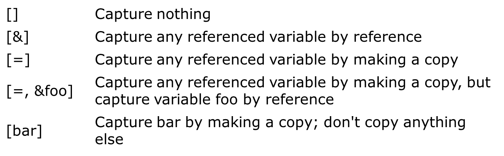

# 右值引用
- 非常量指针：左值
```cpp
int a = 10;
int& ref = a;  // ✔ 正确：绑定到左值
int& ref2 = 5; // ❌ 错误：不能绑定到右值
```
- 常量指针：左值和右值
```cpp
const int& cref1 = a;  // ✔ 绑定左值
const int& cref2 = 5;  // ✔ 也能绑定右值
```
- 右值指针：右值
```cpp
int&& rref1 = 5;      // ✔ 绑定右值
int&& rref2 = a;      // ❌ 错误：不能直接绑定左值
int&& rref3 = std::move(a); // ✔ 通过move转为右值
```
# 移动构造
```c++
class A{
    A(A &&a){
    ...
    }
}
```

如果是复制构造函数，则发生两次或一次拷贝
```cpp
A change_aw(const A &other){
    A a(other.get_size());
    return a;
}

int main(){
    A a(1);
    A b = change_aw(a);//发生两次或一次
}
```
如果是移动构造函数，则发生一次或零次拷贝和一次移动构造
```cpp
A &&c = change_aw(a);
//或
A c = change_aw(a);
```

# Extern Templates
```c++
//myfunc.h
template<typename T>
void myfunc(T t) {}

//test.cpp
#include "myfunc.h"
int foo(int a){
    myfunc(1);
}

//main.cpp
#include "myfunc.h"
extern template void myfunc<int>(int);
//意思是说，myfunc的int实例已经在其他文件完成了实例化
//否则，每个单元单独实例化，包含重复代码
int main()}{
    myfunc(1);
}
```

# Constant Expressions
```c++
enum Flags {GOOD=0, FAIL=1, BAD=2, EOF=3}
int operator | (Flags f1, Flags f2) {return Flags(int(f1) | int(f2));}

void f(Flags x){
    switch(x){
        case BAD|EOF: ...//error: return value is not constant
    }
}
```
强制让初始化在编译时完成
```c++
enum Flags {GOOD=0, FAIL=1, BAD=2, EOF=3}
constexpr int operator | (Flags f1, Flags f2) {return Flags(int(f1) | int(f2));}

void f(Flags x){
    switch(x){
        case BAD|EOF: ...//ok
    }
}
```

# Lambda Function
中括号表明lambda表达式如何使用外部的变量

```c++
bool cmpInt(int a, int b) {return a < b;}

std::sort(items.begin(), items.end(), cmpInt);
std::sort(items.begin(), items.end(), [](int a, int b) {return a < b;});
```

# Delegating Constructor委托构造函数
类中的一个构造函数可以调用另一个构造函数
```c++
class X{
public:
    X(int x) {}
    X() : X(1) {};
}
```

# Uniform Initialization
```c++
int arr[] = {1, 2, 3};
vector<int> vec = {1, 2, 3};
A a = {1, 2, 3};
// all ok
```
花括号会被翻译成initializer_list
```c++
class A{
    int x, y, z;
    A(initializer_list<int> list){
        auto it = list.begin();
        x = *it ++;
        y = *it ++l
        z = *it;
    }
}
```

# 'nullptr'
```c++
f(nullptr) // call f(char *)
f(NULL) //call f(int)
```

# Return Type
## tuple
```cpp
tuple<int, float, int> foo(){
    return {1, 1.0, 1};
}

int main(){
    auto r = foo();
    std::cout << get<0>(r) << " " << get<0>(r) << std::endl;
    auto [i, f] = r;
    std::cout << i << " " << f << std::endl;
}
```

## optional
```c++
#include <optional>

std::optional<string> foo(bool x){
    if(x) return "1";
    else return std::nullopt;
}

int main(){
    auto i = foo(false);
    
    if(i.has_value())
        std::cout << i.value() << std::endl;
    else
        std::cout << "NO VALUE" << std::endl;
        
    std::cout << i.value_or("NO VALUE") << std::endl;
}
```

## variant
安全的union
```c++
#include <variant>

std::variant<int, float, std::string> v;
v = 1;
std::cout << v.index() << std::get<int>(v) << std::endl;
v = "aaa";
std::cout << v.index() << std::get<2>(v) << std::endl; //use index or type

float *fp = std::get_if<float>(&v);
if(fp == nullptr)
else
```

## any
安全的void*
```c++
std::any foo(int x){
    int a = 1;
    double b = 1.0;
    if(x == 1) return a;
    else return b;
}

int main(){
  std::any a = foo(1);
  if(a.type() == typeid(int))
    std::cout << "int: " << std::any_cast<int>(a) << std::endl;
  else
    std::cout << "double: " << std::any_cast<double>(a) << std::endl;
}
```

# Smart Pointer
## unique_ptr
```c++
#include <memory>

std::unique_ptr<int> a = std::make_unique<int>(1);
```
## shared_ptr
```cpp
std::shared_ptr<int> p1(new int());
```
## weak_ptr
不会增加引用计数，无法阻止指向的空间被释放

如果两个shared相互引用则无法释放，此时可以将其中一个换成weak

```cpp
weak.expired() // 检查 `weak_ptr` 观察的对象是否已被释放
weak.lock() // 尝试将 `weak_ptr` 提升为 `shared_ptr`
```