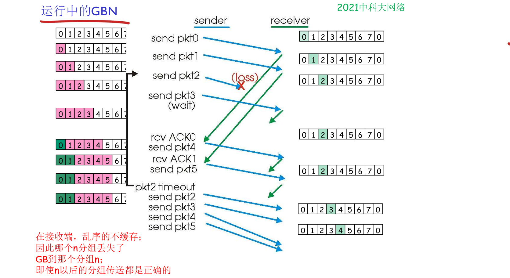
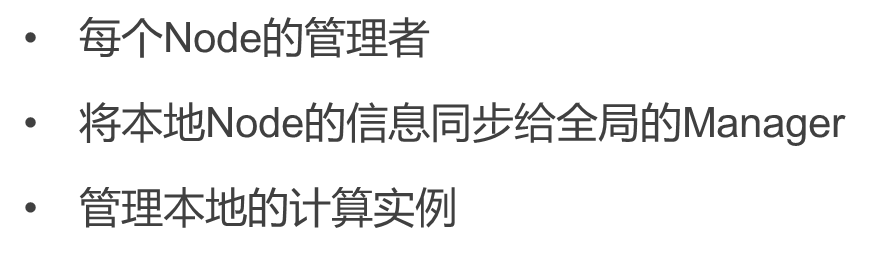
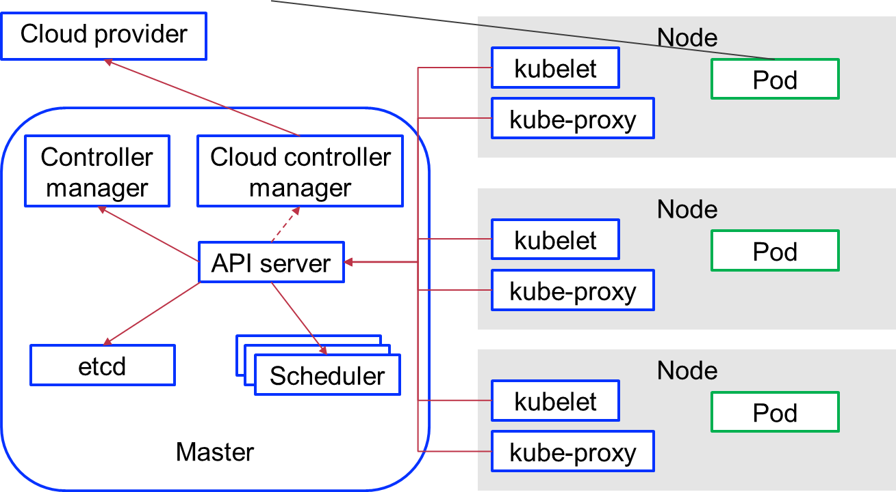
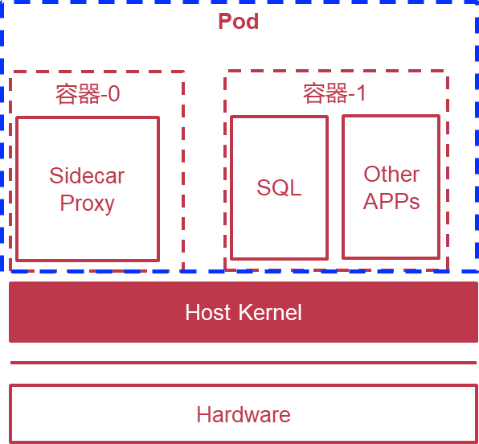
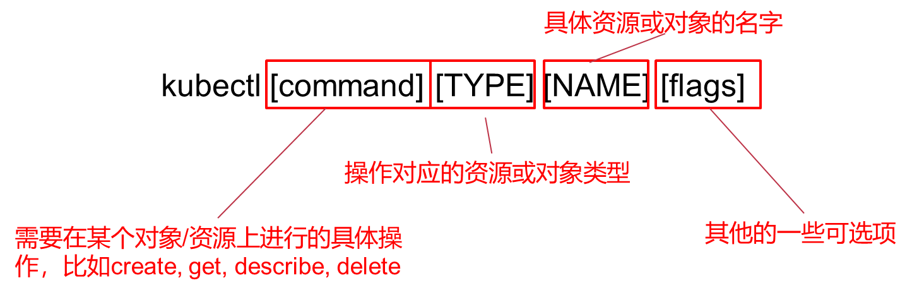

## GBN


## DPDK
PCI(Peripheral Component Interconnect)一种总线标准，给IO设备进行编号

NIC(Network Interface Card)网卡

igb_uio是DPDK提供的一种用户态驱动

## docker
容器通过大量操作系统的内核特性：

control group: 管理资源分配

namespace: 管理隔离

```
docker pull busybox

docker save -o busybox.tar busybox

docker load -i busybox.tar
```

```Dockerfile
FROM ubuntu:latest

RUN apt-get update

RUN DEVIAN_FRONTEND=""

RUN /etc/init.d/apache2 start

EXPOSE 0

```

OverlayFS设计

运行时，怎么保持镜像文件的只读，且不影响多个容器实例对本地数据的读写？

分层文件系统，在FS上实现Copy-on-Write

### 容器的网络设计

CNM(Container Network Model)

沙盒：隔离的网络运行环境

Endpoint: 用来将沙盒引入网络，通常是一对veth或OVS内部端口

#### Bridge模式：Docker下的NAT
自带docker0

#### Host模式:和主机共享

### 容器的安全机制

对于权限的控制

docker run --rm -it --cap-drop=chown busybox

--cap-add

对于系统调用的控制

Seccomp

# k8s

## 容器编排系统

配置部署服务供应，调度，scaling，availability，更新，健康检查

### master+nodes 架构

controller manager:


api server:


etcd:


scheduler:
调度

kubelet:


kube-proxy:


cloud provider（本课程不涉及）:
。。

pod:




### pod
由一个或多个容器过程，
共享network，通过设置共享的存储卷来共享数据



### replication controller
保证集群中指定pod副本数量

### api对象
元数据(namespace, name, uid)，规范(spec)，状态

controller观察到规范和状态不一样，会采取措施。如何实现这种观察采取



# docker网络
## 网络类型
### Bridge 网络（默认网络）：
- 特点：每个 Docker 主机都有一个默认的 bridge 网络，名为 bridge。
- 作用：适用于单主机环境，容器通过虚拟网桥连接到主机网络。
- 容器通信：同一 bridge 网络中的容器可以通过 IP 地址或容器名称互相访问。

### Host 网络：
- 特点：容器直接使用主机的网络栈，没有独立的网络命名空间。
- 作用：适用于需要高性能网络访问的场景，但容器与主机共享网络配置。
- 容器通信：容器之间通过主机的网络栈直接通信。

### None 网络：
- 特点：容器没有网络接口，完全隔离。
- 作用：适用于不需要网络通信的容器。
- 容器通信：无法与其他容器或外部网络通信。

### Macvlan 网络：
- 特点：为容器分配 MAC 地址，使其直接连接到物理网络。
- 作用：适用于需要容器拥有独立 MAC 地址的场景（如虚拟机迁移）。
- 容器通信：容器之间通过物理网络直接通信。

### IPvlan 网络：
- 特点：类似于 Macvlan，但多个容器共享同一个 MAC 地址。
- 作用：适用于需要节省 MAC 地址资源的场景。
- 容器通信：容器之间通过物理网络直接通信。

## 同一个 Docker 客户端创建的容器什么时候可以互相访问？
### 默认情况下：
如果容器使用默认的 bridge 网络，它们可以通过 IP 地址互相访问，但不能通过容器名称访问。

### 自定义 Bridge 网络：
如果容器连接到同一个自定义的 bridge 网络，它们既可以通过 IP 地址，也可以通过容器名称互相访问。

### Host 网络：
如果容器使用 host 网络，它们通过主机的网络栈直接通信。

## Docker Compose 容器之间的网络访问
### 默认行为：
- Docker Compose 会为每个项目创建一个默认的 bridge 网络，所有服务（容器）都会自动连接到该网络。
- 在同一 Docker Compose 项目中的容器之间，既可以通过 IP 地址，也可以通过服务名称互相访问。
### 网络隔离：
- 不同 Docker Compose 项目的容器默认使用不同的网络，因此不能直接互相访问。
- 如果需要跨项目的容器通信，可以手动创建外部网络并将其附加到多个项目中。