#  <span style="color:yellow"> Distribute System</span>
CAP: consistency, availability & partition tolerance

scalability, ease of programming, consistency, performers, fault tolerance

# <span style="color:yellow">Single-Node File System</span>

* <span style="color:green">L0</span> Sector Layer
* <span style="color:blue">L1</span> Block Layer 4k
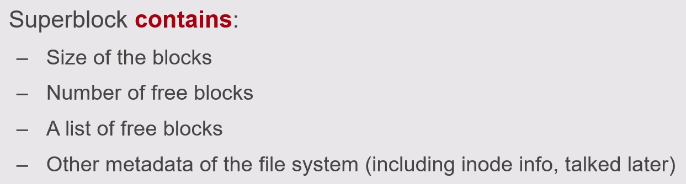
* <span style="color:red">L2</span> File Layer

```
struct inode{
    int block_nums[N]
    int size
    int type
    int refcnt
    int atime
    int mtime
    int ctime
    int userid
    int groupid
    int mode
}
```
* <span style="color:orange">L3</span> Inode Number Layer
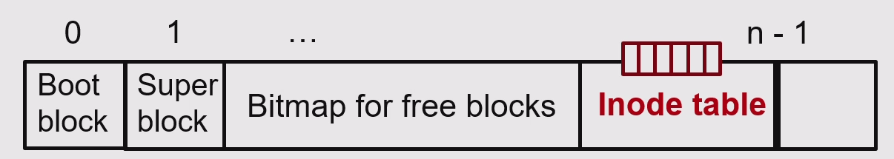
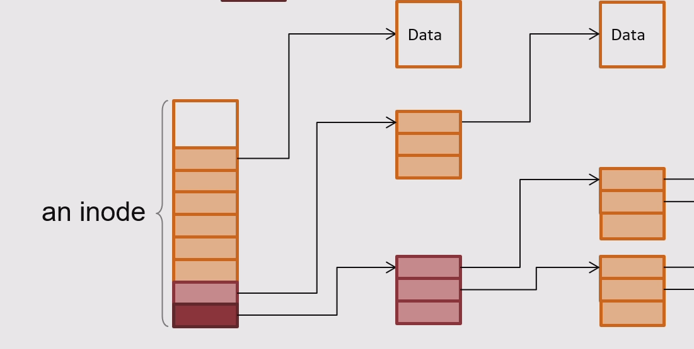
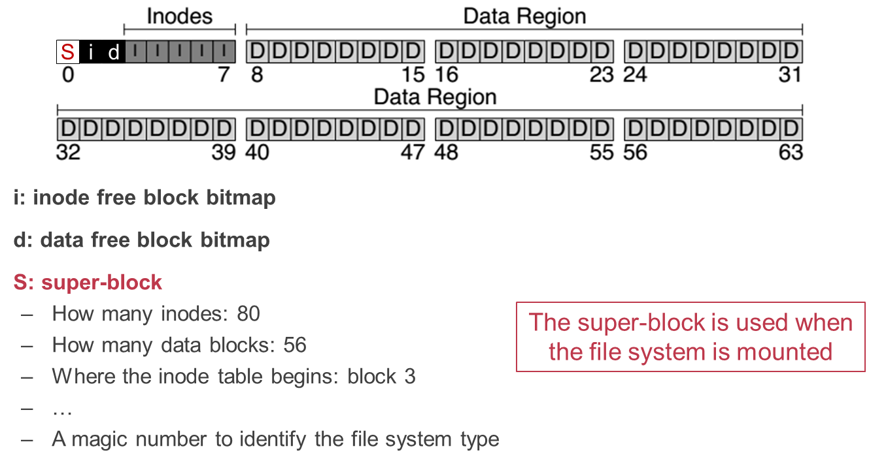
* <span style="color:purple">L4</span> File Name Layer
```
struct dir_entry{
    int32 inode_number
    int16 dir_entry_length
    uint8 file_name_length
    uint8 file_type
    char name[NAME_LEN]
}
```
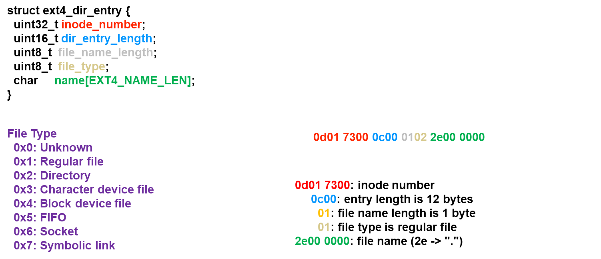
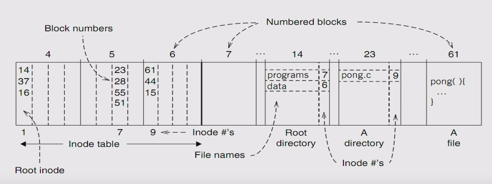
* <span style="color:gray">L5</span> Path Name Layer
* <span style="color:gold">L6</span> Absolute Path Layer
* <span style="color:silver">L7</span> Symbolic Link Layer
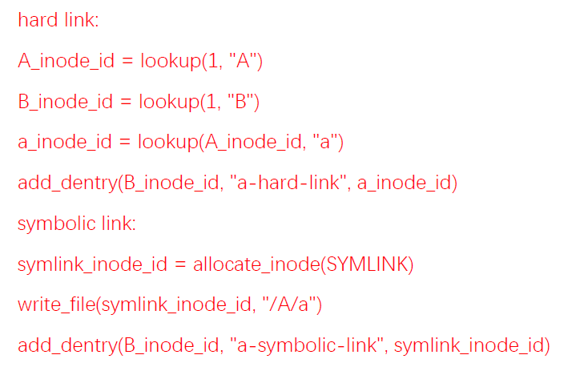多个hard link是等地位的

## file descriptor
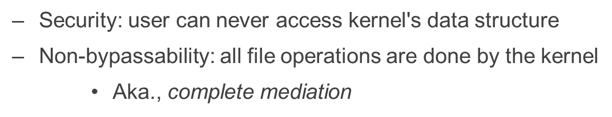

## file cursor

为什么共享一个cursor是合理的？我们希望写的时候共享，读的时候不共享

## open implementation
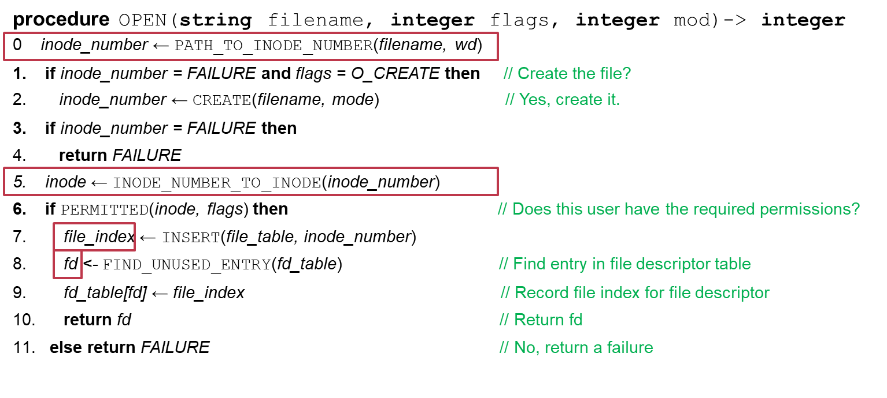
## read implementation


## <span style="color:gold">file write</span>
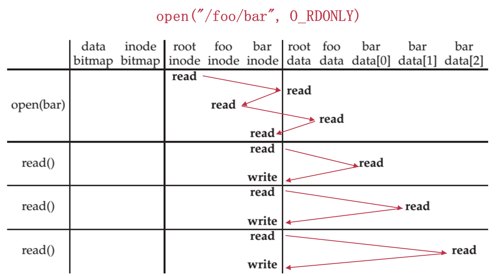

bar inode write: atime

## <span style="color:gold">file creation</span>
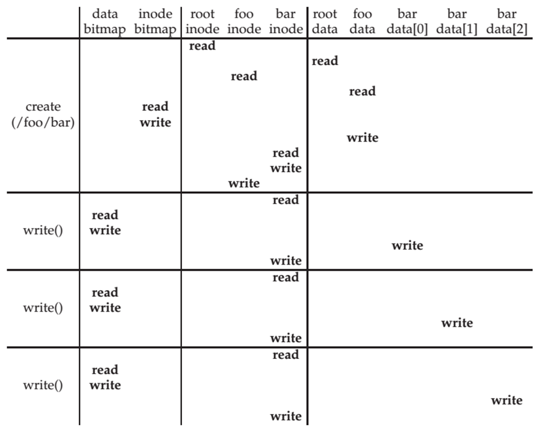
foo inode write: ctime(size), mtime(block content)

bar inode first read: inode is 1k but disk 4k. you need to read before write.

data bitmap read: allocate new space.

## inode create

- op1 ① op2 ② op3

①②断电都是浪费空间

①断电时浪费空间，②断电会看到别人的文件，数据泄露

①两个人可能分配到同一个空间，数据动态泄漏②泄漏

第一种的后果最轻，可以通过磁盘扫描解决

## SYNC
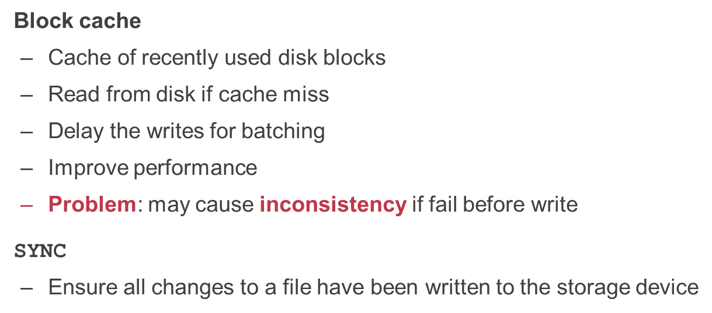
## delete after open


## rename
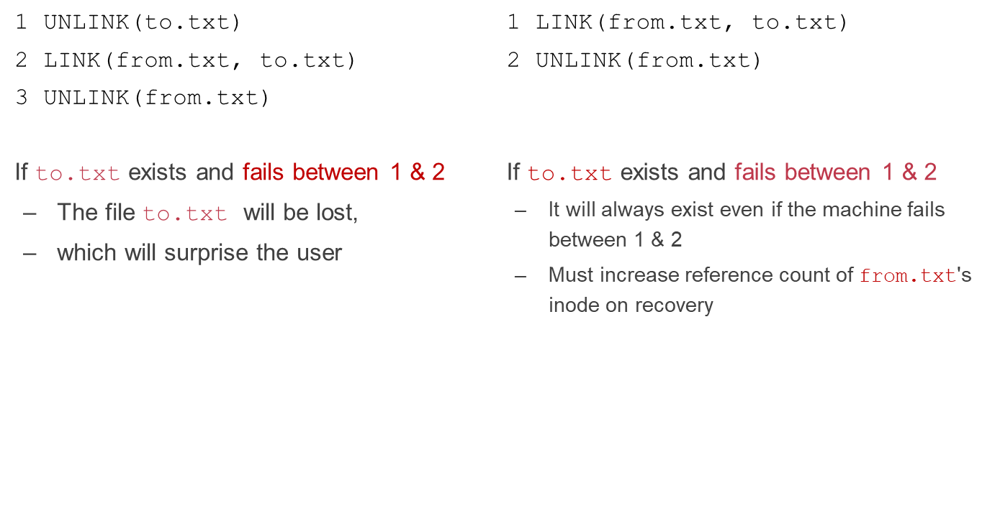

# <span style="color:gold">System</span>

## M.A.L.H
* Modularity: 模块化
* Abstraction
* Layering
* Hierarchy: State, Province, City

## fault tolerance
* replica
* log
* checksum

common: **information redundancy**

# <span style="color:yellow">RPC</span>

## Message
what is inside a message 
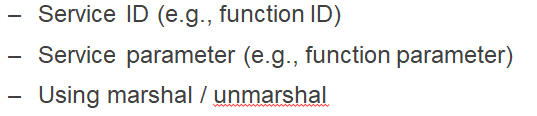

```
rpc request{
    xid
    call/reply
    rpc version
    program
    program version
    procedure
    auth stuff
    arguments
}

rpc reply{
    xid
    call/reply
    accepted
    auth stuff
    success
    result
}
```

## Encoding/Decoding
use stub
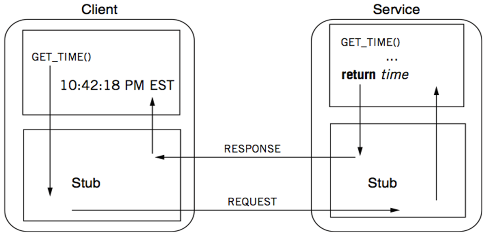

## Failure

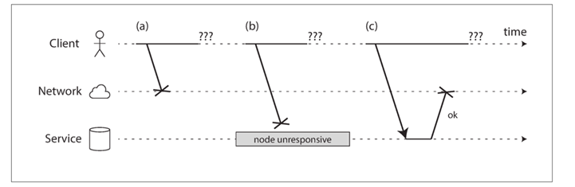

## Handle Failure

at-least-once, at-most-once, exactly-once(most)

how to make handle easier: idempotence(幂等性)

<span style="color:red">idempotence 不一定保证正确</span>

# <span style="color:yellow">Distributed File System</span>

## two types:

* Upload/Download model(FTP)
  - wasteful: 需要小片？
  - problematic: 客户端空间不够？
  - consistence: 两个人同时改？
* Remote access model

## <span style="color:blue">NFS by Sun (single node)</span>

### api
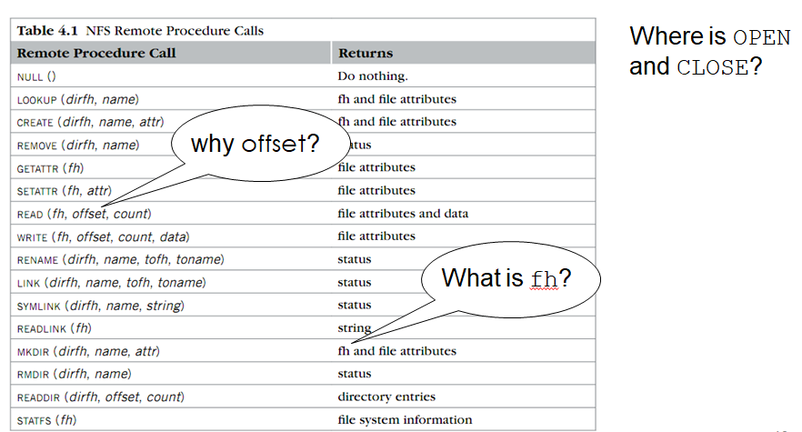
1. no OPEN, CLOSE, use LOOKUP
   - make server **stateless**, improve scalability and fault tolerance.
     1. Lookup和open的唯一区别就是不写cursor，open之后若服务器挂了，重启后不能直接read
     2. 节约内存

2. fh (not inode_number, path, fd)
   - 
   - Rename after Open: 不能用path name
   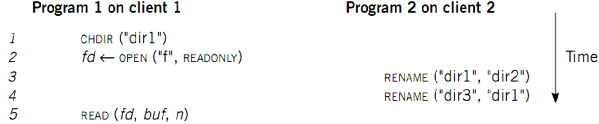
   - Delete after Open: 不能用inode number。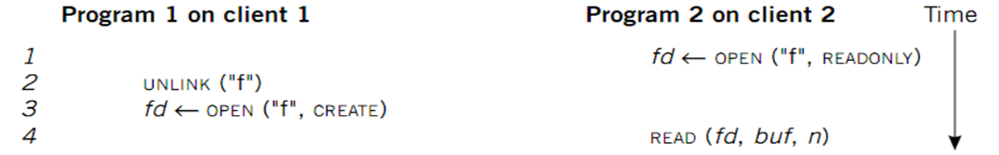
   create 的时候Generation number也加一，读的时候如果gn变化则说明被删除，return error。
3. offset

### how to read

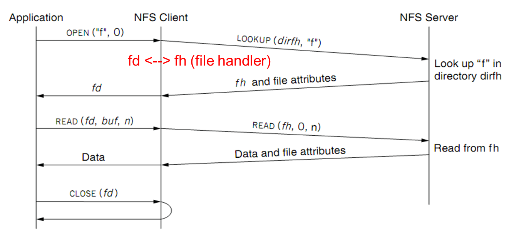

```
disk: 10+ GB/s
network: 20~30 GB/s
```

### optimize: cache, hash, batch🤣

#### cache problem: coherency
1. close-to-open consistency: close之后下一次一定能读到新的数据
   - notification after CLOSE: 开销很大
   - CLOSE时刷回到server，OPEN时检查版本

2. read/write coherence: eventually(3s之后)一定能读到新的数据
    - 每隔3s(file)/30s(dir)询问服务器是否更新

#### improve read performance

1. send large chunk
2. read-ahead

### Drawback

1. scalability => distributed filesystem
2. performance 
3. reliability => replication
## <span style="color:blue">NFS(distributed)</span>
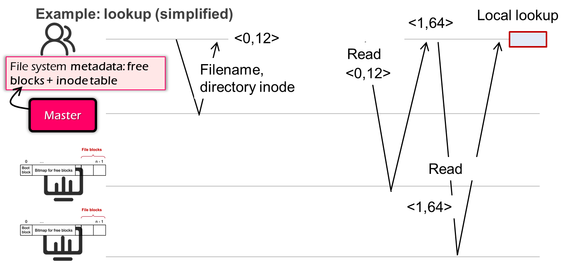
就是增加一个master，只解决了scalability的问题

## <span style="color:blue">GFS by google</span>

### api
没有目录树，使用kvs，没有rename/link，增加append

### use Large Chunk = 64MB
1. 减少通信次数
2. 减少tcp连接
3. 减少master存储metadata大小

### use One Master: Simple

- all metadata in master或者cache在客户端

- no cache: workload基本是append和read

- Name-to-Chunk mapping in **memory** and an operation log in **disk**

- ID-to-Chunk mapping in **memory**. Restore from chunkserver if dead.

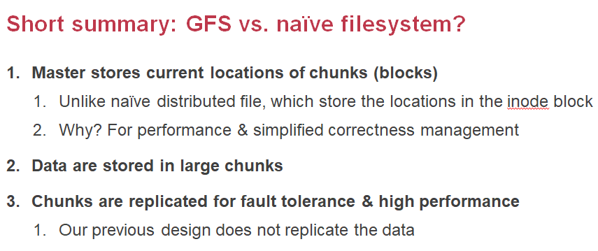

### read file in GFS
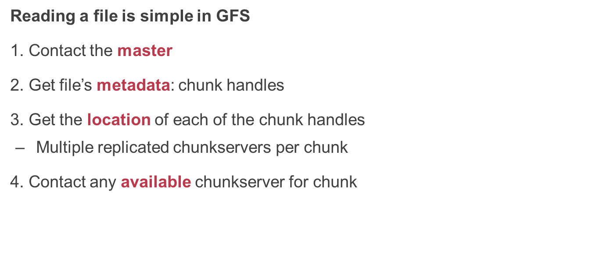
因为metadata甚至能cache到client，所以很多时候直接和chunk server联系

### write file in GFS
为什么需要一个primary：因为一定要有且只有一个人决定写的顺序，否则出现
				时间 -> 
Chunk Server1：C_0 = 1   C_0 = 2
Chunk Server2:   C_0 = 2   C_1 = 1
这个primary如果是master会造成bottleneck
pipline方式与broadcast方式：大数据传输带宽是主要影响，广播给3个chunk server的时间为$\frac{3N}{network_B}$，流水线式的时间为$\frac{N}{network_B}$，与chunk server数无关。
#### relaxed consistency model: 
- each replica eventually have the same data.
- read not always the newest
- master decide which node is primary.

#### how to write

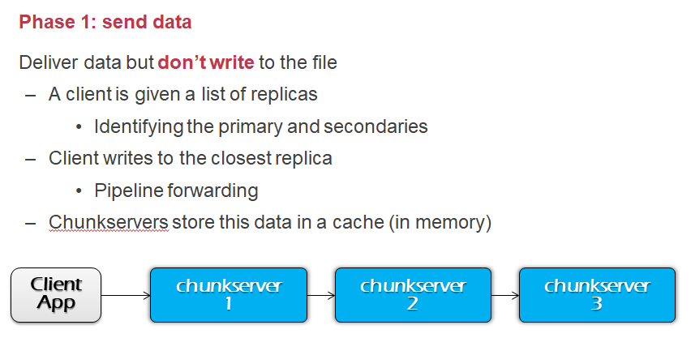

how to send: group communicator

- 此时传输数据较大，带宽占主要影响

- 时间 = 目标服务器个数/网络带宽

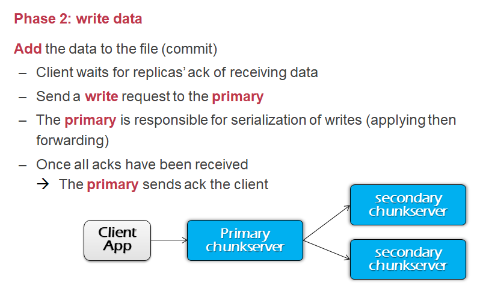

- 此时传输数据较小，网络带宽影响小

more append than write

Chfs Lab相关：
1. msync是mmap的写回，操作的原子性是以一个块4k为单位。mmap操作在页缓存中进行，操作系统定期或者在内存不足时写回。
## <span style="color:blue">HDFS by Apache</span>
和GFS的结构完全相同
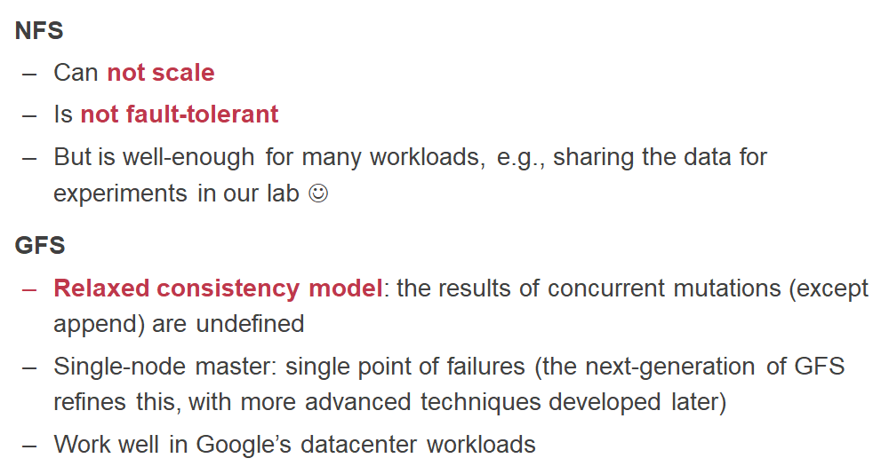

    consistency < isolation   

# <span style="color:yellow">naive Key-Value store</span>
 
## not modified from file system
- 性能很差。reduce system call: GET = READ + OPEN
- 浪费空间。save space

```
cpu -> memory ~= 100ns
cpu -> disk ~= 10ms
system call ~= 1us
cpu -> SSD ~= 3us
```
- 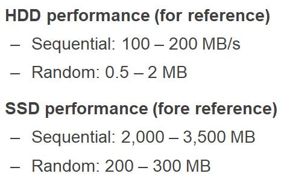
## log-structured

put = append


## log with index in RAM

我们需要让索引也到磁盘上
## hash


## cuckoo hash
解决链表长的问题

## naive log with index summary

第二个问题可以通过compact+merge解决


# <span style="color:gold">scan supported Key-Value store</span>
## B-Tree
### Drawback


## LSM tree
- 不用外部索引，维护内部有序
### good
1. 
2. 
3. 

### sequential sstable Drawback
1. finding old value is slow
2. Deduplication is hard
3. range query is still inefficient

### hierarchy sstable
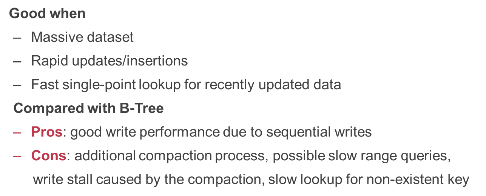
1. slow lookup non-existent key: bloom filter
2. 递归compaction

## all kvs summary
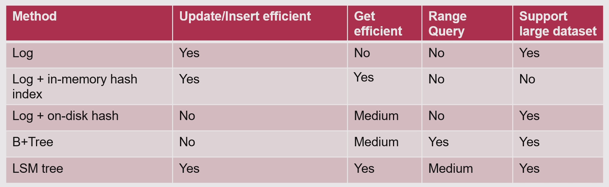

### KVS in centralized server
- 网络延迟。广域网最慢
- cannot work offline
### centralized server and each client

how to write?
- wait sync
  - inefficient
  - cannot tolerant network failure 
- sync but not wait

## <span style="color:yellow">consistency model</span>


### strict model

- 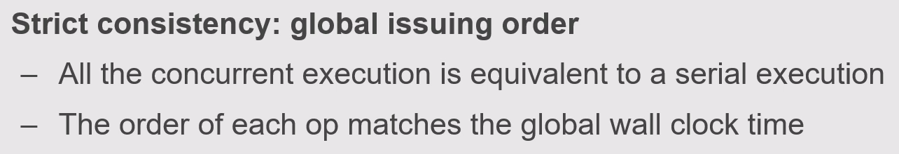
  - 严格按照开始时间
- 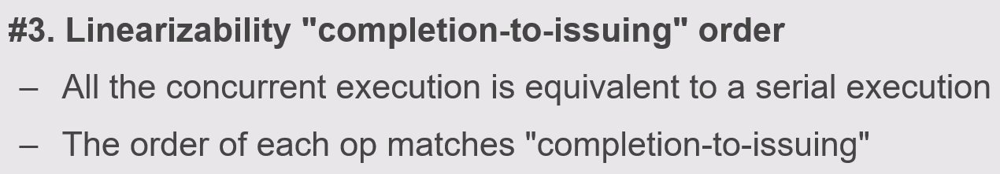
  - 开始时间比另一个的结束时间晚，则一定看到影响。
- 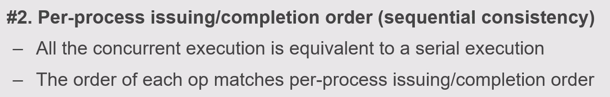
  - 两个设备，对于每个设备上的操作只要顺序对就行

### Linearizability model

#### primary-backup model
write:
1. forward write to all, all write
2. write locally
3. response ok

read:
1. read data on primary
  - cannot read random replica
  - 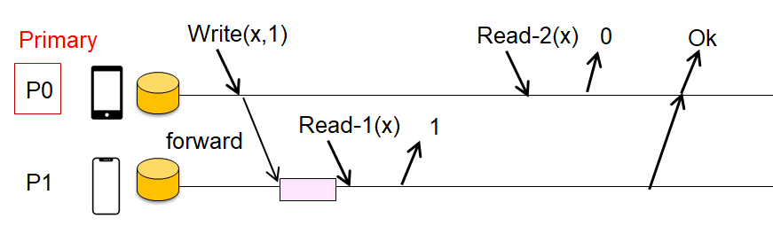

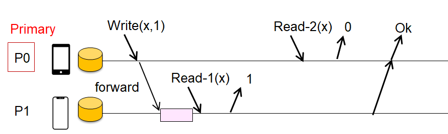
forward需要有一个seq number避免backup写的乱序
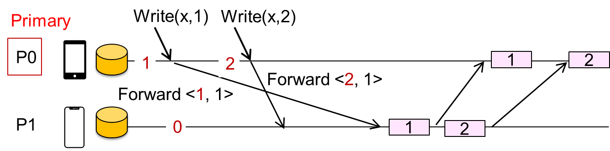
如果要读backup，可能无法实现linearizability。

- read-2 < read-1(完成时间早于开始时间)

- read-1 < read-2(运行结果read-1是1，read-2是0)

- write < read-1
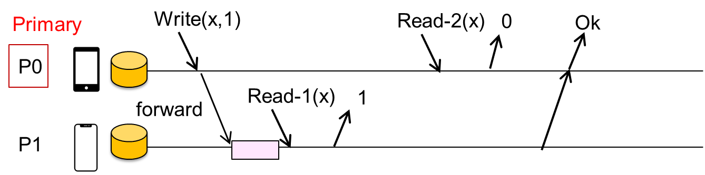

**drawback**

只能在primary上read
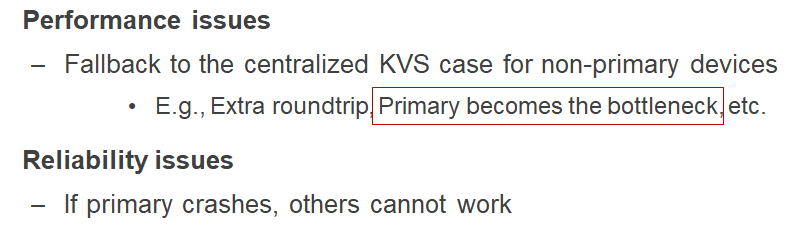

**solution**

不同的变量可以使用不同的primary，也满足linearizability

### Eventual consistency model

- 最后所有副本一致，要符合因果性

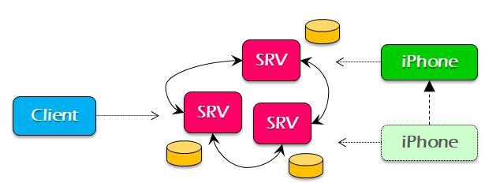
have write-write conflict

#### de-centrialized approach

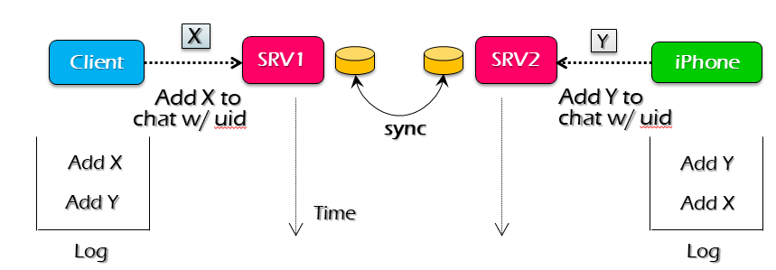

进入log的时候是乱序，按时间戳排序后写入

时间戳 = <time T, node ID>

什么时候做sort？等太久的话用户看不见，虽然也满足eventual。

#### casual ordering

lamport clock algorithms, total ordering, too strong

- 1 been synced to 2: T2=max(T1+1, T2)
- ③event#1发生在event#2之后依然可以更新node#2
  - 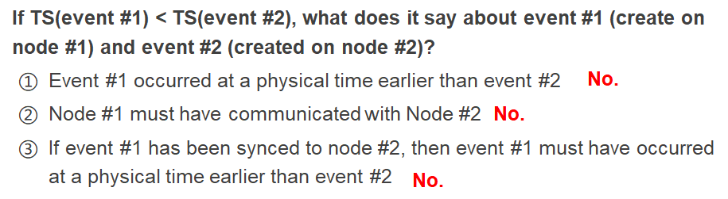

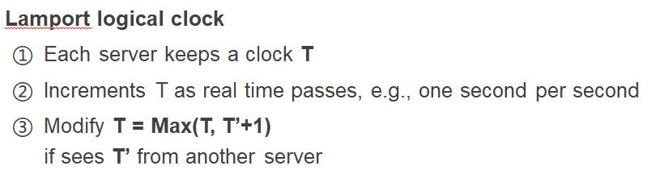

update<10, A> is stable after所有时间戳都大于10，如果有一个节点离线，log长度就不能更新

#### centralized approach
给每个write分配CSN，分配后即stable

- primary不是不可靠吗？移动设备可靠性不高，数据中心可靠性高
- 可以用很多linearizability的设备抽象出一个可靠的primary

Assign a total commit order <CSN, local-TS, SrvID>

- 同步数据和到primary中取CSN的顺序不一定一样。
- 如果没有因果关系，那么Srv2不会拿Srv1的CSN，则server看到的顺序和同步之后的顺序不一致。
- 如果有因果关系，那么Srv2会拿到Srv1的CSN，则primary中顺序和server中一致
  - 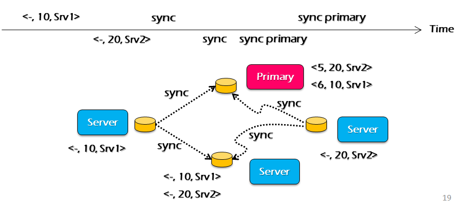

```
Srv1先发<-, 10, Srv1>
此时Srv2看到并发<-, 20, Srv2>
但是Srv2先发给Primary。此时他会把<-, 10, Srv1>也发过去。
```
#### partial ordering
vector clock

lamport时钟用一个整数表示时间戳，因此对于两个操作我们都可以按时间戳比较它的先后顺序。
但这种先后顺序能够区分有因果关系的，没有因果关系的操作我们也以为他有先后。
通过vector时钟我们可以比较有因果关系的先后，也可以知道没有因果关系。

- 假设一开始是[1, 2]，下一刻
  - 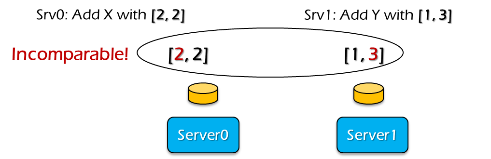这俩就是不可比的
- 再下一刻有sync
  - 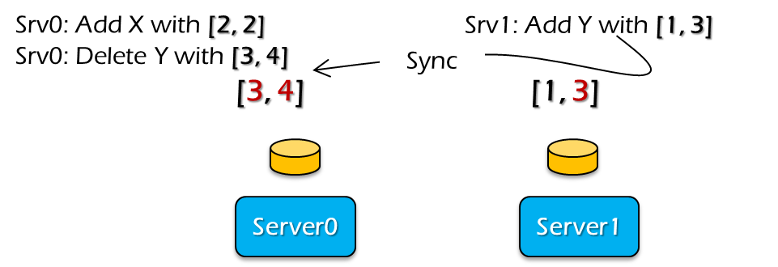这就可以比了

#### rollback

1. De-centralize approach: 任意节点挂了，全部log无法grow
2. centralize approach

## Consistency under single-machine fault = atomic = all-or-nothing

### shadow copy
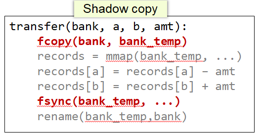

#### journal(in file system)

link back_temp->unlink back

fs ensure rename atomic with journal
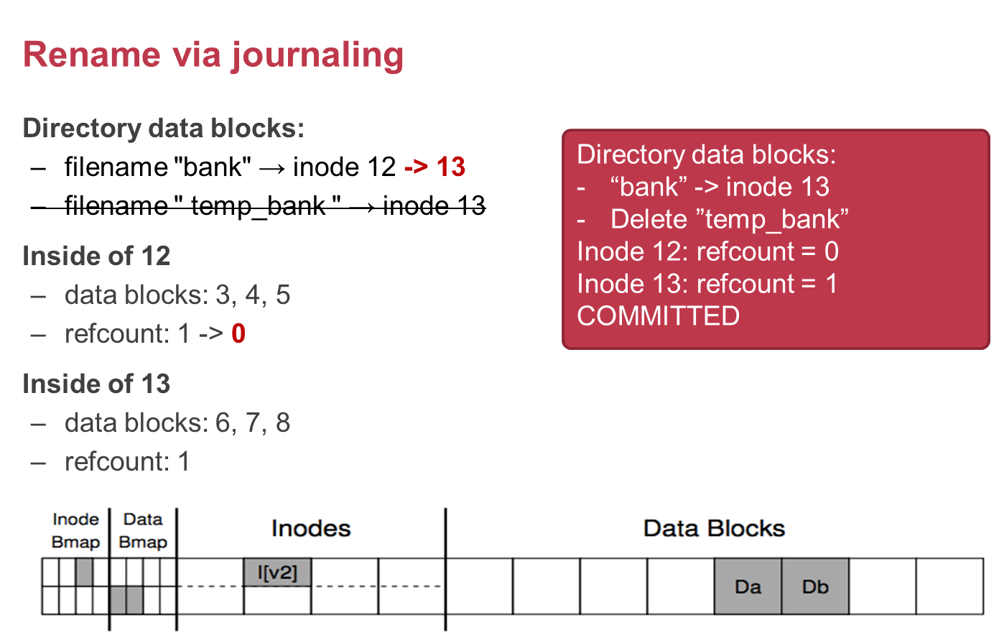

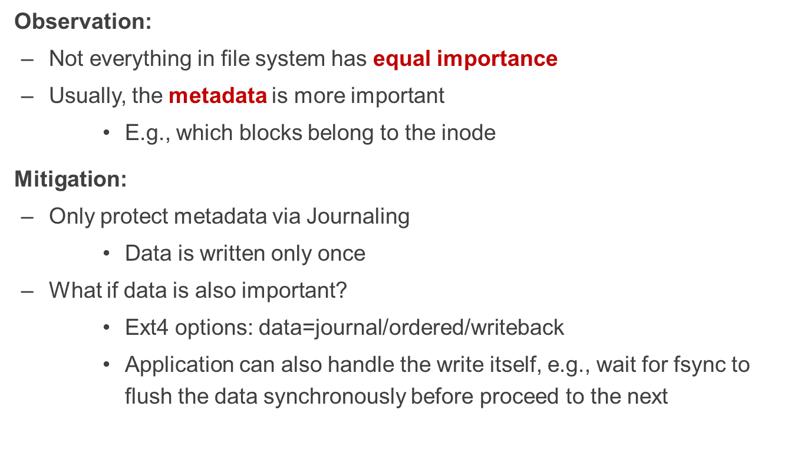
1. journal: 每个操作都写，相当于io放大一倍
2. ordered: 保证metadata改了之后内容一定写了
3. writeback: 不采取措施

hardware ensure sector write atomic

### drawback

1. For one file, only one operation can happen at a time
2. hard to generalize to multiple files or directory
3. require coping entire file

### commit log
如果log太长，写的途中也会挂掉: checksum, COMMIT标记

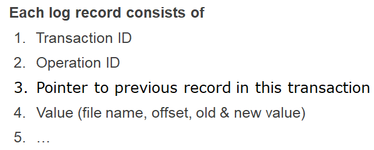

#### redo only(commit logging)
draw back
1. waste of disk i/o
2. redo都是写在内存中，内存消耗大
3. log file is growing

1、2通过redo-undo解决，3通过checkpoint解决

#### checkpoint
if stop all TXs

if allow ongoing TXs
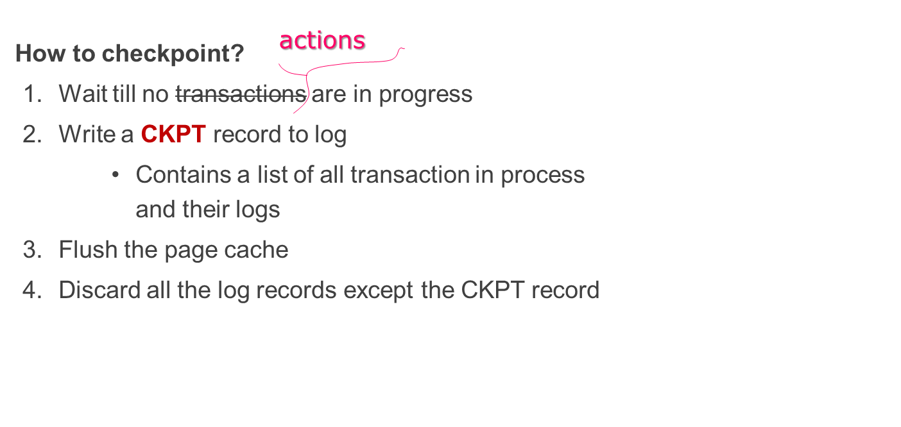
example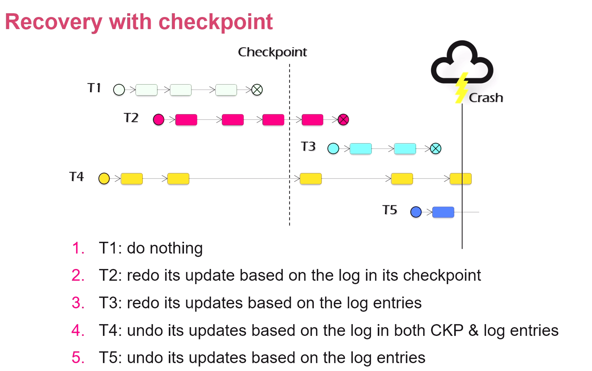

#### redo or redo-undo logging?(write-ahead logging)
1. redo is faster than undo  
- 执行速度: 相同内容redo log小一半(redo只需要新值，undo-redo需要记旧值和新值)
- 恢复速度: redo只需要扫一遍，undo需要三遍
  (从后往前确定哪些已经提交，从后往前undo未提交的，从前往后redo提交的)

#### undo only
每回都要刷盘非常慢。但恢复会快，扫一遍log就行

# Before-or-after atomicity = serializability = isolation

保证一系列的操作的先后，consistency model中只考虑read write的先后

## global lock

## fine-grained lock
每个变量有一个锁，必须拿到所有的锁，否则下面的例子不对

锁太多了怎么办


不能一开始就拿所有锁，因为拿锁时间太长，并且只有在执行过程中才知道要拿哪些锁
## two-phase locking
用哪个拿哪个，但是在事务结束后放锁

### Phantom Problem

因为扫描操作是不拿锁的
#### solution
1. predicate locking: 锁一个大于等于3000
2. range locks in a B-tree index
3. ignore
### dead lock
1. acquire in order
2. detect using conflict graph
3. heuristic: 一段时间内拿不到锁就abort

## Serializability
1. Final-state Serializability
最终结果满足某种线性执行(intermediate reads不一定)
2. View Serializability
逻辑上等价(final-state is fine, intermediate reads are fine)
3. Conflict Serializability(Most widely used)
根据race condition来

对于T1中的每个操作，都要由他来判断T1整个的顺序
### example
- 是final-state但不是conflict
  - 
- 是view但不是conflict
  - 


# OCC, MVCC, TX & Multi-site atomicity

## Optimistic concurrency control


### problem: 
1. false aborts


其实这个等价于B=A+B先执行，但还是abort。只要有一个读有修改就会abort，随着事务执行时间增加，abort概率会增加
2. live lock


## Hardware Transactional Memory
CPU guarantees the before-or-after atomicity of memory read/writes

RTM by Intel
### advantage
fast and simple

### drawback 
1. HTM doesn't guarantee success
- 

2. limited working size

3. limited execution time


### how to make RTM finally commits
- 

如果OCC的abort没了，那它的live lock也没了，就无敌了

## MVCC

### optimal OCC with MV
1. 一个读一个写

这种不会有问题

这种会有问题，fetchAndAdd之后数据没有完全提交，读的时候会读部分。给正在commit的数据加读锁，之后再fetchAndAdd。

不能修改`LockA,B`和T2`FAA(g)`的顺序
2. 必须对write做validation，两个都是既读又写

在写的时候检查写的timestamp是不是读到的下一个

### put it together
提交时检查read之后有没有事务进行修改，若修改则abort


MVCC的好处是read不需要validation

### drawback
1. write skew anomaly: not serializable. is called **snapshot isolation**

两个人都写对方读的和读对方写的。这时候可能都看不到对方的更改


这是因为Only check write timestamp, 如果也要检查read ts，则是MVOCC

幻读？Mysql的可重复读隔离级别是MVCC实现的

## summary

Transaction guarantee ACID

1. atomicity: all-or-nothing
2. **consistency**: 如果转账a=a-b,b=b+2*a，那么即使aid也不c，需要确保语义的c。
3. isolation: serializability, before-or-after
4. durability: 持久性 exist-after-commit


# multi-site transaction
这就不满足atomic

1. compose multi single-site TXs
2. a TX access data across site(same as 1)

## two-phase commit
1. preparation/vote
2. commitment

### 2PC log rule
1. low-level log增加PREPARE状态、指向hl log的指针
2. high-level log增加ABORT、COMMIT状态
#### challenge: log can be partial

#### example
normal

error: network partition


error: node fail

error: coordinate fail


# <span style="color:yellow">Replicated state machine(RSM)</span>
1. same init state
2. same operation, same order
3. deterministic.(no randomness, no reading current time, no racing)

## primary/backup model
1. primary:
2. view: 
primary收到client的请求时需要收到backup的ACK
primary只有一个，coordinator有多个


# <span style="color:yellow">Paxos</span>
## round: 
不要求时间同步，但是收到j+1时会丢弃之前所有的
## phase

1. phase0: client发请求
2. phase1a: leader发N，N是他所见过的最大的+1 

3. phase1b: acceptor

4. phase2a: leader
<span style="color:pink">enough</span>=majority

5. phase2b: acceptor
**A majority of acceptors accepts ok for the same proposal**
之后paxos的value值就已经决定永远不变
6. phase3a: leader
7. phase3b: learner

---

# <span style="color:yellow">Raft</span>
## first of all
1. leader
2. raft发现log不一致的时候会修改到一致
3. 当某个log entry被写入state machine，他之前的一定在所有replica都写入

## phase election
1. phase1a: candidate发送
```
struct RequestVoteArgs {
    int term;
    int candidateId;
    int lastLogIndex;
    int lastLogTerm;
}
```
2. phase1b: follower检查如果term最新和log比自己新
```
  bool log_complete_bo = !((log_list.back().term > args.lastLogTerm) ||
        ((log_list.back().term == args.lastLogTerm) && (log_list.back().logic_index > args.lastLogIndex)));
```
则发送
```
struct RequestVoteReply {
    int term;
    bool voteGranted;
    int followerId;
}
```
3. phase2: candidate收到过半的票，成为leader

## phase log
1. phase1a: leader给follower发送
```
struct RpcAppendEntriesArgs {
  int leaderTerm;
  int leaderId;
  int prevLogIndex;
  int prevLogTerm;
  int leaderCommit;
  std::vector<u8> entries;
}
```
2. phase1b: follower发送
```
struct AppendEntriesReply {
  int term;
  int success;
};
```
3. phase2a: leader如果发现大部分都success，则标记为commit。
对没有success的人发送snapshot
```
struct InstallSnapshotArgs {
  int leaderTerm;
  int leaderId;
  int lastIncludeIndex;
  int lastIncludeTerm;
  std::vector<u8> snapshot_data;
  MSGPACK_DEFINE(
    leaderTerm, 
    leaderId, 
    lastIncludeIndex, 
    lastIncludeTerm,
    snapshot_data
  )
};
```
4. phase2b: 被发送snapshot的则应用快照，返回
```
struct InstallSnapshotReply {
  int term;
}
```

## role
1. leader: 发现自己不是leader则降为follower
2. follower: 收不到leader心跳则变为candidate

## 唯一writer
在paxos里Na最大的说的算，在Raft里的一个term里有零或一个leader


## 随机timeout时间

为了保证尽量只有一个人参与选举，typically 100~500ms

## log

log entry{
    term, index, command
}
在大多数节点上写入的log大概率可以是committed，我们要保证log最终一样，以及哪些是committed


## example 1

此时我们不能认为1 xxx是committed

## raft能够保证prefix相同
leader's log is **truth**: 下面的情况会将1 shi覆盖掉

因此可能出现这种情况：一个log即使被majority写了，也有可能被overwrite掉

## when can committed log not overwrite

如果S5当选新的leader则会损失。所以选取的leader必须：
1. 拥有的log最新
2. 拥有的log最多


## 什么是committed
一个log被majority写了，那么这个log大概率是committed，因为下一个leader一定从有这个log的里面选


committed之后，leader和follower将其apply到state machine里


## example 2

S1挂掉之后，S5有可能成为leader，因此修改committed的定义：


# <span style="color:yellow">network</span>
## layer


## protocl
smart: 快递员知道商家发货发没发错
dumb: 相对于丢包我更在乎速度


## application layer

## transport layer


### TCP&UTP packet format

## network layer


### control-plane: build control data flow adaptively

goal: 

第一种是告诉所有人自己的邻居，第二种是告诉邻居自己认识的所有人


---

1. 获得边权
2. 每个节点都收到所有边权
3. 运行最短路算法
---

### failure
link-state由于flood不需要处理fail


B发给A的信息A不会再发回B


### summary
1. link-state

2. distance-vector


### scale


#### 1. Path vector


#### 2. Hierarchical Address Assignment


BGP

#### 3. Topological Addressing


### data-plane: how to send data fast


optimal with hardware: intel DPDK

### IP datagram(packet/package)

## link layer

### physical transmission
#### example-1: moving a bit from register-1 to register-2
一条时钟线一条数据线，在时钟上升沿从数据线读入数据。

这种同步传输只有在cpu内部才能精确控制，不能有shared clock

#### without shared clock


速度不能太快，64条线每次都得等最慢的一个，并且线和线之间在物理上会收到干扰

#### serial transmission
VCO(Voltage Controlled Oscillator)可以从数据中恢复出时钟

如果我传010101则VCO可以正常工作，但如果传11111则不知道

manchester code: 0 -> 01, 1 -> 10
连续10可能会出问题，但可能这种情况很少。缺点是数据率只有50%

### multiplexing

路由器有buffer，buffer不够就该扔掉。

增大内存问题更严重：如果内存无限大，那么排队无限长，等待时间无限长，则会timeout，然后就会重发...

## isochronous-TDM

703并发用户，少了一样预留空间，多了直接拒绝

## asynchronous link

### framing frames
#### where a frame begin
6 × 1, if 6 × 1 in data, change to 6 × 1 + 0

#### error handling
hamming distance: 从一个二进制到另一个二进制需要变的bit数

### example 1


### example 2
海明编码

为什么蓝色放在124的位置，因为能让它not match的位相加得到error的位

可以纠一位错，检测两位错，如果错三位错了7那么也能检测出来。

P3、P5、P6等价，如果P3错了，则必须P1、P2也错才能检查不出来。如果P7错了，则必须P1、P2、P4都错才能检查不出来

# Network Layer

## NAT
私有ip和公有ip的翻译。为了解决网络地址不够用的问题。不同设备的私有ip可能相同，在同一个子网内不同就行


一个ip+port对应一个port

## Ethernet Mapping

不同设备mac地址可能相同，在同一个网络段不同就行


ARP协议：将IP地址翻译成mac地址
如何得到这个表ARP(Address Resolution Protocol)


### put it together

App层不知道自己的mac地址

最后不用改成router-2因为不用NAT了

### ARP Spoofing
对ARP表的污染


然后B也被改，Hacker就可以变成一个中间人

防御：监听有没有相同IP不同mac的包（不是治本的方法）

# End-to-end Layer
Network layer has no guarantees on:
1. delay
2. Order of arrival
3. certainty of arrival
4. accuracy of content
5. right place to deliver

protocols


consider


## at-least-once
没收到就一直发呗。如何判断包丢了？不知道去的路上丢了还是发回ACK丢了，需要time-out

nonce是网络包的id

no assurance for no-duplication

### decide time out
不能用fix time


NAK是receiver发一个缺失的包列表，sender可以不要timer，其实是将责任从sender转移到receiver。

但是sender对于最后一个包还是需要timer，因为要确保收到回复

## at-most-once
1.发了什么包记一下。table维护多久？这也是一个fix timer

2.不用表，假如nonce有序，我只要记住last nonce即可。


## data integrity
checksum

## Segments and Reassembly of Long Message

如果2,3,4...都发来了但1没发来，则buffer会很大且一直不能释放

combine: buffer满了直接全部重传

NAK: 我的buffer太大了，赶紧把1发来

## jitter control(时延)
缓冲。提前发的包的数量为
每个包最长的时延减最短时延除以平均时延

## authenticity and privacy
公私钥，在后面会讲

## performance
### lock-step
收到前一个的ACK才能发下一个
### overlapping transmission(pipeline style)
只管发包就行，为了防止丢包，发了N个包之后会等等。

sliding window(tcp)

handle packet loss


bottleneck datarate最低网络带宽。也就是当接受到第一个包的ack时，刚好这一轮最后一个包发出去

## congestion control
NAT在网络层改tcp端口，是不符合分层的。但这个地方也必须要两层来做


basic idea: 缓慢增加，如果丢包则迅速减小

### AIMD

1. slow start: cwnd = cwnd * 2
2. duplicate ack: cwnd = cwnd / 2
3. after decrease: cwnd = cwnd + 1

这个线性上升部分浪费的还是很多，属于保守的措施。数据中心采用DC-TCP就更加贴近理论极限带宽。

#### fairness

## drawback


# DNS(Domain Name Service)

一个域名可以多个ip，一个ip可以多个域名（如果本来也没几个人访问）


## enhancement

2. recursion

左边tolerance好，可以有中间结果，换其它root。
右边performance好，对root要求高。


在24小时内同一个域名可能还是会访问到旧的ip地址，因此TTL不能太短或太长

## good points


## bad points


# naming for modularity


hidding of eax: 无论在什么样的机器上，都可以使用同样的eax

indirection of eax: 在寄存器分配时，一个寄存器可以隐式地映射到多个寄存器

# naming model

## binding & unbinding
## determin context


## mapping algorithm


## api

ENUMERATE = ls
COMPARE != diff是判断两个文件是否指向同一个inode

## FAQ
如果进入了545范式，那么要继续考虑这些问题


# Content distribution
Server Selection Mechanism


同时得到两个ip。缺点根据ip近不一定快


第一次从一个较远的地方拿，拿了之后第二次DNS会将它导航到另一个更近的服务器，这个更近的服务器有上次请求的cache


# P2P


## BitTorrent

如果刚下完就关了，但是下载的人很多，所以还是有人可以提供服务

有一些网站定期发布tracker

## which piece

1. 第一个随便下
2. 拥有者最少的片最先下载
3. 最后一个片，可以从多个peer那并行下载

## bt drawback
rely on tracker.

所以需要实现一个分布式的hash table，用来取代tracker的责任

## DHT


貌似这种环形hash还有一种应用场景**一致性哈希**，传统哈希在节点数变化时几乎所有数据都需要迁移`hash(key) % N_nodes`，一致性哈希和这个DHT一样在环上增加虚拟节点，只需要迁移1/n的数据


## Chord

key id 和 node id在同一个值域

## failure

k90存储在N102和N113中，但是如果存finger list则会跳过N113

因此还要存一个successor list，如果发生failure则退化成线性查找，list的长度取决于出错的概率

### join
插入的节点集成他后面的结点的一部分，并且后面的结点也保留

## load balance

如果一个服务器负载过大，将一个计算机作为多个节点，让虚拟节点分布更加均匀

# deeplearning


### backward


transformer ~= 6 * #parameters * B * sequence_length


gpt 2.5w A100 2 month 使用了50~60%有效算力

# single-core
#### pipline
#### 超标量super scalar：同时执行几条指令，前提是没有依赖关系

dependency tracking & reorder


#### 增加主频: 产生温度很高

# multi-core

## cache coherence


这两个方案都没法scale，随着核数增加，代价线性增加


## increase per-core density
单核增加多个ALU：SIMD，不做超标量而是新的指令集，每个指令做多次浮点运算

Memory latency, bandwidth

how to transfer 100PB from Shanghai to Bejing: 🚚牺牲latency，增大bandwidth

使用SIMD后bottleneck就在访存上了


# the roofline model


# Distributed Computing frameworks

## MapReduce

### Fault tolerance
fault tolerance本质上就是冗余，map操作挂了重做就行

1. worker failure

- heartbeat + re-execution


2. master failure
- 重做的时间太长了。
- 
 
3. bad record


### optimization for locality
mapreduce在GFS的chunk server上进行。当年的数据和计算可以在同一个服务器上

### Refinement: redundant execution
stragglers有些机器计算非常慢


需要等待所有map都结束才能reduce，因此一个map操作在多个机器上备份，谁先做完算谁的。
在当前gpu上不大现实。

### restrictiveness
1. how to find 5 most popular websites
- each instruction a MapReduce
2. is chaining MapReduce a good solution?
- 
- 
- to DAG

## computation/dataflow graph(DAG)


有向无环图对fault tolerance友好，直接往上游找就行

图可以很快确认哪些可以并行

## summary


## distributed training


### data parallel


AllReduce汇总+广播会成为bottleneck。

#### overhead = computation + network

计算只是加法开销不大


减少传递量和瞬间进入的量

### parameter server


fan-in 每次传输每台机器连接数

### co-located & sharded PS


只有几百个gpu的时候work很好

### de-centralized approach
每个人拿到所有的参数


### ring all-reduce
reduce + forward

broadcast

每个机器参数的顺序不一样，reduce的运算必须满足交换律。gpu的加法也不满足交换律


de-centralized的做法坏处就是要做P轮->tree

### summary


## model parallelism


### pipeline parallelism: how to reduce bubble


Bubble time fraction: (p - 1) / m

increase m(batch size), reduce p(partitions)

batch size大会影响收敛，partition太少也放不下
### tensor parallelism

high communication cost

# security
goal: CIA


## authentication: password

这样不同正确位数返回的时间不一样，但时间很短无法测量。
想办法让密码第一位在页最后，第二位在另一页且没有加载进来，从而第一位正确时时延会显著增加

解决方法：每一位都检查，不要把密码保存在服务器上，保存哈希

如果哈希和密码一一对应，攻击者可以偷到所有哈希，对于一些常见密码算出哈希进行比对，然后构建rainbow table


### salting
随机数+密码 -> 哈希

虽然攻击者同样可以偷到哈希和随机数从而算出哈希，但是这次对于每个人都要算，增加攻击成本

### session cookies

因为不知道server_key所以用户无法更改


用分隔符和更复杂的结构

### phishing attacks
直接在本地加密再发送不行，因为攻击者截获加密后的字符串依然可以直接使用

这样做缺陷是服务器得保存密码明文


验证server是否是钓鱼。这种方法如果和第一种结合起来，则你不知道密码也能登录了

先输入一个用户名，然后服务器给你看一张你上传的图片从而知道这是真的。

服务器通过记录尝试次数过多的账号


第一次用99次，第二次用98次。即使偷到了98次也没法算出97次

或者H(K || current time)


将鉴权和request绑定起来，每次都要输密码，比如转账


# ROP


## control flow integrity(CFI)

不兼容，如果库打了patch，但是应用程序没有，则会出错

增加一个prefetch data指令

一跳多时不能保证call到正确的位置，多跳一时不能保证ret到正确的位置


x86代码不对齐，跳到中间可能也有语义。RISC要求对齐，CFI在跳转之前会查看某个生成的随机数是否相等


做buffer overflow。攻击者能得到404、connection refuse和pending三种反馈

先加长buffer直到覆盖返回地址，然后依次试出地址的两位

由于服务client的进程是父进程fork出来，所以返回地址不变

需要让服务器将二进制发回来


crash有两种可能


如果我改动other会导致变化，则跳过去的前一个地址最后一个代码就是return

需要寻找四个指令


rdx会在strcmp函数中设置成string的长度


如果找到一个useful gadget并且16bytes之后还是useful gadget则是PLT表


如何找到strcmp


## data flow protection

Dynamic Taint Analysis

初始化->传播->检查

Defending malicious input

taint在cpu intensity时overhead很大

## secure channel

MAC用来检查密文是否被篡改。但是劫持者可以截获并重发


Eve可以用Alice的消息多次发给Bob

可以加一个递增的seq，Bob忽略相同的seq。但是Alice和Bob的seq是对称的


Eve可以冒充Bob给Alice发


可以使用两个秘钥。如何交换秘钥？


中间人知道g^a mod p和g^b mod p，不能算出g^ab mod p。


eve可以在交换秘钥的时候就作为中间人。如何知道对方就是Bob

### public key Distribution

如果我不知道Bob的联系方式，但是只想让Bob知道，就可以用Bob的公钥加密发给全世界。只有Bob能用自己的私钥解密。

Alice如何知道Bob的公钥？
1. Alice remembers the key she used last time.
2. Consult some authority that knows everyone's public key
3. Authority, but pre-compute responses

## privacy
### OT(Oblivious Transfer)
对于Alice不知道Bob拿的哪一个，Bob只能拿到其中一个


### DP(Differential privacy)

不给你精确的数，给一个模糊的数，避免通过多次加加减减获得个人的信息

### Secret Sharing
能否一个密文分给十个人，只要六个人在就可以解密


### HE(Homomorphic Encryption)


### TEE(Trusted Execution Environment)
在硬件层面，从内存到cache里的时候解密。如果cache命中率大，则不会造成太多开销。

feature:
1. Isolated execution: 别人无法偷到我运行时的数据
   - 
2. Remote attestation: 我需要在笔记本上就能验证执行环境在安全的服务器上

## Process of bug report
1. finding a bug: 看有没有人已经发现，看如何最简单地复现，讨论是否严重，设计攻击案例
2. report: 非安全bug和安全的bug发到不同的邮件，申请CVE id
3. handle the bug
4. Embargo
5. public: push to main stream

## summary
控制流，数据流