# Proximal Policy Optimization
## PG
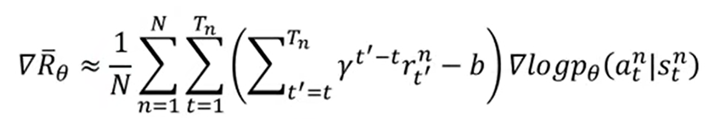
### 1. baseline
### 2. gamma
## on-policy 2 off-policy
policy gradient的期望是对当前$\theta$的期望，因此每更新一次梯度，原来的sample不能再使用。
on-policy意味着更新的模型和与环境直接交互，off-policy意味着更新的模型观看另一个模型与环境交互，后者的sample可以重复使用。

## general的 important sampling
$E_{x \sim p}[f(x)] \approx \frac{1}{N} \sum_{i=1}^N f\left(x^i\right)$

估计$f(x)$的期望，从$p$中采样$x$进行计算。
$=\int f(x) p(x) d x=\int f(x) \frac{p(x)}{q(x)} q(x) d x=E_{x \sim q}\left[f(x) \frac{v_0(x)}{q(x)}\right]$

假如我们不能从$p$中采样，但我们能从$q$中采样，则修正后依然可以计算$f(x)$的期望

$\begin{aligned} & E_{x \sim p}[f(x)]=E_{x \sim q}\left[f(x) \frac{p(x)}{q(x)}\right] \\ & \operatorname{Var}_{x \sim p}[f(x)] \quad \operatorname{Var}_{x \sim q}\left[f(x) \frac{p(x)}{q(x)}\right]\end{aligned}$

结论：修正变量$f(x)\frac{p(x)}{q(x)}$和源变量$f(x)$对于$x~q$计算期望相同，方差不同。因此如果p、q差别过大且采样数量不够，则计算结果差别会很大

## PPO
$$\begin{aligned} & J_{P P O}^{\theta^{\prime}}(\theta)=J^{\theta^{\prime}}(\theta)-\beta K K_6\left(\theta, \theta^{\prime}\right) \\ & J^{\theta^{\prime}}(\theta)=E_{\left(s_t, a_t\right) \sim \pi_{\theta^{\prime}}}\left[\frac{p_\theta\left(a_t \mid s_t\right)}{p_{\theta^{\prime}}\left(a_t \mid s_t\right)} A^{\theta^{\prime}}\left(s_t, a_t\right)\right]\end{aligned}$$

# Q-learning(value-based)
## critic(无折扣版本)
### 1. MC-based: 是很多步的得分之和，方差较大
$t=t_a时，s_t采取a_t得到s_{t+1}和r_t$

$V_{s_t}$是从$s_t$到游戏结束可以得到的回报之和，$G_{t}$是从t到游戏结束可以得到的回报之和

$critic(s_a) = V_{s_a} = G_a = \sum^{t_n}_{t=a+1}r_t$
### 2. TD-based: 拟合差值，但可能本身不准
$critic(s_t) = r_{t+1} + critic(s_{t+1})$

### 3. $\lambda-return$
k步TD法：$G_{t:t+k}=r_t+r_{t+1}+...+r_{t+k}+V_{s_{t+k}}$

拟合n个k步加权平均(给定n，k从1取到n)

$critic(s_a) = G_a = (1-\lambda)\sum^{\infty}_{k=1}\lambda^{k-1}G_{a:a+k}$

### two architecture
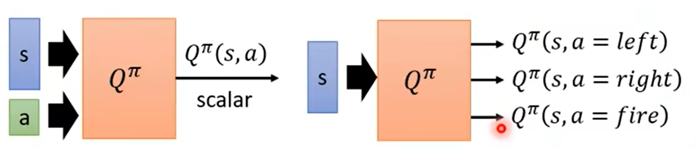
右边只适用于离散控制

## actor
有一个好的critic就有一个好的actor

### target network
在TD-based下target是一直在变化的，训练会很不稳定
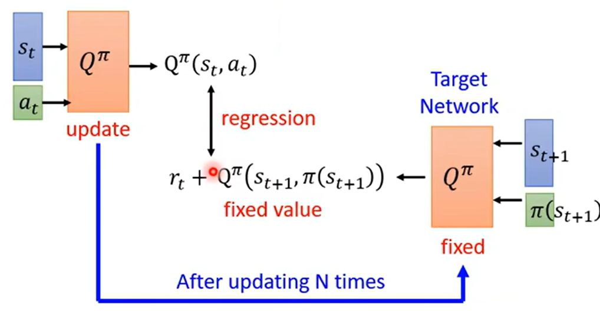

### exploration
1. 以一定几率进行随机动作，训练阶段越后越固定
2. 以输出的概率分布进行采样

### replay buffer
是一种off-policy

## tips
### 1. double DQN: Q-value一般会被高估
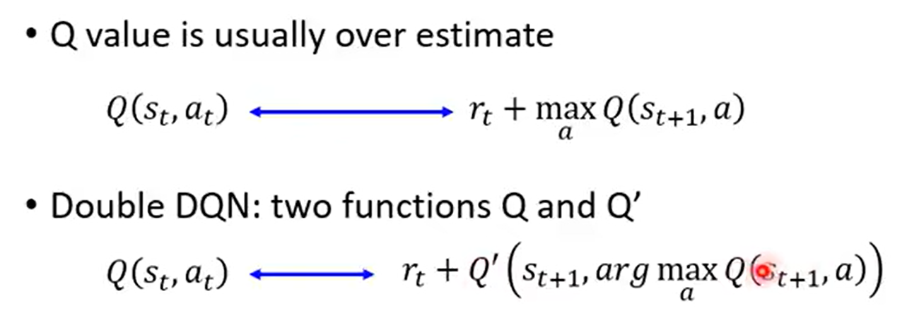
类似于行政与立法分开，即使选出了被高估的a，他也不会被高估

### 2. dueling DQN: 改了架构

### 3. priority replay: 优先选择loss大的data

### 4. multi-step: MC和TD的折中，存取St...St+n

### 5. noisy net: 每个episode开始给Q的参数加上noise
用比较一致的方式进行尝试
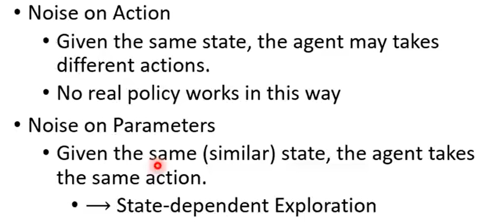

### 6. distributional Q-function
输出的Q值是一个期望值，但实际上应该是一个分布，因此我们改变网络输出一个分布
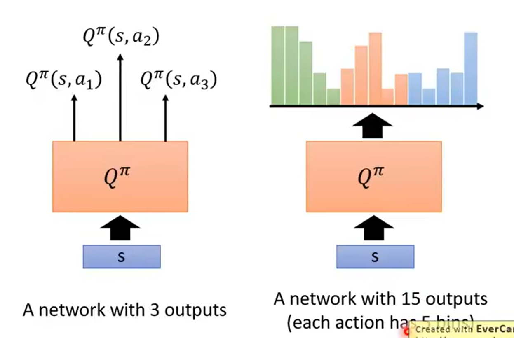
这样也许在两个action的Q期望相同，我们可以选一个风险更小的

## continuous action: a = argmax Q(s, a)
### 1. sample 
### 2. use gradient descent to solve this 
### 3. 改变Q-function, 从而让求解argmax简单
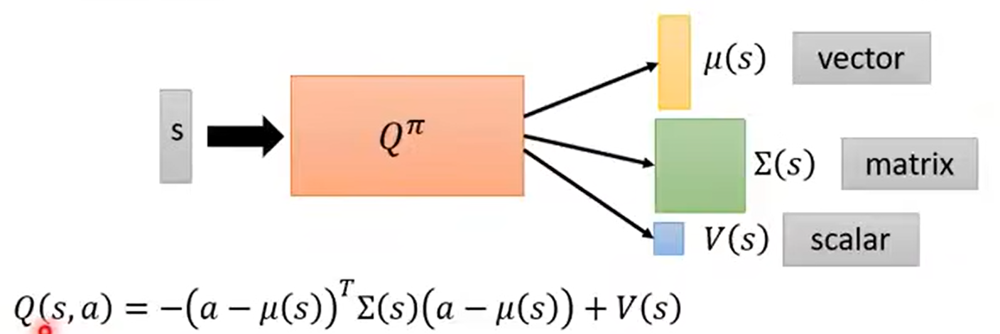
不是直接输出∑，是做了什么运算保证正定，从而是一个正态分布

### 4. don't use Q-learning
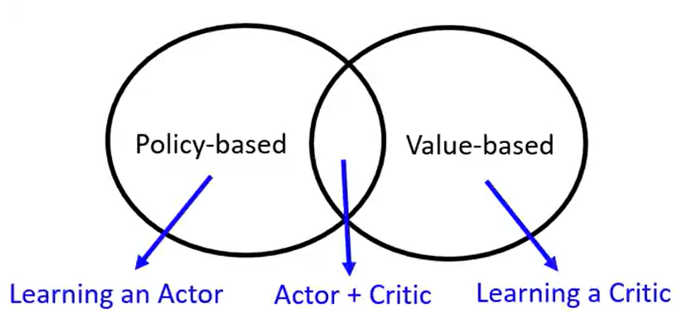

# Asynchronous Advantage Actor-Critic(A3C)

## advantage AC
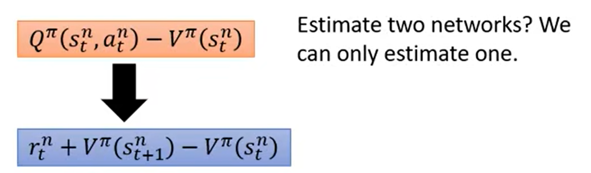
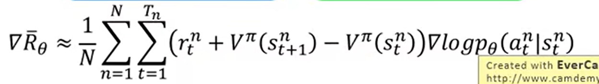

## asynchronous
多个actor，各自有自己的env，所有的梯度共同更新

# Pathwise Derivative Policy Gradient
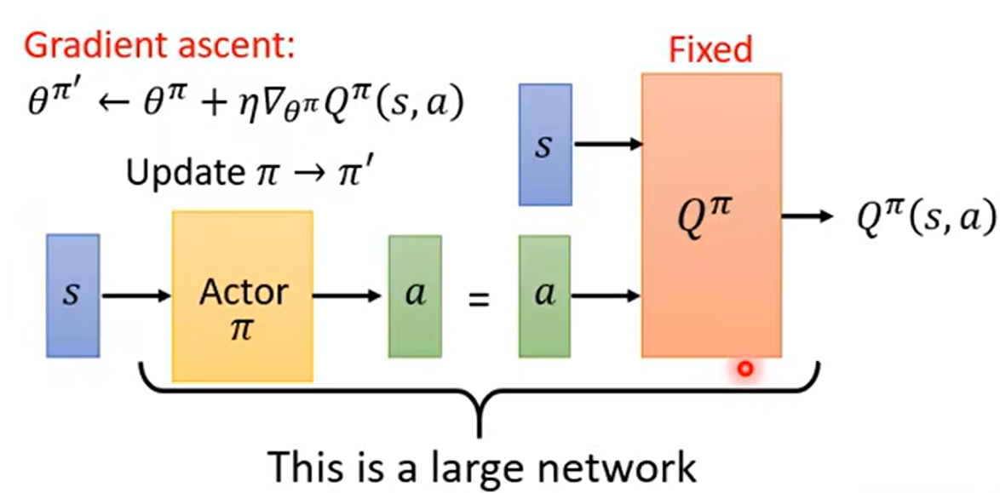
和我知乎上看到的Deep Deterministic Policy Gradient一样？
这个就是GAN

# sparse reward

## reward shaping

## 1. curiosity
ICM(s1, a1, s2)

## 2. curriculum learning

## 3. hierarchical RL