# Architecture 架构

## 应用服务器和数据库服务器分开：
数据库服务器架在内网，外网连不到，应用服务器两个网卡，一个连数据库一个对外
  - 性能：既跑应用又跑服务器
  - 安全：数据库不能用应用ip访问
## 分布式缓存服务器
  - 读盘慢。网络开销比磁盘还慢。
  - 注意经常变化的不要放到缓存里，如库存、价格，保证一致性

## 负载均衡服务器：调度多个应用服务器
可能要求同一个session调用同一个服务器（nginx中的ip hash）

## 数据库主从备份
  - 写主，同步从；读，主从均可，负载均衡
  - 可能切换主从角色，防止过热过冷

## CDN内容分发网络
  - 音频视频文件内容放到全国各地，访问的时候距离最近
  - 反向代理服务器：访问的时候，反向代理服务器去管具体访问哪个节点

## 统一数据访问网关
  - 封装先缓存+数据库等，访问数据统一走数据访问网关

## 多数据库
  - nosql+搜索引擎
  - 数据放在最适合的地方，数据访问由网关统一管理

## 消息服务器
  - 异步通信
## 微服务
  - 上述服务均为基础设施，不同的应用调用同样的基础设施
  - 应用有些部分也是公用的，可以封装成微服务，基础设施越来越多

一个完整的企业级应用架构图如下：

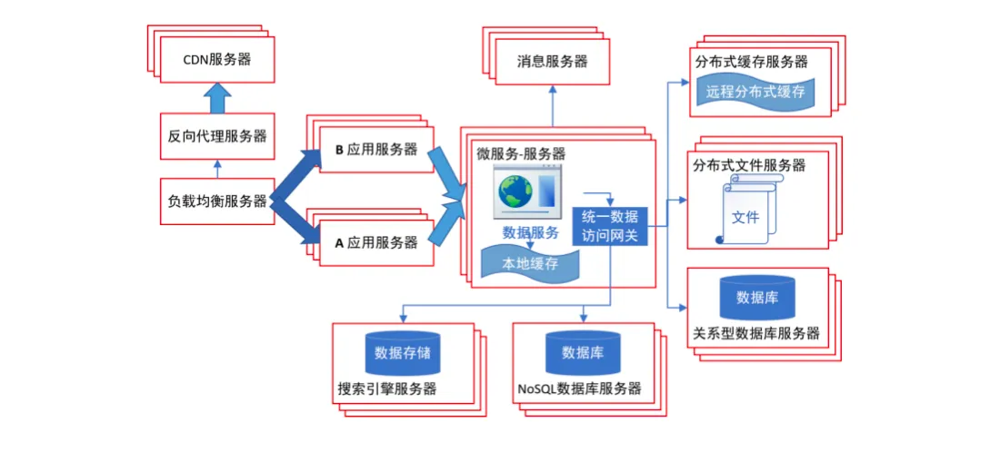

# 实例
本质是有状态还是无状态的

## 实例池，对象池

- 管理和重用对象实例：对象池通常是一个集合，用于存储和管理多个对象实例。当需要使用对象时，可以从对象池中获取一个可用的对象，而不是每次都创建新的对象。一旦使用完成，可以将对象返回到对象池中，以便稍后重用，而不是立即销毁它。
- 有一定的大小：防止1000条访问内存爆炸
- 一定的内存大小服务多个用户：
  - 如果只能内存大小只够两个，共有ABC三个状态
  - 写入A，B后，C也要进入内存不够
  - 就把A序列化成字符串后把C swap in，把A swap out到磁盘上
  - swap in/out的根据是LRU
  - 有状态的因为swap in/out太多，所以效率低还占据空间，所以最好写无状态代码

## HTTP状态

### Http是无状态协议：
每次HTTP请求都是独立的，服务器不会自动记住前后请求之间的关系。每个请求在服务器看来是一个完全独立的事务，与之前的请求无关。（如果你发出多个请求，服务器不会跟踪这些请求之间的顺序或关系）

#### **HTTP有状态服务：**

1. Session：存储在服务器端，服务器为每个用户会话生成一个唯一的Session ID，用键值对存储信息（信息可以比较复杂）
   - 某一个用户的购物车对象等信息
2. Cookie：存储在客户端（浏览器），安全性低
   - cookie对应的是每个对象的id
3. Token：存储在客户端（浏览器的LocalStorage、SessionStorage或Cookie中），包含了用户的身份和权限信息，服务器不需要保存Token状态。加密数据片段，通常用于身份验证。Token 常见的形式是JWT（JSON Web Token）

有状态**消耗额外的（内存）资源**

#### 无状态服务

- 上一次调用跟这次没关系，尽量无状态
- 只要一个对象都行

## Scope

#### 1. Singleton（单例模式） : Stateless
  - 默认，整个bean里只有一个对象

#### 2. Prototype : Stateful
  - 每次**调用(所有的Bean)**产生一个新对象
  - 所以两次访问会产生两个controller（如果controller为prototype）

#### 3. request 专用于web应用
  - 每次http请求就产生一个新对象

#### 4. session 专用于web应用
  - 一个客户端调用两次，使用的是一个对象
  - 两个客户端各调用一次，使用的是两个对象（会属于不同的session）

#### 5. application 专用于web应用
  - 整个bean只有一个对象

### 应该如何设计scopes of Beans

- 如果不同用户看到的内容一样，使用singleton即可
  - 比如主页的所有书籍的具体信息
- 如果不同用户看到的内容不一样，即需要为每个用户维护一个状态，就可以用prototype
  - 让每个用户维护它在线多长时间了
    - 这个东西就可能需要做一个session和prototype的组合

------

### 连接池

- 连接本质是线程，线程切换有代价，所以不要一个用户一个连接
- 数据库连接池和实际能够承受的连接数的关系：
  **connections =((core_count * 2) + effective_spindle_count(有效硬盘数量))**
  - 最好16个核超线程就32个线程
  - 数据库的最终实现是读硬盘，但是在读的时候线程是废的，所以还要加上有效的硬盘数量
  - 这个硬盘数量指的是数据库硬盘的数量，而不是后端服务器硬盘的数量
  - 所以和有多少并发用户没什么关系
  - 这里指的是数据库服务器，而非应用服务器
- 读盘过程线程是空的，可以通过线程切换再加用户
  - 但是最多就开core_count*2个线程
- 用户多就开大是错误的：线程切换太大，不要有太多连接；
- **连接池大小和用户数前端 没关系（不要开多连接数**
  - 上面的公式中连接数已经是数据库效率最高的方式

------

# 异步通信 JMS

### 为什么要异步通信
同步通信的缺点：

- 紧耦合：没有变化保障
- 没有送达保障：过多 / 挂了（通信不可靠的时候） 都调不出来
- 软件物种化：需要做方法声明，所有人按契约编程
- 没有请求缓冲：太忙了直接失败
- 过于强调请求和响应（Too Much Emphasis on Requests and Responses）
- 通信不可重放（Communication is not Replayable）

好处编程简单

------

### 异步模型

没有客户端和服务器的区分，client和server都和kafka cluster这个中间件交互（kafka就是帮助异步通信的中间件）

发信息，发完后可能没有及时响应，但之后一定会完成；发完消息后不用等待

- 后端异步（甚至是不同层之间都可以）：
  - 防止请求过多 丢失；请求放到消息队列，服务什么时候有空了就去处理
- 异步通信的优点（其实同步通信的缺点就是异步的优点）：
  - 不会产生因为service忙而请求被丢失的问题
  - 很好地利用了空闲时间和空闲资源

### topic 消息缓冲区（消息队列）

- producer发送消息到队列topic中（string
- consumer不断从topic中拿string并解析成对象


### client如何知道处理完成

1. client 发ajax获取：轮询机制查询，无需中间件比较灵活，但严重增加服务器负载，造成不必要的带宽浪费

2. websocket：实时更新，双向工作，节省了带宽通信量，可以保持持久连接；保持连接讲持续占用服务器资源，老浏览器不兼容。需要在线接受

3. 服务器把结果推到另一个topic，client监听该消息队列，发现非空后就将内容取出得到结果：
   - 直接交互，不需要单独写新接口（都运行kafka监听）；复杂，客户端直接与Topic连接，Topic直接暴露，需要确保消息传递的安全性
   - 在前端下线时也能接受，在第二次上线时处理

#### 完整详细过程：

1. 前端发起的请求会发到中间件的某个topic（假设为topic A）里面。**此时后端会直接给前端发回一个ok响应，并在后续的步骤异步处理请求**
2. 一旦服务器接口空下来，它就会去扫描对应topic（topic A）看看里面有没有请求，一旦有就将消息取出，转换成json格式，然后进行处理。
3. 同时服务器处理完请求后，会将结果存入另一个topic（假设为topic B）
4. client也会在空闲后扫描topic B，发现非空后就将内容取出得到结果
5. 即service会监听topic A，client会监听topic B

### 应用场景

- **有忙有闲，闲的时候处理忙的时候的缓存请求**
  - **一直忙：增加机器**

  

- 上图中：就是在请求密度很高的时候，仍旧较为平稳地处理请求（虽然我也看不太懂画的啥玩意）

### What is Messaging?
- peer-to-peer: 大家都是客户端，都可以发消息和收消息
- 松散耦合，controller只需要在乎发到那个topic上，只传数据不传方法调用，data-driven
- web service调用方法走SOAP，只传数据走REST

------

## JMS Java Message Service

- 消息传递异步
- 通过异步达到高可靠性：发完消息，不管consumer在不在线，都会先缓存，直到在线了再发；不会发完直接失败
- 客户端
- 消息中间件，消息触发

### JMS API 特性

- 允许Application clients（本来的发请求、处理请求的都算这种）
- 规定了Message send and receive operations

### message格式

message的格式是弹性的，包含以下三个部分：

- A header
- Properties（可选的）消息属性，是对消息头的补充
- A body（可选的）消息体
- 消息可以没有消息体、属性，但是一定有消息头

- 怎么发消息

  - 消息转化为纯文本：特定格式 （header + *properties + *body）

    - 消息模式：可能发一次失败就不发了，比如股票信息对时间顺序敏感先2后1有问题(time stamp 属性)，晚发的消息1会被忽视

      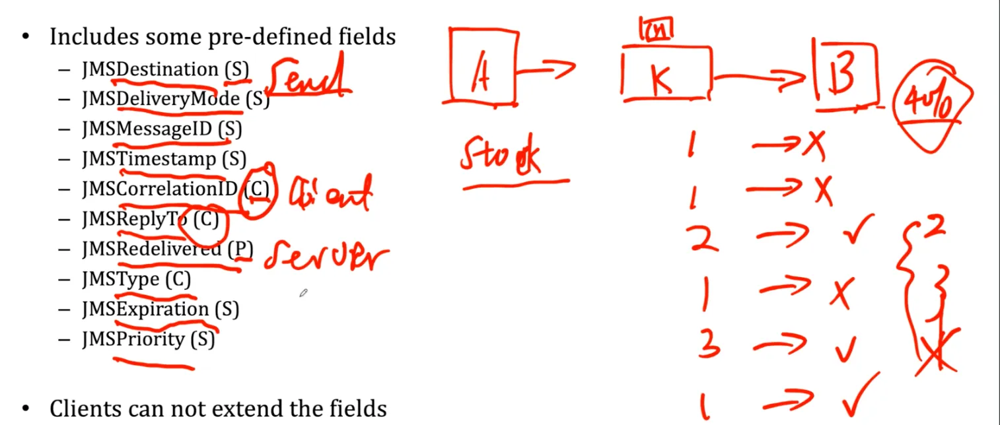

  - 扩展规则：可用来指定接收者等等

    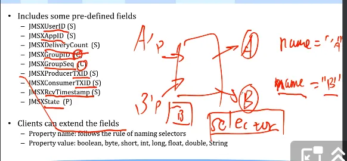

    - Property name
      - 即使在同一个topic下，也可以通过name对于收到该信息的service做区分（select）
      - 比如所有班级的家长都往一个邮箱里寄信，两封信中的name起为A和B，那A和B学生就能拿到对应的正确的信（虽然在一个邮箱里）
    - Property value

JMS的消息体类型

JMS的消息体类型：

- TextMessage：转成java的String类型就可以存
- MapMessage：就是Java的Map类
- BytesMessage：字节数组byte[]
- StreamMessage：任意一个流（必须是基础类型的）
- ObjectMessage：对象一定要能够被序列化
- Message：body为空，是上面五类的父类对象
  - 当你不知道传过来的Message是什么类型的时候就用这个

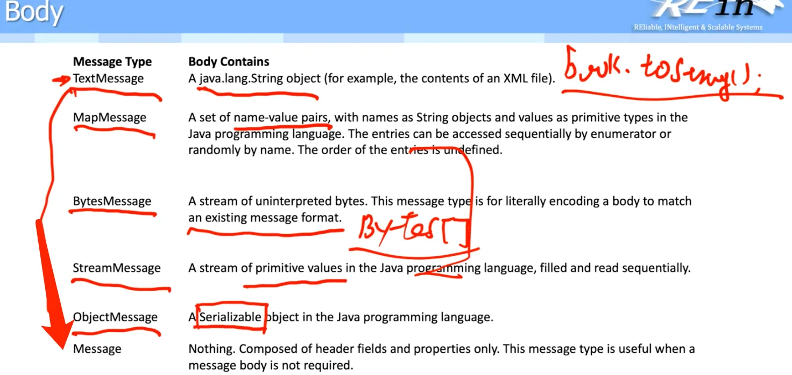

#### JMS API Architecture

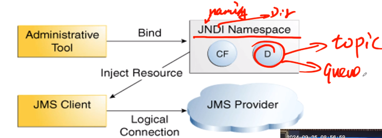

- Destination(D)分为两种
  - topic
  - queue
- JMS Client（收发消息的都算client）
  - 先通过连接工厂找到一个到JMS的连接，才能够进行收发消息
  - Messaging Styles 有两种
    - 发送消息的模式是ptp（point-to-point）
      - 如果client1发送的消息2接收到，3不会受到消息
    - publish/subscribe 广播模式
      - 每个message可以有多个consumer，消息里可以加selector，不同consumer可以收到不同的消息

#### JMS消息传输模型

1. **点对点（Point-to-Point，P2P）模型**：

- 在这个模型中，消息生产者发送消息到队列（Queue），消息消费者从队列中接收消息。
- 每个消息只能被一个消费者接收，一旦消息被消费，它就会从队列中移除，确保消息不会重复处理。
- 这种模型**适用于需要确保消息只被处理一次的场景**，例如订单处理、用户请求处理等。

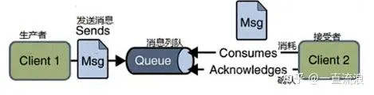

2. **发布/订阅（Publish/Subscribe，Pub/Sub）模型**：

- 在发布/订阅模型中，消息生产者（发布者）将消息发送到**主题（Topic）**，而消息消费者（订阅者）订阅感兴趣的主题。
- 一个发布者发送的消息可以被多个订阅者接收，这使得发布/订阅模型**非常适合需要一对多通信的场景**。
- 订阅者可以设置过滤条件，只接收满足特定条件的消息，这增加了消息传输的灵活性。

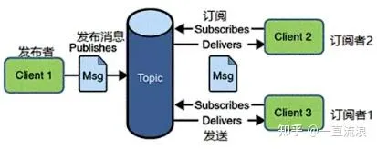

两种模型的特点对比：

- **一对一 vs 一对多：**
  - P2P模型是一对一的消息传输，每条消息只有一个消费者。
  - Pub/Sub模型是一对多的消息传输，一条消息可以被多个订阅者接收。

- **队列 vs 主题：**
  - 在P2P模型中，使用队列作为消息的容器，队列**保证了消息的顺序性和独立性。**
  - 在Pub/Sub模型中，使用主题作为消息的发布点，主题允许多个订阅者接收消息。

- **消息确认：**
  - 在P2P模型中，消费者通常需要显式确认消息，告知消息服务器消息已被成功处理。
  - 在Pub/Sub模型中，订阅者可能需要确认消息，也可能不需要，这取决于具体的实现和配置。

- **消息持久性：**
  - 在两种模型中，都可以配置消息的持久性，确保消息不会因为系统故障而丢失。

JMS的这两种消息传输模型为不同的应用场景提供了灵活的消息传递机制，允许开发者根据业务需求选择合适的模型来实现消息通信。

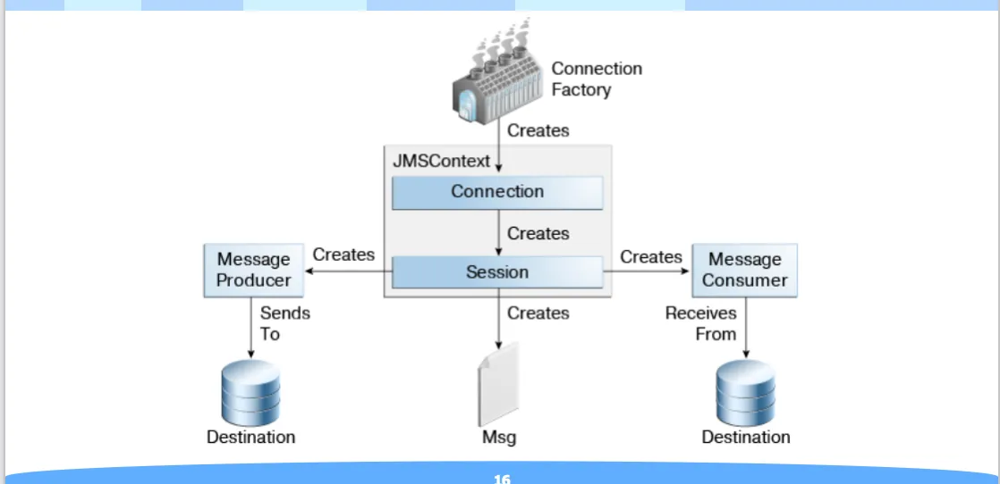

## 异步通信 - kafka

- 消息中间件
- **发布(write)/订阅模式(read)**，存储转发
- 基于日志实现：append-only只追加，在后面不断更新
  - 顺序写：速度快
- 对不同用户维护不同用户读的offset
  - 不同用户按自己的进度读，不会读乱
  - 当一个消息被所有的消费者读走了之后，这个消息才会被删除掉；多个用户可以读取同一个log，并且维护他们各自的文件位置（都到哪里了）这样就能保证log文件不可能无限制的增长
- 如果一个topic放相同的对象：优点是每个对象长度相同，通过偏移量快速定位
  - 缺点是种类多，topic多
- 如果一个topic记录多种类型：每个都要记录起始位置和长度

### 分区
队列如果很大，就可以分区每个service处理一个分区
- 加快处理，按时间或者用户姓名等
- 不同用户处理不同的区
- 对于集群的容灾：用空间换可靠
  - 比如每个数据存储两个副本，这样比如有一个卡夫卡服务器崩溃了，还有一个备份能够使用。
- 检测死没死：心跳
  - 此时就需要一个协调器在kafka集群里面，consumer一直发心跳包给协调器，如果不发协调器就不会再把消息给故障的机器。
  - 如果一个死掉另一个会接管它的工作

### websocket

- **全双工**（双向都工作）通信，request端和response端完全对等，即用户可以主动给服务器发消息，服务器也可以主动给用户传递消息。底层使用TCP协议（安全保证）
- 服务器发布（publish）一个 WebSocket 端点endpoint，客户端使用端点的URI连接到服务器。

WebSocket分为两部分：**握手（handshake）和数据传输（data transfer）**

#### 握手（handshake）

1. **客户端发起 WebSocket 握手请求：**客户端通过使用其URI向WebSocket端点发送请求来启动握手。握手（handshake）与现有的基于HTTP的基础设施兼容，Web服务器解释其为HTTP连接升级请求
2. **服务器响应 WebSocket 握手请求**
3. 客户端收到服务器的响应后，验证 `Sec-WebSocket-Accept` 是否正确。如果验证通过，服务器和客户端就可以互相发送消息了

**Sec-WebSocket-Accept 的生成：**

- 服务器对Sec-WebSocket-Key标头的值应用已知操作，以生成Sec-WebSocket-Accept标头的值。
- 客户端对Sec-WebSocket-Key标头的值应用相同的操作，如果结果与从服务器接收到的值匹配，则连接成功建立

#### 如何创建并部署一个endpoint：

1. 创建端点类（endpoint）
2. 实现端点的生命周期方法（发送、接受信息的时候要做些什么事情）
3. 将您的业务逻辑添加到端
4. 在web应用程序内部部署端点

开发中一般使用annotation的方法实现endpoint

#### 一些WebSocket的生命周期方法：

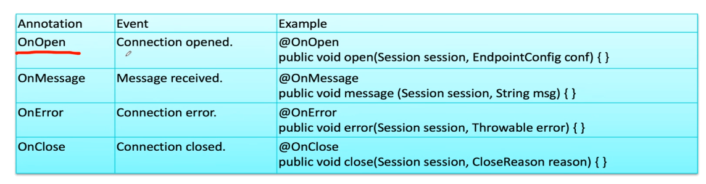

- OnOpen：建立连接的时候要做什么
  - 封装好session并写入list，这个list在发消息的时候会遍历这个list
- OnMessage：收到消息的时候
- OnError
- OnClose

#### 维护session list

创建端点的的时候也会为它建立一个session list并维护（将所有的session按顺序放进去）

- 连接后是通过session发消息
  - send的时候就会需要拿到每个session并将消息广播出去（也可以指定具体的接收者）

- sessionlist要求是线程安全的（可能多线程）
  - 如果不是线程安全的可能会导致数据丢失甚至崩溃

#### 编码器 解码器

发消息的时候使用

- 可以增加编码器和解码器
- 将对象decode成方便发送的格式

#### 通信机制共存

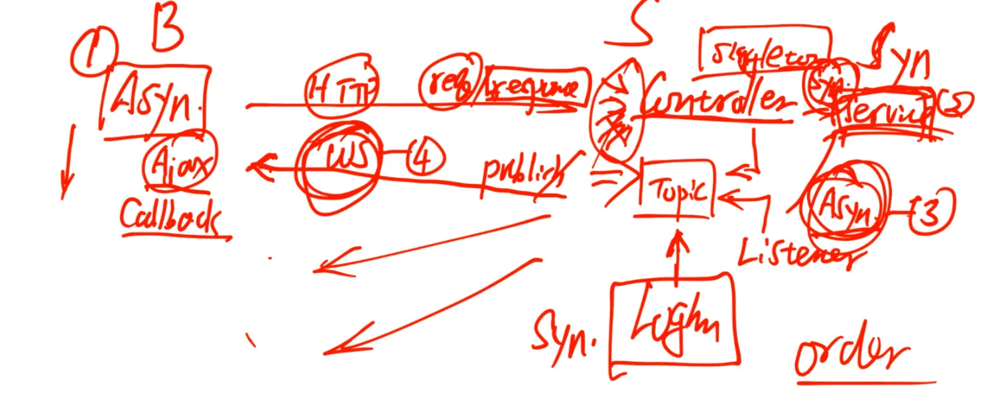
客户端B和服务器S是走http走同步调用，意味着在浏览器这端发送了信息之后等待回来，因此前端是需要ajax异步，在回消息之后调用回调函数

不仅前端需要异步后端也需要。controller接受了大量的请求，如果只有一个实例可能会丢失，所以写入一个topic。

这个时候如果前端需要消息，所以也就需要ws。所以这个时候我们出现了四种通信方式的共存。Login这种高优先级的场景必须是同步的。

# transaction 事务

只有100张票的东西却有200个人同时并发在抢，如何控制不会出错，确保数据库中的状态是一致的

- 不会因为并发请求同时处理使得数据库的数量出问题

如何确保两个操作是原子性的？（即要么都发生要么都不发生）

需要使用java中的transaction

- 要么全部执行
- 如果部分执行则要对执行了的部分进行回滚

#### Java Transaction Api（JPA）

- 支持声明式的事务控制
```
begin transaction
  先扣钱
  再存钱
  再更新操作日志
commit transaction
```
- 原子性问题，上述即为达到transaction的伪代码
#### 事务的定义：

一系列必须全部成功完成的操作，要么都执行，要么都不执行（事务回滚）

#### 显式使用transaction的不同方法

没有显式使用transaction之前，bean都是用container管理的

- 比如methodA要调用methodB
- 进入methodA，该线程就会依附上一个事务TX1
  - TX1肯定要在methodA执行完毕后才会尝试提交/回滚
- 调用methodB时，该线程会进入哪个事务执行呢？
  - 这就由下面的不同状态来定义

#### 范式
- 第二范式：非主属性必须完全依赖于主键，而不是主键的一部分。适用于复合主键，消除**部分依赖**
- 第三范式：不存在非主属性依赖于非主属性。消除**传递依赖**于主属性
- BC范式：对于Y依赖于X的函数依赖 $X → Y$，$X$必须是一个超键（即 X 能够唯一确定一行数据）
- 第四范式：不存在两个独立的属性同时依赖于同一个主键。消除**多值依赖**

#### 六种@TransactionAttribute的状态(atomic)

methodA中调用methodB

- Required
  - 在方法前面加注解@TransactionAttribute(REQUIRES)
    - 也可以在整个bean上面加
  - 有加入，没有新建
  - 在调用methodB（B也为Required）的时候，会将methodB加入到调用它的方法的事务，即methodB执行的时候也在事务TX1中
    - methodB执行结束后，TX1会检查是否能提交/回滚，但是因为是A创建的所以不能
    - 返回到methodA结束后，TX1才能最终选择提交/回滚
  - 适用于绝大多数情况，**确保所有相关操作要么一起提交，要么一起回滚**
- RequiresNew
  - method B会开一个新的TX2，method B执行结束之后就会执行一次提交/回滚，成功与否不影响A
  - 新建一个事务，原有事务被暂时挂起
  - 用于需要方法独立执行、避免与外部事务干扰的情况
  - 若A中有方法B，若A为Required，B为RequiresNew,那么B发生错误不会影响A
    - 比如上述问题，不希望log操作失败就将扣钱、存钱也进行回滚，所以将log声明为RequiredNew。
- Supports
  - B在A的中执行状态下执行
  - 即无论A有没有事务，B都和A在相同的事务/没有事务的背景下执行
  - 用于可选择性的事务操作，事务性并不是必需的
- NotSupported
  - None，当前方法不支持事务。如果调用时有事务存在，事务会被挂起，方法执行完成后再恢复原来的事务；挂起现有事务，无事务支持
  - 如果B为NotSupported，则调用B时会先将A的TX1挂起，然后在非事务的状态下执行B，再回到A进行执行
  - 当不希望方法在事务上下文中运行时，比如不需要事务保证的一些只读操作
- Mandatory
  - 如果A有事务就加入，如果A没有事务就抛出异常
  - 强制要求方法必须在事务中执行
- Never
  - 和Mandatory恰好相反，在事务里抛出异常，不在事务里则正常执行（也不会创建事务）
  - 需要确保方法绝对不在事务中执行时

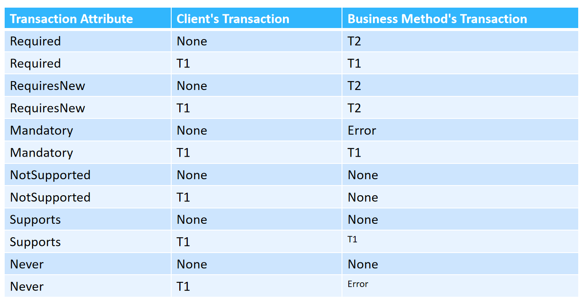

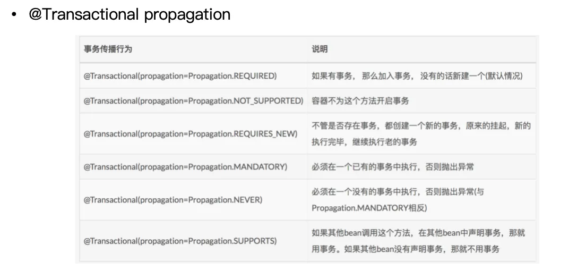

#### 事务四个属性：ACID

- a：atomic原子性（可以使用双required确保整个事务回滚）
  - 不可分割性，事务单元全部成功或者全部失败
- c：consistency 一致性
  - 一个正确（一致）的状态转移到另一个正确的状态
  - 比如银行存款无论怎么扣都要确保值不能是负的

- i：isolation 隔离性，互不干扰
  - 多个事务在并发执行的过程中所得到的结果，和串行执行得到的结果一致
  - 解决A和B做并发操作时，做到不会卖重复
- d：durable 持久性
  - 永久保持，执行结果不会丢失（数据库要保证提交的东西绝对不会丢失）
    - 通过undo log和redo log来确保
  - 只要正常提交，数据库中的数据变化就一定长久可见

#### Isolation
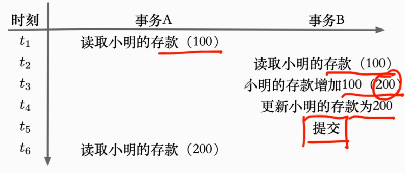

事务隔离级别控制的是**同一时间内多个事务如何相互影响数据可见性**的问题。

#### 隔离性冲突总结

| **写读冲突** | **脏读**       | 事务A读取了事务B修改但未提交的数据（读到了事物处理的**中间状态**），事务B随后回滚，导致A读的数据无效。（解决：不能读中间状态 |
| ------------ | -------------- |--------------------------------------------------------------------|
| **写读冲突** | **不可重复读** | 事务A第一次读取数据后，事务B修改并提交该数据，事务A再次读取时数据被修改。（解决：读了就锁->幻读                 |
| **读写冲突** | **幻读**       | 事务A执行范围查询后，事务B插入/删除了满足条件的记录(但B还没确定)，事务A再次查询时不同。（解决：将整个table锁住      |
| **写写冲突** | **脏写**       | 事务A和事务B同时修改同一条记录，事务B的提交覆盖了事务A的修改。                                  |

- 写读冲突的例子：
  - 事务A：小明账户存款100元
  - 事务B：家长查询小明存款
  - 如果事务A、B并发执行就会导致dirty read脏读
    - 比如如果B读取到了A的中间状态，因为不知道A最终会提交还是回滚，此时B读到的数据就可能是错误的
- 不可重复读的例子：
  - 两个人抢同一张票，一个人先读到了还有一张，然后进行购买流程。另一个人在前一个人进行购买流程的时候也读到了还有一张，但是准备买的时候前一个人下单成功，导致读到有票，可是要买的时候票没了。
- 幻读：如果表里插入了新数据，且满足query的条件，查询时不断会有满足条件的新数据出现

#### **Read Uncommitted：**

- **特性**：允许一个事务**读取另一个未提交事务的修改**，可能发生**脏读**（Dirty Read）。
- **优点**：并发性能较高；
- **缺点**：最低的隔离级别，可能会看到未提交的数据变化。

#### **Read Committed：**

- **特性**：**只能读取已经提交的事务修改**，避免了脏读，但可能发生**不可重复读**（Non-repeatable Read）。
- **实现原理：**增加写锁
- **优点**：大多数数据库的**默认级别**，保证每次读取的数据都是已提交的；
- **缺点**：同一事务中，连续读取同一条数据可能会不一致。

#### **Repeatable Read：**

- **特性**：**保证同一个事务中多次读取的数据是一致的**，解决不可重复读的问题，但可能会发生**幻读**（Phantom Read）
- 实现原理：~~增加读锁。~~ MVCC
- **优点**：确保读取的记录在事务期间不发生变化；
- **缺点**：仍可能有幻读问题（即插入新数据时的并发问题）。
- **解释**：与不可重复读的区别在于，**不可重复读**是针对**已存在的记录**的修改，而**幻读**则是因为**并发事务插入或删除了新的记录**，从而影响了查询结果集的条目数量或内容。对一个同一个List在同一事物读取，第一次读到10个，第二次读到11个，因为中间插入了一个数据。

#### **Serializable：**

- **特性**：**最高级别的隔离，事务之间完全隔离**，仿佛事务是一个接一个顺序执行的，解决了幻读问题。
- 实现原理：对所有SELCT语句增加共享锁，UPDATE语句增加排他锁，利用锁机制实现串行
- **优点**：提供了最高的事务一致性；
- **缺点**：没有任何并发，完全时串行的操作
- 所以很少使用，因为性能实在太差

SQL：JDBC的连接是什么属性，是在数据库里设置的

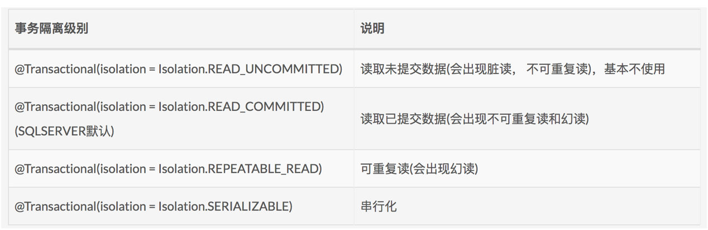

------

## 多数据库 分布式事务

### 两阶段提交协议

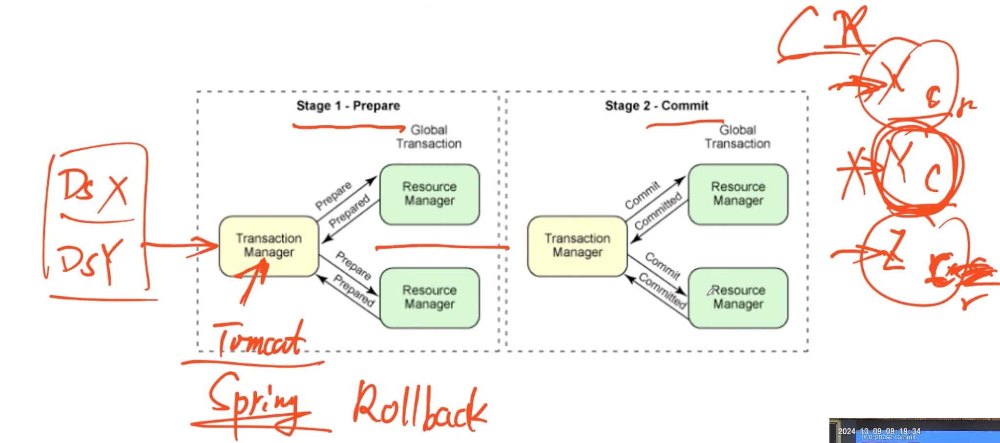

- 两阶段：
  - 第一阶段prepare
  - 第二阶段commit
- 启发式：第二阶段发送全部commit时网断了，不知道manager的决定，从提交/回滚中猜一个
- 但是技术上无法避免第二阶段的启发性错误，需要人工处理

### 并发锁

- 乐观离线锁 optimistic offline lock（认为读多写少
  - 离线：从数据库拿走之后自己玩
  - 在会话提交更改之前，会进行冲突检测。如果检测到冲突，则会话无法提交更改
  - 加版本号version int
  - 写的时候和读的时候版本号不一样，冲突
  - 这玩意就是cse里面那个乐观多版本锁机制
- 悲观 Pessimistic Offline Lock （认为写多
  - 读了就锁
  - 浏览次数（更改很多的情况
- **粗粒度锁** Coarse-Grained Lock
  - 锁多张表，比如一个用户多个address（一个锁）
    - 乐观锁：单独一个版本号对象，这几个表对应的记录共享一个对象，写的时候检测version
    - 悲观锁：统一一个锁锁版本号对象，读就锁

事务在资源管理器来管的(数据库，邮件系统，消息服务器)，不会管内存，需要维护过这个对象之前的状态；是在对事务性的对象做
比如，y++失败，x++不会回滚。
```
@Transaction
{
  x ++; y ++;
}
```

# 数据库事务管理 log

## 调度

为了更好解释并发控制过程中，数据库对事务的处理流程而引入的

定义：事务并发过程中，决定事务中每个操作的执行顺序

- eg:小明要扣款100元，分为三步
  - 读取小明余额
  - 计算扣款情况
  - 将扣款后金额存回数据库

假如有两个事务，T1为消费100元，T2为消费200元

- 若**串行调度**，慢但是正确
- **并行调度**快，但是可能会出现错误的情况

### 调度定义下的并发控制：

- 给定一个并发调度S'，存在一个串行调度S，在任何数据库状态下，按照S和S'执行后产生的结果都是相同的。
- 此时调度S'被称为**可串行化调度**

### 可串行化调度

- 数量十分巨大，且难以校验
- 数据库中一般通过找到可串行化调度的子集（充分条件），即找到能提前确认为可串行调度的并发调度
  - 即找出来一个能用的就行，不用找出所有的然后选最优
  - 找的方式：冲突可串行化调度
- **操作交换：**定义为交换事务调度序列中相邻的两个操作，一次交换操作可以将一个调度A变为另一个调度B
  - 当交换不会影响两个调度的一致性，则称该交换得到的两个调度是等价的，该交换为等价交换
    - 等价操作：交换连续两个相同数据读取、两个不同数据读写操作的顺序
    - 非等价操作：交换连续两个相同数据读写操作的顺序
- 如果一个并发调度可以通过等价交换变为一个串行调度，则认为该并发调度是安全的
- 但如果使用不等价交换就可能出现冲突

### 冲突可串行化调度(Conflict Serializability)

- 定义：从冲突的角度出发，针对一个调度S（可能存在冲突）去发现其等价的串行调度S'来确定S是一个可串行化调度
  - 是一种特殊的确定是否是可串行化调度的方法

- **验证是否冲突可串行化**：（对同一数据的冲突连线

  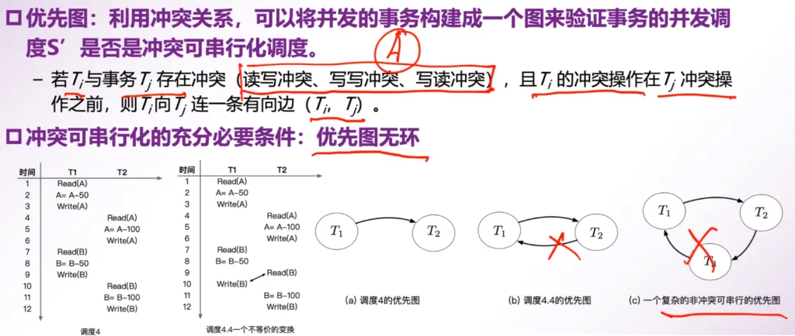

  - 要求为优先图（无环，有环就非冲突可串行化

  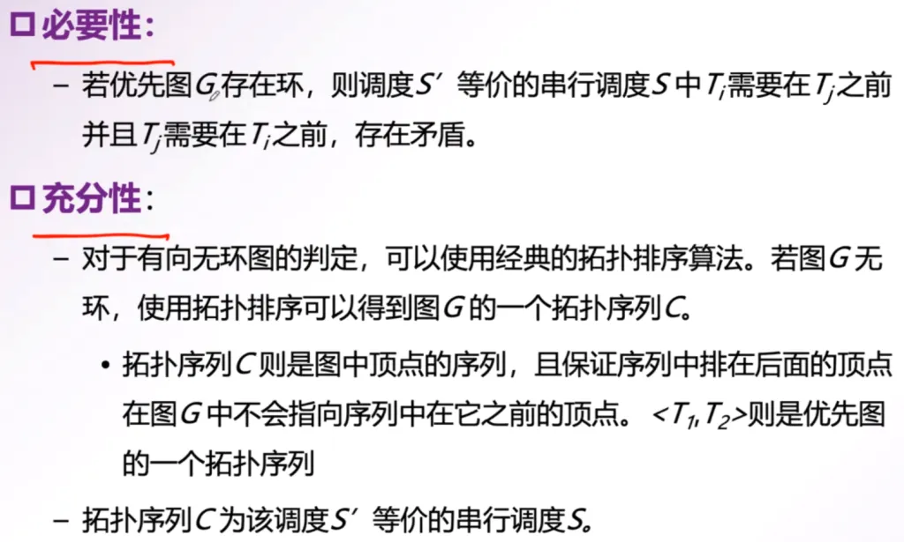

#### 结论：如果调度S‘中T~i~,T~j~的某两个操作存在冲突，且T~i~的冲突操作在T~j~之前。若调度S'存在冲突等价的串行调度S，则在串行调度S中T~i~一定在T~j~前面

## 事务原子性和持久性的实现

### 原子性

- 事务运行期间不刷盘，故障系统重启后自动保证原子性
  - 优点：在事务提交前绝对不会写到硬盘中，使得回滚特别方便
  - 缺点：事务中处理的事情如果多，会占据很多空间
- 事务运行期间刷盘，故障系统重启需回滚该事务
  - 优点：内存占用小
  - 缺点：如果遇到故障重启，恢复事务需要进入硬盘进行回滚，比较麻烦

### 持久性

- 事务完成（commit/abort）时刷盘（即一完成立刻刷盘）
  - 自动保持持久性，磁盘IO次数多，需要undo
- 事务完成时不刷盘（可能等到脏页写到一定数量后统一刷盘）
  - 故障系统重启后需重做该事务，磁盘IO使用少，需要redo

### 数据库故障类别：

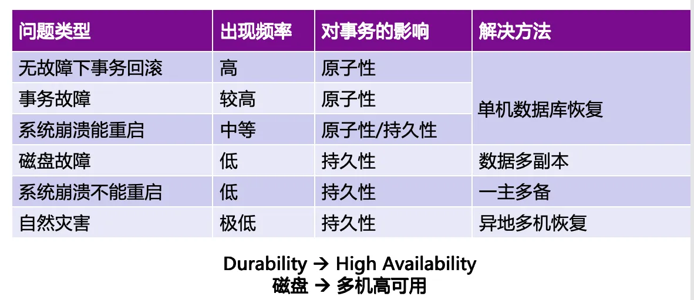

1. 事务故障
   - 资源冲突或死锁等原因导致失败
   - 只会影响原子性
2. 系统崩溃
   - 数据库自身或操作系统故障
   - 可能会影响持久性
3. 磁盘故障
4. 自然灾害

后两种显然无法避免损失

### 数据库恢复机制架构


1. 无故障事务回滚（例如余额小于0）
   - 影响原子性，撤掉该事务已做操作
2. 故障事务回滚（如死锁杀死事故）
   - 影响原子性，撤掉该事务已做操作
3. 系统故障（如重启）：丢失内存数据，影响原子性、持久性
   - 原子性：**撤销**未结束（不带commit，abort标记）的事务
   - 持久性：**重做**已经结束（带commit或abort标记）的事务
4. 系统崩溃不能重启：不能提供服务，影响持久性
   - **一主多备**：主备之间通过日志保持一致性，发生故障后切换到其他系统
5. 磁盘故障：影响持久性
   - 磁盘数据多副本；数据备份机制：数据备份，日志备份
6. 自然灾害：
   - 异地多机容灾

### 系统崩溃恢复

- **脏页：**内存页面已更新，磁盘页面未更新
- **刷脏：**将内存脏页刷到磁盘
- 如果事务在崩溃时刻前已经提交
  - 若未刷脏，则影响持久性，需重做——redo
  - 若已刷脏，则不影响持久性
- 若崩溃时刻前已经中止（abort且已经完成回滚）
  - 如果期间刷过脏，但abort时未刷脏，则影响持久性，需重做（事务部分操作已经落入磁盘，且abort操作未将磁盘中回滚）——redo
  - 如果已刷脏，则不影响持久性
- 若崩溃时刻前未结束
  - 如果已刷脏，影响原子性，需要回滚——undo
  - 如果未刷脏，不影响原子性

汇总：一般情况下，完成未刷脏重做redo；刷脏未完成回滚undo

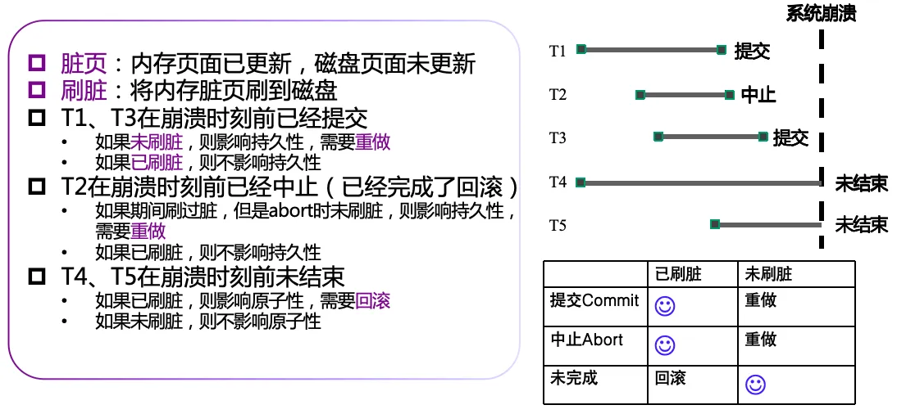

### 崩溃恢复策略设计：

- 原子性保证（这个开关在mysql里是可以打开的）
  - 选择：NO-STEAL(非窃取)
    - 未结束事务不能刷脏，不存在原子性问题
    - 占用内存大
  - 选择：STEAL(窃取)
    - 未结束事务可刷脏，影响原子性，需要undo
    - 占用内存小
- 持久性保证
  - 选择：Force（强制）
    - 已完成事务**强制立刻刷脏**，不存在持久性问题
    - IO frequency高，性能差
  - 选择：NO-Froce（非强制）
    - 已完成事务**不强制刷脏**，影响持久性，需要重做
    - IO frequency低，但是影响持久性

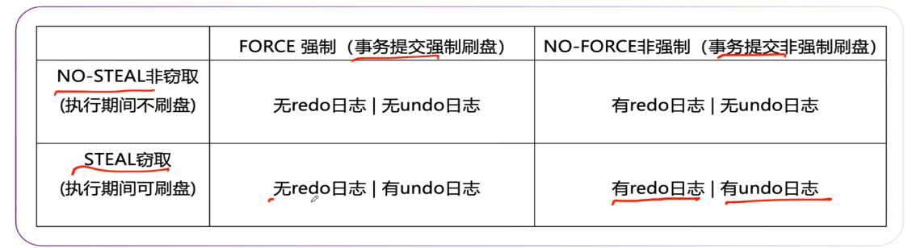

- - 影子拷贝:每个事务都需要一个数据库的内存拷贝
  - undo: 难以实现主备设备同步。随机页面读写多性能差
  - redo: 并发场景受限。执行过程中内存占用大。

维持原子性：undo日志

维持持久性：redo日志

### 数据页面写回磁盘时机

- 数据库同步写内存数据页，但**异步写回磁盘**
- 刷脏时机（一般不会选择事务完成立刻刷脏，而是如下策略）：
  - 数据库关闭时，所有脏页写回
  - 缓冲区中数据也已满，将被替换脏页写回
  - 数据库设置单独线程定时刷脏
    - 比如进行了1000次写操作后刷脏一次
- 难点：遇到故障如何靠日志回滚

### 日志

日志是log record的序列，记录了数据的更新，和数据库事务开始/结束的逻辑

日志是磁盘文件

- 日志文件写入后不可修改，即顺序写入，几乎没有随机访问的需求
- 所有日志内容可以顺序写入，提供了高效的写入速度，不影响对数据库的操作性能
- 如果日志太大了会进行截断

日志的分类

- redo log：重做已提交事务的修改，确保数据**持久性**
- undo log：回滚未提交事务的修改，确保数据**一致性**

### Undo回滚日志

- 格式：<T,X,V~old~>
  - T：事务的唯一标识符
  - X：数据项
  - V~old~：数据项修改以前的值（**记录的是操作前的旧值**）
- 产生时机：当数据T修改数据项X时产生（先日志后执行）
- 作用：实现事务回滚
- 注：一般还包括一个日志序号LSN
- 使用方式：反向扫描（cse讲过的那个）

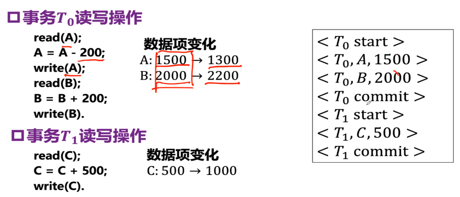

### Redo重做日志

- 格式：<T,X,V~new~>
  - T：事务的唯一标识符
  - X：数据项
  - V~new~：数据项**修改以后**的值（新值）

- 产生时机：当数据T修改数据项X时产生（先日志后执行）
- 作用：实现事务重做
- 使用方式：正向扫描
### read-ahead log预写日志 WAL

- 数据库日志需要满足预写日志，即**日志必须比数据更早的写入磁盘**（即先日志后执行）
- 日志写入顺序必须和生成时间一致
- 原子性保证：页面写回磁盘时和事务相关的undo日志需要先写回
- 持久性保证：事务提交的时候，和事务相关的redo日志需要先写回

### 日志实现方式

- 功能
  - undo日志
  - redo日志
- 按照性质分类
  - 逻辑日志
    - 记录高层抽象的逻辑操作(sql语句，小明的年龄由20改成21)
    - 日志量较小，解析速度慢
    - 数据库的版本改变之后依然可以进行
  - 物理日志
    - 记录数据库具体物理变化(第10个页面第100个偏移量的值由20改为21)
    - 日志量较大，解析速度快
    - 操作满足幂等性
  - 物理逻辑日志
    - 日志记录中包含了数据页面的物理信息，但页面以内的是以逻辑的形式记录的
    - 日志量中等，速度较快

#### 日志的重要性质

1. **幂等性**：一条日志记录无论执行一次或多次，得到的结果都是一致的
   - **物理日志满足幂等性，逻辑日志不满足**
2. **失败可重做性**：一条日志执行失败后，是否可以重做一次达成恢复目的
   - **物理日志满足，逻辑日志不满足**
     - 比如一个逻辑日志的插入数据页面操作。如果插入页面成功而插入索引失败，不能重做，如果重做会报错
3. **操作可逆性**：逆向执行日志记录的操作，可恢复原来状态
   - **物理日志不可逆，逻辑日志可逆**：页面偏移量位置可能被后续操作修改

不同日志的各种信息汇总：

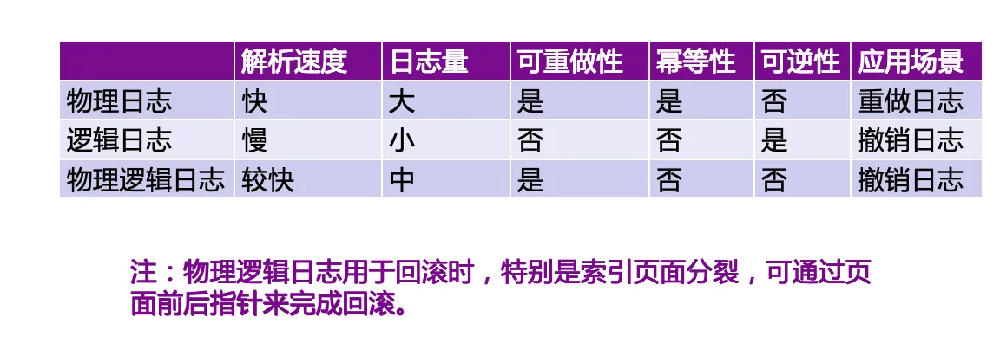

redo日志一定是物理日志

- 逻辑日志不具有可重做性，所以不能用于redo

undo日志可以是逻辑日志可以是物理逻辑日志。所以不具备幂等性

- 物理日志不具有可逆性，所以不能用于undo

### 恢复算法

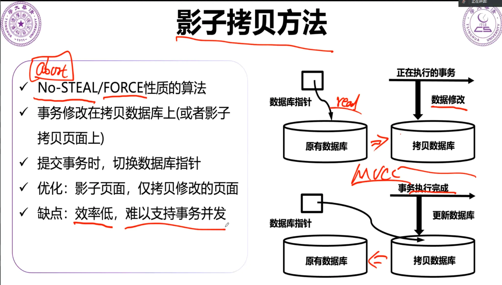


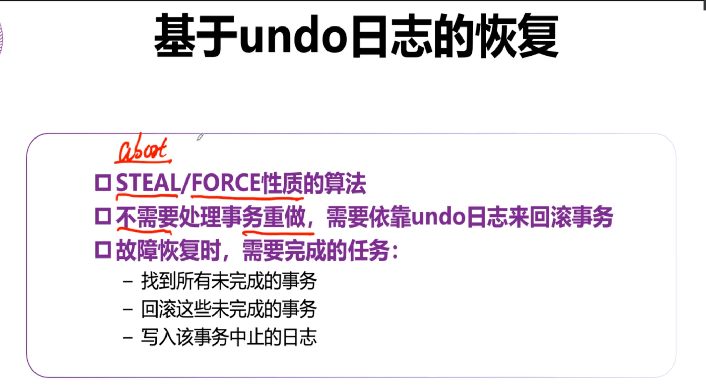

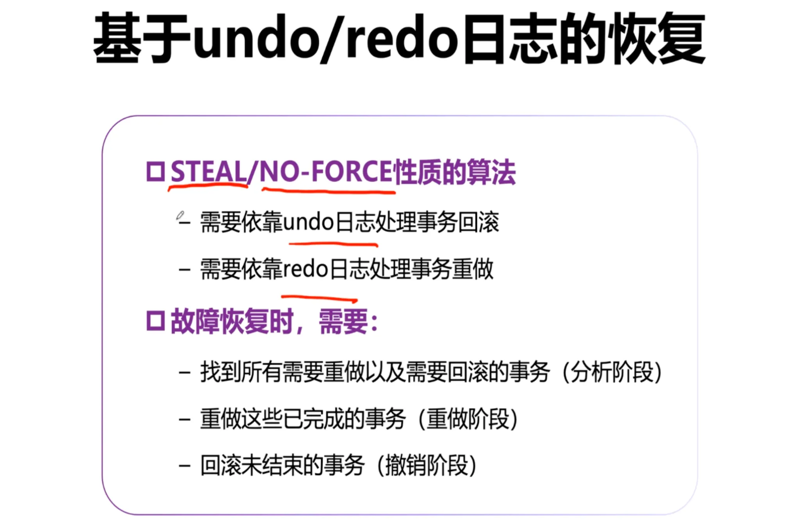

补偿日志：Undo日志的redo日志，每次执行undo日志记录后，数据库需要向日志中写入一条补偿日志记录（compensation log record，CLR），记录撤销的动作

- 目的：undo不是幂等的，防止做多次

### 作业3

1. 如果数据库系统在事务执行过程中不断地将事务操作的结果执行落盘操作，会带来什么潜在问题？可以如何处理？

事务原子性可能出现问题：在事务完成前程序发生崩溃时，事务全部都不应该落盘，但因为执行过程中不断刷脏，导致一些操作已经落盘了，从而不能保证事务的原子性（要么全部成功要么全部失败）

处理：采用undo log，系统崩溃后，可以通过反向扫描相关的undo日志，执行回滚。

2. 如果数据库系统在事务执行提交后再将事务操作的结果执行落盘操作，会带来什么潜在问题？可以如何处理？

执行期间不刷盘、事务提交后强制刷盘可能会：事务执行过程中不能刷新磁盘，必须占有较大的缓冲区空间，不利于多个事务的并发执行；每次事务提交都必须刷新脏页，消耗大量IO读写资源

处理：使用STEAL模式，利用Undo日志撤销事务；使用NO-FORCE模式，利用Redo日志重做事务；

# multithreading 多线程

- 进程：进程有一个自包含的执行环境；进程间内存隔离，互相访问不了；
  - 进程间通信：RMI / Http，RMI通信方式类似于Server和Client，用Serializable流的方式传递
- 线程：线程有时被称为轻量级进程。
  - 进程与线程的关系和区别：
    - 进程和线程都提供了一个执行环境，但创建新线程所需的资源比创建新进程少。
    - 线程存在于进程中——每个进程至少有一个线程；线程共享进程的资源，包括内存和打开的文件。这有助于高效但可能存在问题的沟通。

为什么java虚拟机中只说multithread不说multi-process：
- 因为java虚拟机本身就是一个进程，它不可能支持多进程

## **创建线程**

- 手动创建一个线程，这个线程执行完就结束了。（人为的管理、控制线程）
- 两种实现方式
  - 实现Runnable这个接口（推荐使用这个，因为Java里面只能继承一个类，但是实 现可以实现多个接口）
    - 这个接口里只有一个run方法，这里面写着线程要做的实现
    - 更推荐用这个
      - 涉及到java中单根继承的问题：任意一个类只能扩展自一个类，**一旦它本身是一个扩展类，它就不能被别人所扩展**
  - 继承Thread类（Java是单根继承，和cpp不一样，所以这种方法不推荐）
    - thread类里有一些方法
      - sleep()
      - interrupted()
        - 用来判断线程是否被中断，返回的是一个bool值
      - interrupt()
        - 用来中断某个线程
      - join()
        - t.join()，表示停止当前线程的执行，直到t这个线程终结

## **中断与存活函数**

- 中断一个线程，调用Thread.interrupt（）方法，让其抛出InterruptedException异常
- 判断是否存活，调用Thread.interrupted(）

## **join**

- join方法允许一个线程等待另一个线程的完成。如果t是线程当前正在执行的Thread对象，t.join（）

使当前线程暂停执行，直到t的线程终止。和sleep一样，join依赖于操作系统的时间，设备好理论就快，所以你不应该假设join会等待你指定的时间。也和Sleep类似，join通过发出InterruptedException退出来响应中断。

## **线程间通信**

线程之间主要通过**共享字段**以及**字段引用的对象**来进行通信。这种通信方式非常高效，但可能会导致两类错误：

- **线程干扰**（Thread Interference）：比如多个线程有些在消费有些在充值
- **内存一致性错误**（Memory Consistency Errors）：可能会因为多个线程同时操作数据库，导致内存一致性错误

The tool needed to prevent these errors is **synchronization：解决竞争问题**

## Synchronization

有synchronazed标记的所有方法共用**该对象**的锁，一个方法执行完才能执行下一个

- 在 **Java** 中，每个对象都隐含地拥有一个**内在锁**（也称为**监视器锁**
- 调用这些方法之间之前要获得这把锁，必须执行完一个操作，另一个操作才能获得这把锁（对象的内部锁）
- Synchronization是基于java中的intrinsic lock实现的，是一个内部锁，每个对象只有一个锁

即使是调用的这个类的static方法，static方法不是属于对象的，是属于这个类的

- 但是类本身（类也是一个对象）也会有自己的对象锁，所以static synchronized也能起到作用

同步语句——细粒度的控制：放在语句前，在语句执行前获得对应对象(可以指定)锁

**可重入的锁： ReentrantLock：一个线程**不能获得一个被其他线程占据的lock；但是它能够**获得一个它已经拥有的锁**：我们有一个类 C ，它有一个Synchronized方法 m ， m 里面调用了另外一个Synchronized方法 n ， n 也在 C 里面；这个时候我们发现按照我们前面的逻辑就蚌埠住了。调用 n 的时候，发现这个对象的锁在 m 手里

- 所以java的synchronized关键字实现的内部锁是一把可重入锁

## java原子变量
除了 long 和 double 之外，其他的基本类型都是原子的。如果我们想要把一个变量变成 原子变量，只需要在变量定义的前面加一个 ```volatile``` 修饰就可以了。

## **Liveness：多线程碰到的各种问题**

- **死锁**：A线程等待B，B等待A，这样就会陷入死锁的循环
- **饿死** starvation ：A想要访问一个共享资源，但是一直获取不到，就像被饿死了一样。（需要消除那些贪婪的线程，避免一个线程长期贪婪的占用资源；所以tomcat里面用了连接池，避免一个连接长期占用资源）
- **活锁**：活锁是指一个线程对另一个线程的动作做出反应，而如果另一个线程的动作也是对前一个线程动作的反应，那么可能会导致活锁

**解决方式：协调资源**

1. **受保护的块（guarded block）**。 最常见的方式，while(!joy) {}简单的循环，但浪费处理器时间。一般不推荐这么做，在少数情况下没有上下文切换的开销
2. 调用`wait`方法会暂停线程，直到另一个线程发出通知**Object.notifyAll**(通知所有等待该锁的线程，表示某个重要事件已经发生，具体谁抢到锁不一定)

## example
synchronized对象并不代表满足同步，可能需要更上层的同步

方法是同步的，但在getRGB和getName 之间 颜色直接被另一个线程改了

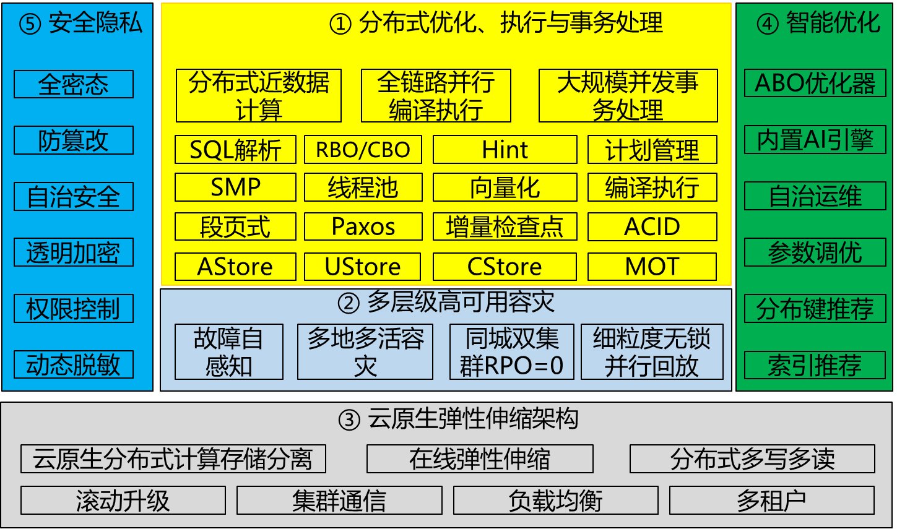


或者可以使用不可变的对象
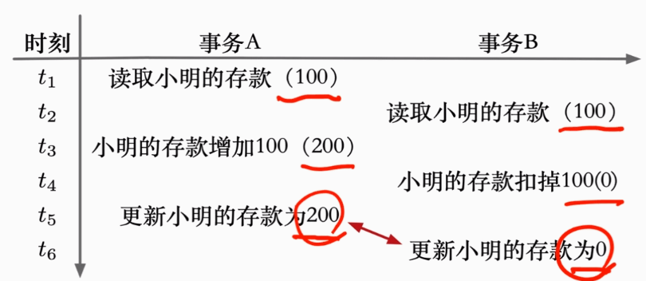
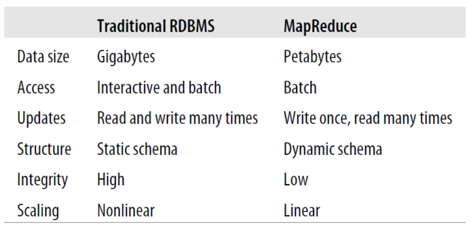

## **Immutable Objects 不可变对象**

如果一个对象的状态在构造之后**不能更改**，那么该对象被认为是不可变的

**一定要改：创建新对象**

缺点:每次更新都要创建一个新的对象，因此大多数程序员不太愿意使用不可变对象，认为开销比较大。

**程序员常常不愿使用不可变对象**，因为他们担心创建新对象的**成本**，而不是直接在原地更新对象。但对象创建的影响常常被**高估**，因为**垃圾回收**带来的开销减少和**无需编写额外的代码**来保护可变对象不受损坏，且可以通过不可变对象带来的一些效率来**抵消**。

## **高级并发特性**

### 1. Lock对象
`tryLock` 方法在锁不可用时立即退出，或者在超时之前退出（如果指定了超时时间）。`lockInterruptibly` 方法在另一个线程发送中断信号时退出，前提是锁尚未获取。

### 2. 线程池
- `Executors`类提供了线程池管理的实现，避免了手动创建和销毁线程的麻烦；里面有一组线程，要线程就从里面找：
- `ExecutorService` = runnable + callable，线程+回调
- `ScheduledExecuter`是ES的子类，还接受一个时间表示多久之后执行
### 3. Fork/Join
- 是一种 `ExecutorService` 的实现，设计用于可以递归拆分为较小任务的工作负载
- `RecursiveAction`


**并发集合**：并发集合类（如 `ConcurrentHashMap`：通过采用了分段锁的设计，允许多个读线程并发地访问map，并且允许多个写线程并发修改不同的段。）允许多个线程安全地访问集合，无需手动添加同步块。通过分段锁定技术，实现高效的并发操作，减少了锁竞争 

### 5. 原子变量
允许线程安全的变量操作，无需显式使用锁
**ThreadLocalRandom**:每个线程独立生成随机数的方式，避免了传统 `Random` 类在多线程下的竞争问题。
------

### 虚拟线程
不跟操作系统线程绑定：轻量级线程，可以减少编写、维护和调试高吞吐量并发应用程序的工作量。更加轻量化，比如在被IO阻塞时，那么就把线程解绑；等IO结束时再绑定线程，但不一定是原先的线程。但对于长时间占用cpu的任务不友好
- 平台线程（Platform Thread）：平台线程是一个围绕操作系统（OS）线程的轻量级封装的Java线程。可用的操作系统线程数量决定了平台线程的数量限制；具有较大的线程栈（存储线程执行状态的内存）以及其他由操作系统管理的资源。

# cache

## memcache比mysql cache优点
1. cache和应用在同一台服务器，没有网络开销。或者不在一台服务器但是缓存集群，增大缓存大小
2. mysql的缓存没法控制，我希望放经常访问的，但他也有可能放最近访问的
3. 放置的是从不同数据库访问的、一系列join操作的结果

## 缓存 memory caching | Redis

- 频繁读的数据放memory cache
- 频繁写的不应该放（防止每次都要更新cache和数据库

**mysql本身带cache为什么还要多加cache？**

- mysql自动cache ，**cache的是最近访问的，不是最常访问的**
- 进程间通信都有序列化开销：
  - 如果跟server在一台机器上，通信开销小；
  - 如果不在，是cache集群，缓存的内容够大 ，放更多数据（还可以放多种数据库的数据 / 已经进行过一些操作的数据）


### MemCached

#### Memcached - principle

- 首次访问：从RDBMS（关系型数据库）中取得数据保存在memcached
- 第二次访问：从memcached中取得数据显示页面
- 本质上其实每次访问都是先访问memcached，如果能找到就直接返回，否则进入RDBMS
- 如果对数据做修改：
  - 先对memcached做修改再落盘
- 但是这种频繁写的数据完全没有必要进入memcached
  - 所以book中的库存数量就没有必要进入memcached
  - 此时应该把stock解耦出去，变成一张单独的表


#### 如何使用memcache：

在repository层，增加@Cacheable("books")

在主程序层打开enableCaching

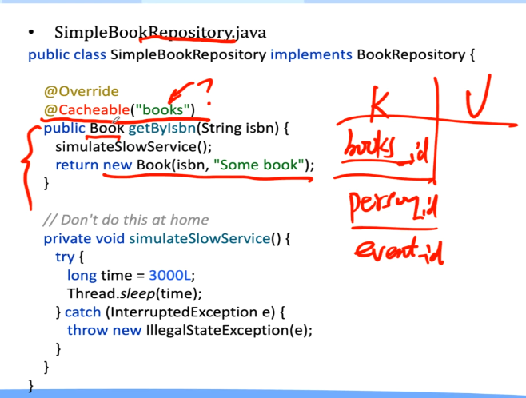

- "books"的意思是，存在memcache中的所有的key一定都是以books开头的
- getByIsbn方法的意思（因为添加了cacheable的annotation）：先到memcache里面去找，如果有的话直接返回，如果没有的话则执行函数
- new Book除了创建一个新对象之外也会把它放进memcache里面


**不同对象怎么缓存（大对象+小对象**

缓存的内容有大的也有小的，它们会用最省空间的方式进行存储——slab分配机制

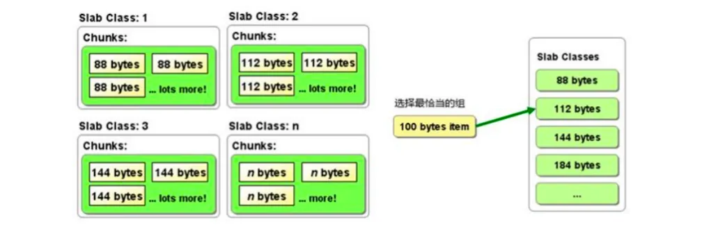

Slab 分配机制，它通过将内存划分成多个“Slab Class”来管理不同大小的数据。

- **每个chunk对应存储的大小不一样**，每次找到一个最合适的位置。也就是大对象和小对象存在不同的chunk里
- 还会根据名字空间进行划分


#### **多服务器怎么存储（怎么添加 / 删除方便**

- 一致性哈希：节点间不用通信，算法来算：chord协议

  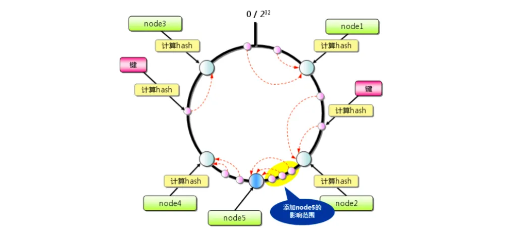

#### 内存放不下了

- LRU替换出去
- LRU写到disk上（是处理完的数据）（disk比数据库硬盘更近 快）


### Redis

- redis就是一种key-value store
- key-value的key可以包含多种数据类型
  - 可以存放strings,hashed,lists,sets and sorted sets等
- 主从备份
  - 如果分布式则可以从另一个机器进行数据恢复

目前的所有数据库具备特性：

| **名称**       | **类型**                   | **数据存储选项**                                       | **查询类型**                                               | **附加功能**                                       |
| -------------- | -------------------------- | ------------------------------------------------------ | ---------------------------------------------------------- | -------------------------------------------------- |
| **Redis**      | 内存中的非关系型数据库     | 字符串、列表、集合、哈希、有序集合                     | 针对每种数据类型的常用访问模式命令、批量操作和部分事务支持 | 发布/订阅、主/从复制、磁盘持久化、脚本（存储过程） |
| **Memcached**  | 内存中的键值缓存           | 键到值的映射                                           | 创建、读取、更新、删除命令以及少数其他命令                 | 多线程服务器以增强性能                             |
| **MySQL**      | 关系型数据库               | 行表、表视图、空间数据和第三方扩展的数据库             | SELECT、INSERT、UPDATE、DELETE、函数、存储过程             | 符合 ACID（使用 InnoDB）、主/从复制和主/主复制     |
| **PostgreSQL** | 关系型数据库               | 行表、表视图、空间数据、第三方扩展、自定义类型的数据库 | SELECT、INSERT、UPDATE、DELETE、内置函数、自定义存储过程   | 符合 ACID，主/从复制，多主复制（第三方）           |
| **MongoDB**    | 基于磁盘的非关系型文档存储 | 无模式 BSON 文档的表                                   | 创建、读取、更新、删除、条件查询等命令                     | 支持 Map-Reduce 操作、主/从复制、分片、空间索引    |


#### redis过期逻辑与问题处理：

问题1：雪崩

每过一段时间（比如3600s，一个小时），就会认为redis中的数据全部失效

- 此时大量访问书的请求无法命中
- 这种**同时的全部失效称为雪崩**
- 解决方法：将一千本书分为10个100本，将失效时间错开

问题2：击穿

- 依然可能存在的问题：如果同时有大量请求对同一本书进行，此时redis中没有被存储，此时**所有请求会同时进入数据库（这种情况称为击穿）**，但是全部只要一个数据，导致这一次大量请求涌入根本没有用到redis
  - 解决方法：所有请求都在访问同一本书时，加一把锁，在书被取回到redis后，再放开锁（也就是有一个请求拿到了书后），剩下的请求全部从缓存中获取
- 另一种击穿情况：大量请求同时查询一本不存在的书（因为此时一定会进入数据库进行查询）
  - 可以添加一个布隆过滤器来很大避免这种情况的出现


**在集群部署方案中，使用了 Redis 缓存来存储 HttpSession 对象，请问，即使不使用 Redis，HttpSessior对象也会存储在内存中，那么为什么要使用 Redis 来存储 HttpSession 对象呢?**

1. 服务器重启session不易丢失
2. 便于集群session维护，所有服务器都到redis服务器拿session
3. 便于水平方向扩展，多个redis


## 全文搜索 Full-text Searching

全文搜索是一种信息检索技术，通过对文本内容进行分词、索引和匹配，实现对文本内容的高效检索。

#### SQL方式解决

- remark的数据类型可能为CHAR VARCHAR TEXT：
  - 最暴力的方法：每次都要从里面一个个查找
- 列出来一个remark中xx关键词有没有的表 ：remark很短但关键词列表还是很长
- 列出来一个remark 有几个关键词就有几条记录：remark比较长的会很长

如何keyword → remark

相似度度量？频率？

index → field（哪些部分做索引

要能够根据业务需求，识别适合全文搜索引擎的场景，设计并实现基于搜索引擎的全文搜索方案

索引维护：增量式维护：不要每次新增都重新做

- 因为全文搜索的索引构建的开销很大，增量式维护可以降低这方面的开销


#### **全文搜索的核心步骤**

1. **分词处理**
   将文本按照词语或关键词进行拆分，生成分词结果。
2. **建立索引**
   对分词结果进行存储和排序，方便后续的快速查询。
3. **查询匹配**
   根据用户输入的查询条件，在索引中查找匹配的文本内容。

**使用场景**

- 适用于文本量较大的场景，如电子书、博客、社交媒体、邮件等。
- 企业内容管理系统（CMS）。
- 搜索引擎（如 Elasticsearch、Solr 等）。


#### Lucene

**Lucene** 是一个高性能、全功能的文本搜索引擎库，提供了构建全文搜索引擎的基础工具。

- 它是一个 Java 库，主要用于处理底层的索引与搜索。

对**非结构化数据**建立索引，搜索索引

- **正向索引：按照文档顺序存储文档内容及其对应的元信息。**即每个文档的哪行包含了什么；

  - 特点：
    - 检索时需要逐个扫描文档，效率较低。
    - 易于记录文档的完整信息。
  - 正向索引**适用于需要按文档检索的应用**，例如文档管理系统或内容展示；
  - 正向索引**需要更多的存储空间**，但在访问特定文档时速度较快；

- 高效交叉索引：某一个关键词出现在 哪个文件 哪个位置 （反向索引

  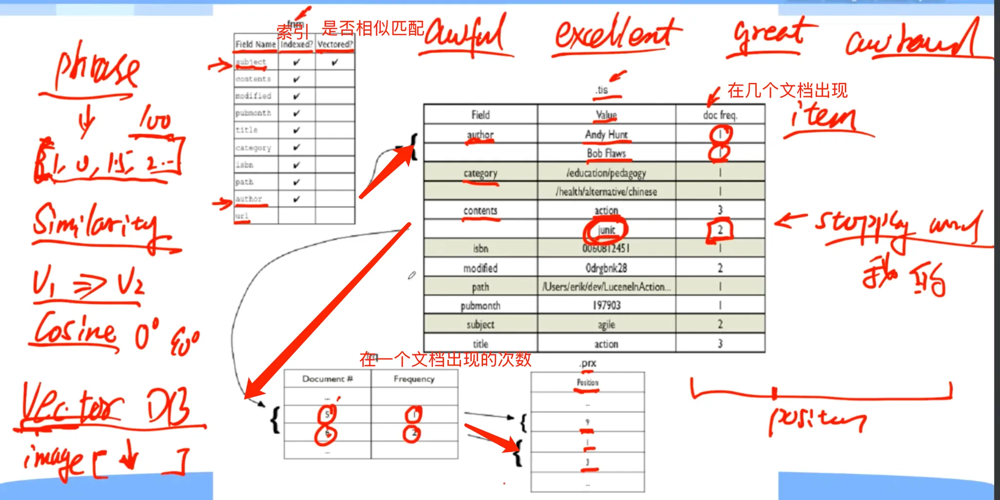

  - 上图为一个反向索引的例子，记录了关键词在文档中出现的次数等信息

- **反向索引：将关键词与文档的对应关系存储起来，方便通过关键词快速定位文档。**

  - 反向索引适用于需要全文搜索和关键词检索的应用，例如搜索引擎和信息检索系统。
  - 反向索引占用较少的存储空间，**在全文搜索和关键词检索时速度更快。**

------

- recall：召回率（检索到的相关文档数占所有相关文档数的比例）：都拿出来了
- 准确率：都是准的
- 不参与查询的不建立在索引文件里

------

#### Core Indexing Classes

- 建立索引：
  - 读文档； **Analyzer** 是文本分析的关键组件； 用于分词、去除停用词、提取关键词等。
    - 常用的 Analyzer：
      - `StandardAnalyzer`：标准分析器，适用于大多数场景。
      - `WhitespaceAnalyzer`：仅按空格分词。
      - `KeywordAnalyzer`：不分词，直接使用整个输入作为一个关键词。
    - 自定义分析器：可以根据需求定义分词规则和停用词表。
  - **IndexWriter**：用于创建和维护索引。
    - 功能：添加文档到索引、更新索引、删除文档、优化索引等。
    - 索引存储：Lucene 使用 **`Directory` 抽象类**来管理索引的存储（可以是文件系统、内存等）
  - **Document 表示索引中的一个文档**，**文档通常由一组字段（ Field ）组成**；**域Field 是文档中的一个字段或属性。它包含了字段的名称、值以及用于指定如何处理该字段的 配置选项**（关键词域keywordField不参与索引；LongField；TextField tokenizer断开）
- 搜索
  - parse解析
  - 可以指定在某个域里找

------

#### 索引文件标准格式

- 核心概念包括：index, document, field and term.
- An index contains a sequence of documents. 一个索引由很多个文档组成
  - document 表示一个索引中的文档，包含多个 field。
  - Field 表示文档的一个属性，如标题、正文、作者等，由很多个term组成
  - A term is a sequence of bytes. 项，也就是具体的词

index：documents：field：terms(项，具体的词)

- fields具备的可选属性：
  - **存储（Stored）**：是否将字段值存储在索引中。
  - **索引（Indexed）**：是否将字段内容索引以供搜索。
- segments：索引很长 分段

------

#### 搜索

Lucene 支持多种查询方式，如简单关键词查询、布尔查询、范围查询等。

- 通过优化的反向索引结构和自定义的打分机制，Lucene 能够高效地提供相关性排序结果

具体的搜索实现：

- 多个 `TermQuery` 实例组合起来，可以构建更复杂的查询；多个 `BooleanClause`，每个子查询都有一个运算符（来自 `BooleanClause.Occur`），该运算符描述子查询如何与其他子查询组合。

  - **SHOULD**：子查询可以出现在结果集中，但不是必须的。如果所有子查询都是 `SHOULD`，则结果集中的每个文档至少匹配一个子查询。
  - **MUST**：子查询必须出现在结果集中，并且会影响评分。结果集中的每个文档将匹配所有这样的子查询。
  - **FILTER**：子查询必须出现在结果集中，但不影响评分。结果集中的每个文档将匹配所有这样的子查询。
  - **MUST NOT**：子查询不能出现在结果集中。结果集中没有文档会匹配这样的子查询。

- **打分机制：可以自定义**

  - 为了获得更高的得分，尽量增加查询词在重要字段（如标题）中的频率，并使用稀有且相关的关键词，同时保持字段内容简洁以提高权重。

  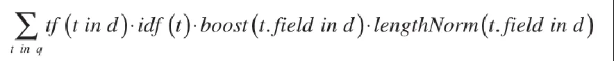

  | **因素**                     | **描述**                                                     |
  | ---------------------------- | ------------------------------------------------------------ |
  | **tf(t in d)**               | 术语 (**t**) 在文档 (**d**) 中的词频因子。表示该术语在文档中出现的频率。 |
  | **idf(t)**                   | 术语的逆文档频率。表示该术语在整个文档集合中的稀有程度，稀有的术语对得分影响更大。 |
  | **boost(t.field in d)**      | 字段提升因子，通常在索引时设置，用于提升特定字段的权重。     |
  | **lengthNorm(t.field in d)** | 字段的长度归一化值，根据字段中的词语数量进行归一化。此值在索引时计算，并存储在索引中。 |
  | **coord(q, d)**              | 协调因子，基于文档中匹配查询项的数量来计算。匹配的查询项越多，得分越高。 |
  | **queryNorm(q)**             | 查询的归一化值，根据查询项的加权平方和计算。确保查询项更多的查询不会不公平地影响得分。 |

------


#### **Solr**

- 是基于**Apache Lucene™**构建的流行、快速、开源的企业搜索平台。
- 具有高度可靠性、可扩展性和容错性，提供分布式索引、复制和负载平衡查询、自动故障转移和恢复、集中配置等。
- Solr为世界上许多最大的互联网网站的搜索和导航功能提供支持。


#### Elasticsearch

- **Elasticsearch** 是一个分布式的开源搜索引擎，基于 Lucene 构建，专注于实时搜索和分析。
- 它以 RESTful API 和 JSON 数据格式为基础，简化了搜索引擎的开发和集成。

宽表反向索引搜索 → 去SQL搜索：不用写复杂SQL语句

- 在 Elasticsearch 的使用场景下，将复杂 SQL 查询的场景通过 Elasticsearch 的反向索引和全文检索能力简化

---
# Web Services

## 1. Web Services 的核心问题

### 1.1 跨语言通信
在分布式系统中，不同系统可能由不同编程语言开发（如 Java 和 C#）。
Web Services 通过标准化协议（如 SOAP 和 REST）实现跨语言调用，消除语言差异带来的通信障碍。

### 1.2 跨地域通信
- 在广域网（WAN）上，数据传输可能受限于网络延迟、带宽和稳定性。
- Web Services 使用基于 HTTP 或其他协议的通信方式，能够在全球范围内传递信息。
- 借助中间件、负载均衡和缓存机制提高远程调用的可靠性。

### 1.3 协议多样性
- Web Services 支持多种通信协议，包括：
  - **HTTP**：最常用的协议，适合浏览器到服务器的通信。
  - **SMTP**：通过电子邮件传递消息。
  - **FTP**：用于文件传输。
- 这种灵活性使其适用于各种场景。

---

## 2. Web Services 的定义

- **Web**：指通过网络协议（HTTP、FTP、SMTP 等）实现通信。
- **Services**：表示服务功能，以标准化的形式（接口）供其他系统调用。
- **目标**：解决分布式系统的集成问题，尤其是跨语言和跨地域的场景。

Web Services 的基本特点包括：
- **松耦合性**：服务的提供方和消费方可以独立开发与维护。
- **标准化**：依赖标准协议（如 SOAP、HTTP、XML、JSON）。
- **可发现性**：服务可以通过 WSDL 或注册中心被自动发现。

---

## 3. SOAP（Simple Object Access Protocol）

### 3.1 定义
SOAP 是一种基于 XML 的协议，用于在分布式系统中进行远程方法调用（RPC）。它提供了一种标准化的消息格式，支持通过多种传输协议（如 HTTP 和 SMTP）传递数据。

### 3.2 SOAP 消息结构
SOAP 消息是一个 XML 文档，主要包含以下部分：
1. **信封（Envelope）**：
   - 定义消息的边界。
   - 指定消息的头部和主体。
2. **信封头（Header）**（可选）：
   - 包含元信息（如认证信息、安全凭据）。
3. **信封体（Body）**：
   - 包含实际的数据负载（如方法调用的参数和返回值）。

### 3.3 SOAP 的优缺点
**优点**：
- 方便使用，可以像本地对象一样使用
- (跨语言、跨平台，具有高度的互操作性。)
- (支持多种协议（如 HTTP、SMTP）。)
- (可扩展性强，可添加安全性、事务支持等功能。)

**缺点**：
- 方法和签名、编码方式绑定，耦合度高
- 消息格式基于 XML，体积较大，解析和组装开销高。
- 需要生成一个WSDL文件额外描述他，和一个代理来实现解析和组装

---

## 4. WSDL（Web Services Description Language）

### 4.1 定义
WSDL 是一种基于 XML 的文档，用于描述 Web Services 的接口、操作、消息格式和访问地址。

### 4.2 WSDL 文件的结构
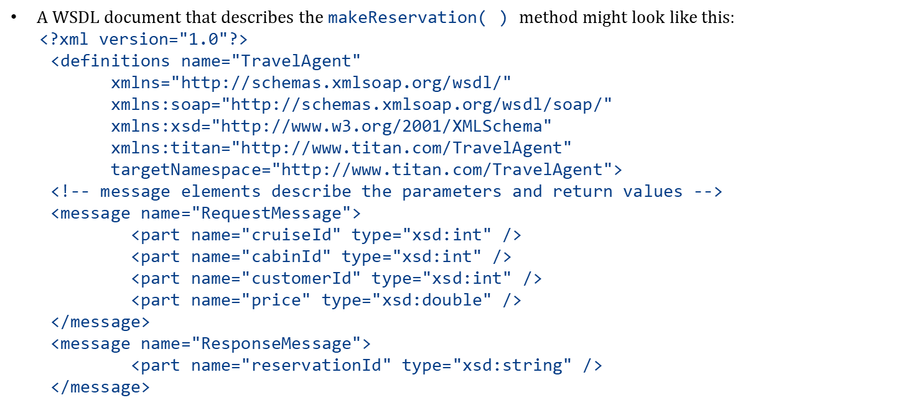
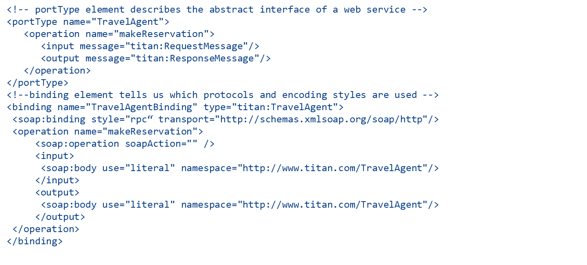
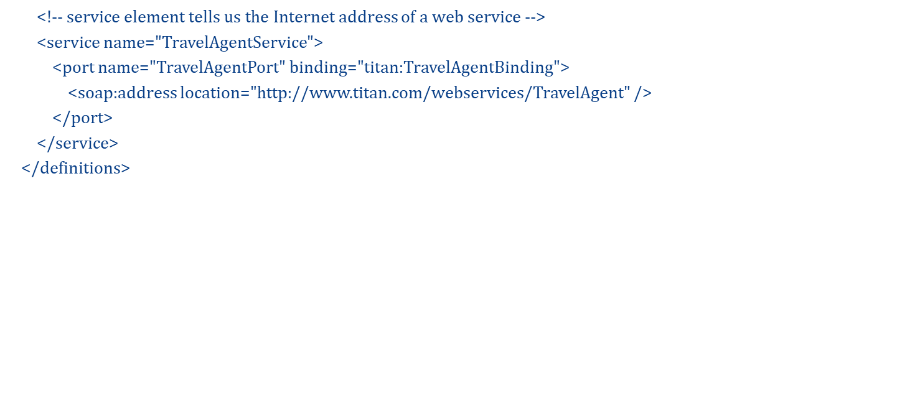

1. **Message**：
   - 定义服务中请求和响应的消息格式。
   - 包括消息名称和组成部分。
2. **PortType**：
   - 描述服务的接口（方法）及其输入和输出。
   - 相当于面向对象编程中的类和方法。
3. **Binding**：
   - 定义服务接口与协议的绑定（如 HTTP、SOAP）。
   - 包括协议的细节（如编码方式）。
4. **Service**：
   - 指定服务的访问地址（URL）。
   - 允许客户端定位并调用服务。

### 4.3 WSDL 的作用
- **客户端**：
  - 通过wsdl文件和Axios、Jerrey等工具自动生成调用代码。
  - 无需了解服务端实现即可调用服务。
- **服务端**：
  - 自动生成服务骨架代码。
  - 确保接口的一致性。

---

## 5. Web Services 的实现流程

### 5.1 服务端实现
1. **定义接口**：编写一个包含业务逻辑的方法（如 Java 接口）。
2. **生成 WSDL 文件**：使用工具（如 Apache CXF 或 JAX-WS）生成 WSDL 文件。
3. **暴露服务**：通过 Web Server（如 Apache Tomcat）发布服务。

### 5.2 客户端实现
1. **解析 WSDL**：通过工具生成对应的客户端代码（如代理类）。
2. **调用服务**：通过代理类发送 SOAP 请求。
3. **处理响应**：解析 SOAP 响应消息并提取数据。

---

## 6. RESTful Web Services
REST(REpresentational State Transfer)数据驱动

### 6.1 定义
REST 是一种基于 HTTP 协议的架构风格，其核心理念是将资源通过 URI 暴露，并通过 HTTP 方法操作资源。

### 6.2 REST 的核心思想
#### 1. representational:
- 每个资源对应唯一 URI（如 `/users/123` 表示用户 ID 为 123 的资源）。
- 所以`findperson/1`是不符合规范的
- 每个资源有不同的表现方式
- 通过http的方法来表示对数据的操作逻辑GET,POST,PUT,DELETE

#### 2. state
服务器端无状态，状态在客户端，每个人看到的前端不一样。
#### 3. transfer
点击书籍跳转到详情页，客户端状态不断转移

### 6.3 RESTful 的优缺点
**优点**：
- 跨平台，基于JSON或XML的纯文本格式。
- 需要用wsdl来进行表达纯文本的含义
- 模块化，将构件封装成服务
- 通过http请求，更好通过防火墙

**缺点**：
- 开发生产率低，代码不好写。
- 都要转化为assic码，组装和解析效率低
- Security。

---

## 7. Web Services 与微服务的关系

- **Web Services**：是一种用于系统集成的技术，适用于跨语言和跨平台的场景。
- **微服务**：是一种分布式架构风格，强调服务的独立性和轻量级通信。
- **服务注册中心**：微服务架构中常用的组件（如 Eureka、Consul），用于管理服务发现，功能类似于 Web Services 中的 WSDL。

---

## 8. 安全性问题

### 8.1 数据加密
1. **SSL/TLS**：
   - 用于加密通信，防止数据被窃听和篡改。
2. **非对称加密**：
   - 使用公钥加密，私钥解密，确保机密性。
3. **对称加密**：
   - 使用共享密钥加密数据，效率高。

### 8.2 身份验证
1. **HTTP 基础认证**：
   - 使用用户名和密码进行验证。
2. **Token 认证**：
   - 客户端通过 OAuth 2.0 或 JWT 获取访问令牌。

---

## 9. 总结
1. Web Services 提供了跨语言、跨平台的系统集成能力。
2. SOAP 和 WSDL 是 Web Services 的核心技术，适合复杂场景。
3. RESTful 是一种轻量级的 Web 服务风格，更适合现代 Web 开发。
4. 微服务架构继承了 Web Services 的思想，进一步强调服务的独立性和轻量化。

---

## 1. 微服务的核心概念

### 定义
微服务是一种将单一应用程序拆分为一组小型、独立部署的服务（每个服务运行在自己的进程中）的架构风格。

### 特点
- **独立性**：每个微服务可以独立开发、部署和扩展。
- **语言中立**：不同微服务可以用不同编程语言实现。
- **数据隔离**：每个微服务有自己的数据库或数据存储。
- **轻量级通信**：通常通过 HTTP/REST 或消息队列进行通信。

### 优点
- 提高系统的灵活性和可维护性。
- 支持团队并行开发。
- 提高系统的容错性和可扩展性。

## 2. 微服务与单体架构的对比

### 单体架构
- 所有功能模块集中在一个应用中。
- 开发、部署和维护简单，但随着系统规模增大，复杂性增加。
- 一个模块的故障可能导致整个系统崩溃。

### 微服务架构
- 功能模块拆分为独立的服务。
- 每个服务可以独立部署和扩展。
- 一个服务的故障不会影响其他服务。
- 但通信开销增加，系统复杂性提高。

---

## 3. 微服务的核心组件

### 服务注册与发现（Service Registry & Discovery）
- **服务注册**：微服务启动时，将自己的信息（如 IP、端口、服务名）注册到注册中心（如 Eureka）。
- **服务发现**：客户端通过注册中心查找服务的位置。
- **动态更新**：服务重启或迁移时，注册中心会更新服务的位置信息。

### API 网关（API Gateway）
- **统一入口**：客户端通过网关访问后端服务。
- **路由转发**：根据请求路径将请求转发到对应的微服务。
- **负载均衡**：支持多个服务实例的负载均衡。
- **安全性**：提供认证、授权等功能。

### 消息队列（Message Queue）
- **用途**：用于异步通信，解耦服务之间的依赖。异步通信不是目的，而是为了弥补用户体验
- **常见工具**：Kafka、RabbitMQ。

### 配置中心（Configuration Center）
- **功能**：集中管理微服务的配置信息。
- **优势**：支持动态更新配置，无需重启服务。

---

## 4. 微服务的实现技术

### Spring Cloud
- **Eureka**：服务注册与发现。
- **Zuul/Gateway**：API 网关。
- **Ribbon**：客户端负载均衡。
- **Feign**：声明式的 HTTP 客户端。
- **Hystrix**：服务熔断与降级。

### Docker 和 Kubernetes
- **Docker**：用于容器化微服务。
- **Kubernetes**：用于微服务的编排和管理。

### 消息队列
- Kafka、RabbitMQ 用于异步通信。

### 数据库
- 每个微服务有自己的数据库（如 MySQL、MongoDB）。
- 数据一致性通过分布式事务或最终一致性保证。

---

## 5. 微服务的通信方式

### 同步通信
- 使用 HTTP/REST 或 gRPC。
- **优点**：简单直接。
- **缺点**：服务之间的耦合性较高，性能可能受影响。

### 异步通信
- 使用消息队列（如 Kafka、RabbitMQ）。
- **优点**：解耦服务，提高系统的响应速度和容错性。
- **缺点**：增加了系统的复杂性。

---

## 6. 微服务的优缺点

### 优点
- **独立性**：每个服务可以独立开发、部署和扩展。
- **技术多样性**：不同服务可以使用不同的技术栈。
- **容错性**：一个服务的故障不会影响其他服务。
- **可扩展性**：可以根据需求单独扩展某个服务。

### 缺点
- **复杂性**：系统架构和运维复杂度增加。
- **性能开销**：服务之间的通信增加了延迟。
- **数据一致性**：分布式事务管理复杂。
- **调试困难**：跨服务的调试和问题排查难度增加。

## 7. Serverless

- 服务器端没有很重的环境，不需要配置太多数据源来进行服务。
- event-driven
- 函数式服务可以完成服务后删除实例，也可以分程序、java、os三层在一段时间内依次释放，也可以像连接池一样维护容器池
- 一个函数式服务理论上可以服务无限的用户，但为了速度还是启动多个

# Information Retrieval: Lucene & SOLR & Elasticsearch

- keyword -> {doc}
- ordering -> similar, frequency
- index -> field
- increment

# database optimization

## consideration
1. 学号是string还是int？int小
2. 在哪一列建索引？哪几列建索引，如何排序？
3. 存储引擎选择InnoDB。
4. 行格式char还是varchar？char等长浪费，varchar对起始位置记录
5. 学号前缀相同，进行压缩
6. 用什么样的锁机制/事务隔离级别是什么样的？
7. cache配多大？cache大则大量内存里操作，
8. 磁盘碎片消除，存储空间连续，提高速度
9. 常用SSD，不常用HDD
10. 优化cpu和内存带宽

## Mysql Index
- most: B-trees，第一个好处是建立一个多叉树，考虑到了内存页的尺寸，每次读入数据时不会有很多的空间浪费；第二个好处叶子节点有指向兄弟节点的指针，范围搜索很快
- spatial data: R-trees
- memory tables: hash，比较浪费空间（桶源有些空位）
- fulltext: inverted list，InnoDB使用inverted lists进行FULLTEXT 索引
- Cluster Index聚簇索引（树中兄弟节点的顺序和物理存储的顺序一致）默认在主键上建立，可以建到经常搜索的数据上；一个表一个。

  ps：B树和哈希比较

  - B树适合做范围查找，也适合like查找（但是第一个前缀不能是通配符）始终是最左索引
  - 哈希索引适合对于=或者不=十分友好，不可以排序


**具体应用在哪些操作上？**

- 快速查找与WHERE子句匹配的行。
- 从考虑中排除行。
- 如果表具有多列索引，则可以使用索引的最左边的任何前缀来查找行。
- 在执行连接时从其他表检索行。
- 查找特定索引列key_col的MIN（）或MAX（）值。
- 如果排序或分组是在可用索引的最左边的前缀上完成的，则对表进行排序或分组（例如，ORDER BY key_part1, key_part2）。
- 在某些情况下，可以对查询进行优化，以便在不查询数据行的情况下检索值。

### **实质**

把那一列的东西都搬了出来建了一棵树，所以空间大小其实就是做了一个 duplication。我们在支持的时候，是把索引 load 到内存里的，索引命中的时候，就对应的硬盘上的位置，我们就可以直接寻址过去。

- 建立索引要花费时间和空间，维护一颗树也需要成本
- 追求一个平衡，如果表本身就很小，索引的成本超过了scan的成本，所以不需要索引。

### 主键和外键

- 主键如果由太多的列构成，那么这个建立索引的效率就不太好，可以生成一个**基于整数递增**的列来建立索引
- 主键是默认不为空的，但是如果在**为空的列上上建立索引**有3个坏处：
  - 允许某列为空是在这个存储单元之后最后一个bit位，用01表示是否为空，空间浪费
  - Mysql操作时总是要check是否为空，浪费时间
  - 挂一串很长null的东西，索引失去意义，所以最好设计不为空

可以把使用频率比较低的数据列和其他分开（比如：书籍简介单独开一张表，使用bookid关联）好处：
- 可以一次读入更多更常使用的数据
- 可以把这些放入其他数据库（图数据库。。。）

### 列索引

如果一列太长怎么建索引？可以只使用前N个字串来索引（比如只搜索title的前3个词）

N怎么选择：行格式REDUNDANT COMPACT  DYNAMIC  COMPRESSED（4种范围决定了N）

前面讲过的全文索引只附一张图：

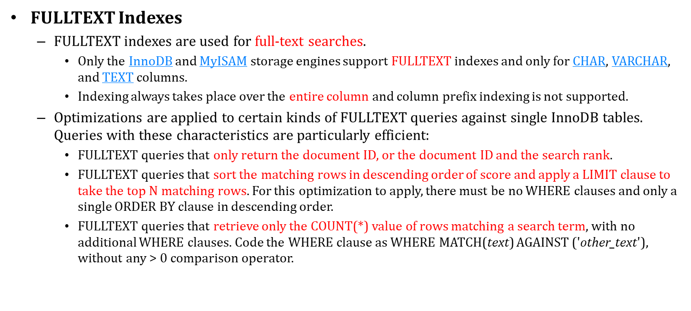

### 多列索引

最多在16列上创建索引，是按照靠前靠左的方式查询的，不能搞反了。（最左索引）

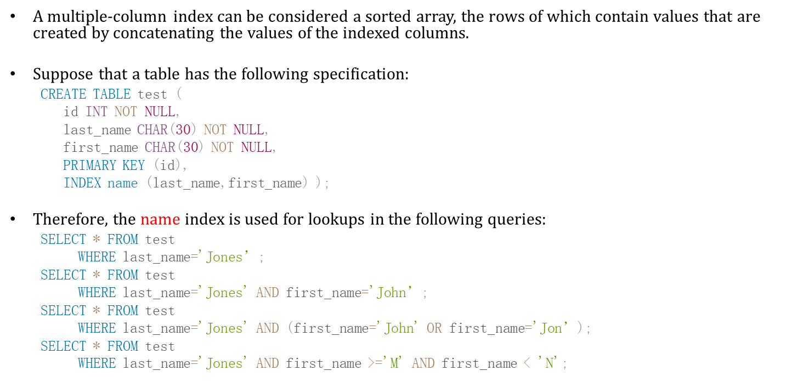
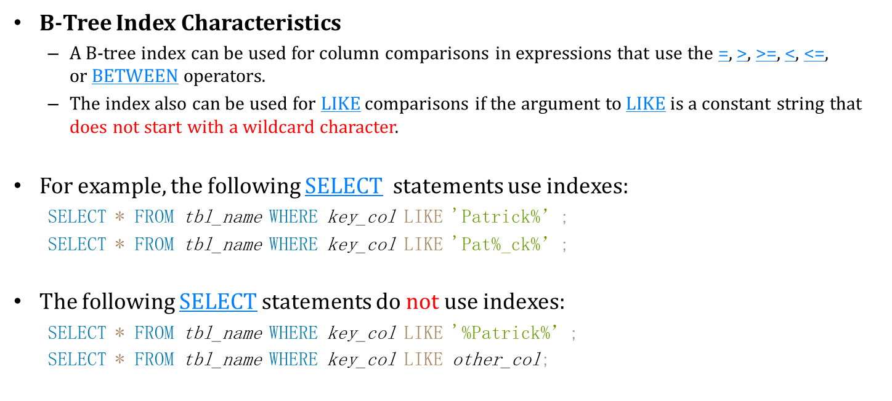

索引可以有升序降序：不同列的升降属于不同的索引

## 数据库结构

目标：最小化IO；相关联的项在一起；是否分表分区

### 数据存储尺寸

- 数据库的列：使用比较小的数据类型，尽量设置为不为空；
- 行格式：REDUNDANT < COMPACT  DYNAMIC  **COMPRESSED**（把前几位一样的落盘时压缩/存浮动）
- 索引：主键越短越好，基于整数递增（8）/UUID（16）;UUID是生成策略简单，但是太长、没有时间顺序、不好索引。第一个索引应该尽可能排除更多的
- join操作：字段信息应该完全一样两个表里面的booid名字数据类型必须一样，速度会快很多。
- 范式化Normaization：消除冗余数据，但是不能范式化程度太高，否则冗余数据就少，需要频繁join，会效率低下

### 数据类型

- 数值型：字符串（浪费）or 数值（省空间）学号优选数值型：快省空间，避免解析字符串的时间
- 字符型：使用相同的数据集（UTF-8或者Unicode），varchar（尺寸小于8k），BlOB（大于8k，只存一个指针）
- BLOB字段：把很长的东西放到另外的地方只是load进很多指针，效率高不少

### 表的数目

打开一个表会放到一个缓存里面，使用多版本的并发MVCC，每个并发里面都会开一个表（靠log统一）

MySQL对于数据库的数量无限制，对于表也无上限；由操作系统对文件系统的上限决定

连接池通常200，table_open_cache默认400

表的尺寸：也由操作系统对文件系统的上限决定。最多4096列，行的尺寸：一行最多64kb（65535），
varchar，TEXT和BLOB（9-12bytes，基本可以的），varchar除了写出来的大小，还需要有1-2个bit存储到底放了几个，所以不可以varchar（65535）。
char不能大于页面的一半大小（页大小16k），varchar可以。

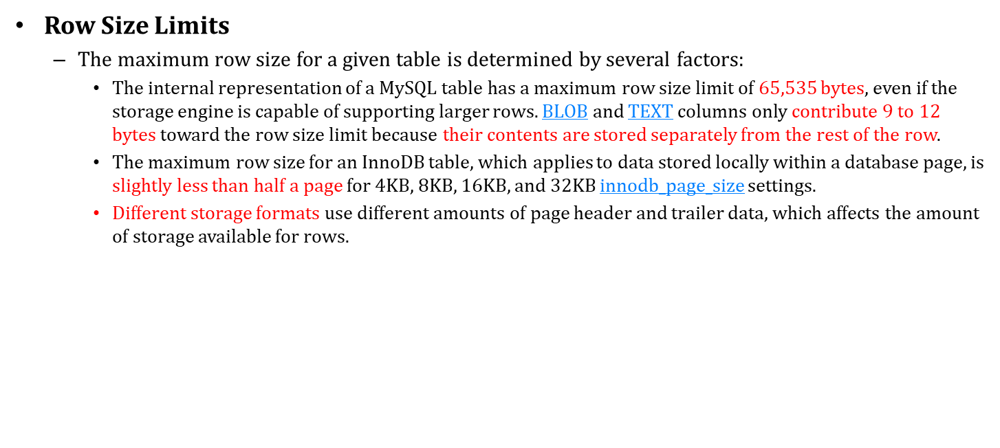

## optimize InnoDB Tables
- 尺寸到一定程度时，进行一次OPTIMIZE TABLE，减少磁盘碎片，然后重新建立索引，让内存连续加速查找
- 主键很长或者主键是多列很浪费磁盘空间，因为主键理论上会复制一份出来 
- 尽量用varchar，如果一列有许多NULL，就多用varchar。如果每个人都一个长度那就char 
- 只有一行太长的时候才使用COMPRESS，一般COMPACT
- **事务：**执行每一条SQL语句，都默认在一个事务里，每条语句一个事务。（AUTOCOMMIT决定的）但是频繁的落盘会效率比较低，所以可以手动划分事务边界。
  - 但是需要避免一个大事务里修改大量的行（roolback时候系统性能极其差）
  - 如果实在避免不了，尽量少commit。同时避免长时间运行的事务，因为会上锁导致其他事务无法进行，
  - 如果要降低事务隔离级别使其可以，会出现更多问题。
- **缓冲池（buffer pool）：** 尽可能稍微大一点，我们写完之后，会先缓存，不会立马落盘，性能提高。
- **READ-Only事务：** 开始事务之前声明 START TRANSACTION ONLY，不会回滚，select无锁
- **批量数据导入InnoDB表：** 可以先关掉autocommit，不会创建海量事务，无数次提交。只需要在都结束之后提交即可。
  - （如果插入唯一UN的数据，每插入一条都会检查，所以先关掉插入后再打开：这么做的前提是必须确认没有重复的；如果插入有外键的，也可以这么做）
  - 插入多行可以写single SQL 用INSERT (1,2)，(3,4)....; 
  - 批量数据时自增的锁的模式是2(interleaved，多线程主键递增不连续)不是1(consecutive).
- **查询优化：** 每个表有主键，怎么优化见OPT1.（1.聚簇索引  2.根据query建索引 3.主键不要太长，不要太多）
- **磁盘IO：**
  - 把缓存池增大，事务执行NO-Steal，NO-Force（内存上来）
  - 调整落盘时的策略 O_DSYNC（异步修改文件属性）
  - 配置文件同步的阈值（填一个具体数值使其周期性的往磁盘上刷）
  - 找非旋转的存储（不用HDD，对随机的IO比较差），用SSD处理随机的IO
  - 提高IO性能避免经常做的日志。**checkpoint** ：从t1到t2的增量，到一定时间做全量一次（涉及大量的IO）。
- **优化DDL**：删除表中的所有数据，使用TRUNCATE(直接把后续的指针置为空)不要使用DELETE *(一条一条删)，但是有外键的时候要注意顺序问题，主键一旦被创建尽量不要修改了。

## optimize MEMORY Table

内存里的数据放一些常用的但是不能放关键的，容易丢。
默认是哈希查找，但是也可以根据需求修改成B树。

## Buffering and Caching

- #### 缓存池尺寸
  buffer_size是chunk_size * instance的整数倍

  pool 由一个一个的chunk组成，每个chunk size默认是128M，所以pool size必须是chunksize 的整数倍，所以你规定9G（只是一个建议），他会开成10G。

- #### 多个缓存池的实例
  减少不同进程对cached page 的竞争访问，实例多了，每个池的大小会变小，要做一个平衡。最多可以开到64个，最小得是1G。

- #### 抵抗扫描
  我们不是使用严格的LRU策略决定缓存池里放什么东西。放到LRU一半的位置（3/8的位置），很快被替换，保证数据hot性。
  甚至可以分segment，分开放热度不同的数据，保证热数据。

- #### 预读
  HDD磁盘转到这里的时候，我们会乘磁盘转的时候多读一些数据到缓存池里。（线性读出来前后/随机读出）

- #### Flushing
  缓存里的东西什么时候落盘。记录所有的脏页（更改过数据的没落下去）。**有几个线程负责脏页落盘**（默认是4个）？但是不会超过线程池的实例个数。**落下去的时间**？脏页的水位线，大概是10%。

- #### 保存和恢复缓存池状态
  会在服务器关闭时，把最常用的页存在硬盘上，启动时从硬盘上直接恢复。dump的百分比可以设置。

# mysql backup
## 损坏
1. power off, os damage：重启后恢复
2. fs, disk damage: 从备份恢复

## 物理还是逻辑
1. logical拷sql、**csv**等
   - 好处: mysql几个版本、其它关系型数据库都能用。可以执行部分恢复
   - 坏处: 速度慢
2. physical拷数据库的文件
   - 好处: 速度快，适合比较大的数据库
   - 坏处: 不兼容其它数据库。只能全量恢复

## 在线还是离线
1. online/hot
   - 如果正在进行写，会不一致，需要锁
2. offline/cold
   - 对用户影响大
3. warm
   - 不允许写，但是允许读

## 全量还是增量
1. full
2. incremental
   - snapshot backup
     - 类似copy on write，当数据库70%以上都修改时执行复制
   - full versus
     - 存储上次全量备份之后的bin-log，存储sql语句
## method
- 定期、事件、几个线程做恢复、压缩加密

## 没有企业版
- a read lock
- 在拷贝前必须刷盘
- 所有辅助文件必须都拷出来

###
redo-log: physical log

undo-log, binlog: logic log

# 14-mysql partitioning

## MySQL 8.0 分区支持

### 分区概述
- **支持的存储引擎**：`InnoDB` 和 `NDB`。
- **分区类型**：
  - **水平分区**：将表的不同行分配到不同的物理分区。
  - **垂直分区**：MySQL 8.0 不支持。

---

## 分区的优势

### 主要优点
1. **存储扩展**：
   - 单个表可以存储超过单个磁盘或文件系统分区的数据。
2. **数据管理**：
   - 通过删除分区轻松移除无用数据。
   - 通过添加新分区简化新数据的插入。
3. **查询优化**：
   - 查询时自动排除不相关的分区。
   - 支持显式分区选择，例如：
     ```sql
     SELECT * FROM t PARTITION (p0, p1) WHERE c < 5;
     ```
   - 支持 `DELETE`、`INSERT`、`REPLACE`、`UPDATE` 和 `LOAD DATA` 等操作的分区选择。

---

## 分区类型

### 1. **RANGE 分区**
- **定义**：根据列值的范围将行分配到分区。
- **示例**：
  ```sql
  CREATE TABLE members (
      firstname VARCHAR(25) NOT NULL,
      lastname VARCHAR(25) NOT NULL,
      username VARCHAR(16) NOT NULL,
      email VARCHAR(35),
      joined DATE NOT NULL
  )
  PARTITION BY RANGE(YEAR(joined)) (
      PARTITION p0 VALUES LESS THAN (1960),
      PARTITION p1 VALUES LESS THAN (1970),
      PARTITION p2 VALUES LESS THAN (1980),
      PARTITION p3 VALUES LESS THAN (1990),
      PARTITION p4 VALUES LESS THAN MAXVALUE
  );
  ```

### 2. **LIST 分区**
- **定义**：根据列值匹配一组离散值来选择分区。
- **示例**：
  ```sql
  CREATE TABLE members (
      firstname VARCHAR(25) NOT NULL,
      lastname VARCHAR(25) NOT NULL,
      username VARCHAR(16) NOT NULL,
      email VARCHAR(35),
      joined DATE NOT NULL
  )
  PARTITION BY LIST(YEAR(joined)) (
      PARTITION p0 VALUES IN (1960, 1970),
      PARTITION p1 VALUES IN (1980, 1990)
  );
  ```

### 3. **HASH 分区**
- **定义**：根据用户定义的表达式返回值选择分区。
- **示例**：
  ```sql
  CREATE TABLE members (
      firstname VARCHAR(25) NOT NULL,
      lastname VARCHAR(25) NOT NULL,
      username VARCHAR(16) NOT NULL,
      email VARCHAR(35),
      joined DATE NOT NULL
  )
  PARTITION BY HASH(YEAR(joined))
  PARTITIONS 6;
  ```

### 4. **KEY 分区**
- **定义**：类似于 `HASH` 分区，但使用 MySQL 提供的哈希函数。
- **示例**：
  ```sql
  CREATE TABLE members (
      firstname VARCHAR(25) NOT NULL,
      lastname VARCHAR(25) NOT NULL,
      username VARCHAR(16) NOT NULL,
      email VARCHAR(35),
      joined DATE NOT NULL
  )
  PARTITION BY KEY(joined)
  PARTITIONS 6;
  ```

---

## 分区的常见用途

### 按日期分区
- **场景**：按日期范围分区，便于管理和查询。
- **示例**：
  ```sql
  CREATE TABLE members (
      firstname VARCHAR(25) NOT NULL,
      lastname VARCHAR(25) NOT NULL,
      username VARCHAR(16) NOT NULL,
      email VARCHAR(35),
      joined DATE NOT NULL
  )
  PARTITION BY RANGE(YEAR(joined)) (
      PARTITION p0 VALUES LESS THAN (1960),
      PARTITION p1 VALUES LESS THAN (1970),
      PARTITION p2 VALUES LESS THAN (1980),
      PARTITION p3 VALUES LESS THAN (1990),
      PARTITION p4 VALUES LESS THAN MAXVALUE
  );
  ```

---

### 对比总结
| **分区类型** | **定义**                           | **适用场景**                 |
| ------------ | ---------------------------------- | ---------------------------- |
| **RANGE**    | 根据列值的范围分配分区             | 按日期、数值范围分区         |
| **LIST**     | 根据列值匹配一组离散值分配分区     | 按离散值（如地区、类别）分区 |
| **HASH**     | 根据用户定义的表达式返回值分配分区 | 均匀分布数据                 |
| **KEY**      | 根据 MySQL 提供的哈希函数分配分区  | 均匀分布数据，支持非整数列   |

## MySQL 分区表：RANGE 分区

### RANGE 分区概述
- **定义**：根据分区表达式的值范围将表的行分配到不同的分区。
- **特点**：
  - 分区范围应连续且不重叠。
  - 使用 `VALUES LESS THAN` 定义分区范围。

---

## 创建 RANGE 分区表

### 示例 1：按 `store_id` 分区
```sql
CREATE TABLE employees (
    id INT NOT NULL,
    fname VARCHAR(30),
    lname VARCHAR(30),
    hired DATE NOT NULL DEFAULT '1970-01-01',
    separated DATE NOT NULL DEFAULT '9999-12-31',
    job_code INT NOT NULL,
    store_id INT NOT NULL
)
PARTITION BY RANGE (store_id) (
    PARTITION p0 VALUES LESS THAN (6),
    PARTITION p1 VALUES LESS THAN (11),
    PARTITION p2 VALUES LESS THAN (16),
    PARTITION p3 VALUES LESS THAN (21)
);
```

### 示例 2：按 `store_id` 分区，包含 `MAXVALUE`
```sql
CREATE TABLE employees (
    id INT NOT NULL,
    fname VARCHAR(30),
    lname VARCHAR(30),
    hired DATE NOT NULL DEFAULT '1970-01-01',
    separated DATE NOT NULL DEFAULT '9999-12-31',
    job_code INT NOT NULL,
    store_id INT NOT NULL
)
PARTITION BY RANGE (store_id) (
    PARTITION p0 VALUES LESS THAN (6),
    PARTITION p1 VALUES LESS THAN (11),
    PARTITION p2 VALUES LESS THAN (16),
    PARTITION p3 VALUES LESS THAN MAXVALUE
);
```

### 示例 3：按 `job_code` 分区
```sql
CREATE TABLE employees (
    id INT NOT NULL,
    fname VARCHAR(30),
    lname VARCHAR(30),
    hired DATE NOT NULL DEFAULT '1970-01-01',
    separated DATE NOT NULL DEFAULT '9999-12-31',
    job_code INT NOT NULL,
    store_id INT NOT NULL
)
PARTITION BY RANGE (job_code) (
    PARTITION p0 VALUES LESS THAN (100),
    PARTITION p1 VALUES LESS THAN (1000),
    PARTITION p2 VALUES LESS THAN (10000)
);
```

### 示例 4：按 `YEAR(separated)` 分区
```sql
CREATE TABLE employees (
    id INT NOT NULL,
    fname VARCHAR(30),
    lname VARCHAR(30),
    hired DATE NOT NULL DEFAULT '1970-01-01',
    separated DATE NOT NULL DEFAULT '9999-12-31',
    job_code INT NOT NULL,
    store_id INT NOT NULL
)
PARTITION BY RANGE (YEAR(separated)) (
    PARTITION p0 VALUES LESS THAN (1991),
    PARTITION p1 VALUES LESS THAN (1996),
    PARTITION p2 VALUES LESS THAN (2001),
    PARTITION p3 VALUES LESS THAN MAXVALUE
);
```

### 示例 5：按 `UNIX_TIMESTAMP(report_updated)` 分区
```sql
CREATE TABLE quarterly_report_status (
    report_id INT NOT NULL,
    report_status VARCHAR(20) NOT NULL,
    report_updated TIMESTAMP NOT NULL DEFAULT CURRENT_TIMESTAMP ON UPDATE CURRENT_TIMESTAMP
)
PARTITION BY RANGE (UNIX_TIMESTAMP(report_updated)) (
    PARTITION p0 VALUES LESS THAN (UNIX_TIMESTAMP('2008-01-01 00:00:00')),
    PARTITION p1 VALUES LESS THAN (UNIX_TIMESTAMP('2008-04-01 00:00:00')),
    PARTITION p2 VALUES LESS THAN (UNIX_TIMESTAMP('2008-07-01 00:00:00')),
    PARTITION p3 VALUES LESS THAN (UNIX_TIMESTAMP('2008-10-01 00:00:00')),
    PARTITION p4 VALUES LESS THAN (UNIX_TIMESTAMP('2009-01-01 00:00:00')),
    PARTITION p5 VALUES LESS THAN (UNIX_TIMESTAMP('2009-04-01 00:00:00')),
    PARTITION p6 VALUES LESS THAN (UNIX_TIMESTAMP('2009-07-01 00:00:00')),
    PARTITION p7 VALUES LESS THAN (UNIX_TIMESTAMP('2009-10-01 00:00:00')),
    PARTITION p8 VALUES LESS THAN (UNIX_TIMESTAMP('2010-01-01 00:00:00')),
    PARTITION p9 VALUES LESS THAN (MAXVALUE)
);
```

### 示例 6：按 `YEAR(joined)` 分区
```sql
CREATE TABLE members (
    firstname VARCHAR(25) NOT NULL,
    lastname VARCHAR(25) NOT NULL,
    username VARCHAR(16) NOT NULL,
    email VARCHAR(35),
    joined DATE NOT NULL
)
PARTITION BY RANGE (YEAR(joined)) (
    PARTITION p0 VALUES LESS THAN (1960),
    PARTITION p1 VALUES LESS THAN (1970),
    PARTITION p2 VALUES LESS THAN (1980),
    PARTITION p3 VALUES LESS THAN (1990),
    PARTITION p4 VALUES LESS THAN MAXVALUE
);
```

### 示例 7：按 `RANGE COLUMNS(joined)` 分区
```sql
CREATE TABLE members (
    firstname VARCHAR(25) NOT NULL,
    lastname VARCHAR(25) NOT NULL,
    username VARCHAR(16) NOT NULL,
    email VARCHAR(35),
    joined DATE NOT NULL
)
PARTITION BY RANGE COLUMNS(joined) (
    PARTITION p0 VALUES LESS THAN ('1960-01-01'),
    PARTITION p1 VALUES LESS THAN ('1970-01-01'),
    PARTITION p2 VALUES LESS THAN ('1980-01-01'),
    PARTITION p3 VALUES LESS THAN ('1990-01-01'),
    PARTITION p4 VALUES LESS THAN MAXVALUE
);
```

---

### 对比总结
| **分区方式**      | **定义**                         | **适用场景**           |
| ----------------- | -------------------------------- | ---------------------- |
| **RANGE**         | 根据列值的范围分配分区           | 按数值、日期范围分区   |
| **RANGE COLUMNS** | 根据列值的范围分配分区，支持多列 | 按多列范围分区         |
| **MAXVALUE**      | 用于定义最后一个分区的上限       | 处理超出定义范围的数据 |

## MySQL 分区表：LIST 分区

### LIST 分区概述
- **定义**：根据列值是否属于一组离散值列表来选择分区。
- **特点**：
  - 每个分区对应一组特定的列值。
  - 不支持类似 `MAXVALUE` 的“兜底”分区，所有可能的值必须显式定义。

---

## 创建 LIST 分区表

### 示例 1：按 `store_id` 分区
```sql
CREATE TABLE employees (
    id INT NOT NULL,
    fname VARCHAR(30),
    lname VARCHAR(30),
    hired DATE NOT NULL DEFAULT '1970-01-01',
    separated DATE NOT NULL DEFAULT '9999-12-31',
    job_code INT,
    store_id INT
)
PARTITION BY LIST(store_id) (
    PARTITION pNorth VALUES IN (3, 5, 6, 9, 17),
    PARTITION pEast VALUES IN (1, 2, 10, 11, 19, 20),
    PARTITION pWest VALUES IN (4, 12, 13, 14, 18),
    PARTITION pCentral VALUES IN (7, 8, 15, 16)
);
```

### 示例 2：按 `c1` 分区
```sql
CREATE TABLE h2 (
    c1 INT,
    c2 INT
)
PARTITION BY LIST(c1) (
    PARTITION p0 VALUES IN (1, 4, 7),
    PARTITION p1 VALUES IN (2, 5, 8)
);
```

---

## LIST 分区的注意事项

### 1. **未定义值的处理**
- 如果插入的值未在分区定义中列出，MySQL 会抛出错误。
- **示例**：
  ```sql
  INSERT INTO h2 VALUES (3, 5);
  ```
  **错误**：
  ```
  ERROR 1525 (HY000): Table has no partition for value 3
  ```

### 2. **使用 `IGNORE` 忽略错误**
- 使用 `INSERT IGNORE` 可以忽略未定义值的错误。
- **示例**：
  ```sql
  INSERT IGNORE INTO h2 VALUES (2, 5), (6, 10), (7, 5), (3, 1), (1, 9);
  ```
  **结果**：
  - 成功插入 `(2, 5)`、`(7, 5)` 和 `(1, 9)`。
  - 忽略 `(6, 10)` 和 `(3, 1)`。

---

### 对比总结
| **分区方式** | **定义**                                 | **适用场景**                 |
| ------------ | ---------------------------------------- | ---------------------------- |
| **LIST**     | 根据列值是否属于一组离散值列表来选择分区 | 按离散值（如地区、类别）分区 |
| **RANGE**    | 根据列值的范围分配分区                   | 按数值、日期范围分区         |
| **MAXVALUE** | 用于定义最后一个分区的上限               | 处理超出定义范围的数据       |

## MySQL 分区表：COLUMNS 分区

### COLUMNS 分区概述
- **定义**：`COLUMNS` 分区是 `RANGE` 和 `LIST` 分区的变体，支持使用多列作为分区键。
- **特点**：
  - 支持非整数列（如 `DATE`、`DATETIME`、`CHAR`、`VARCHAR` 等）。
  - 分区键的列值用于确定行的存储位置和分区修剪。

---

## RANGE COLUMNS 分区

### 特点
- **与 RANGE 分区的区别**：
  - 不接受表达式，仅接受列名。
  - 支持多列分区键。
  - 基于列值的元组比较，而非标量值比较。
  - 支持字符串、`DATE` 和 `DATETIME` 列作为分区键。

### 语法
```sql
CREATE TABLE table_name
PARTITION BY RANGE COLUMNS(column_list) (
    PARTITION partition_name VALUES LESS THAN (value_list)[,
    PARTITION partition_name VALUES LESS THAN (value_list)][,
    ...]
);
```

### 示例 1：按多列分区
```sql
CREATE TABLE rcx (
    a INT,
    b INT,
    c CHAR(3),
    d INT
)
PARTITION BY RANGE COLUMNS(a, d, c) (
    PARTITION p0 VALUES LESS THAN (5, 10, 'ggg'),
    PARTITION p1 VALUES LESS THAN (10, 20, 'mmm'),
    PARTITION p2 VALUES LESS THAN (15, 30, 'sss'),
    PARTITION p3 VALUES LESS THAN (MAXVALUE, MAXVALUE, MAXVALUE)
);
```

### 示例 2：按单列分区
```sql
CREATE TABLE rx (
    a INT,
    b INT
)
PARTITION BY RANGE COLUMNS(a) (
    PARTITION p0 VALUES LESS THAN (5),
    PARTITION p1 VALUES LESS THAN (MAXVALUE)
);
```

### 示例 3：按 `lname` 列分区
```sql
CREATE TABLE employees_by_lname (
    id INT NOT NULL,
    fname VARCHAR(30),
    lname VARCHAR(30),
    hired DATE NOT NULL DEFAULT '1970-01-01',
    separated DATE NOT NULL DEFAULT '9999-12-31',
    job_code INT NOT NULL,
    store_id INT NOT NULL
)
PARTITION BY RANGE COLUMNS(lname) (
    PARTITION p0 VALUES LESS THAN ('g'),
    PARTITION p1 VALUES LESS THAN ('m'),
    PARTITION p2 VALUES LESS THAN ('t'),
    PARTITION p3 VALUES LESS THAN (MAXVALUE)
);
```

### 示例 4：按 `hired` 列分区
```sql
ALTER TABLE employees
PARTITION BY RANGE COLUMNS(hired) (
    PARTITION p0 VALUES LESS THAN ('1970-01-01'),
    PARTITION p1 VALUES LESS THAN ('1980-01-01'),
    PARTITION p2 VALUES LESS THAN ('1990-01-01'),
    PARTITION p3 VALUES LESS THAN ('2000-01-01'),
    PARTITION p4 VALUES LESS THAN ('2010-01-01'),
    PARTITION p5 VALUES LESS THAN (MAXVALUE)
);
```

---

## LIST COLUMNS 分区

### 特点
- **定义**：`LIST COLUMNS` 分区是 `LIST` 分区的变体，支持使用多列作为分区键。
- **适用场景**：按离散值（如城市、日期）分区。

### 示例 1：按 `city` 列分区
```sql
CREATE TABLE customers_1 (
    first_name VARCHAR(25),
    last_name VARCHAR(25),
    street_1 VARCHAR(30),
    street_2 VARCHAR(30),
    city VARCHAR(15),
    renewal DATE
)
PARTITION BY LIST COLUMNS(city) (
    PARTITION pRegion_1 VALUES IN('Oskarshamn', 'Högsby', 'Mönsterås'),
    PARTITION pRegion_2 VALUES IN('Vimmerby', 'Hultsfred', 'Västervik'),
    PARTITION pRegion_3 VALUES IN('Nässjö', 'Eksjö', 'Vetlanda'),
    PARTITION pRegion_4 VALUES IN('Uppvidinge', 'Alvesta', 'Växjo')
);
```

### 示例 2：按 `renewal` 列分区
```sql
CREATE TABLE customers_1 (
    first_name VARCHAR(25),
    last_name VARCHAR(25),
    street_1 VARCHAR(30),
    street_2 VARCHAR(30),
    city VARCHAR(15),
    renewal DATE
)
PARTITION BY LIST COLUMNS(renewal) (
    PARTITION pWeek_1 VALUES IN('2010-02-01', '2010-02-02', '2010-02-03',
                               '2010-02-04', '2010-02-05', '2010-02-06', '2010-02-07'),
    PARTITION pWeek_2 VALUES IN('2010-02-08', '2010-02-09', '2010-02-10',
                               '2010-02-11', '2010-02-12', '2010-02-13', '2010-02-14'),
    PARTITION pWeek_3 VALUES IN('2010-02-15', '2010-02-16', '2010-02-17',
                               '2010-02-18', '2010-02-19', '2010-02-20', '2010-02-21'),
    PARTITION pWeek_4 VALUES IN('2010-02-22', '2010-02-23', '2010-02-24',
                               '2010-02-25', '2010-02-26', '2010-02-27', '2010-02-28')
);
```

---

### 对比总结
| **分区方式**      | **定义**                                   | **适用场景**                 |
| ----------------- | ------------------------------------------ | ---------------------------- |
| **RANGE COLUMNS** | 根据多列值的范围分配分区                   | 按多列范围分区               |
| **LIST COLUMNS**  | 根据多列值是否属于一组离散值列表来选择分区 | 按离散值（如城市、日期）分区 |
| **MAXVALUE**      | 用于定义最后一个分区的上限                 | 处理超出定义范围的数据       |

## MySQL 分区技术

### HASH 分区
HASH 分区主要用于确保数据在预定义的分区中均匀分布。通过使用 HASH 函数对某一列的值进行计算，MySQL 将数据分配到不同的分区中。

#### 示例
```sql
CREATE TABLE employees (
    id INT NOT NULL, 
    fname VARCHAR(30), 
    lname VARCHAR(30), 
    hired DATE NOT NULL DEFAULT '1970-01-01', 
    separated DATE NOT NULL DEFAULT '9999-12-31', 
    job_code INT, 
    store_id INT 
) 
PARTITION BY HASH(store_id) 
PARTITIONS 4;
```

#### 使用表达式进行 HASH 分区
```sql
CREATE TABLE employees (
    id INT NOT NULL, 
    fname VARCHAR(30), 
    lname VARCHAR(30), 
    hired DATE NOT NULL DEFAULT '1970-01-01', 
    separated DATE NOT NULL DEFAULT '9999-12-31', 
    job_code INT, 
    store_id INT 
) 
PARTITION BY HASH(YEAR(hired)) 
PARTITIONS 4;
```

### 线性 HASH 分区
线性 HASH 分区与普通 HASH 分区的区别在于，线性 HASH 使用线性二次幂算法，而普通 HASH 使用取模运算。

#### 示例
```sql
CREATE TABLE employees (
    id INT NOT NULL, 
    fname VARCHAR(30), 
    lname VARCHAR(30), 
    hired DATE NOT NULL DEFAULT '1970-01-01', 
    separated DATE NOT NULL DEFAULT '9999-12-31', 
    job_code INT, 
    store_id INT 
) 
PARTITION BY LINEAR HASH(YEAR(hired)) 
PARTITIONS 4;
```

#### 线性 HASH 分区算法
给定表达式 `expr`，线性 HASH 分区将记录存储在分区号 `N` 中，`N` 的计算步骤如下：
1. 找到大于分区数 `num` 的下一个 2 的幂，记为 `V`。
   ```sql
   V = POWER(2, CEILING(LOG(2, num)))
   ```
2. 计算 `N = F(column_list) & (V - 1)`。
3. 如果 `N >= num`，则：
   - 设置 `V = V / 2`
   - 设置 `N = N & (V - 1)`

#### 示例计算
```sql
CREATE TABLE t1 (col1 INT, col2 CHAR(5), col3 DATE) 
PARTITION BY LINEAR HASH( YEAR(col3) ) 
PARTITIONS 6;

-- 示例 1
V = POWER(2, CEILING( LOG(2,6) )) = 8 
N = YEAR('2003-04-14') & (8 - 1) 
    = 2003 & 7 
    = 3 
-- 3 >= 6 为 FALSE，记录存储在分区 #3

-- 示例 2
V = 8 
N = YEAR('1998-10-19') & (8 - 1) 
    = 1998 & 7 
    = 6 
-- 6 >= 6 为 TRUE，需要进一步计算
N = 6 & ((8 / 2) - 1) 
    = 6 & 3 
    = 2 
-- 2 >= 6 为 FALSE，记录存储在分区 #2
```

### KEY 分区
KEY 分区与 HASH 分区类似，区别在于 KEY 分区的哈希函数由 MySQL 服务器提供，而不是用户定义的表达式。

#### 示例
```sql
CREATE TABLE k1 (
    id INT NOT NULL PRIMARY KEY, 
    name VARCHAR(20) 
) 
PARTITION BY KEY() 
PARTITIONS 2;
```

#### 线性 KEY 分区
```sql
CREATE TABLE tk ( col1 INT NOT NULL, col2 CHAR(5), col3 DATE ) 
PARTITION BY LINEAR KEY (col1) 
PARTITIONS 3;
```

### 复合分区（子分区）
复合分区（子分区）是对分区表中的每个分区进行进一步划分。

#### 示例
```sql
CREATE TABLE ts (id INT, purchased DATE) 
    PARTITION BY RANGE( YEAR(purchased) ) 
    SUBPARTITION BY HASH( TO_DAYS(purchased) ) 
    SUBPARTITIONS 2 ( 
        PARTITION p0 VALUES LESS THAN (1990), 
        PARTITION p1 VALUES LESS THAN (2000), 
        PARTITION p2 VALUES LESS THAN MAXVALUE 
    );
```

#### 显式定义子分区
```sql
CREATE TABLE ts (id INT, purchased DATE) 
PARTITION BY RANGE( YEAR(purchased) ) 
SUBPARTITION BY HASH( TO_DAYS(purchased) ) ( 
    PARTITION p0 VALUES LESS THAN (1990) ( 
        SUBPARTITION s0, 
        SUBPARTITION s1 
    ), 
    PARTITION p1 VALUES LESS THAN (2000) ( 
        SUBPARTITION s2, 
        SUBPARTITION s3 
    ), 
    PARTITION p2 VALUES LESS THAN MAXVALUE ( 
        SUBPARTITION s4, 
        SUBPARTITION s5 
    ) 
);
```

### 总结
- **HASH 分区**：通过哈希函数均匀分布数据。
- **线性 HASH 分区**：使用线性二次幂算法进行分区。
- **KEY 分区**：由 MySQL 提供哈希函数。
- **复合分区**：对分区进一步划分，支持更细粒度的数据管理。

## MySQL 分区中的 NULL 值处理

MySQL 分区表在处理 `NULL` 值时，行为因分区类型的不同而有所差异。以下是针对不同分区类型的 `NULL` 值处理方式。

---

### RANGE 分区中的 NULL 值处理
在 RANGE 分区中，如果插入的行的分区列值为 `NULL`，则该行会被插入到最低的分区中。

#### 示例
```sql
CREATE TABLE t1 (
    c1 INT,
    c2 VARCHAR(20)
)
PARTITION BY RANGE(c1) (
    PARTITION p0 VALUES LESS THAN (0),
    PARTITION p1 VALUES LESS THAN (10),
    PARTITION p2 VALUES LESS THAN MAXVALUE
);

CREATE TABLE t2 (
    c1 INT,
    c2 VARCHAR(20)
)
PARTITION BY RANGE(c1) (
    PARTITION p0 VALUES LESS THAN (-5),
    PARTITION p1 VALUES LESS THAN (0),
    PARTITION p2 VALUES LESS THAN (10),
    PARTITION p3 VALUES LESS THAN MAXVALUE
);
```

#### 插入 NULL 值
```sql
INSERT INTO t1 VALUES (NULL, 'mothra');
INSERT INTO t2 VALUES (NULL, 'mothra');
```

#### 查询分区信息
```sql
SELECT TABLE_NAME, PARTITION_NAME, TABLE_ROWS, AVG_ROW_LENGTH, DATA_LENGTH
FROM INFORMATION_SCHEMA.PARTITIONS
WHERE TABLE_SCHEMA = 'p' AND TABLE_NAME LIKE 't_';
```

#### 结果
- `t1` 和 `t2` 中的 `NULL` 值都被插入到最低的分区（`p0`）。
- 删除分区 `p0` 后，`NULL` 值也会被删除。

---

### LIST 分区中的 NULL 值处理
在 LIST 分区中，只有明确为 `NULL` 值定义了分区时，才能插入 `NULL` 值。

#### 示例
```sql
CREATE TABLE ts1 (
    c1 INT,
    c2 VARCHAR(20)
)
PARTITION BY LIST(c1) (
    PARTITION p0 VALUES IN (0, 3, 6),
    PARTITION p1 VALUES IN (1, 4, 7),
    PARTITION p2 VALUES IN (2, 5, 8)
);

-- 插入 NULL 值会失败
INSERT INTO ts1 VALUES (NULL, 'mothra'); -- 报错：Table has no partition for value NULL
```

#### 允许 NULL 值的 LIST 分区
```sql
CREATE TABLE ts2 (
    c1 INT,
    c2 VARCHAR(20)
)
PARTITION BY LIST(c1) (
    PARTITION p0 VALUES IN (0, 3, 6),
    PARTITION p1 VALUES IN (1, 4, 7),
    PARTITION p2 VALUES IN (2, 5, 8),
    PARTITION p3 VALUES IN (NULL)
);

CREATE TABLE ts3 (
    c1 INT,
    c2 VARCHAR(20)
)
PARTITION BY LIST(c1) (
    PARTITION p0 VALUES IN (0, 3, 6),
    PARTITION p1 VALUES IN (1, 4, 7, NULL),
    PARTITION p2 VALUES IN (2, 5, 8)
);
```

#### 插入 NULL 值
```sql
INSERT INTO ts2 VALUES (NULL, 'mothra'); -- 成功插入到 p3
INSERT INTO ts3 VALUES (NULL, 'mothra'); -- 成功插入到 p1
```

#### 查询分区信息
```sql
SELECT TABLE_NAME, PARTITION_NAME, TABLE_ROWS, AVG_ROW_LENGTH, DATA_LENGTH
FROM INFORMATION_SCHEMA.PARTITIONS
WHERE TABLE_SCHEMA = 'p' AND TABLE_NAME LIKE 't_';
```

---

### HASH 和 KEY 分区中的 NULL 值处理
在 HASH 和 KEY 分区中，任何产生 `NULL` 值的分区表达式都会被当作 `0` 处理。

#### 示例
```sql
CREATE TABLE th (
    c1 INT,
    c2 VARCHAR(20)
)
PARTITION BY HASH(c1)
PARTITIONS 2;
```

#### 插入 NULL 值
```sql
INSERT INTO th VALUES (NULL, 'mothra'), (0, 'gigan');
```

#### 查询分区信息
```sql
SELECT TABLE_NAME, PARTITION_NAME, TABLE_ROWS, AVG_ROW_LENGTH, DATA_LENGTH
FROM INFORMATION_SCHEMA.PARTITIONS
WHERE TABLE_SCHEMA = 'p' AND TABLE_NAME = 'th';
```

#### 结果
- `NULL` 值被当作 `0` 处理，插入到分区 `p0`。
- 分区 `p0` 包含两行数据（`NULL` 和 `0`）。

---

### 总结
- **RANGE 分区**：`NULL` 值插入到最低分区。
- **LIST 分区**：必须显式定义 `NULL` 值分区，否则插入 `NULL` 值会失败。
- **HASH 和 KEY 分区**：`NULL` 值被当作 `0` 处理。

通过合理设计分区策略，可以有效管理包含 `NULL` 值的数据。

## MySQL 分区表操作详解

以下是对 MySQL 分区表操作的详细说明和示例，涵盖创建分区表、插入数据、查询分区、删除分区、添加分区以及重组分区等操作。

---

### 创建分区表
使用 `RANGE` 分区，按 `YEAR(purchased)` 分区。

```sql
CREATE TABLE tr (
    id INT,
    name VARCHAR(50),
    purchased DATE
)
PARTITION BY RANGE( YEAR(purchased) ) (
    PARTITION p0 VALUES LESS THAN (1990),
    PARTITION p1 VALUES LESS THAN (1995),
    PARTITION p2 VALUES LESS THAN (2000),
    PARTITION p3 VALUES LESS THAN (2005),
    PARTITION p4 VALUES LESS THAN (2010),
    PARTITION p5 VALUES LESS THAN (2015)
);
```

---

### 插入数据
向分区表中插入数据。

```sql
INSERT INTO tr VALUES
(1, 'desk organiser', '2003-10-15'),
(2, 'alarm clock', '1997-11-05'),
(3, 'chair', '2009-03-10'),
(4, 'bookcase', '1989-01-10'),
(5, 'exercise bike', '2014-05-09'),
(6, 'sofa', '1987-06-05'),
(7, 'espresso maker', '2011-11-22'),
(8, 'aquarium', '1992-08-04'),
(9, 'study desk', '2006-09-16'),
(10, 'lava lamp', '1998-12-25');
```

---

### 查询分区数据
#### 查询特定时间范围内的数据
```sql
SELECT * FROM tr
WHERE purchased BETWEEN '1995-01-01' AND '1999-12-31';
```

#### 结果
```plaintext
+------+--------------+------------+
| id   | name         | purchased  |
+------+--------------+------------+
| 2    | alarm clock  | 1997-11-05 |
| 10   | lava lamp    | 1998-12-25 |
+------+--------------+------------+
```

#### 查询特定分区的数据
```sql
SELECT * FROM tr PARTITION (p2);
```

#### 结果
```plaintext
+------+--------------+------------+
| id   | name         | purchased  |
+------+--------------+------------+
| 2    | alarm clock  | 1997-11-05 |
| 10   | lava lamp    | 1998-12-25 |
+------+--------------+------------+
```

---

### 删除分区
删除分区 `p2`。

```sql
ALTER TABLE tr DROP PARTITION p2;
```

#### 验证删除分区后的查询
```sql
SELECT * FROM tr
WHERE purchased BETWEEN '1995-01-01' AND '1999-12-31';
```

#### 结果
```plaintext
Empty set (0.00 sec)
```

---

### 查看表结构
查看分区表的结构。

```sql
SHOW CREATE TABLE tr\G
```

#### 结果
```plaintext
*************************** 1. row ***************************
       Table: tr
Create Table: CREATE TABLE `tr` (
  `id` int(11) DEFAULT NULL,
  `name` varchar(50) DEFAULT NULL,
  `purchased` date DEFAULT NULL
) ENGINE=InnoDB DEFAULT CHARSET=latin1
/*!50100 PARTITION BY RANGE ( YEAR(purchased))
(PARTITION p0 VALUES LESS THAN (1990) ENGINE = InnoDB,
 PARTITION p1 VALUES LESS THAN (1995) ENGINE = InnoDB,
 PARTITION p3 VALUES LESS THAN (2005) ENGINE = InnoDB,
 PARTITION p4 VALUES LESS THAN (2010) ENGINE = InnoDB,
 PARTITION p5 VALUES LESS THAN (2015) ENGINE = InnoDB) */
```

---

### 插入新数据并查询
插入新数据并查询特定时间范围内的数据。

```sql
INSERT INTO tr VALUES (11, 'pencil holder', '1995-07-12');
SELECT * FROM tr
WHERE purchased BETWEEN '1995-01-01' AND '2004-12-31';
```

#### 结果
```plaintext
+-----+----------------+------------+
| id  | name           | purchased  |
+-----+----------------+------------+
| 1   | desk organizer | 2003-10-15 |
| 11  | pencil holder  | 1995-07-12 |
+-----+----------------+------------+
```

---

### 删除分区并验证
删除分区 `p3` 并验证查询结果。

```sql
ALTER TABLE tr DROP PARTITION p3;
SELECT * FROM tr
WHERE purchased BETWEEN '1995-01-01' AND '2004-12-31';
```

#### 结果
```plaintext
Empty set (0.00 sec)
```

---

### 添加分区
向分区表中添加新分区。

```sql
CREATE TABLE members (
    id INT,
    fname VARCHAR(25),
    lname VARCHAR(25),
    dob DATE
)
PARTITION BY RANGE( YEAR(dob) ) (
    PARTITION p0 VALUES LESS THAN (1980),
    PARTITION p1 VALUES LESS THAN (1990),
    PARTITION p2 VALUES LESS THAN (2000)
);

ALTER TABLE members ADD PARTITION (PARTITION p3 VALUES LESS THAN (2010));
```

---

### 重组分区
重组分区以调整分区范围。

```sql
ALTER TABLE members REORGANIZE PARTITION p0 INTO (
    PARTITION n0 VALUES LESS THAN (1970),
    PARTITION n1 VALUES LESS THAN (1980)
);
```

---

### 错误处理
#### 添加分区时值必须严格递增
```sql
ALTER TABLE members ADD PARTITION (PARTITION n VALUES LESS THAN (1970));
-- 错误：VALUES LESS THAN value must be strictly increasing for each partition
```

#### LIST 分区中常量重复定义
```sql
ALTER TABLE tt ADD PARTITION (PARTITION np VALUES IN (4, 8, 12));
-- 错误：Multiple definition of same constant in list partitioning
```

---

### 总结
- **创建分区表**：使用 `RANGE` 或 `LIST` 分区。
- **插入数据**：数据会根据分区规则自动分配到对应的分区。
- **查询分区数据**：可以直接查询特定分区或按条件查询。
- **删除分区**：使用 `DROP PARTITION` 删除分区及其数据。
- **添加分区**：使用 `ADD PARTITION` 扩展分区范围。
- **重组分区**：使用 `REORGANIZE PARTITION` 调整分区范围或合并分区。

通过合理使用分区表，可以提高查询性能并简化数据管理。


## MySQL 分区表操作笔记

### 分区表的基本操作

#### 创建分区表
```sql
CREATE TABLE clients (
    id INT, 
    fname VARCHAR(30), 
    lname VARCHAR(30), 
    signed DATE 
) 
PARTITION BY HASH( MONTH(signed) ) 
PARTITIONS 12;
```

#### 合并分区
对于使用 `HASH` 或 `KEY` 分区的表，不能直接删除分区，但可以通过 `ALTER TABLE ... COALESCE PARTITION` 合并分区。

```sql
ALTER TABLE clients COALESCE PARTITION 4;
```
- 合并分区时，不能删除所有分区，否则会报错：
```sql
ERROR 1478 (HY000): Cannot remove all partitions, use DROP TABLE instead
```

#### 添加分区
```sql
ALTER TABLE clients ADD PARTITION PARTITIONS 6;
```

### 分区表与普通表的交换

在 MySQL 8.0 中，可以使用 `ALTER TABLE ... EXCHANGE PARTITION` 将分区表的分区与普通表进行交换。

#### 创建分区表
```sql
CREATE TABLE e (
    id INT NOT NULL, 
    fname VARCHAR(30), 
    lname VARCHAR(30) 
) 
PARTITION BY RANGE (id) ( 
    PARTITION p0 VALUES LESS THAN (50), 
    PARTITION p1 VALUES LESS THAN (100), 
    PARTITION p2 VALUES LESS THAN (150), 
    PARTITION p3 VALUES LESS THAN (MAXVALUE) 
);
```

#### 插入数据
```sql
INSERT INTO e VALUES 
    (1669, "Jim", "Smith"), 
    (337, "Mary", "Jones"), 
    (16, "Frank", "White"), 
    (2005, "Linda", "Black");
```

#### 创建普通表并移除分区
```sql
CREATE TABLE e2 LIKE e;
ALTER TABLE e2 REMOVE PARTITIONING;
```

#### 交换分区
```sql
ALTER TABLE e EXCHANGE PARTITION p0 WITH TABLE e2;
```

#### 查询分区信息
```sql
SELECT PARTITION_NAME, TABLE_ROWS 
FROM INFORMATION_SCHEMA.PARTITIONS 
WHERE TABLE_NAME = 'e';
```

#### 查询普通表数据
```sql
SELECT * FROM e2;
```

### 非匹配行的处理

如果普通表中存在不符合分区定义的行，交换分区时会报错。可以通过 `WITHOUT VALIDATION` 忽略验证。

```sql
INSERT INTO e2 VALUES (51, "Ellen", "McDonald");
ALTER TABLE e EXCHANGE PARTITION p0 WITH TABLE e2;
-- 报错：ERROR 1707 (HY000): Found row that does not match the partition

ALTER TABLE e EXCHANGE PARTITION p0 WITH TABLE e2 WITHOUT VALIDATION;
```

### 分区维护操作

#### 重建分区
```sql
ALTER TABLE t1 REBUILD PARTITION p0, p1;
```

#### 优化分区
```sql
ALTER TABLE t1 OPTIMIZE PARTITION p0, p1;
```

#### 分析分区
```sql
ALTER TABLE t1 ANALYZE PARTITION p3;
```

#### 修复分区
```sql
ALTER TABLE t1 REPAIR PARTITION p0,p1;
```

#### 检查分区
```sql
ALTER TABLE trb3 CHECK PARTITION p1;
```

### 分区修剪与选择

#### 分区修剪
分区修剪是自动进行的，查询时只检查相关的分区。

```sql
CREATE TABLE t1 (
    fname VARCHAR(50) NOT NULL, 
    lname VARCHAR(50) NOT NULL, 
    region_code TINYINT UNSIGNED NOT NULL, 
    dob DATE NOT NULL 
) 
PARTITION BY RANGE( region_code ) ( 
    PARTITION p0 VALUES LESS THAN (64), 
    PARTITION p1 VALUES LESS THAN (128), 
    PARTITION p2 VALUES LESS THAN (192), 
    PARTITION p3 VALUES LESS THAN MAXVALUE 
);

SELECT fname, lname, region_code, dob 
FROM t1 
WHERE region_code > 125 AND region_code < 130;
```

#### 分区选择
分区选择与分区修剪类似，但需要手动指定要检查的分区。支持以下 SQL 语句：
- `SELECT`
- `DELETE`
- `INSERT`
- `REPLACE`
- `UPDATE`
- `LOAD DATA`
- `LOAD XML`

# Nosql - MongoDB

#### 为什么nosql

- **数据量大**：mysql虽然有分区，但数据量大的情况下mysql还是会很慢
  - 当数据量超过1k，mysql将变得很慢，因为它是用B树建立索引，此时还要随机IO
- **非结构化 半结构化数据：**这种数据难以用关系型数据库存储

下表为传统关系型数据库和常见的大规模数据处理程序（如mapreduce）的需求的对比

| **维度**       | **传统 RDBMS**                            | **MapReduce**                                     |
| -------------- | ----------------------------------------- | ------------------------------------------------- |
| **数据规模**   | Gigabytes（千兆字节级别）                 | Petabytes（PB 级别，超大规模）                    |
| **访问方式**   | 支持交互式和批量（Interactive and batch） | 仅支持批量（Batch）                               |
| **更新模式**   | 读写多次（Read and write many times）     | 写入一次，读取多次（Write once, read many times） |
| **数据结构**   | 静态模式（Static schema）                 | 动态模式（Dynamic schema）                        |
| **数据完整性** | 高完整性（High）                          | 完整性较低（Low）                                 |
| **扩展性**     | 非线性扩展（Nonlinear）                   | 线性扩展（Linear）锁少                            |

------

#### mongoDB

1. **文档式存储（Document-Oriented）**
   - MongoDB 是一个面向文档的数据库，存储的数据为 JSON（或 BSON 格式）的文档。每个文档是一个键值对集合，与关系型数据库中的行类似。
2. 全索引支持(2D)，支持地理空间索引
3. 高可用性（通过复制和分区）
4. auto sharding：自行分区，负载均衡：
   - 分区信息存放在config中，请求来了在config中确定分区再搜索
5. **查询操作**：MongoDB 提供丰富的查询功能，包括简单查询和复杂的聚合查询，支持类似 SQL 的操作，但没有像 SQL 中的 JOIN 操作。
6. **就地修改（In-place Update）**：MongoDB 支持高效的就地修改操作，可以直接修改文档中的字段，而不需要重新写入整个文档。
   - 快，非常快，比重新写入快多了
7. **内嵌文件系统（GridFS）**：MongoDB 提供内嵌的文件系统 GridFS，用于存储超大文件（如图片、视频等）。
8. **支持 MapReduce**：MongoDB 支持 MapReduce 用于大规模数据处理，适用于批处理任务。


------

#### mongodb的数据结构

- database(数据库)：权限控制（就不同的人可以访问不同的数据库），每个数据库存储在单独的文件
- collection 集合 (对应mysql中的表)：MongoDB 的集合是模式自由（Schema-free）的，不需要提前定义结构。集合可以包含多个文档。
  - subcollection(相当于垂直分割，但没有关联关系)
- document 文档：json格式key value对（实际上是 BSON 格式）；当数据存(不是指针指向大数据)
  - **_id (对应主键)**
  - **类型敏感，大小写敏感**
  - **字段唯一性**：每个文档中的键值对的键不能重复
- 不能所有数据都存一个collection中：
  - 可以这么做，但是难维护，且查询效率低

------

#### mongodb操作

- find：用于查询文档，类似 SQL 中的 SELECT 语句，但没有复杂的嵌套操作。
- updateOne：有key，对value修改
- replaceOne：对key更改
  - 是对文档的结构（scheme）的改变
- delete
- aggregate pipeline：聚集流水线操作：一连串的操作
  - 用于进行多阶段的查询处理。聚合操作通常用于复杂的数据处理和分析。
- index：
  - mongodb支持多种索引类型，如多列索引；还可以建立空间索引；
  - 索引有助于提高查询效率，但不支持 SQL 中的 JOIN 操作。
  - mongodb中搜索没有关系型数据库中join操作的效率高

------

#### Auto-Sharding 自动分片

- 数据量大，切成小chunk，放到不同的集群中：把collection切成小块
  - 分片由mongoDB自动做，访问时不能指定在哪个分区
    - mongoDB会自动识别数据所在的分区并路由：Router
- **路由器（Router）**：记录什么存在哪里，会把请求转发到合适的shard上
  - 一些配置的元教据需要记录，在config 配置服务器存储，相当于router

**为什么需要 Auto-Sharding？**

- **数据量太大，存储不下**：数据超出了单机存储的容量，分布到多个机器上。
- **用户访问量大，需要分开写入**：为了提高并发读写能力，将用户数据分布到不同的机器上。
- **内存不足，需要扩展集群缓存**：通过增加 Shard，提升缓存能力，避免内存瓶颈。

**每个 Shard 有唯一的 Shard Key**：

- Shard Key 是决定数据如何在多个 Shard 之间分布的字段。

mongoDB会**自动负载均衡**(增加机器等情况)

- shard中有很多chunk：所有shard中chunk数量的差异有一定限制，保证平衡
  - 每个chunk包括一些document key (UUID )的范围，chunk的范围&位置 这些信息均记录在config中
  - 每当某个 Shard 中的 Chunk 超过容量限制时，MongoDB 会自动拆分该 Chunk。
  - 如果 Shard 的负载不均衡，MongoDB 会动态地将数据迁移到其他 Shard 上，确保负载均衡。
- **手动分区管理**：管理员也可以手动控制分区的策略，例如根据数据访问频率来调整 Shard 中的数据分布。


### 图数据库 Neo4J

#### **基本概念**

- **节点（Node）**：表示实体或对象。
  - **id**：每个节点都有一个唯一的标识符，类似关系型数据库中的主键。通常这个 `id` 自动生成。
  - **类型（Type）**：表示节点的种类（如：User、Message 等）。
  - **属性（Label）**：节点可以拥有多个属性，属性是键值对形式。例如，一个 `User` 节点可以有属性 `name` 和 `content`。
- **边（Relationship）**：表示节点之间的关系。
  - **有向**：边是有方向的，表示从一个节点指向另一个节点。
  - **关系标签（Relationship Label）**：边有关系标签，用于表示不同类型的关系。例如：`FOLLOWS`、`TEAMMATE`。
- **标签（Label）**：标签可以用于标识节点或边，帮助对数据进行分类和查询。
- **属性（Attribute）**：节点或边的属性是键值对形式，描述了节点或边的特征。例如，`name` 和 `age` 是节点 `User` 的属性。

------

#### **图数据库底层存储结构**

- 底层存储引擎和查询处理引擎

  ：Neo4j 的底层结构是专为图数据设计的，可以高效地存储和查询图形数据。它包含：

  - **节点**：每个节点存储其 ID、第一条边的 ID、属性的 ID、标签的 ID 等。
  - **边**：每条边存储边的类型、起始节点和终止节点的 ID、相关的属性等。

------

#### 为什么使用图数据库

本质原因：**关系的查询效率高**

- mysql：跨表关联，join操作多，性能差（e.g. A的好友的好友
- nosql：嵌套不能反向结构(只能扫描所有的document)；只能一次一次搜索查找
- 图数据库：**查找关系不用访问所有节点和边；描述关系简单，在进行复杂关系查询时具有较高的性能。**

------

### query语句：Cypher

(emil:Person {name:'Emil'}) <-[:KNOWS]-(jim:Person {name:'Jim'}) -[:KNOWS]->(ian:Person {name:'Ian'}) -[:KNOWS]->(emil) MATCH (a:Person)-[:KNOWS]->(b)-[:KNOWS]->(c), (a)-[:KNOWS]->(c) WHERE [a.name](http://a.name/) = 'Jim' RETURN b, c

------

### Neo4j

- 多机器均衡；主从备份（主写从读）
- 同一个进程开一个嵌入式的neo4j：
  - Neo4j 可以作为嵌入式数据库运行在同一进程内，适用于一些本地存储的场景。

内部存储结构：

- 节点：
  - 1bit：是否使用；
  - 第一条边的id ；
  - 第一个属性的id；
  - label的id；
- 边：
  - 1bit：是否使用；
  - 从哪个nodeID出（前一条边ID 后一条边ID），
  - 入（前一条边ID 后一条边ID；）

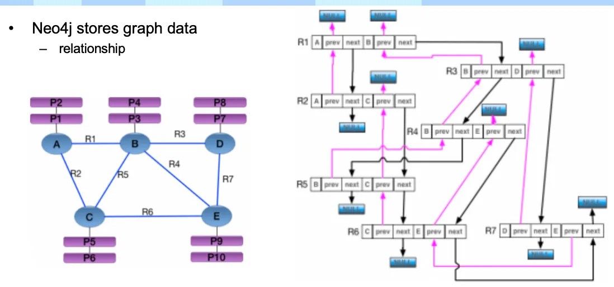

# 17. Log-Structured Database & Vector Database

### 1. 课前Redis讲评

课前讲了作业中`Redis的超时`设置（比如3600秒），有几个要考虑的问题：

1. **缓存雪崩**：一开始我把数据库中10万本书的信息都缓存在Redis中，那最初大量的访问都是走Redis的。但当3600秒到了之后，Redis中的对象会**全部失效**，这意味着之后大量的访问书的请求在Redis中是无法命中的，于是要到数据库硬盘上重新去load

	官方定义：Redis中缓存的数据大面积同时失效，或者Redis宕机，从而会导致大量请求直接到数据库，压垮数据库。

	解决：10万本分成10个1000本，然后每小时失效1000个（即不要让所有缓存同时过期，也可以通过设置缓存的过期时间为随机值来避免）

2. **缓存击穿：**比如碰上双11，突然会有10万个请求**同时进来**都要找同一本书，而这一本书恰好在Redis中没有，这意味着数据库要同时去处理大量的请求，但其实处理的都是一个数据。此时缓存就好像没有一样，就给击穿了，尽管最后这条数据会被load到缓存里

	官方定义：缓存击穿是指某个热点数据在缓存中失效的瞬间，大量的并发请求同时访问该数据，由于该数据在缓存中失效，大量请求同时打到数据库，造成数据库压力骤增。这种情况通常发生在热点数据或访问频繁的数据上。

	解决：**加锁**。当缓存失效时，通过加锁的方式保证只有一个线程去查询数据库并更新缓存，其他线程等待缓存更新完成后再获取数据，此时就是走Redis了，读数据库就只有一次。

3. **缓存穿透：**客户端频繁访问一些根本不存在的缓存数据，由于缓存中没有这些数据的记录，每次请求都直接打到数据库，导致数据库压力增大。这通常是由于用户输入非法或恶意构造的请求引发的。

	解决：在前面要做个过滤，比如布隆过滤器（不存在的数据一定会返回不存在，所以如果布隆过滤器判定该key不存在，则直接返回，不必查询缓存或数据库。但是它说有不一定真有。）

	第一个问题和过期时间有关，后两个问题和数据库与缓存之间的数据同步有关。所以在设计Redis时有很多问题要考虑。

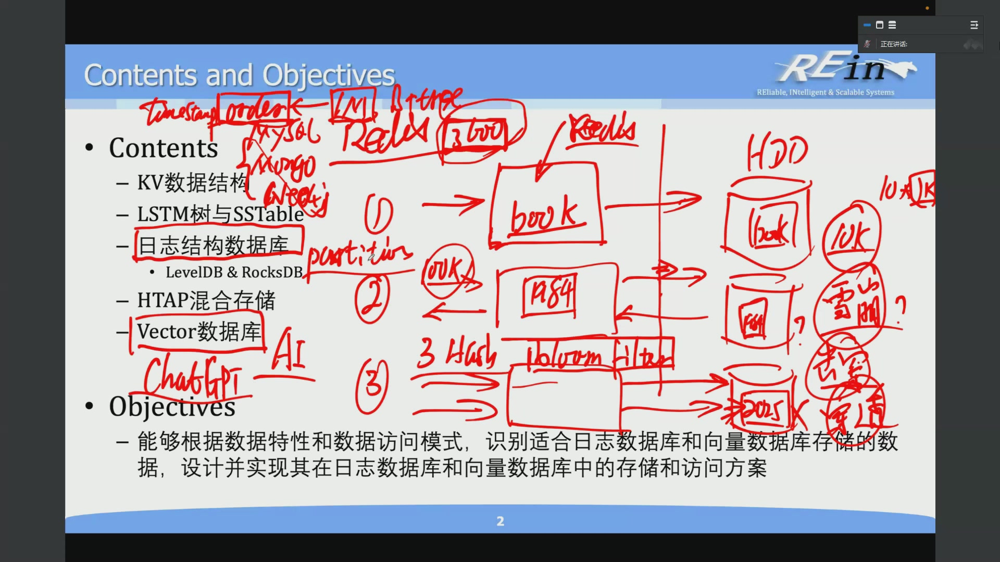


讲向量数据库Vector Database是因为现在很多AI的项目在用Vector DB做处理，比如ChatGPT。

### 2. Log-Structured Database 日志结构数据库

它的存在是为了解决一个**热点数据问题**。

传统数据库（如MySQL、MongoDB、Neo4j等）存在一个`前提条件`：所有数据被访问的概率相似，且数据在语义上没有明显差异。

考虑购物节的场景，期间会有很多新插入的订单，而这些新数据被访问的频率极高（如用户查看订单状态、处理情况、运送信息等）。传统数据库将所有订单数据存储在同一张表中，无法区分新订单与老订单，这会导致：数据访问效率低下，尤其当订单量达到百万级别时，每次查找都需在大量数据中检索，即使使用B+树等索引结构，速度仍然较慢。即使采用分区Partition等方法，仍有不足：

如果按插入时间进行分区，则需要在表中包含时间戳（timestamp），以支持按时间查询，这样就无法同时按用户名或地域等其他维度进行分区。此外，**子分区SubPartiton**也比较复杂：例如，先按用户名进行哈希分区，再在每个用户名分区内按时间戳分区。查找时需先确定所在的分区，再在分区内进行查找，操作复杂且不便。

所以总的来说，他们对**热点数据的支撑**会弱一点。

此时我们就用到了日志数据库。

#### 2.1 LSM-Tree:Log-Structured Merge Tree 日志结构合并树

- 是一种分层、有序、面向磁盘的数据结构，其核心思想是充分利用磁盘批量顺序写性能远高于随机写性能的特点

（1）什么是日志结构？前面数据库讲undo，redo和bin log的时候提到了，是**顺序写**的，即以append的模式追加写入，不存在删除和修改（修改也是通过插入新数据）。

- 这种结构虽然大大提升了数据的写入能力，却是以牺牲部分读取性能为代价，故此这种结构通常适合于写多读少的场景

（2）为什么叫合并树？即把`热数据`放在树里面比较`高`的地方，这样从根往下遍历的时候能比较快的读到新数据。旧数据通过不断的合并沉到树的下面。（数据被分了层，数据热度和level相关）

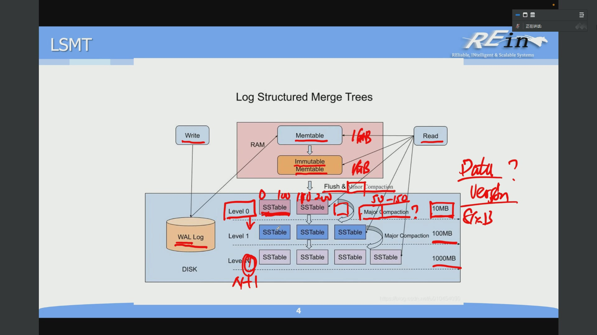

**双内存表机制**确保在一个内存表写满时，它的角色会切换成`Immutable Memtable`（即冻结），然后另一个内存表可以立即接收新的写入（写操作不能停止，系统需要持续接受新的数据写入）。此外，满的内存表需要被持久化到硬盘，以释放内存空间供新的写入使用。这个过程需要一定的时间，不可避免会有写入延迟。将满的内存表**冻结**，即转换为不可修改状态，能确保数据的一致性和完整性。

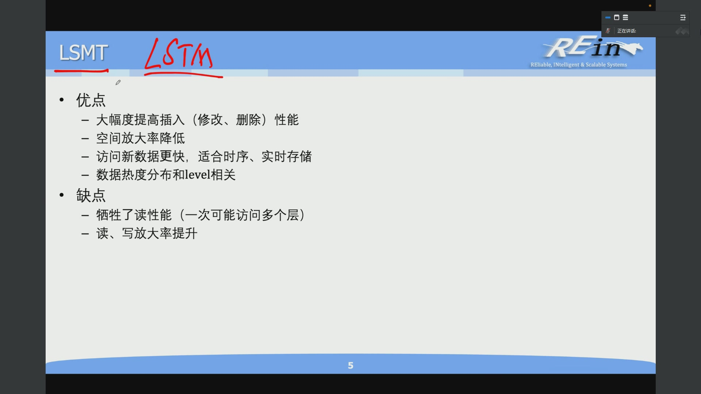

#### 2.2 SSTable(Sorted String Table)

**SSTable的特点**

- 存储的是<键,值>格式的字节数据 
- 字节数据的长度随意，没有限制 
- 数据顺序写入
- 键可以重复，键值对不需要对齐（所以需要一个索引记录key和offset）
- 随机读取操作非常高效

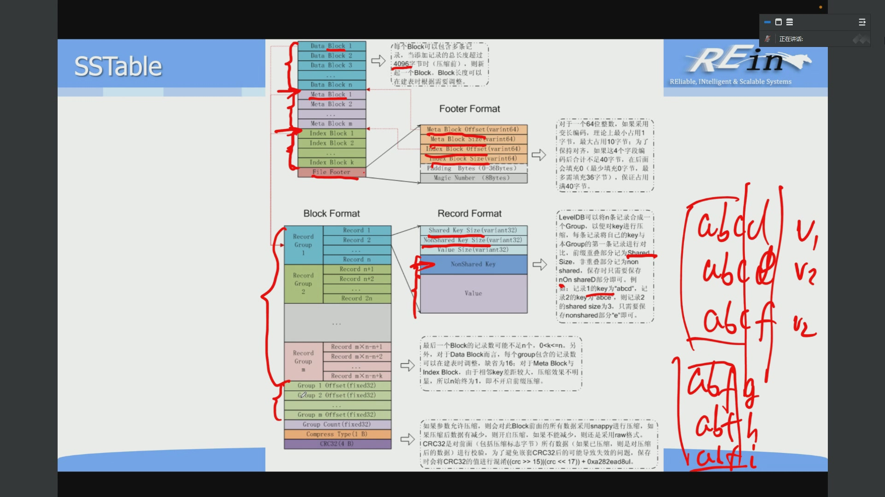


**SSTable的限制**

- 一旦SSTable写入硬盘后，就是不可变的，因为插入或者删除需要对SSTable文件进行大量的I/O操作 
- 不适合随机读取和写入，因为效率很低，原因同上一条

#### 2.3 写放大问题

- 写入的时候可能有个阻塞问题，为啥？因为它写入的时候有可能需要去做合并Compaction，比如L0层满了之后，它要往L1层去落，那么刚才讲了一个极端情况是L1层你落下来之后也满了，又要往L2层落，以此类推，每一层可能都会满。不断地往下compact导致**实际写入的数据量远大于真正的数据量**。

#### 2.4 读放大问题

- 那读呢？是存在这么一个问题，就是我在找一个数据的时候，我先到内存表里；找不到，我再到这个 L0层找，找不到我也不能说这数据不存在，有可能它太老，它落到底下去了，于是我一层层找，极有可能就是最后你在很找了很多层你才找到。而且你在不同的层里面可能还存着不同的版本。因为我们刚才说了，它的改写是通过append追加得到的，那也就是说你如果有老版本的话，它会在更低的层里面，如果没有经过compaction，这个数据还是在的，只有compact才有一次机会可能把它给删掉。这个过程可能需要不止一次I/O。特别是range query的情况，影响很明显。**限制了AP查询的性能**。
- 优化：同样可以用一个布隆过滤器

#### 2.5 RocksDB

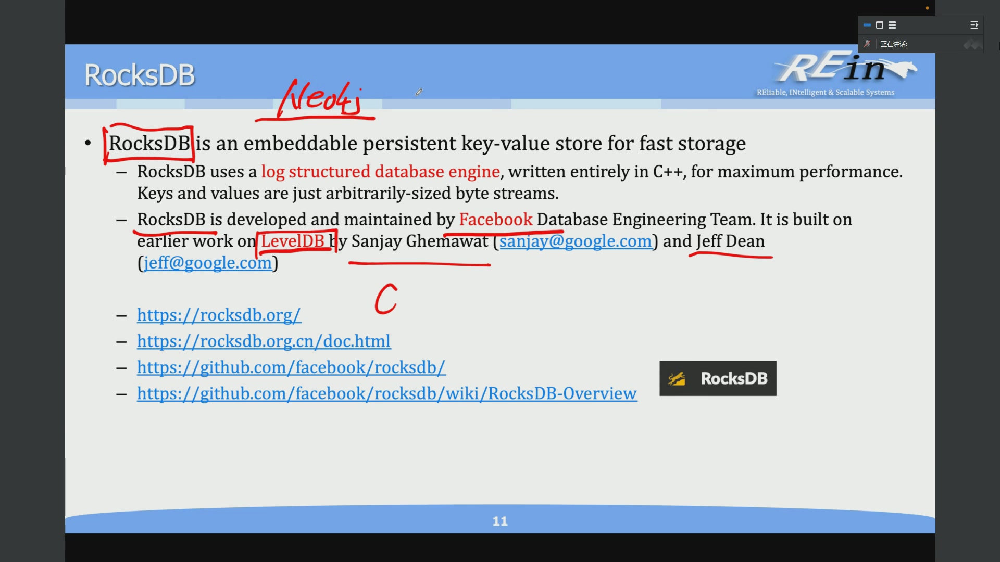

和Neo4j类似，有两种运行方式：一种是他在后台作为一种服务，另一是它嵌入到应用中

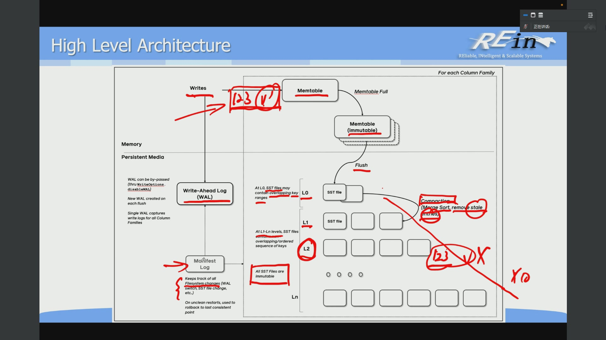

**注意的点：**

- 在写之前，同样要先写Write Ahead Log
- 有多个Immutable Memtable，因为写操作数量比较多
- L0层是允许key的范围有重叠，从L1之后往下不允许范围有重叠
- Compaction过程中可以去掉旧数据
- Manifest Log不断追踪文件系统的变化，相当于记录SSTable的变化

课上运行了一个**嵌入式**的RocksDB的Java程序，要注意的是在实现增、删、查方法时需要添加**synchronized**关键词，防止多个用户访问时出错，比如一个正在删，一个正在查

#### 2.6 HTAP(Hybrid Transactional/Analytical Processing)

- 数据存储方式的选择（按行存储 vs 按列存储）直接影响数据库对不同类型工作负载的支持。

##### 行存储与列存储的区别

- 行存储:数据以“行”为单位存储，每一行包含一个完整的记录。

	适用于:在线事务处理（OLTP）

	- 低延迟、高并发的随机读写操作。
	- 典型场景：订单处理、用户登录等。

	- 优点:
		- 快速插入和更新单条记录。
		- 适合频繁的随机访问。
	- 缺点:
		- 大规模的顺序读取（如统计分析）效率低下。

- 列存储：数据以“列”为单位存储，每一列的数据集中存放。

	适用于:在线分析处理（OLAP）

	- 高效的大规模数据读取和聚合操作。
	- 典型场景：销售统计、报表生成等。

	- 优点：
		- 高效的列级压缩和大规模数据读取。
		- 适合大规模顺序访问和分析。
	- 缺点：
		- 插入和更新单条记录较慢，尤其是高并发场景。

##### OLTP与OLAP对存储格式的不同需求

- 在线事务处理（OLTP）
	- 特点：
		- 高并发、低延迟的随机读写。
		- 处理大量短小的事务（如订单、用户信息）。
	- 需求：
		- 快速的单条记录插入和更新。
		- 高效的随机访问支持。
- 在线分析处理（OLAP）
	- 特点：
		- 低并发、高吞吐量的大规模数据分析。
		- 处理复杂的查询和聚合操作。
	- 需求：
		- 高效的顺序读取和列级聚合。
		- 优化的列存储以提升查询性能。

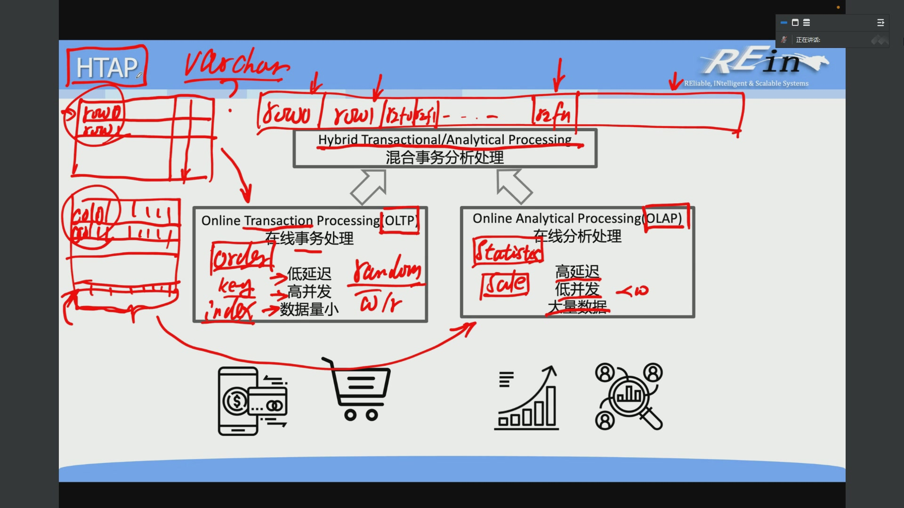

##### 混合存储的挑战

- 不同需求的冲突：OLTP和OLAP对存储格式的需求相互矛盾，单一的存储格式难以兼顾两者的性能。
- 系统复杂性：在一个系统中同时支持行存和列存需要复杂的存储管理和数据一致性维护。

##### 解决方案

1. **双存储方案（Dual Storage）**：
	- 同时维护行存和列存两份数据。
	- 优点：
		- 完全优化 OLTP 和 OLAP 各自的性能。
	- 缺点：
		- 存储空间浪费严重（数据存储空间翻倍）。
		- 保持两份数据的**一致性**极为复杂，易出现数据不一致问题。
2. **根据数据的访问情况进行行存和列存的自动转换**

RocksDB没法直接实现行存到列存的转换，但他走了一个`折中路线`

##### RocksDB 的处理方式

- 列族（Column Family）
	- 很多NoSQL数据库都想到这种方法，很像MySQL的`垂直分区`（但是MySQL自身不支持，因为维护起来太麻烦，找第三方工具能实现），而在NoSQL中垂直分区是很常见的
	- 将数据分成不同的列族，每个列族独立管理和优化。
	- 例如，订单表中将与 `sale` 相关的列存储在一个列族中，以优化OLAP查询。
	- 其他订单相关信息继续使用行存列族，优化OLTP操作。
- 预写日志（WAL）
	- 所有列族共享一个预写日志和Manifest Files，确保数据一致性和可靠性。
- 优化折中
	- 通过垂直分区和列族机制，实现部分行存和列存的优化，兼顾OLTP和OLAP的需求。

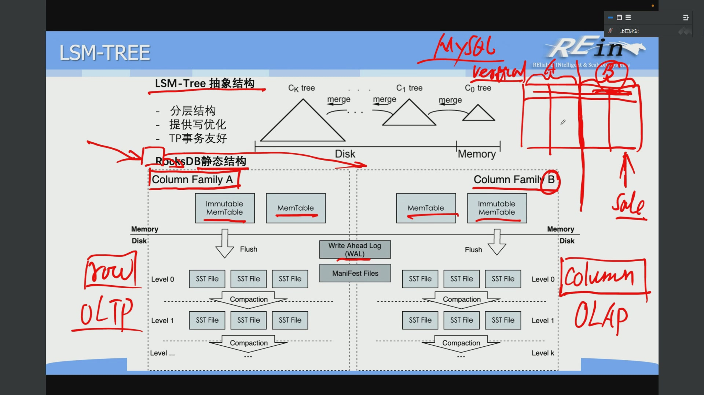

#### 2.7 RocksDB的读写流程

##### 2.7.1 写流程

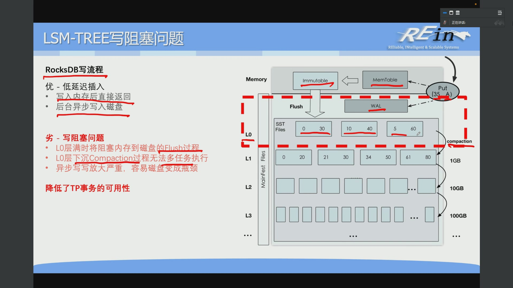

**解决：**

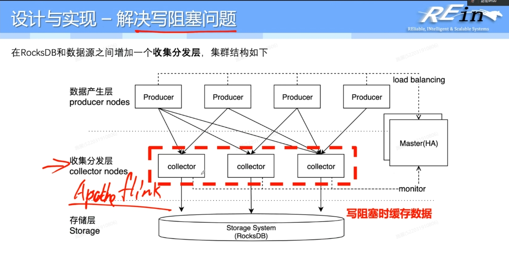

增加一个**收集分发层**，比如**Apache Flink**（一种流处理框架，广泛应用于字节跳动、阿里巴巴等大型平台，用于高效处理和分配数据）

###### 数据处理流程

1. 数据接入：数据首先接入Flink进行实时处理和分发。
2. 数据暂存与分配：
	- 确保大量数据能够被快速接收和暂存（写阻塞是缓存数据）
	- 将数据根据策略分配到不同的Collector进行后续处理。
3. 数据写入存储系统：Collector负责将数据从内存写入硬盘，确保数据的持久化存储。

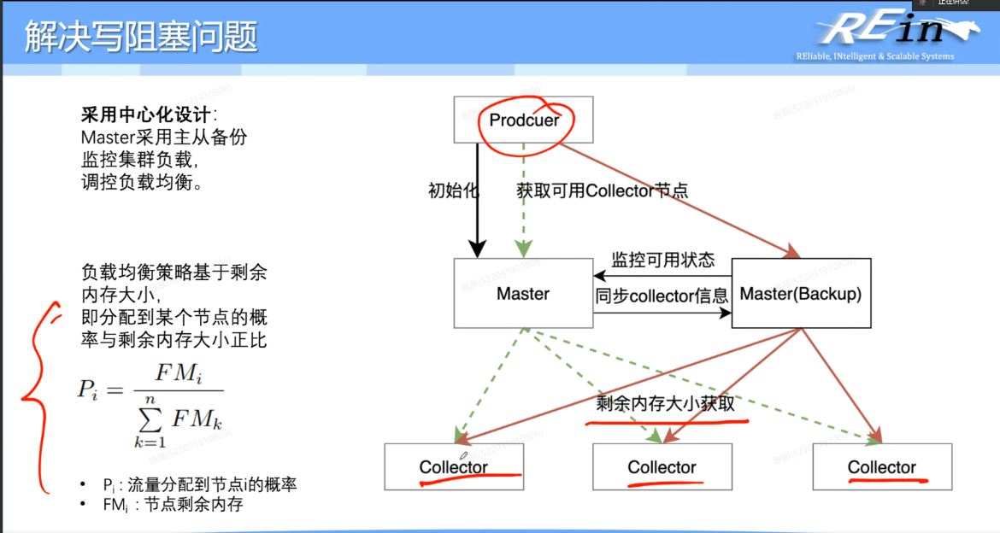

###### Collector管理与监控

- 多Collector并行写入：系统中存在多个Collector，能够并行处理写入请求，提升写入效率。
- 监控Collector状态：
	- 关键监控指标：
		- **内存大小**：每个Collector的总内存容量。
		- **剩余内存**：当前Collector的可用内存量。
		- **写入进度**：数据写入到内存和从内存落盘的进度。
	- 监控目的：实时了解各Collector的负载情况，确保数据分配的合理性。

###### 数据分配策略

- 动态分配策略
	- 根据内存使用情况分配：优先将新数据分配给空闲内存最多的Collector，以优化资源利用。
	- 负载均衡：确保各Collector之间的负载均衡，避免某些Collector过载而导致写阻塞。
- 具体步骤：
	1. 检测Collector状态：实时监控各Collector的内存使用情况和写入进度。
	2. 选择合适的Collector：根据空闲内存量，选择最合适的Collector接收新的Producer数据。
	3. 分配数据：将数据发送到选定的Collector，确保写入操作的高效和连续性。

###### 优势

- 避免写阻塞：通过合理的数据分配，减少单个Collector的压力，避免写操作被阻塞。
- 提升系统可用性：保证写入操作的连续性和高效性，提高事务处理的可用性和系统响应速度。
- 增强系统扩展性：过增加Collector数量，可以线性扩展系统的写入能力，适应更高的并发写入需求。

##### 2.7.2 读流程

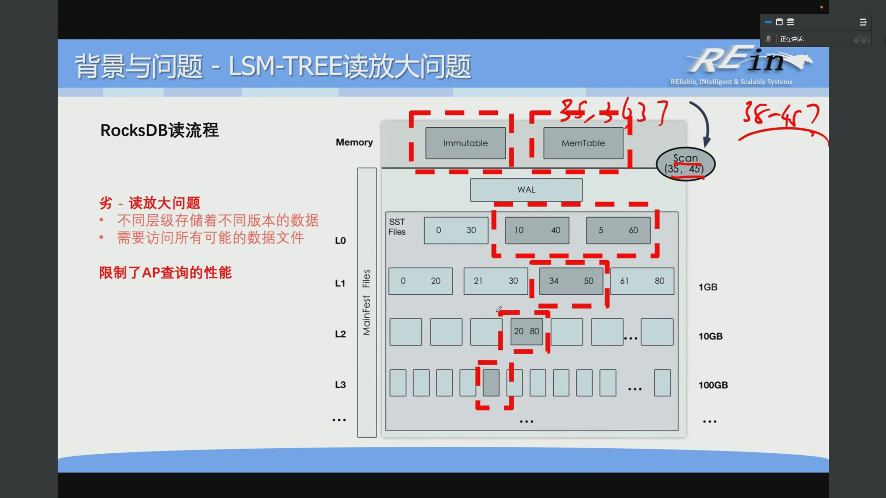

**解决：**

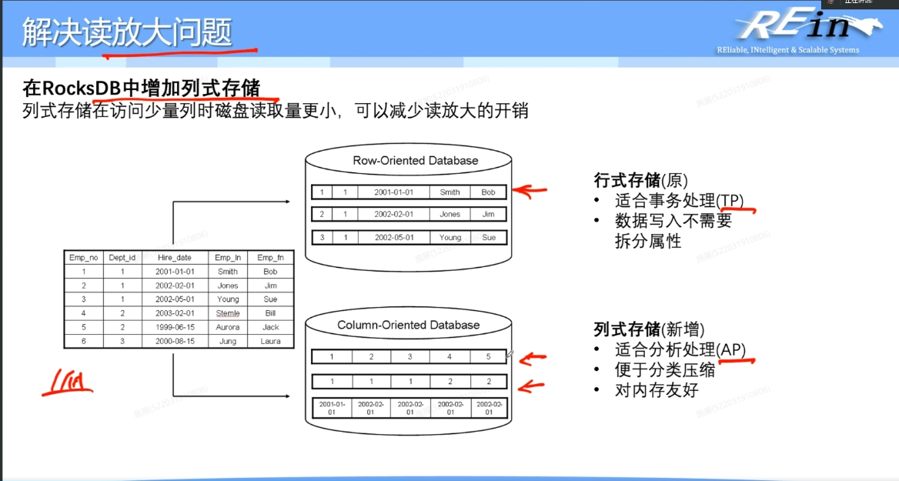

###### 列存储在RocksDB中采用分块存储策略：

- 数据量较大时（如100万条记录），不能先全部存这100万跳记录的某一列，然后在存下一列。
- 分块存储策略：
	- 将数据按列分成多个数据块，每个数据块包含前m行的某一列数据。
	- 每个大块内先存储第一列的数据，接着存储第二列，依此类推。
	- 数据块按行切分，确保在每个大块内按列存储，提升查询效率。

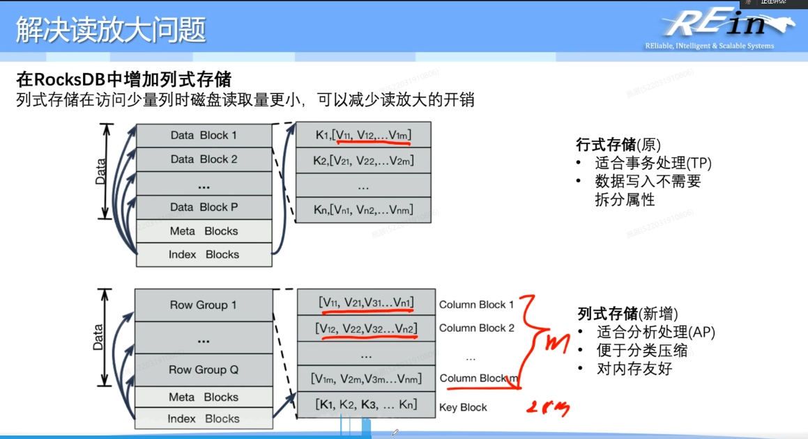

###### 支持混合存储策略：

- 支持同时使用行存和列存，满足OLTP和OLAP的不同需求。

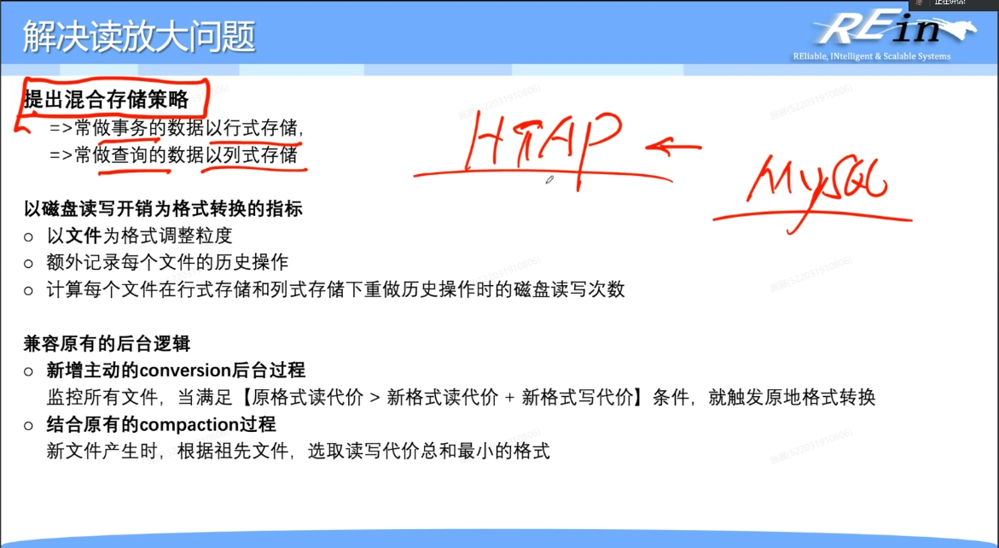

几乎所有数据库都支持HTAP功能（包括MySQL），用户可以选择打不打开，但是打开之后会影响性能

#### 2.8 HTAP系统整合

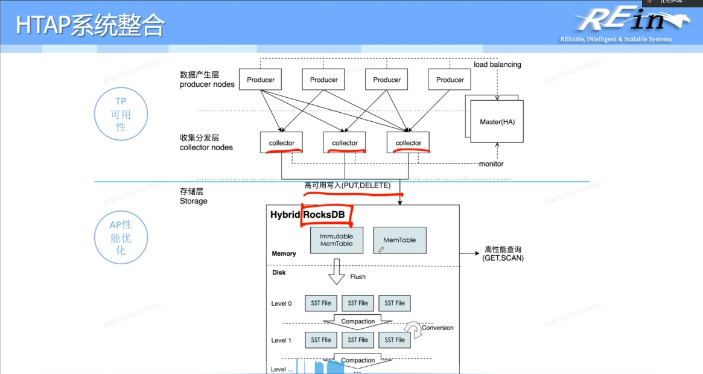

根据发送过来的请求来决定是在行存还是列存上去做操作。行存和列存是在**互相转换**的，不需要在任何时刻两个同时存在，数据在行存和列存上做转换，只保留一份。

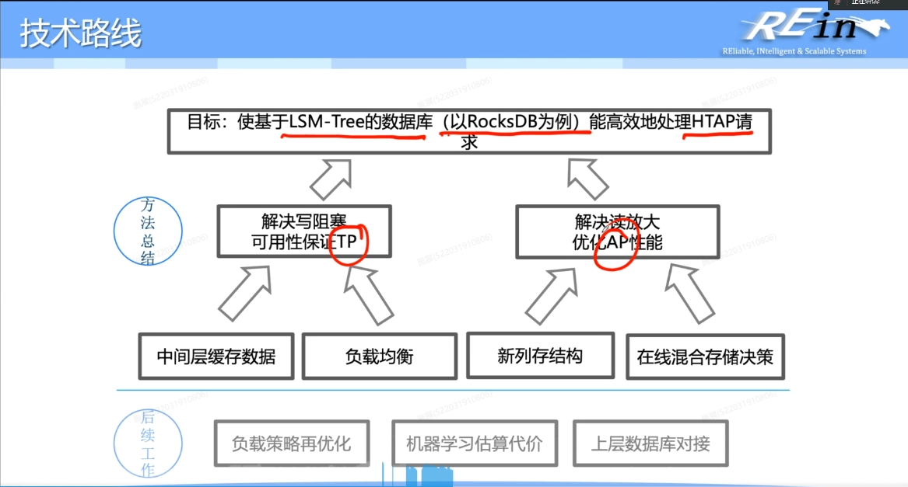

我们只是以RocksDB为例来讲了为什么数据库中需要行存和列存来支持HTAP，事实上，关系型数据库、文档数据库等也都是同时支持AP和TP的。

### 3. Vector Database向量数据库

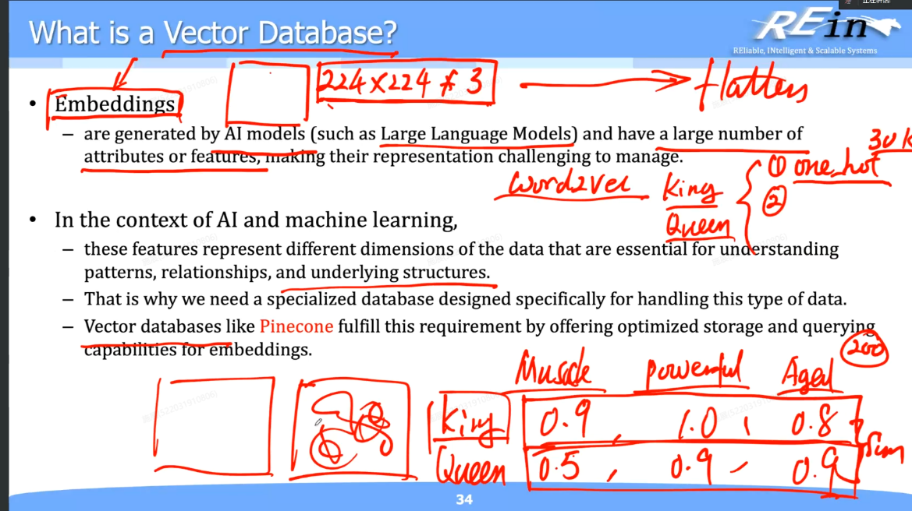

#### 3.1 定义：

专门用于存储和查询高维向量（嵌入）的数据库，主要用于支持人工智能模型中的相似性搜索。

#### 3.2 向量数据库解决的问题：

###### AI模型中的嵌入需求

- 嵌入（Embedding）

	- 将目标对象（如文本、图像、视频）数值化，转化为高维向量。
	- 生成的向量包含对象的特征或属性信息。

- 应用场景：

	- **图像分类**：将图像像素（如224x224像素*3通道）摊平成一维向量作为嵌入。

	- **自然语言处理**：将单词通过词向量模型（如Word2Vec）转换为向量表示。

		- 使用One-Hot编码：每个单词表示为一个稀疏高维向量，维度等于词汇表大小（如3万个单词）。单词a在第一个位置上为1其他位置都是0，单词b在第二个位置上为1其他位置都是0（需要3万个位来表示）

		- 缺点：
			- 维度过高，存储空间大。
			- 向量之间正交，无法表示单词间的**相似性**。

	- **降维嵌入**：

		- 将单词嵌入压缩到较低维度（如上图中的5维，每一位代表一种“属性”）。
		- 优点：
			- 降低存储空间需求。
			- 向量之间可以计算相似性，反映单词间的关系。

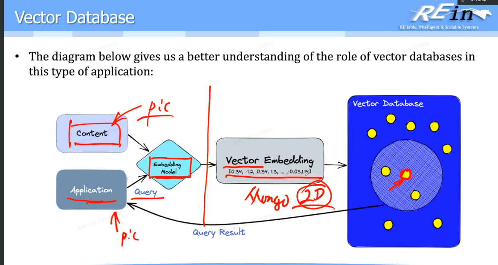

#### 3.3 向量数据库的工作原理：

###### 存储向量

- 存储内容：向量数据库存储各种对象的嵌入向量。
- 相似性搜索：根据查询向量，查找数据库中与之最相近的向量，支持相似对象的检索。

###### 向量与传统数据库的区别

- 传统数据库：主要支持精确匹配查询。
- 向量数据库：支持基于向量相似度的模糊匹配查询。

###### 常见相似度度量

- 余弦相似度（Cosine Similarity）：
	- 计算两个向量的夹角余弦值，范围[-1, 1]。
	- 越接近1，表示向量方向越相近。
- 欧几里得距离（Euclidean Distance）：计算两个向量之间的直线距离(用两点之间距离公式)。
- 曼哈顿距离（Manhattan Distance）：计算两个向量在各维度上的绝对差值之和。
- 其他相似度度量：Jaccard相似度、Hamming距离等，根据具体应用选择。

#### 3.4 向量数据库的索引方法

###### 维度处理

- 高维向量的挑战：存储空间大，查询效率低（之前的例子，一张图片变成向量会有224 * 224 * 3位）

- 降维方法：

	- 随机投影：
		- 使用随机矩阵将高维向量投影到低维空间。（1 * n的向量乘n * m的矩阵变成1 * m）
		- 当然也可以从低维变成高维，所以本质上是**维度的压缩或扩张**

	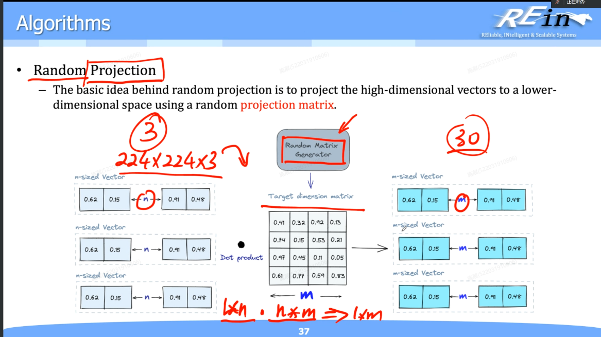

	- 量化（Product Quantization）：
		- 将高维向量拆分成小块，映射到预定义的代码本（Codebook）中，减少存储空间。
		- 本质上是做了一个**聚类**操作
		- 如下图所示，如果A和B经过分割然后量化后都有3个code，可通过比较匹配上的有多少个，匹配的越多表明越相似

	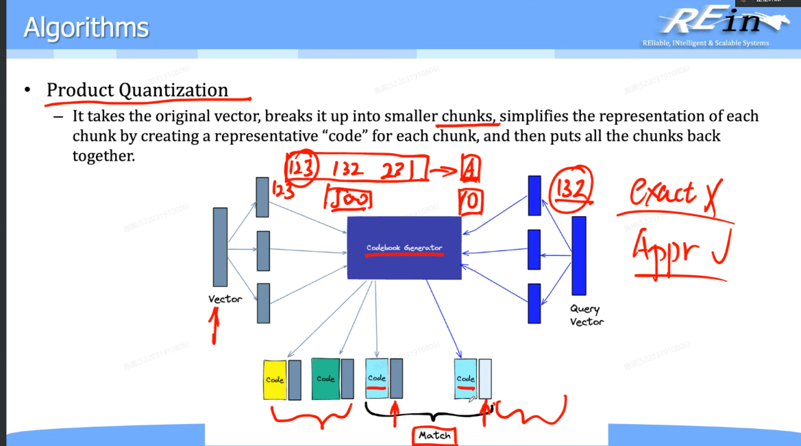

###### 其他计算近似的算法

- 位置敏感敏感哈希（Locality-sensitive hashing）
	- 相似的向量会进入同一个哈希桶且位置靠近（如下图所示）

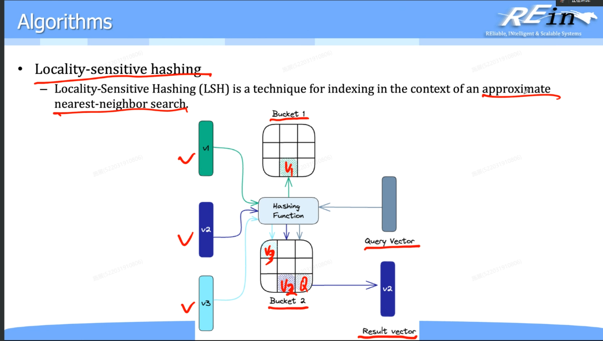

- 图结构方法
	- 层次化可导航小世界（HNSW）：构建多层次的图结构，每个节点（代表一个“群”，群内的向量相似度都比较高）连接相似的节点，支持高效的近邻搜索。

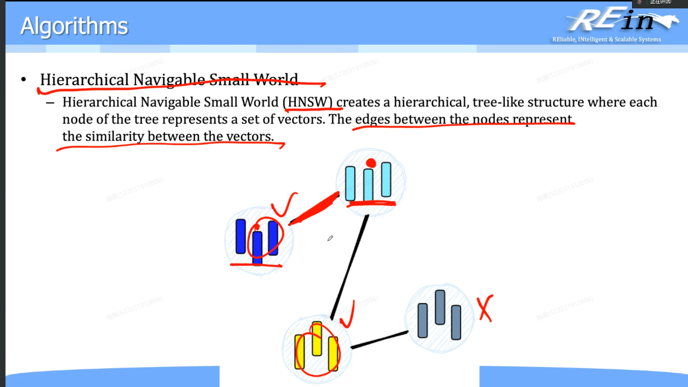

###### 通过过滤来优化

一个向量包含着元数据（比如图片信息，视频信息和音频信息）

在进行相似度查找时，有两种过滤方式：

- Pre-filtering：先把不相关的过滤掉（比如我只想找相似的图片，那我就先过滤掉视频和音频），再根据相似度排序
- Post-filtering：比如是多模态的搜索，然后对结果进行过滤，如果不满意过滤后的结果还可以退回到初始的结果进行进一步处理

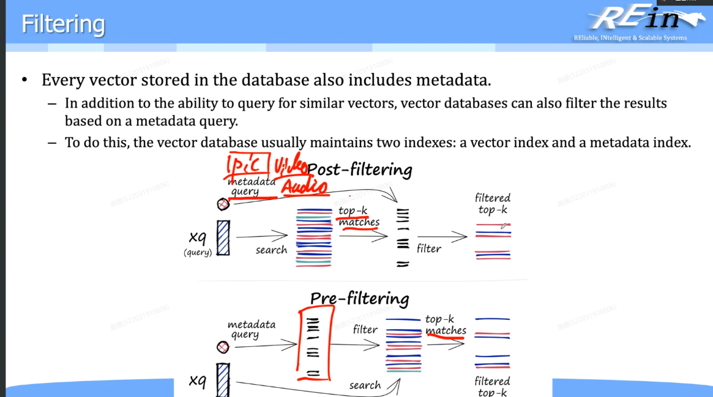

#### 3.5 以Pinecone这个向量数据库为例

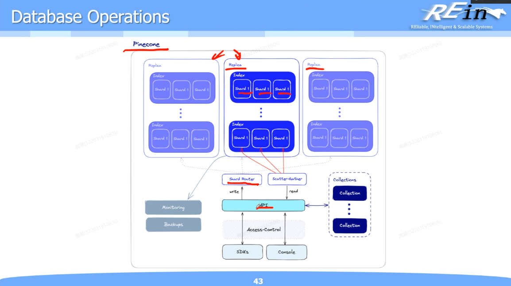

可以发现，它也有**主从备份**，然后它存的是**索引Index**，可以理解成传统关系数据库的表(Table)。每个Index在Pinecone中都是一个独立的数据结构,用于存储和检索高维向量。创建索引时，需要定义`向量维度`和`相似度的度量方式（比如余弦相似度）`。此外，索引中有**sharding分片**

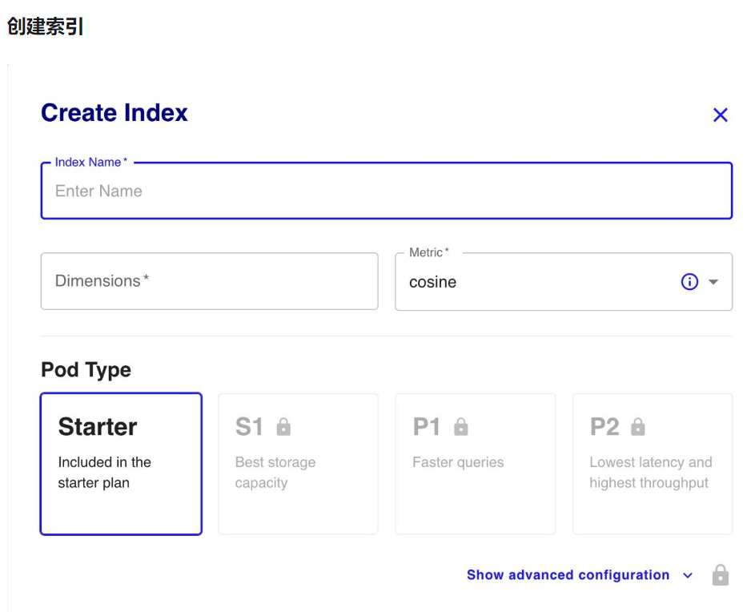

- 在创建完索引后，可以将嵌入向量插入到索引中（相当于往表中插入一条数据），也可以进行删除操作。

- 查找时，输入查询向量，可以获取Top K相似向量及其对应的对象。

- 下图的示例是针对三维向量的query，返回结果中的**score**表示相似程度，越大表明越相似。

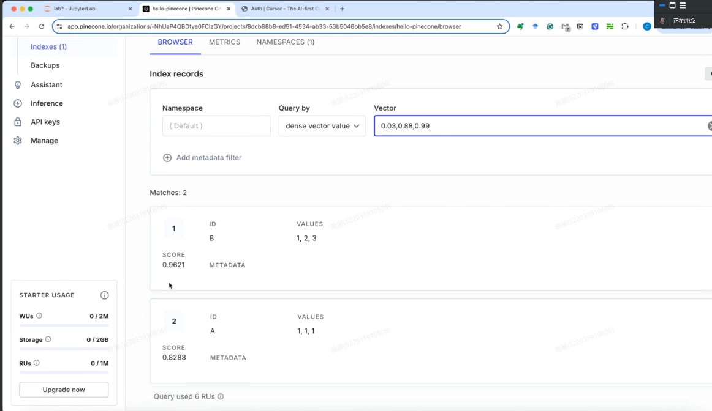

# 18. Timeseries Database 时序数据库

### 1. 概念

时间序列数据库（TSDB）是针对时间戳或时间序列数据而优化的数据库。

> 时序数据：比如说一个花园，我在里面布了很多的传感器，这些传感器能检测温度和湿度，我来做这个自动浇灌，然后他们就会源源不断的产生数据，我要把它存起来，那可以看到它们源源不断产生数据，于是我们看到这数据有几个特征。
>
> - 第一个：它的**数据格式是比较简单**的，不像关系型数据库有多个表然后表和表之间还有关联，它实际上就是一**些监控数据**，比如温度，资源利用率utility
> - 第二个：因为格式比较简单，因此可以**不存原值，存差值**。比如有一串温度数据11.1，11.2，10.9，10.8，可以保存成11.1，+0.1，-0.2，-0.3，这样做的好处是可以**节省空间**
> - 第三个：这个数据只要你往上发，它一定**带一个时间戳timestamp**。针对timestamp的存储可以做**优化**，比如我要存13位的学号，前10位所有人都是一样的，那么前10位可以只存一次。timestamp同理，可能很多数据timestamp一样，那么可以之存一次。此外，也可以像第二点一样，存差值，节省空间。
> - 第二个：你一定会有大量的这种传感器在传数据，所以它必须要支持这种**高并发**，就**吞吐量要大**，这种吞吐量必须要大才能支持高并发。
> - 第四个：你说传感器如果他在报数据，他偶尔丢掉一两个或者一两个不太准，它会不会影响你的这个数据整体的效果？
> 	就是他如果说每一秒钟都报一个数据，在某一秒他突然丢了一个数据，它会不会影响你做统计的效果？就理论上来说，它里面的**数据允许少量的不准确或者是缺失**，也就是说它的数据和那种 transaction 的数据就形成了鲜明的对比。
> - 第五个：就是其实我们**对单点的数据是不感兴趣**的，你说我要知道某一个时间点，这里面每一秒都要发数据，我要知道在某一秒的数据，这个肯定你不太关心，你关心的是**一个时间区间内**，比如说在一小时内它的数据什么样的，我要去求和，更严谨的说第五个：它的**数据格式是比较简单**的，不像关系型数据库有多个表然后表和表之间还有关联，它实际上就是一**些监控数据**，比如温度，资源利用率utility
> - 第六个：因为格式比较简单，因此可以**不存原值，存差值**。比如有一串温度数据11.1，11.2，10.9，10.8，可以保存成11.1，+0.1，-0.2，-0.3，这样做的好处是可以**节省空间**。所以在持续数据库里，他对单点数据的访问不会特别多，他经常做的是对一块数据，尤其是时间片划分出来的一段数据，他要去做一个访问。

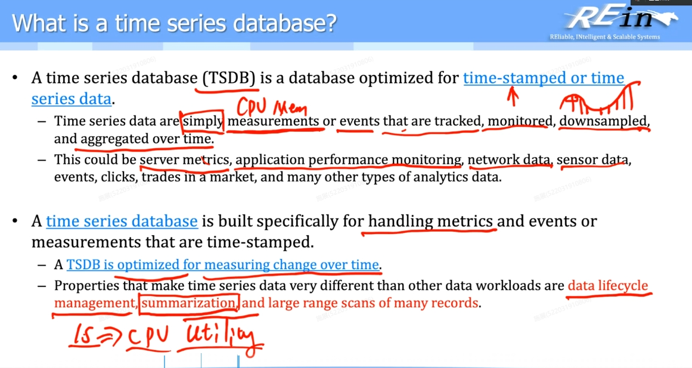


1. 整体的存放是用了类似lsm日志结构合并树的结构；时序数据库的**生命周期一般比较短**，比如一个传感器，可能我们只关心最近一周的或者一个月的数据，超过的时间的数据就可以删除（比如当掉到L0以下，我们就将其压缩，甚至删除）。（类比关系型数据库的订单数据，订单数据必须要持久化保存，但是这种时序数据库可以**通过摘要压缩一下，或者直接删掉**）
2. 不太可能会建立索引，例如记录温度随时间的变化，一般不会有必要建立索引（比如建个温度在时间的索引，这没有意义）
3. 对于时序数据库接受的数据的特点：格式简单，更多的数据点，更多的数据源，更多的监控，更多的控制

> **Telegraf & InfluxDB**
> InfluxDB是数据库；Telegraf是数据采集器，可以采集各种各样的数据，然后把数据写入到InfluxDB里面去。

### 2. InfluxDB

#### 2.1 query示例：

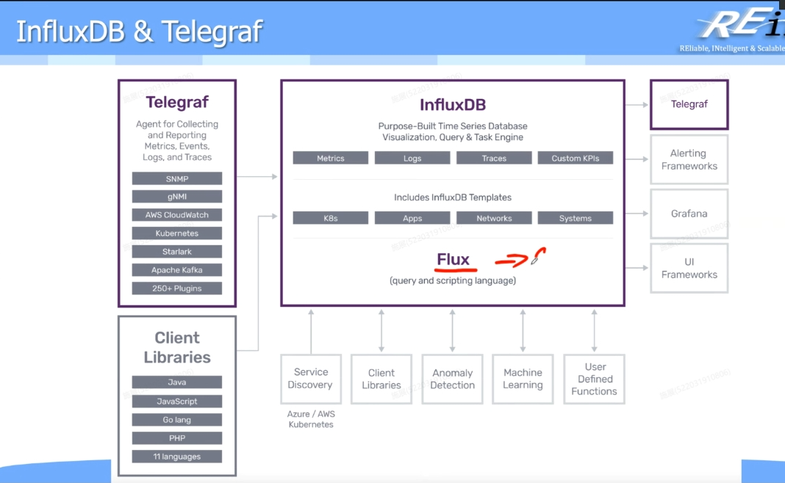

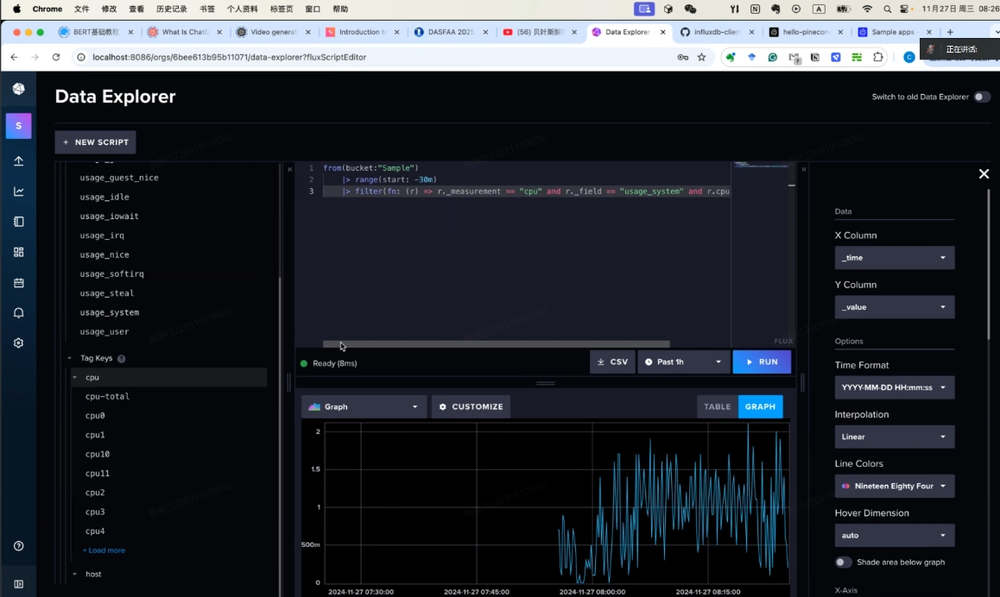

#### 2.2 基本概念

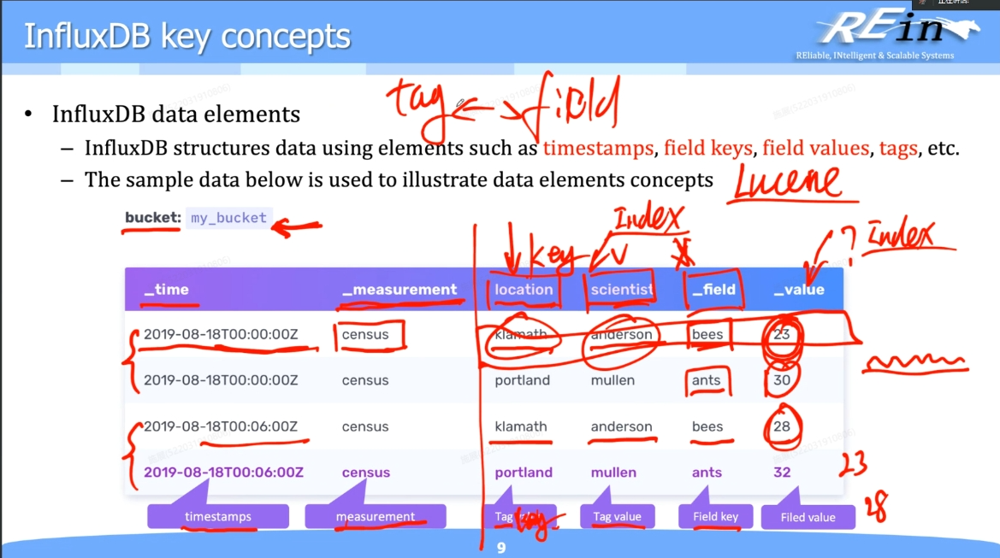

- Bucket就是类似于关系型数据库中“表”的概念；没有库的概念，因为不像关系型数据库中有外键关联的概念。
- 带有_开头的，都是系统保留的字段，也就是一定会有的一个列，反之都是用户自定义的字段（比如上图中的location和scientist，他们都是**Tag key**, Tag可以作为筛选的依据，得到一个**Tag set**）。
- _time：时间戳，数据对应的时间，因为可能同一个时间会接收到很多数据，所以很可能同一个时间接收到很多数据，所以时间戳不能唯一的标识。时间戳非常准确，精确到纳秒级别。
- _measurement：起一个名字，一个统称，这个表格在干啥。census就是调查种群数量。这里我们发现它是共享的，所以存储的时候会优化，**只存储一次**。
- _field：存储的是key，比如上图里面存储的就是某个物种的名字；和value构成键值对。Field可以作为筛选的依据，得到一个**Field set**。
- _value：存储的是value，类型可以是strings, floats, integers, or booleans，之所以不能是别的，是因为如果是复杂的数据类型转换会耽误时间，效率降低，所以就只能存这些基础的数据类型。
- 所有的tag都参与索引，而field是不参与索引的（从语义上说，tag的东西都是用来“修饰”_field的，比如上图中的）

#### 2.2 Schema优化

上图中，location和scientist都属于Tag，_field和 _value都是Field。Tag和Field之间是**可以相互转化**的

- **Fields不参与索引**，必须扫描全表；如果经常被访问，就表明不适合以这种形式存储，就应该以Tag的形式存储。
- **Tags参与索引**，当然查询起来就会更快。当然索引本身是有开销的，并且如果你进行写操作，索引也会更新，带来更多开销。

考虑以下的示例：

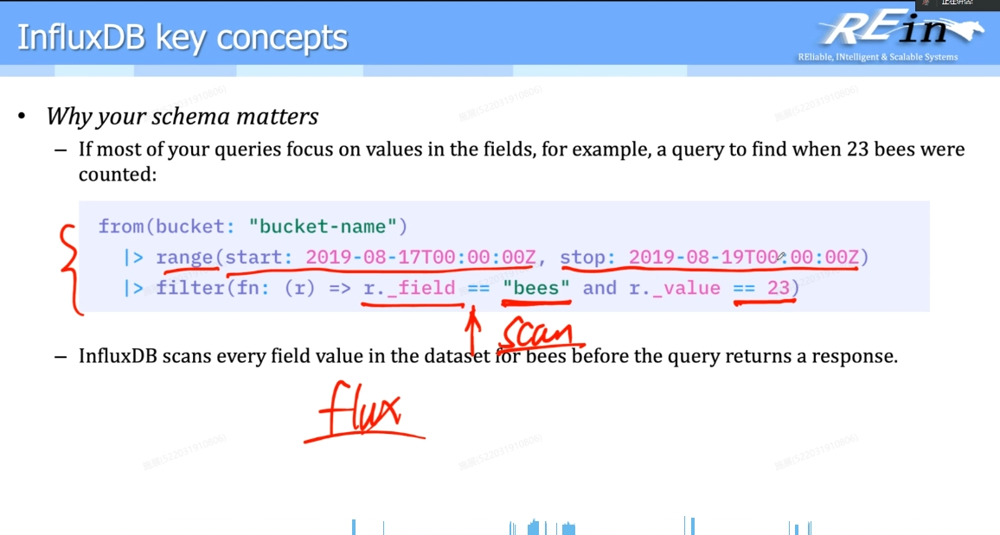

如果经常会做上述的query，那么事实上我们不用每次都去做全表的scan。如果在bees这一列上**按value的值做过索引**，那么query会更快。修改下图所示

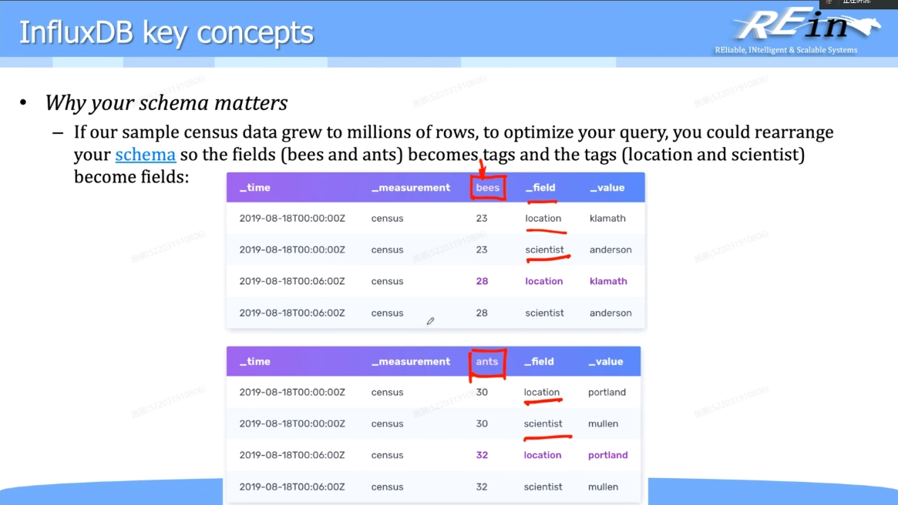

#### 2.3 influx中的其他基本概念

- Series：measurement, tag set, 和field key都相同的点集合，统称为series key。

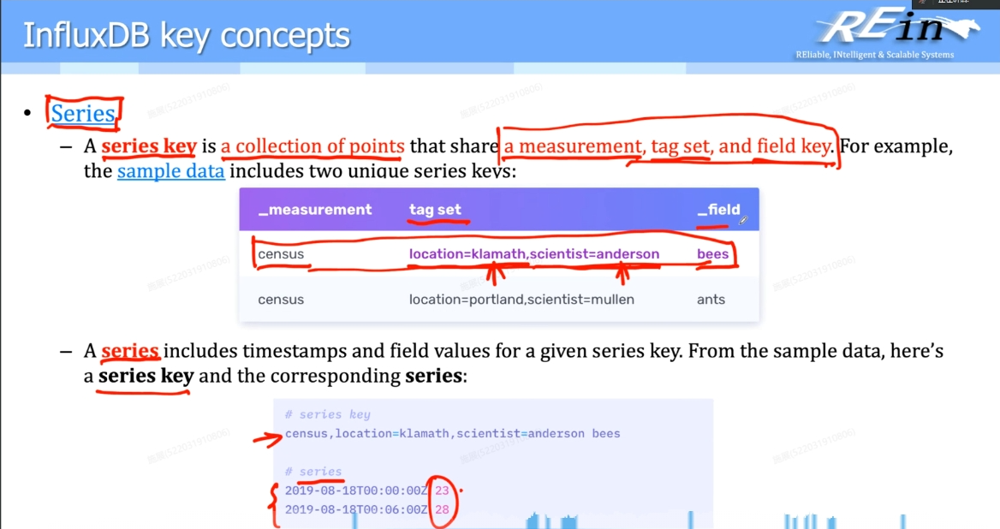

- Point：一个数据点，带有时间戳的数据点。
	比如 `2019-08-18T00:00:00Z census ants 30 portland mullen`
- Bucket：存储桶，包含**数据库**和**存活时间（retention period，即每个数据点能持久化存在的时间，时间一过就会删除掉）**这两个概念。归属于一个组织，存储相对应的数据点集合。
- Organization：组织，一组用户共同的工作空间，他们会看到相同的bucket，dashboard等。

#### 2.4 InfluxDB设计原则：何以支持时序数据？

- **严格按照时间组织**，按照时间顺序递增追加append（write in time-ascending order），不会出现说我突然插入一个以前的时间戳
- **严格限制update和delete**。首先本来就是传感器送过来的数据，你改它干吗？而且，你明明一直在追加，你说我往里面去改写，那它就不是顺序读了，它要做一次随机读，它效率就降低了。改一下有可能尺寸会发生变化，要么留下空洞，要么它存不下后面东西所有都要往后挪，所以它就严格限制你不能这么做。所以他认为时序数据就是新数据，而不是一个数据的不同版本（所以和RocksDB有差别）。
- **数据的读写优先**。你数据库里就是读和写，然后你说他们优先，那还有啥东西？就是我们的数据库InfluxDB，那它也许会是分布式处存储的，那它可能一主两从，那你这些中间是不是就会有同步的问题？这是一个动作，这是他内部要去实现的，但是他就告诉你，如果你现在有这个读和写，就指的是用户发送过来的读和写的要求的话，必须优先处理，哪怕你没同步好也要处理。比如当数据的接入率非高的时候（multiple writes per ms），这个时候query会类似“冻结”一样，只把当前时间之前满足的数据返回给你，在执行过程中之后进来的数据是找不到的，因此**有可能找不到最新的数据**。它实现的是**最终一致性**，而不是实时一致性。因为它认为系统的实时性比较重要——开始我们讲过了，我们是允许时序数据中一些小小的错误的。
- **幂等性**。应用场景里面就是大量的传感器，会把大量的数据通过不可靠的或者不那么可靠的网络传递过来，那我就不能保证它没有被发送多次，但是它发送多次它也不能对我的数据库产生影响，我只存一个（根据时间戳）。比如除了value之外的部分数据都是相同的，这样的数据提交了三次，不会像MySQL一样插入三行相同的数据，InluxDB会用最新的一个数据存储。
- **没有传统意义上的ID**。因为数据集比单点数据更重要，id是来区分每一条数据和其他数据之间的差异，用ID是因为我们要拿单点数据，但对于时序数据库我们没有这一需求。所以InfluxDB实现了强大的工具来聚合数据和处理大型数据集。点通过时间戳和series key来区分，因此没有传统意义上的ID。

#### 2.5 Storage Engine 存储引擎

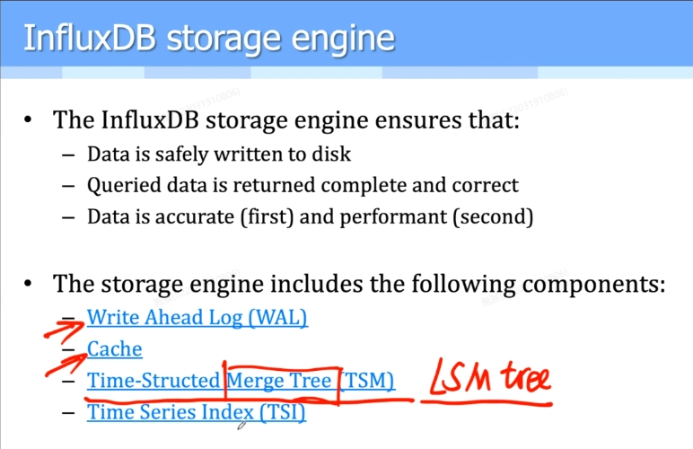

整体是TSM（Time Structured Merge Tree）结构，类似于LSM的结构。

###### 2.5.1 Writing data from API to disk

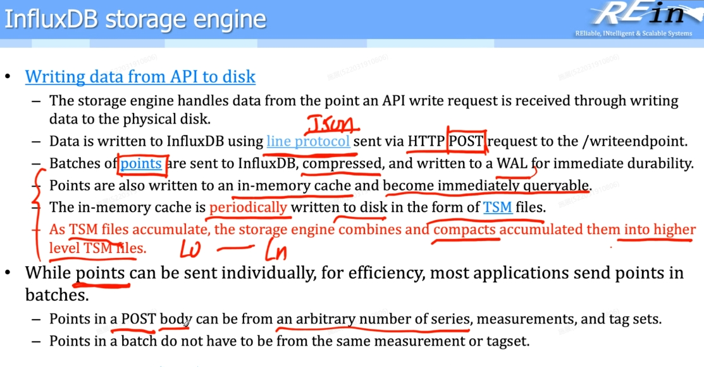

**关键概念：**

- **Line Protocol：**采用**Line Protocol**来将数据写入硬盘。它本质上可以视为一种“键值对 + 时间戳”格式。与JSON类似，但在序列化和传输时有特定的格式，旨在更高效地处理时序数据。之所以高效是因为InfluxDB提供了RESTful的HTTP接口来接收数据,通常使用`POST`方法提交数据到指定的写入端点（如 `/write`），数据在传输过程中以字符串（或类 JSON）形式封装，方便批量写入。
- **数据写入流程：**
	1. **客户端发送数据**
		- 通过`POST`请求将数据发送到InfluxDB，数据可包含一个或多个“点”（Points）。
		- **批量发送**：为降低网络和接口压力，通常会将多条数据（多个点）批量发送，而非单条单条发送。
	2. **接收数据与压缩**
		- InfluxDB接收数据后，会对相同或相似的部分进行简单压缩（如“相同数据只存一次，然后记录数据出现的范围”）。
		- **目的**：减少写入量，避免预写日志（WAL）迅速膨胀。
	3. **写入WAL（Write-Ahead Log）**
		- 数据在正式持久化到底层存储之前，会先写入**WAL**。
	4. **内存缓存（Cache）**
		- 查询可见性：只要数据到达Cache，便可被查询到（类似于前面介绍的 RocksDB/LSM Tree 的MemTable机制）。
		- 当Cache达到一定阈值或时间周期到达时，才会将数据 **刷新（Flush）**到硬盘。
	5. **持久化与 Compaction**
		- **多层存储（L0 ~ Ln）**
			- InfluxDB采用类似LSM Tree的结构，数据从内存落盘后会形成新的文件（如L0层文件）。
			- 随着数据量增多，文件会不断往更低层（L1、L2…Ln）合并，类似RocksDB的层级结构。
		- **Compaction（合并操作）**
			- 当某层文件数量过多或文件规模过大时，需要执行Compaction**将多个文件合并，删除或合并重复数据，生成更大、更有序的新文件。
			- 目的：减少文件数量、优化查询性能、回收无效空间。

###### 2.5.2 Write Ahead Log(Log)


**关键概念：**

- **顺序写入日志**

	- 当存储引擎接收到写请求后，首先将该请求写入预写日志（WAL）。

	- WAL采用顺序写的方式，将写操作记录（如新增或更新的数据）依次追加到日志文件中。

- **同步日志到硬盘**

	- 为确保数据可靠性，存储引擎会将预写日志刷新（Flush）到硬盘。

	- 只有当日志文件同步到硬盘之后，系统才认为该写操作有了“落盘保障”。

- **数据写入内存**
	- 日志同步完成后，存储引擎才将数据缓存到内存（通常是MemTable、Buffer Cache等），便于后续的快速读写和处理。

- **写操作完成**
	- 当WAL同步和数据入内存等关键步骤执行完毕后，存储引擎才向调用者返回“写操作完成”的确认。

###### 2.5.3 Cache

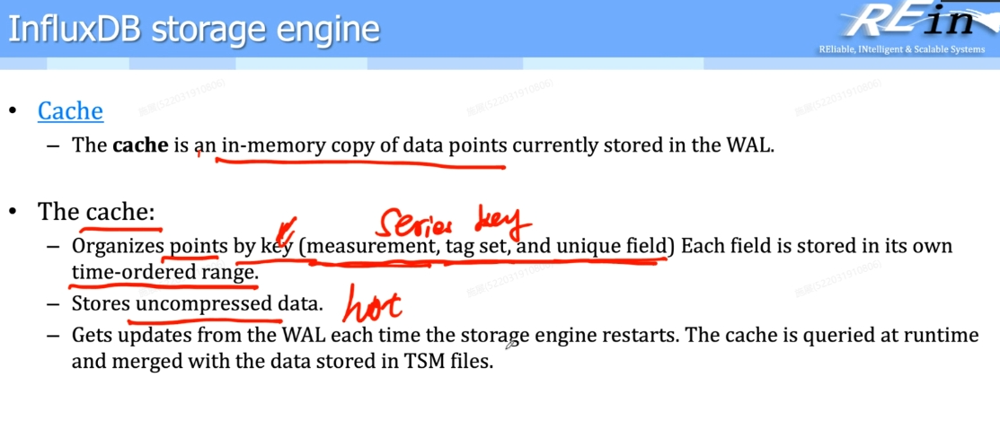

**关键概念：**

- **Cache 与 WAL 的关系**

	- 当写请求到来时，先将数据写入**WAL**（写之前可能先压缩），以减少对WAL的写入量和存储占用。

	- 随后，数据会被放入内存**Cache**中，方便快速访问与查询。

	- 在一定时间或空间阈值触发后，数据再从Cache合并落盘至底层文件。

- **Cache 中的数据组织**

	- **Series Key**：由**Measurement**、**Tag**以及**Field**等信息组成，标识了同一组数据在不同时间点的记录。

	- **按 Key 存储**：Cache以Series Key为单位组织数据，相同的Key会被汇总在一起。

	- **时间顺序排序**：在同一个Series Key下，数据按时间戳顺序排列，便于时序查询。

- **“热”数据特性**

	- **内存中不压缩**：Cache中的数据（最热的数据）为了保证快速读写，不进行压缩。

	- **快速访问**：由于在内存中，查询时对热数据的读取延迟极低。

	- **动态合并**：随着时间推移或数据增长，Cache中的数据会批量合并到更低层的持久化文件，腾出Cache空间。

- **合并流程（Compaction）**

	- **周期或阈值触发**：在达到设定条件（时间、空间）后，Cache中的数据被合并写回磁盘文件。

	- **RocksDB式分层**：底层文件采用类似LSM Tree的多层结构，通过合并操作（Compaction）维持数据有序并释放冗余空间。

	- **查询可用性**：在合并的过程中，Cache中以及合并后的文件都能持续支持查询请求。

###### 2.5.4 Time-Structured Merge Tree(TSM) & TSM files

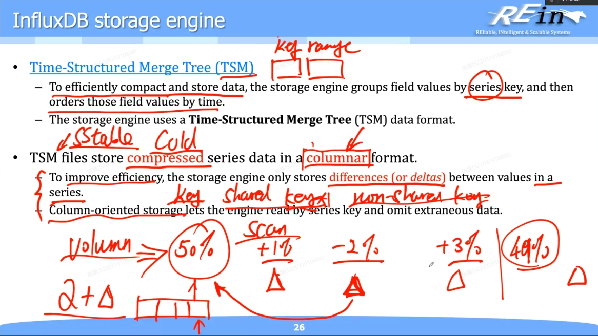

**关键概念：**

- **文件层次与合并（Compaction）**

	- **多文件合并**
		- InfluxDB的底层文件在写满或定期触发时，会进行合并（Compaction）操作，将多个小文件重新整理、去重、压缩后合并为更大的文件。
		- **按时间或按Series Key范围** 划分文件，合并时也会考虑Series Key的分布以便有序存放。

	- **数据“冷热”分层**
		- **写入Cache的数据**：视为“热”数据，未压缩，便于快速读写；
		- **落盘文件**：视为“冷”数据，进行压缩以节省存储空间；合并后再以较大文件形式存储。

- **列式存储(Column-Oriented Storage)**

	- **为什么采用列式？**
		- **典型时序场景**：频繁对某个或几个Field（字段）做分析或聚合，需要对单列进行大规模顺序扫描（Scan）。
		- **顺序读性能更高**：列式存储将同一列的数据集中在一起，便于大块读取。

	- **数据组织方式**
		- **Series Key**：由Measurement、Tag、Field等信息组合而成，标识同一“系列”数据。
		- **同一Series Key内部**：按时间顺序排列数据；多条数据打包在同一文件块（Chunk）中，并采用列式格式存储。

- **压缩与 Delta 编码**

	- **差值（Delta）存储**
		- 为降低空间占用，对数值型数据（如CPU利用率）通常只存储相邻记录间的“差值”（Delta），而不是原始值。
		- 基准点 + 差值：
			1. 先记录一个基准值（如50%）
			2. 后续每次只存“与前一次记录的差值”（+1%、-2% 等）
			3. 定期刷新新的基准点，减少误差累积。
		- **优点**：显著减少存储空间占用；
		- **缺点**：查询任意时间点的数据时，需要先找到基准点，再累计所有差值才能复原。

	- **列式压缩**
		- 同列数据往往类型和分布相似，更易采用高效的编码方式（如前几位相同，所以只存后几位、或仅存变化量），从而进一步降低存储量。

- **与 SSTable 的对比**

	- **相似点**
		- **日志结构**：写操作先顺序追加，后续合并（Compaction）生成有序文件；
		- **共享前缀/共享字段**：只记录差异部分，节省存储空间；
		- **按Key排列、分块存储**：可快速定位Key范围，提升查询效率。

	- **差异点**
		- InfluxDB主要面向时序数据，列式存储、Delta 编码尤为常见；
		- 一些传统的SSTable仍以行式或前缀压缩为主，未必都做列式拆分。

###### 2.5.5 Time Series Index(TSI)

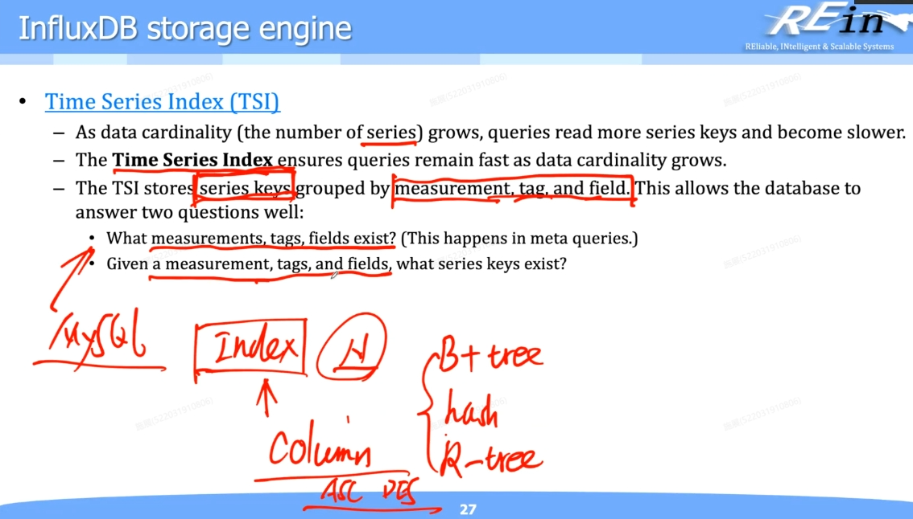

**关键概念：**

- **基于 Series Key 的索引**

	- **Series Key**
		- 由Measurement、Tag、Field等组成，用于唯一标识一组时序数据。
		- TSI主要围绕Series Key构建索引，用来快速定位具体时序数据。

	- **索引结构简化**
		- 在传统关系型数据库中，索引种类繁多（B+树、哈希、前缀索引、地理空间索引等），可自定义多列、多种排序方式。
		- 时序数据库（TSDB）则不需要如此复杂的索引结构：
			1. 时序数据查询模式相对固定，多基于 (Measurement + Tag + Field) 的组合。额外索引（如多列任意组合）意义不大，且会增加索引维护成本。
			2. **只需维护Series Key索引** 即可快速查到相应的时间序列。

- **查询过程示例**
	- 指定 Measurement、特定 Tag 或若干 Tag、以及需要读取的 Field。
	- InfluxDB 通过 TSI，先找到满足 (Measurement + Tag + Field) 的 **Series Key**，再返回对应时间序列。

- **对比关系型数据库索引**

	- 关系型中的灵活索引
		- 可以任意指定单列、多列、前缀、顺序等，甚至支持空间索引。
		- 查询模式更加多变，需要更通用的索引策略。

	- TSDB 的简化模式
		- 查询模式围绕时序和少数固定字段，索引只需简单且高效地支持 (Measurement + Tag + Field + Time)。
		- 数据库内核也无需维护大量复杂的索引结构。

#### 2.6 InfluxDB file system layout

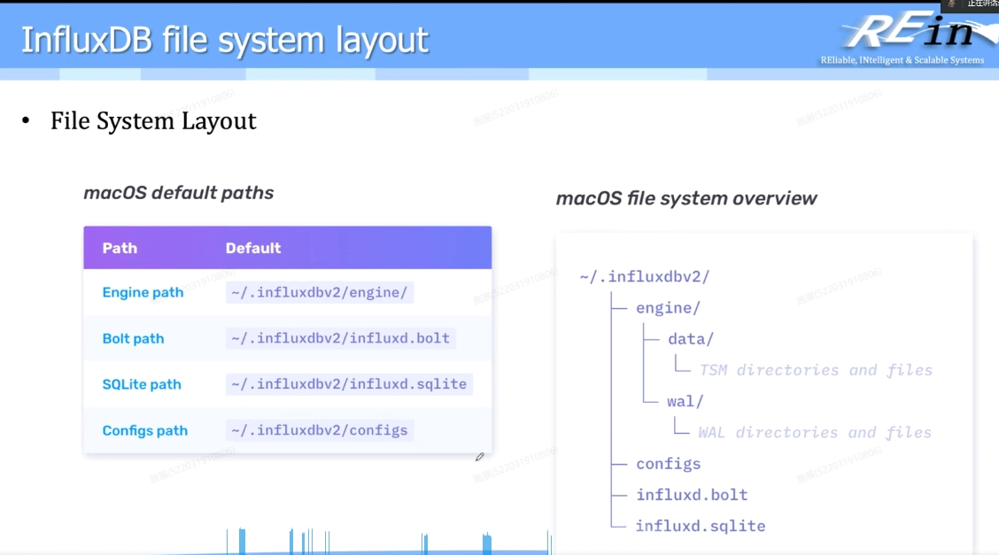

#### 2.7 InfluxDB shards and shard group

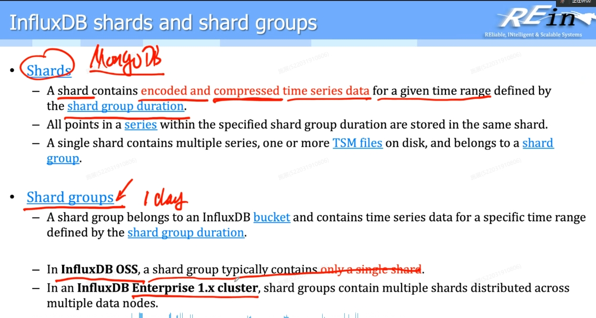

**关键概念：**

- **Shard 与 Shard Group 的定义**

	- Shard：
		- 时序数据在硬盘上的基本存储单位，通常已经经过压缩和编码。

	- **Shard Group：**
		- 对特定时间范围的数据进行分组管理的逻辑单位。
		- 例如，可将**1 天**定义为一个 Shard Group，再细分出若干个Shard（企业版）；在OSS中，每个Shard Group仅包含一个 Shard。

- **时间范围（Duration）的配置**

	- Retention Policy（保留策略）
		- 指定数据保留的总时长，例如保留4天的数据，超过4天自动删除。
		- 也可设置为 “forever” 不自动删除，具体视业务需求。

	- Shard Group Duration

		- 例如，可将 “1 天” 作为一个 Shard Group 的持续时长；在此之下再根据需要划分 Shard（如1小时一个 Shard）。

		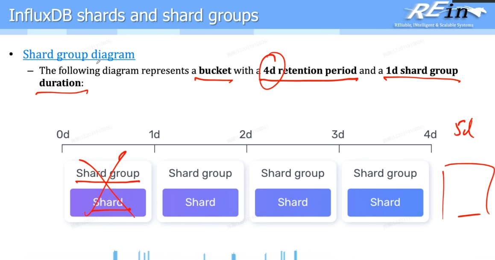

		- 当新的时间段开始时，自动创建新的Shard Group并删除过期的旧Shard Group（由 Retention Policy 决定）。
		- **Precreation（预创建）**：可提前创建未来时间范围内的Shard Group，避免在数据刚到来时再去建Shard Group耗时。

	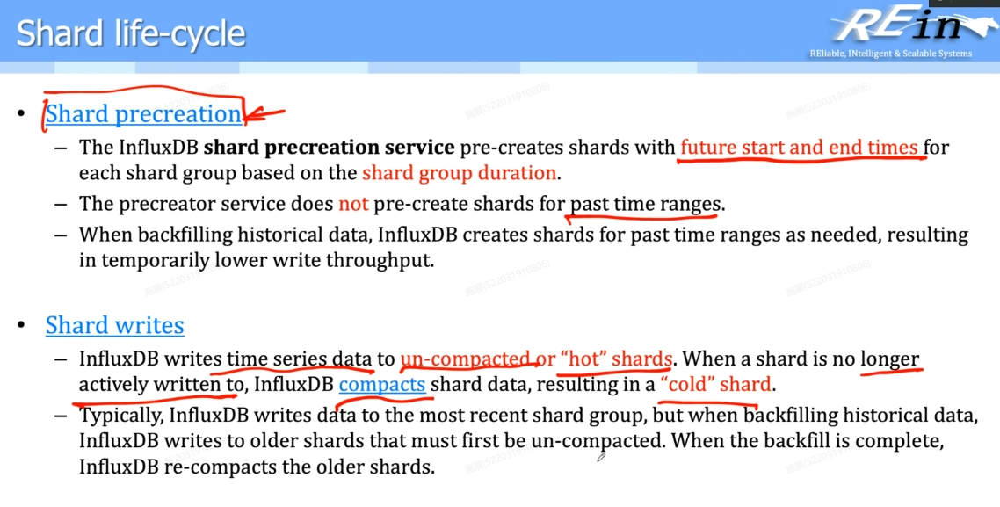

- **数据“冷热”分层与写入流程**

	- 最新写入的数据
		- 位于内存缓存（热数据）或刚创建的Shard（活跃 Shard），此时往往尚未压缩，利于快速写入和读。

	- 压缩与落盘
		- 当 Shard 不再是活跃状态，数据落盘后会进行更强的压缩（TSM 文件），减少存储空间占用。
		- 落盘后的 Shard 即可视为相对“冷”的数据，未来只读不写，便于在时间到达后直接删除。

	- Compaction（合并）
		- 采用类似 LSM Tree 的多层结构（L0/L1/L2/...），数据批量往下合并，减少文件数量并整理数据。
		- 每一层比上一层存储容量可大一个数量级，默认配到 L4、L5 即可满足相当大的数据规模。

	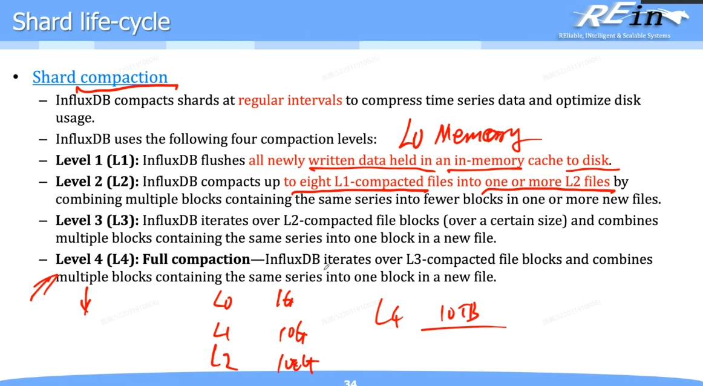

- 自动管理与删除机制

	- 自动删除旧 Shard
		- InfluxDB 会根据 Retention Policy **周期性地**删除过期的 Shard Group，无需人工干预。
		- 例如，保留 4 天的数据：当第 5 天开始时，创建新 Shard Group 的同时，删除第 1 天的 Shard Group。

- 与传统数据库的区别

	- 传统数据库通常需要用户手动指定何时删除或归档数据；

	- InfluxDB 面向时序场景，系统自动完成旧数据的删除和新Shard Group的创建（都在配置文件中设置）。

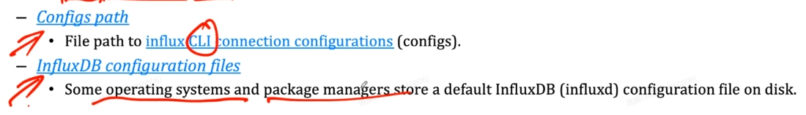

# gaussdb

# GaussDB技术架构
GaussDB基于Postgrade SQL9.2版本写成，但是后期做了一些改进，例如把原本的单机改成了分布式，多进程变成多线程，总的来说是做了分布式优化。分布式会遇到两阶段（2-phase）提交的问题，如何知道某个数据能否提交？第一阶段先做prepare，问系统能不能提交，第二阶段才做提交或者回滚，做了一个决策，所以他做了一个很复杂的分布式事务，然后在上面又做了分布式的优化。例如用户给出一个SQL，在用户不知道分布式存储的情况下，GaussDB做了关系运算的优化。  
GaussDB的最底层做了一个分布式共享存储，所谓的分布式共享存储，是对用户来说是一个数据库，用户感知不到分布，所谓共享，就是实现了存算分离（存储和内存分离）。在单片机中有DMA的概念，基于这个想法，把所有节点的内存单独拿出来，凑成一个分布式的盘存，再把硬盘全部拿出来凑成一个网盘，如果支持一个机器上的内存去读另一台机器硬盘上的数据，就实现了一个remote DMA。云数据库把所有机器上的内存组成一个大的内存，所有的硬盘组成一个大的网盘，做了一个内存和存储，即磁性化存储和顺式性存储的分离，那么看起来就是一个特别大的机器有特别大的内存和特别大的硬盘，那他的数据保温性能就会提高。
## 具体事务管理有
1. 分布式的近数计算，就是我们的处理应该靠近数据（靠近存储数据的那一层），在前面的样例中就是计算节点，这样能提高执行效率
2. 全链路并行编译执行，也就是把语句先编译一下，把参数填进去执行，相比SQL语句的解释执行要快
3. 大规模并发事务处理。
## 具体分布式优化
1. 一个SQL语句过来先解析生成query plan，把原先的写的不好的地方优化一下再执行
2. 第一个可以给一些固定死的优化的规则，不管SQL是什么情况都基于这个规则去做（RBO）；第二个是基于代价，即需要评估现在的这个SQL语句读取的硬盘或者网络传输的代价（CBO）。
3. hint，即用一些类似于annotation的东西，去告诉query plan的优化器大概可以怎么做，去生成一个更好的东西。
4. 计划管理
5. SMP，用对称的多核的机器做并行处理
6. 相比Postgrade新加了线程池
7. 向量化，在数据存储的时候可以有行存也可以有列存，可以一次读取一列上面的多行的数据。     
其余的还有（上课没讲但是PPT上有）段页式，Paxos，增量检查点，ACID，AStore，UStore，CStore，MOT。HTAP：行列混合存储（OLTP），智能行转列（OLAP）
## 多层级高可用容灾
一般在单机的时候不会考虑，但是这里的容灾包括了多地多活的容灾，一般是两城三中心，就是在两个城市里面有三个数据中心，他们互相之间备份。
## 云原生弹性伸缩架构
即假设当在线人数很多，请求数很多，数据存储不下了，需要做在线的弹性伸缩，一般分成两个方向，纵向是多分配给原先的机器、原先的实例一些计算资源，横向是原先只有一台机器，现在新加一台机器，变成一个集群，这里纵向横向都可以做。有云原生分布式计算存储分离，把内存层硬盘层CPU层变成三个集群，合起来看就像是一台超级计算机在运行，这样引申出了负载均衡、分布式多写多读、多租户（这个等会展开来讲）
## 智能优化
这里有一个很重要的ABO优化器，是之前RBO和CBO的一个补充，全拼是AI Based Optimize，意思就是无论是代价的评估还是启发式的选择，都可以通过AI方式以及生成式的AI来帮忙处理，因此内置了AI引擎，内置了实现好封装好的算子，例如矩阵乘法或者神经网络的前馈或者反向传播
## 安全隐私保护
利用了区块链来防篡改，区块链是非对称密钥的应用

# GaussDB分布式架构
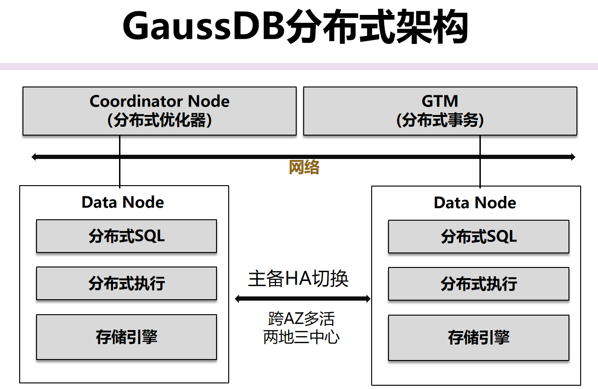  
分布式优化器（Coordinator Node）协调所有的Data Nodes，真正存数据的节点，协调数据一致性以及做事务的时候向两边提交的事务。全局分布式事务（GTM）做事务管理

# GuassDB分布式优化器
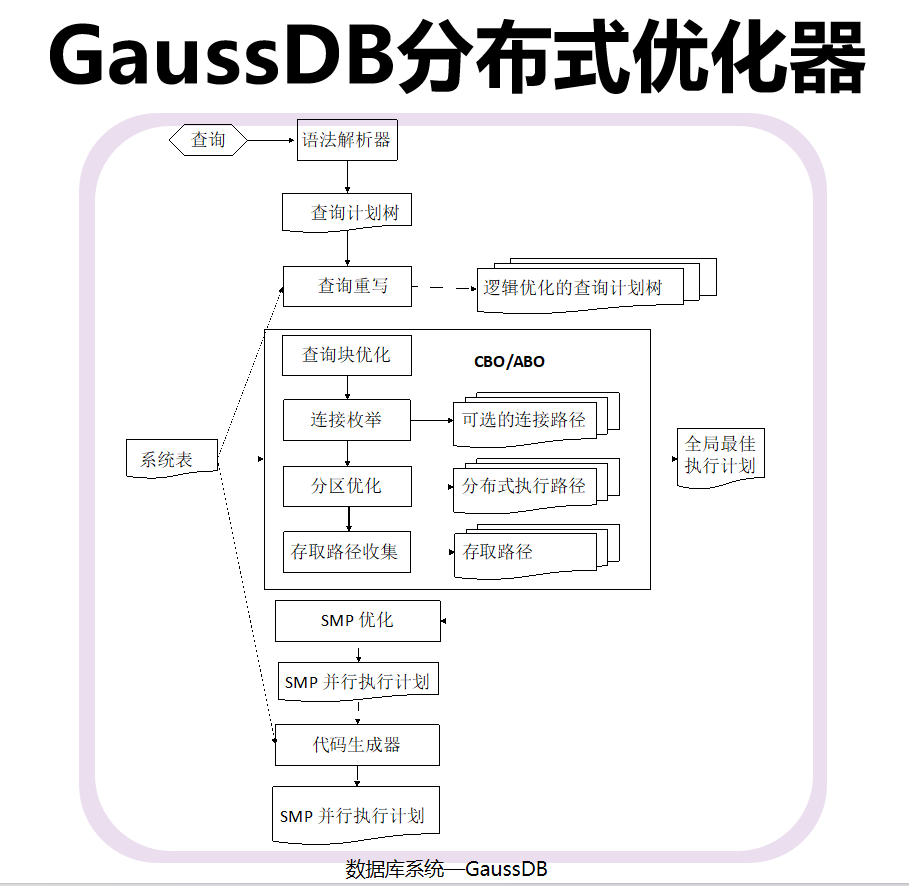
## 查询重写
目的是根据底下的分布式的存储状态、底下机器的定形的优化和对称的多核处理器的优化，改写逻辑优化的查询计划。  
数据库最后逻辑优化出来的查询考验数据库的能力，例如同样的一个查询在不同数据库优化后的查询树执行一下，看看执行效果。但是有些种类的查询可能在某些数据库上查询较好，但是另外一些又反过来，也就是说，目前没有一种优化器，对于所有的优化，都做得比别人好，原因是优化器的过程很多是顾此失彼的。这张图上还只是传统的RBO和CBO，那么有些数据库可能封装了更多AI算子，那么效果可能更好。  
还有一个要注意的地方是要做好一个平衡，例如假设不优化需要1s，优化过程需要800ms，优化以后需要执行500ms，看起来优化了一下时间缩短了一半，但是不是看起来很高级的算法一定能做出一个很好的结果

# GaussDB分布式并行执行
1. 前提条件是任务必须满足批处理的结果，也就是大家并行做出来的结果合并以后就是最终结果，后面讲到Hadoop的时候会讲到这个问题，这就是多机多线程并行执行。  
2. 向量执行很像python里面的维度拓展，对于一个多核处理器，每一个核都能处理一个列里面的一个值，那么处理一个向量和处理一个单独数据消耗的时间是一样的，那么这里就支持单条指令中多个数据的处理。  
3. 由于底层虚拟机（LLVM）使用的时候可以像流水线一样加载一些指令，因此可以编译执行

# GaussDB两地三中心
同城两中心，异地有一个第三中心作为容灾机群，除非两个城市的三个中心都出现问题了，数据才不能用。这里三个中心中只有一个DN是主节点，其他都是备份节点，需要进行同步操作（CSE中的）

# GaussDB多租户
当同一个实例给不同人用，提出的不同的需求应该怎么办？方案一生成不同的数据库，方案二是大数据控制，方案三是在后面新加的字段标注是哪个用户的，每个用户只能看到自己加上去的字段，方案四，把列转成行，后面新加的数据用行存，每一行分别存主键、新加的字段以及对应的值，缺点是可能表很大，但是后三种都实现了多租户。GaussDB可以选择用哪种方式实现。现在的数据库可以支持底下芯片的异构，然后以统一的方式去维护

# GaussDB优化处理
RBO：根据启发式规则进行优化，即现在全局可能有一个最优解但是目前找不出来，然后通过一定的方式去计算，例如牛顿切线法以及贪心，按梯度走。还有一个元启发，就是在原先找到的局部最优下，冲出去一点找有没有新的局部最优，也就是说可以确立一个新的起点  
CBO：这里的代价包括读取的列数、行数（IO开销）、通信开销、CPU开销等等，包含了好几部分，然后基于AI模型估计这个代价是多大，还有统计信息：表级别的有总元组数、总页面数，列级别的有空值率、不同的值有多少。

# GaussDB计划生成
主要采用自底向上和随机搜索相结合的模式

# GaussDB存储
## 追加更新
主要是行存（追加更新行存、原位更新行存）和列存，还有智能化的互转，并且内存可以做数据全内存的存储，就像自带Redis。
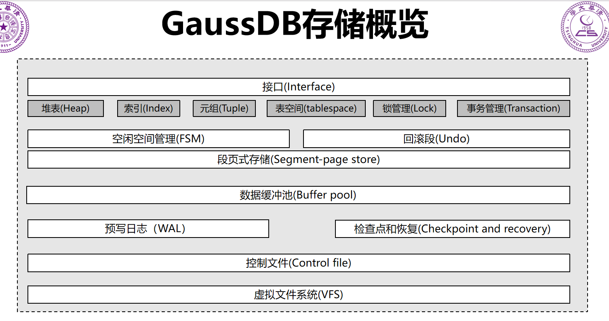
堆表主要是三层大根堆，用于管理内存的空闲空间。在数据插入的时候需要高效找到空闲空间足够的页面，插入数据后还要能够高效更新页面的空闲空间大小
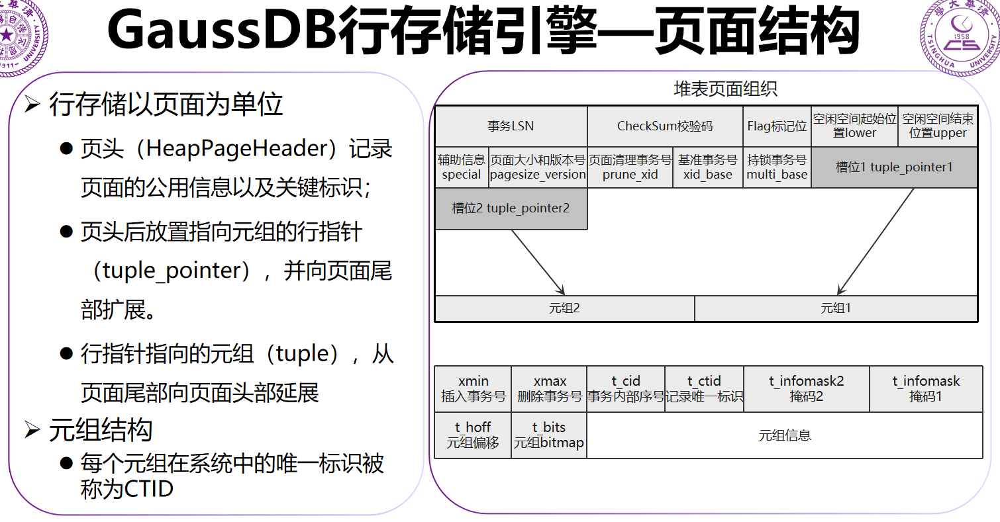
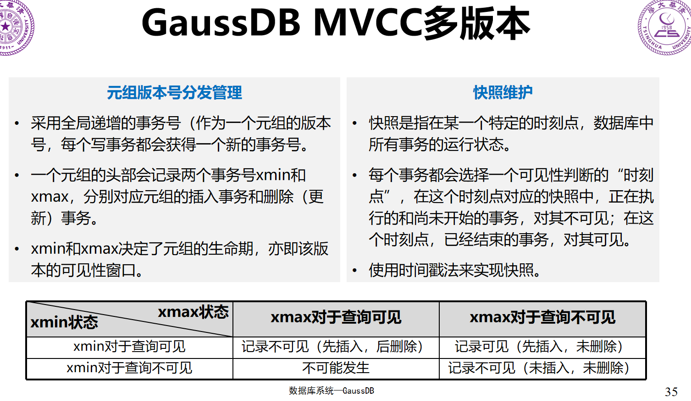
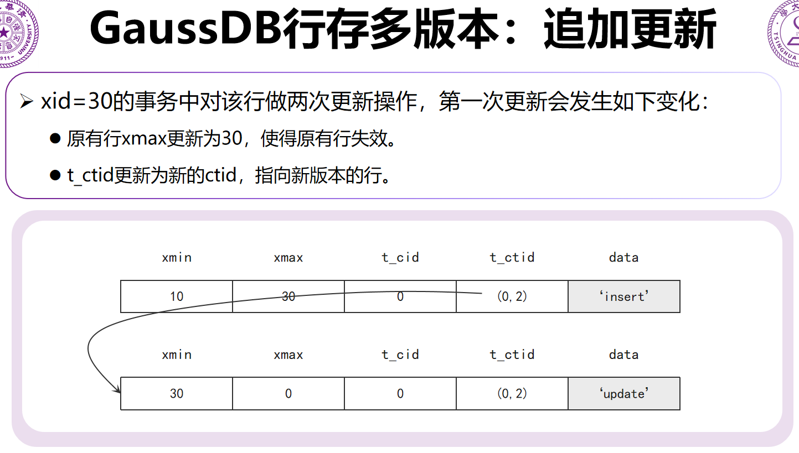
追加更新中xmax=0表示该数据仍然有效，t_ctid表示该数据失效后应该找哪条数据
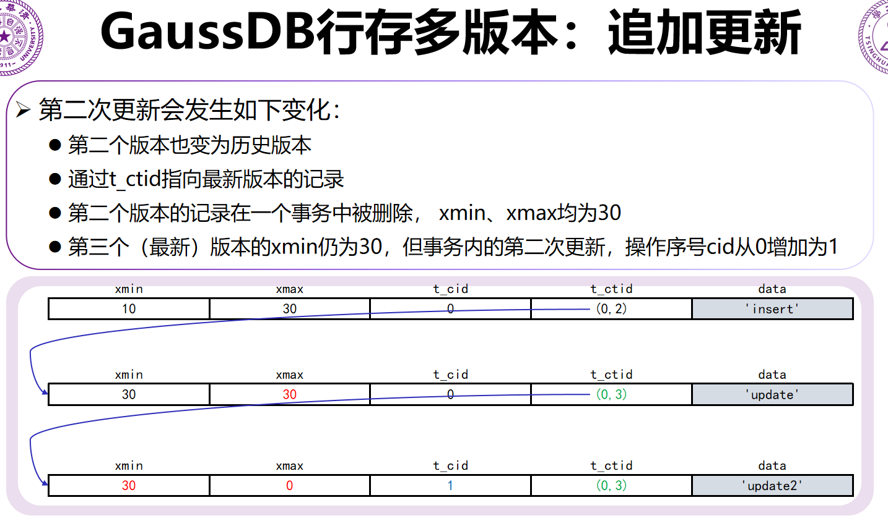
每个事务有一个单独的事务状态存储区域，记录了该事务的状态信息和提交顺序号（CSN）。每个非只读事务的事务号为XID，在事务提交时会增加CSN取值。  
CSNLog：记录XID与CSN的映射关系，为每个事务生成一个唯一递增的CSN，用于将事务与其可见性进行关联  
Clog：记录事务ID的运行状态：运行中/提交/回滚。当事务结束后，使用CLOG记录是否提交，使用CSNLOG记录该事务提交的序列

## 原位更新
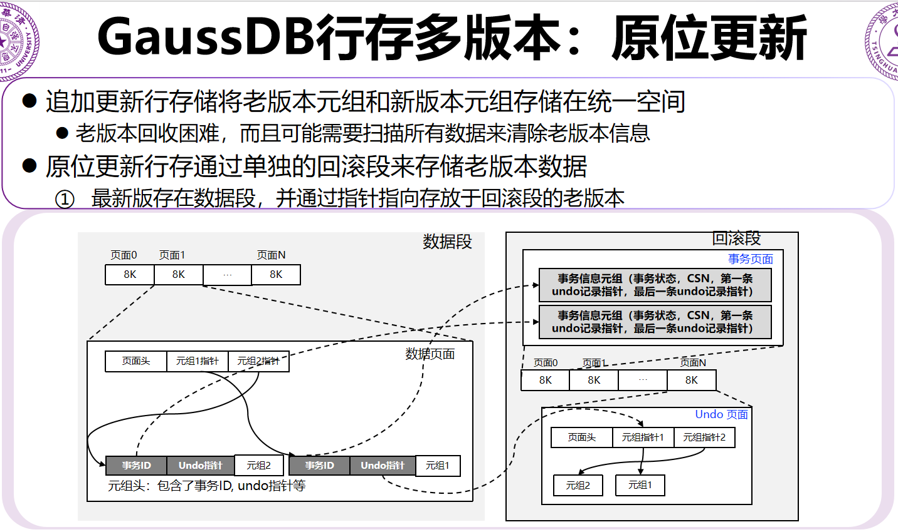
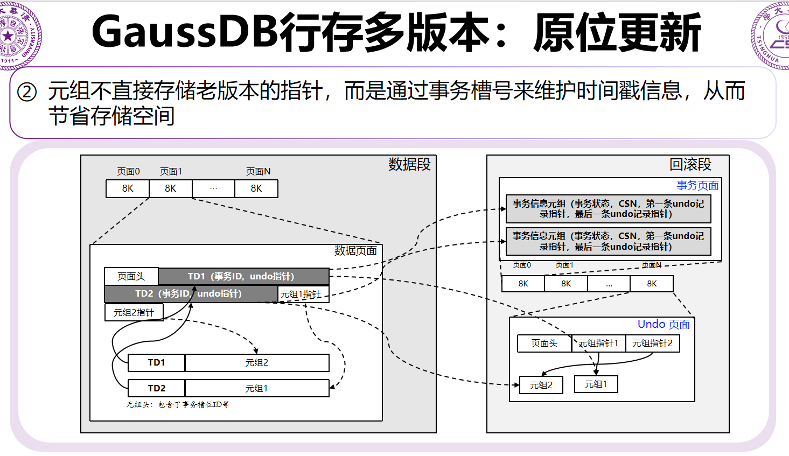
优点是保证数据段紧凑并且不用做多版本控制，因为各有优劣所以GaussDB两个都支持，行存储索引用的是B+树  

## 缓冲区
GaussDB对事务的读写请求，都会被先传递至共享缓冲区。请求页面利用Ring Buffer操作批量读、批量写、以及页面清理，会先在缓冲区搜索该页面，如未命中，则获取一个空的槽位（可能需要淘汰掉缓冲区中不常用的页面），再与文件系统进行交互将所需页面读到槽位中，加锁并使用。高并发Hash table：采用分区锁避免读写hash table冲突。  
Buffer页面的冷热管理
1) buffer ring策略:  避免顺序扫描读取页面导致大量淘汰温热buffer
2) never evict策略：基于规则避免页面被淘汰
3) LRU策略：识别冷热页面，提高buffer命中率
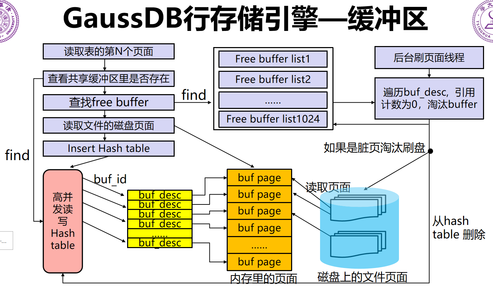

## 并行日志系统
事务提交仅保证事务相关的预写日志WAL持久化完成，WAL模块在内存中维护了WAL缓冲区用于各个事务的WAL日志并发写入缓存区，提高性能。后台刷WAL日志线程需要顺序从WAL 缓冲区读取WAL日志完成持久化。在每个事务提交之前，需要判断已经刷新的WAL LSN是否已经包含了本事务的WAL。用全局的锁控制多进程输入。

## 列存储
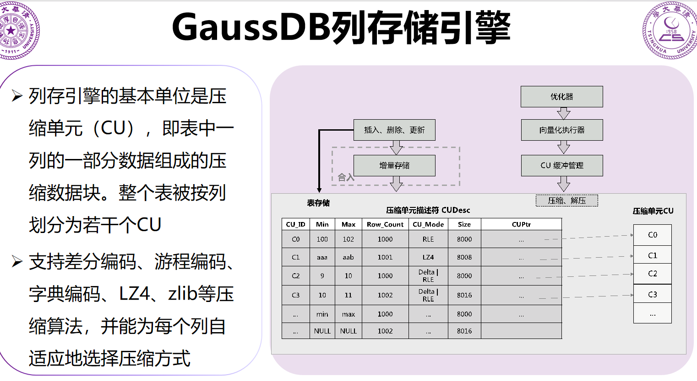
为了管理列存表的CU，列存储引擎使用压缩单元描述符（CUDesc）表来记录CU的元信息。CUDesc的一行对应一个CU，记录了CU的事务时间戳信息、大小、存储位置等信息。  
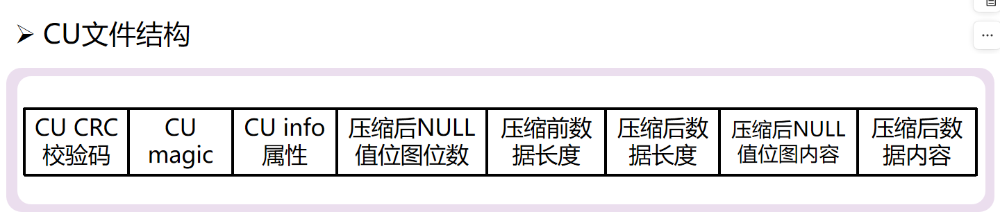
列存储的B+树索引:与行存类似，列存B+树的索引页面上存储键到ctid（页面号，元组槽位）的映射，ctid记录的是CU的编号，还需要通过CUDesc进一步查找。  
列存储的稀疏索引：CUDesc存储每个CU中数据的最小值和最大值。读CU前可以根据查询条件进行判断，如不在不在最小值和最大值之间，则可以不读取该CU，大量减少I/O的开销。  
列存储的聚集索引：不同CU间最小值和最大值的区间有大量交集时，稀疏索引可能无法提升效率。聚簇索引对部分区间内的数据排序（一般区间会包含多个CU），由此减小CU之间数据的交集，使CU内部的数据有序，提升CU文件本身的压缩效率。

## 内存引擎
类似于Redis，支持全内存态的数据存储与事务处理。  
低延迟（Low Latency）：提供快速的查询和事务响应时间。  
高吞吐量（High Throughput）：支持峰值和持续高用户并发。   
高资源利用率（High Resource Utilization）：充分利用硬件。  
具备并行持久化、检查点、高可靠、免锁事务管理、免锁索引等能力。  

采用外部数据封装器FDW（Foreign Data Wrapper）方式将内存引擎插入数据库。数据可以是外面的数据，拉进来之后经过格式转换，变成内存里的数据存储。  
这些都是为了HTAP的数据支撑，既支持OLAP又支持OLTP

# GaussDB分布式事务
全局事务管理器GTM处理全局时间戳请求，即CSN（Commit Sequence Number，待提交事务的序列号，是全局递增的一个变量）。  
首先，获取本地最新的CSN和准备阶段事务号，如果CSN状态为“提交中”则进行等待，如果row.CSN < localsnapshot.csn || xid in prepared_xid list可见，否则不可见。
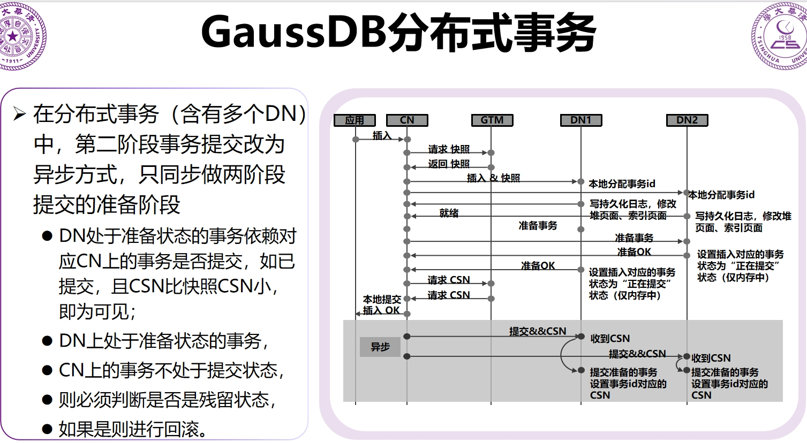
只要在第一阶段达成了一致，事务就可以结束，去做其他事情。  
判断事务的发生的先后需要用高精度的时钟，例如北斗这样的卫星，对所有的服务器进行定位。分布式系统一定要有一个统一的授时单位，目前可以用北斗

## 查询优化
传统汇聚分布式：假如节点1和节点2的数据需要合并，那么需要这两个节点把数据推上来进行合并。  
协调节点旁路技术：把节点1和节点2的数据在处理的时候保证在同一个节点上，但是很难。  
数据节点自协同的流式计划：最好情况是两个节点内部各自做大量的计算，然后有少量数据进行节点之间的互相访问，最后两个节点的结果在协调节点合起来就是最终结果。只需要t2的分区和t1的分区相同即可。如果不同，有两个方法。如果表2比较大，直接做一个重分布，但是会比较费时，因为需要有数据的移动和传输。表2比较小的话可以把数据广播到其他所有节点上，那么表1所在的节点也就能接收到数据。分布式的优化就是不要在节点之间传大量的数据。  
生成分布式物理计划时，会考虑数据是否处于同一个数据节点，如果不是，那么会添加相应的数据分发算子。根据分发算子的数据量以及网络通信开销， GaussDB优化器计算计划的代价，并根据代价从中选出最优的物理计划。  
云原生中这些节点之间都是通过高速网络连接

# GaussDB云原生
分布式计算存储分离：计算与存储解耦，实现计算资源池和存储资源池独立扩缩容，分层弹性。  
存储节点按需回放: 存储节点实现日志回放，大幅减少计算节点和存储节点带宽压力。我们做的所有操作都记录到日志里面，提交操作到哪个节点上都是透明的，崩了之后可以在其他地方利用这个日志回放成跟原先一样的数据。  
数据预分片: 结合底层分布式存储，实现数据预分片能力，不用每一次数据进来的时候再分片。缩短扩容时间，实现业务平滑扩容。  
哈希桶聚簇存储：把表文件拆分为多个分片，采用一致性哈希算法，扩容时，只需重分布少量数据可实现扩容。  
映射表并行迁移:  用户数据不迁移，仅迁移少量元数据映射表，实现数据在数据节点的重分布，达成扩容目标。  
全局回放点计算：收集所有备机回放进度，计算全局一致性点，即协调节点。  

# GaussDB高可用
生产集群，热备集群：实时备份的集群，一个请求同时发到主从集群里面，对用户来说切换时间几乎是0，丢失的数据也几乎是0（RPO=0），但是也浪费资源。暖备集群，收到请求但是不执行，等到生产集群的结果出来再备份，如果这个时候生产集群崩了就备份失败，会要求重发一次。冷备集群是周期性的进行备份，为了防止发现很长一段时间崩掉无法备份，通常很短的时间进行一次主从切换（例如5min）。

# GaussDB安全全景
1. 攻不破：攻击进来首先要做一个模式的识别，知道是不是攻击，然后检测是不是有威胁，有没有异常行为，防止一些恶意代码的注入（例如脚本）
2. 进不来：指我也不会去攻击你，用公私钥对、黑白名单、第三方如KerBeros进行认证
3. 拿不走：做权限设计，基于决策、基于访问权限的设计，能做到行级别的
4. 看不懂：数据脱敏，动态或者静态的脱敏，做一些编码和数据一起输入。数据加密，首先很难解密，其次就算解密了，修改以后没有私钥也保存不了，改了也没用。一般用的都是非对称密钥（包括SSL）
5. 改不了：用账本数据库机制，核心是区块链
6. 赖不掉：因为有log的存在，每次操作都会记录下来，抵赖不了，包括语句审计，用户审计，数据库水印等
7. 信得过：通过了一些第三方认证，例如GDPR，CC认证


并行执行:
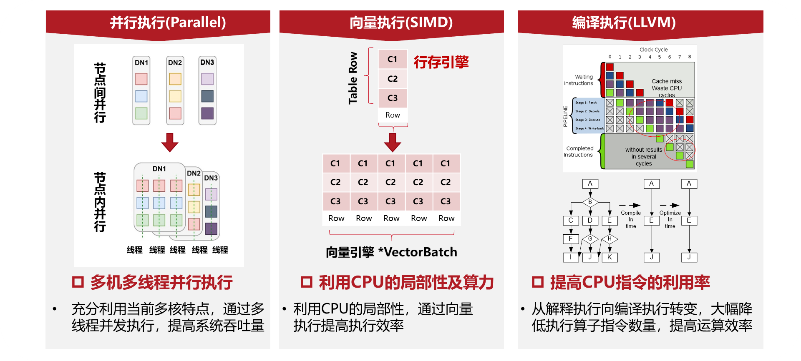
两地三中心高可用:
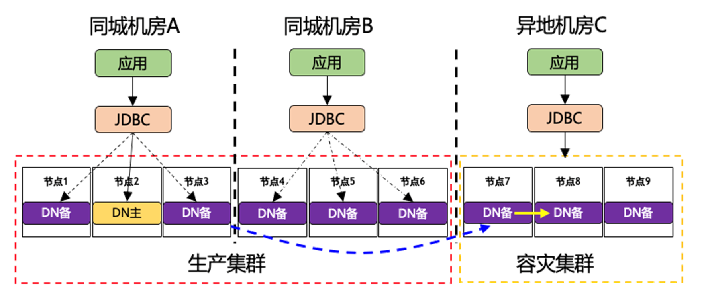
云原生架构:
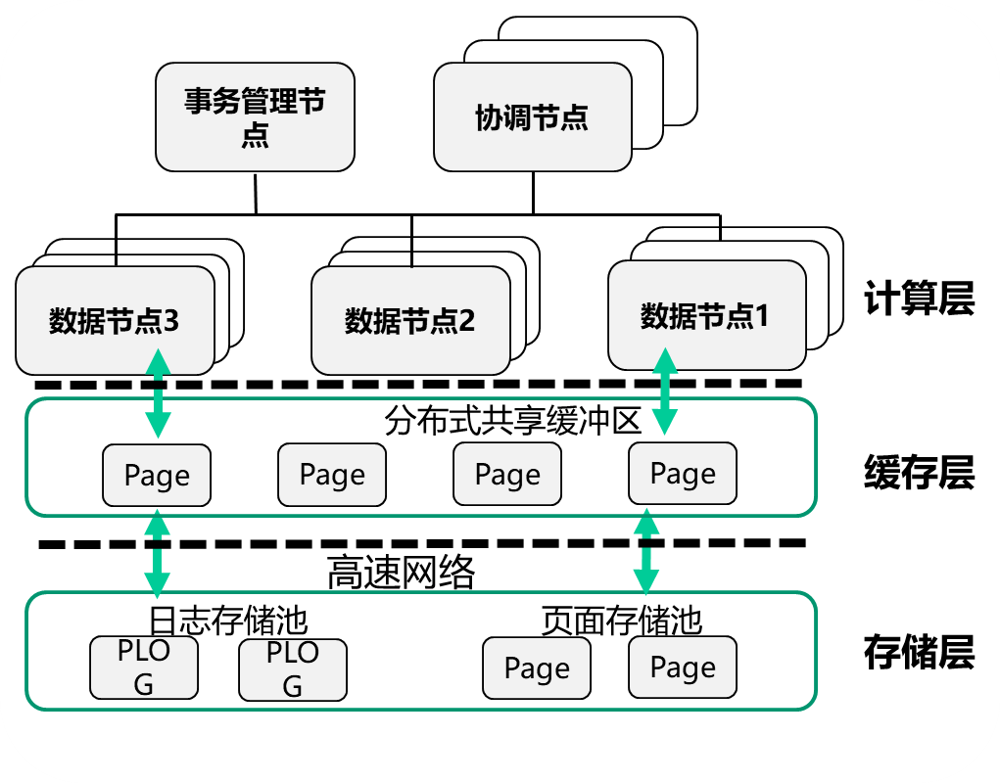
多租户:
只有一个数据库实例可以服务多个用户。

查询优化:

查询重写: 

谓词下推: where造成的join能不能在底层节点做

代价估计:

行多版本:
1. 追加更新
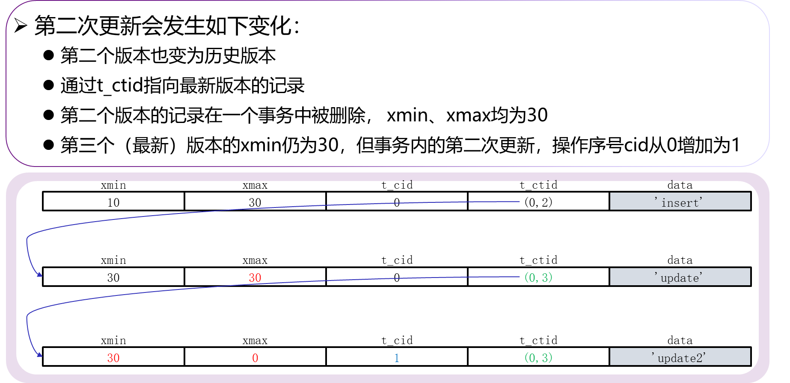
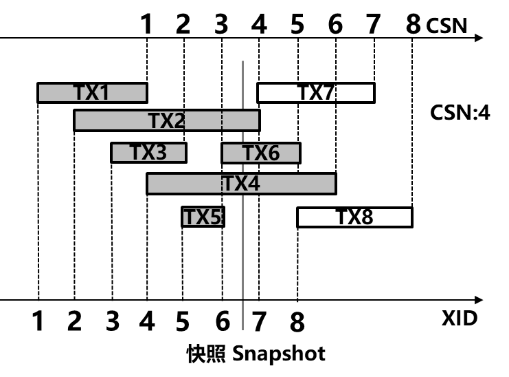
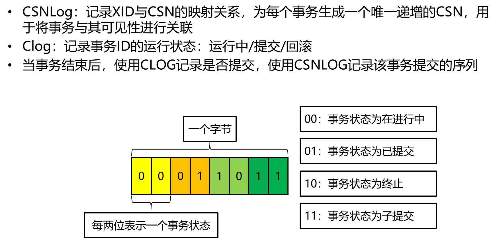
2. 原位更新
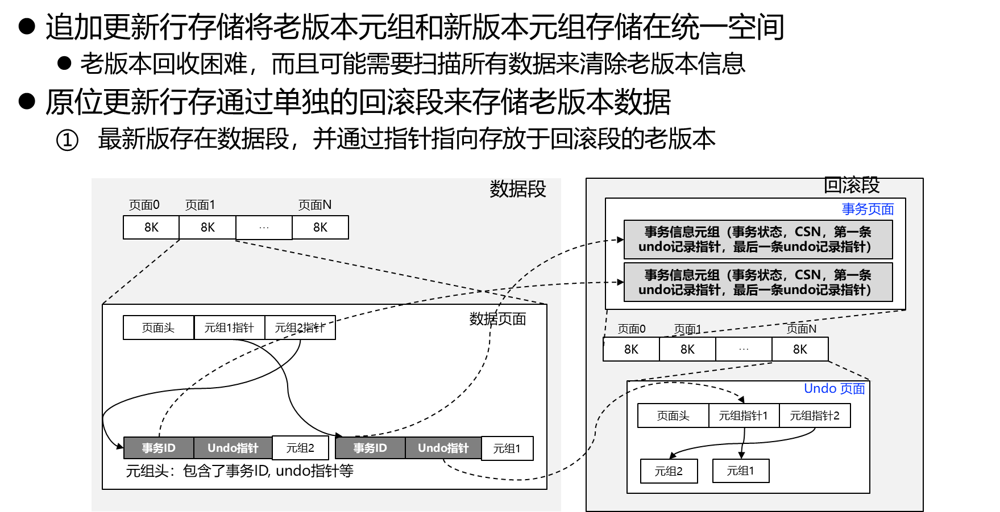

空闲空间管理:


缓冲区:

并行日志系统:...

列存储:
压缩单元(CU)，查分编码等压缩方式

内存存储: 外部数据转存器

HTAP负载透明路由
    OLAP
    OLTP

分布式事务CSN

分布式查询优化
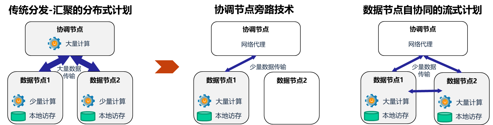

最后的效果就是尽量每个join操作避免数据传输
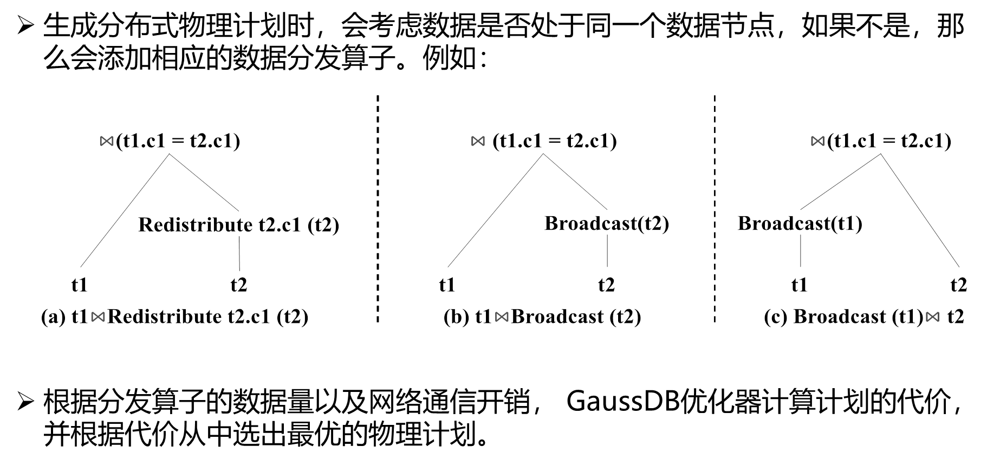

云原生
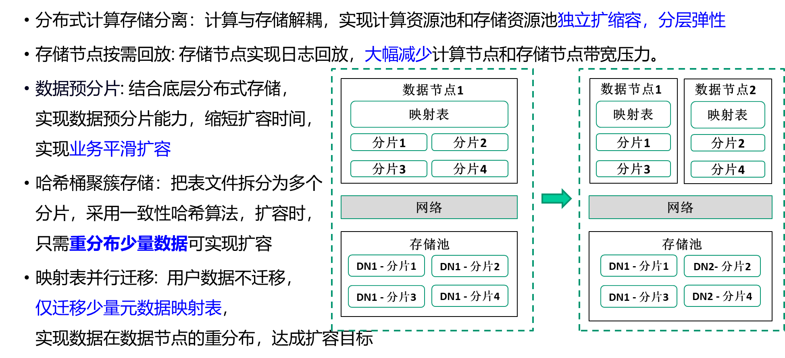
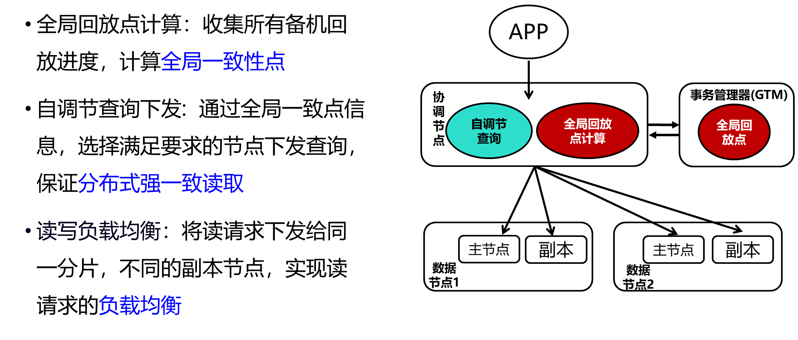

安全
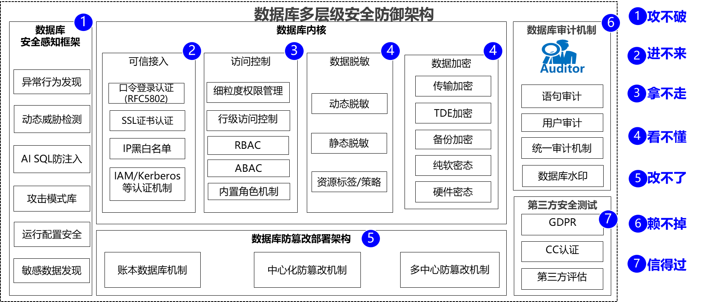

# Data Lake

flink -> DL metadata

SQL query -> DL -> mongo query, sql ...
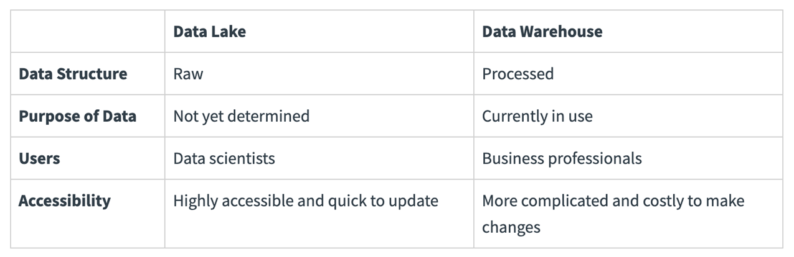

流式处理: 一个字一个字输入
批处理: 处理一大段
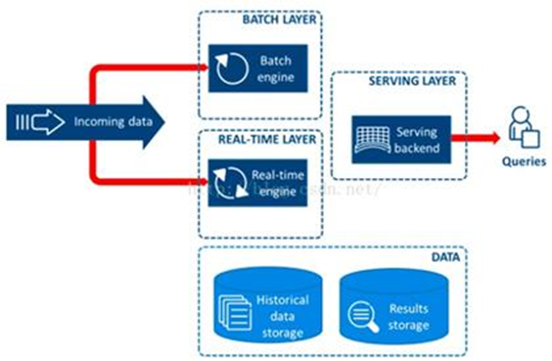
统一处理: 每给一大段
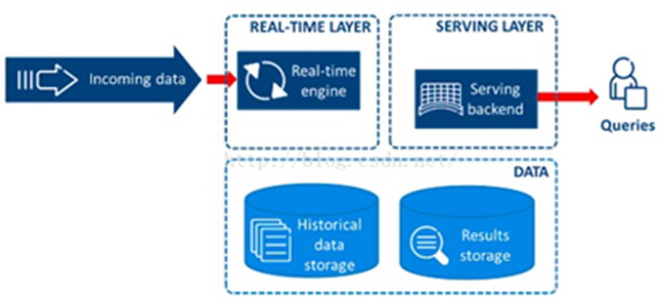

之前的数据库例如MongoDB、InfluxDB都有云数据库，注册一个账号就可以用，但是现在有一些不同数据库里面的数据，需要放到一个系统里面，未来要做OLAP。那么就有一种软件叫做Dataware House（数据仓库），作用是接一些适配器，每个适配器负责一个数据库的数据读取，读进来以后放到一张表或者一个立体一样，将来分析的时候直接在这个多维的数据表上面分析。但是在这个分类读取和整理的过程中耗费了大量的代价，一般都要经过三个过程。E（extract），把数据从原始的表里面提取出来，T（Transform）把原始的数据转换成统一的单位，L（Load）加载到统一的表里面，如果原始的表很大就会非常耗时间。但是假如不知道什么时候对于这些数据进行分析，那么只需要把这些数据存放下来即可，等到需要分析的时候再去做ETL，那么数据湖就是解决这样一个存放数据的问题。  

数据湖是一个存储池，**存的时候没有ETL的操作**，就是按照数据原来的格式，一般来说是图文件或者较大的文件，还需要有一个元数据去描述它的格式。里面包含结构化的数据，也可以是非结构化的数据。  

湖的前方会有一个类似于Flink这样的工具，把数据接入进去存放进去，然后配一个metadata描述他在干嘛，要访问的时候先去读取metadata，看是什么格式，是不是自己要的，找到之后再去做ETL。  

但是假如用户的Query语句设计了MySQL和MongoDB两个数据库的内容，需要在元数据里面发现操作的数据集是这两个，要把SQL语句转化为这两个数据集的调用，但是有专门的工具，例如calcite。  

# Delta Lake
数据湖里面有几个不同产品。最常用的叫Delta Lake，它支持各种结构化、半结构化、非结构化的数据类型，可以高速接入各种类型数据并且保真存储，原来的格式是什么就存什么。它的处理可以是实时处理也可以是批处理，可以用SQL或者第三方的语言去进行分析。分析的方法是把所有数据转成统一的格式，例如Parquet这种二进制格式，几乎所有数据库都支持把他们的数据转换成这个格式，那么也就是说，它可以成为一个数据交换的一个标准。

# 数据湖和数据仓库的区别
|   | 数据湖  | 数据仓库  |
|---|------|------|
| 数据格式 | 原生的 | 经过处理的 |
| 数据使用时间 | 不是现在 | 现在正在使用 |
| 用户 | 数据科学家 | 商业处理 |
| 能力 | 高可用性和可更新性 | 更复杂、修改更花时间 |

# 演化历程
HDFS（集群）->YARN（分布式计算框架）->数据湖  
HDFS批处理无法满足实时性要求高的场景，因此产生了lambda架构“流批一体”。流是源源不断的，因此需要加一个实时处理的层，filter必须马上过滤完，在原先的批处理引擎上增加了流处理引擎，形成了lambda架构。进来的数据既可以以流的方式处理，也可以以批的方式处理，最终都放在一个统一的数据存储的地方。对外服务的时候也有流处理和批处理两种方式。  
现在对流处理划定一个时间窗，对这个时间窗内的内容进行统一处理，那么在每个时间窗内就是一个批处理，那么流处理就可以按照批处理的方式去分析，无非就是调整时间窗的大小，那么只需要一个批处理引擎就可以实现流批一体。

# 架构
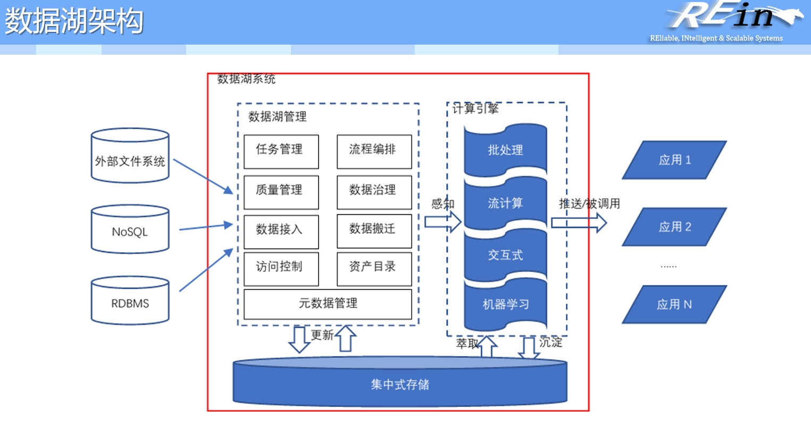
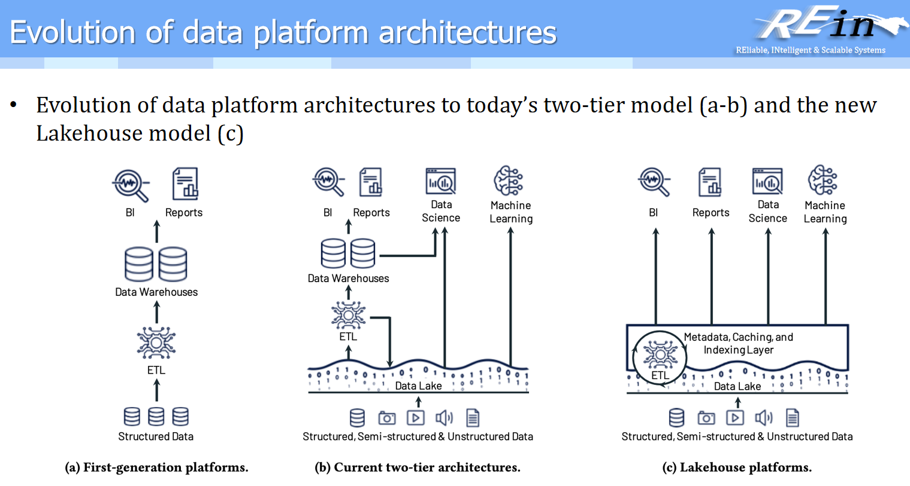
最后一种湖仓一体的存储方式，数据是否需要ETL由具体用途决定，但是不需要额外进行ETL，在这个湖仓一体的里面即可完成。  
现在的数据湖底部基本上是HDFS或者亚马逊S3或者微软的Azure。
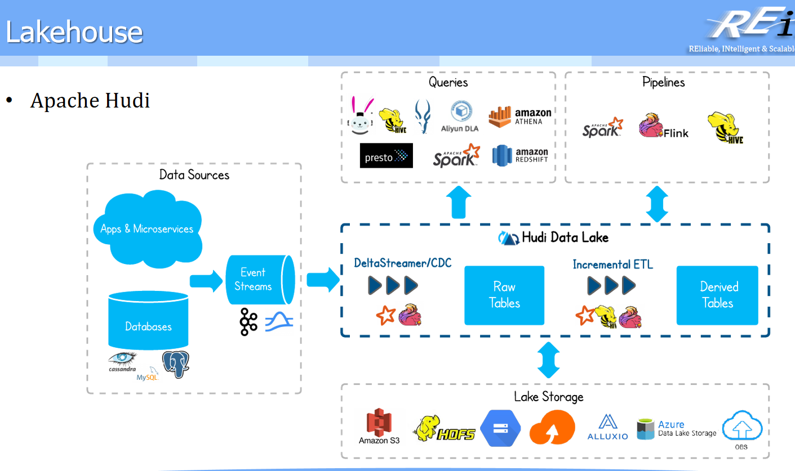

## 21-22 clustering & cloud computing

## 集群 clustering

#### 目的

- 增加可扩展性：希望线性（有两倍的机器就有两倍的效率） 但是达不到；
- 可用性：一个崩了，另一个还能用

对用户来说

- 不知道后面是集群，只是给它发请求

正向代理：4个人用同一个ip地址请求出去：

- 例子：vpn

反向代理：大量请求发到一个ip上：负载均衡

- 集群就是一个反向代理：大量请求发到一个IP上，这个IP将请求调度、转发给不同的服务器

在做集群的时候本质就是在做一个反向代理

集群的服务器之间要有一些约束：

- 要满足一定条件服务器才能够被拼起来，去做同步
- 只有同步了才能去做容错

------

#### **RAS 属性**

1. **可靠性（Reliability）：** 消除单点故障。
2. **可用性（Availability）：** 确保总体可用性，计算公式为： 1−(1−𝑓%)^n。
3. **可维护性（Serviceability）：** 复杂性比单一服务器更高，但支持热升级。

------

#### load balance 负载均衡策略

负载均衡器根据策略把请求转发到集群的服务器上

- **round-robin 锦标赛：直接轮流发**（对等的转发）
  - 优点：负载 均衡的效果比较好，不同的机器轮流来处理，一般来说比方法三的效果好；
  - 缺点：session需要单 独维护，以及没有方法二的优点)

- **least-connect 看谁当前处理的请求最少就发给谁**

- **ip-hash（根据cookie选择对应的server）**

  - **会话粘滞性**，如果发到了其他机器上会找不到session id

  - 优点：
    - 保证了会话的粘制性，只要用户的IP不变，集群中处理用户请求的机器 就不会变，
  - 缺点：
    - 这是三种方法里面负载均衡效果最差的一种，如果hash函数选择的不好的话，最终的结果很可能是导致集群里面的经常是一台机器在处理请求；
    - 如果用户改变了IP，比如上网途中开启了或者关闭了VPN或者代理服务器，导致用户ip改变，这时候session就可能丢失

- **weight权重：** 让服务器资源不同也能获得对应数量的请求

------

#### 容错

- **请求级别的failover**：无状态请求崩了，再调一个（需要幂等性）
- **session级别的failover**：会话之前已经有状态了，需要维护住之前的状态，不用把所有的都重做（如果不维护住就会需要将这个session里的所有请求都重做一次）
  - 状态广播：将session处理的状态广播到服务器上
    - 每台机器上都会有它的会话状态的副本
    - 会造成浪费
  - 用一个统一的session服务器存储各种会话信息
    - 所有其他服务器都无状态；
      - 此时根本不需要ip-hash，因为会话服务器是独立出去的
    - 每个请求都会去这个服务器拿对话id对应的session进行处理，处理完毕后再写回到这个服务器上
    - session服务器单一节点需要备份（不然挂了所有信息都没了）

- **要支持容错：服务器要支持幂等性的操作（失败了可能会多次重做）**
  - GET,PUT,DELETE都是幂等的，只有POST不是幂等的

#### **失败可能点：**

1. 请求发出后，服务方法执行前失败。
   -  解决：换一台服务器。

2. 服务方法执行中途失败。 
   - 解决：重新换服务器，重新拿session执行。

3. 服务方法执行完成后，响应传输失败。
   -  解决：保证系统**严格幂等**的情况下换服务器执行。


------

### Nginx

- 基于HTTP
- 就是一个反向代理，且和后台服务器的类型是解耦的（不要求后台服务器一定是spring boot之类的）
  - **负载均衡：**Nginx可以将传入的请求分发给多个后端服务器，以平衡服务器的负载，提高系统性能 和可靠性。
  - **缓存功能：**Nginx可以**缓存静态文件或动态页面**，减轻服务器的负载，提高响应速度。
  - **动静分离：**将动态生成的内容（如 PHP、Python、Node.js 等）和静态资源（如 HTML、CSS、 JavaScript、图片、视频等）分别存放在不同的服务器或路径上。
  - **多站点代理：**Nginx可以代理多个域名或虚拟主机，将不同的请求转发到不同的后端服务器上，实现多个站点的共享端口。

------

### 数据库集群

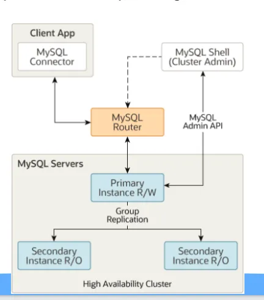

- 组成：
  - 至少有三个实例

  - 需要一个叫Admin API的工具，使用一系列的命令去配置三个机器

  - **一个类似GateWay的MySQL Router**，负责转发请求。

- 数据库组成可能是一个主MySQL服务器，两个从MySQL服务器，主服务器负责读写操作，后面两个从服务器只能读，然后同步主服务器的内容。
  - 写只能在一台服务器上，会把内容同步到其他服务器上

  - 读请求则在所有服务器上做负载均衡

- MySQL Router，负责转发请求也会保证负载均衡，对于读的操作均衡分配（ 当然主服务器可能会少一点）对于写的操作分配给主服务器。


## Cloud Computing

### 云

云在现实生活中：本质上就是将软件和硬件全部当做服务对外界暴露

##### 好处：

- 不需要去部署一个服务器
- 用多久就付多少钱，可以省钱
- 具有更加灵活的计价机制（短期、长期）
- 可以马上启动
  - 云需要解决快速供给的问题——避免冷启动

##### 特点：

- 虚拟化
  - 物理机上既能模拟出windows、也可以模拟出ubuntu
- 快速供给
- 弹性计价
- 弹性扩展规模
  - 可以很好满足用户需求

##### 云上的核心技术：

- 作业调度

  - google提供的一种方法：map-reduce

- 分布式文件系统

  - distributed google file system
    - chunk server 一台台物理机
    - master server

- Bigtable——分布式文件系统中数据存储的形式

  - 关系型数据库的问题：
    - 如果三张表都很大（三张表存在三个机器中），外键的join操作要在机器之间进行的开销是极大的
    - 竖着切，使用等价类划分，将表的一部分存在A上，另一部分存在B上。
      - 问题：很难切开
  - bigtable解决了这个问题：一个表可以很大很大，可以随便切成若干块处理。且也没有表之间的关联了。
    - 因为少了表之间的关联，所以引入了列组
    - 列组是可以动态变化的，使得bigtable可以存储半结构化的数据
  - 这张表本质上还是一个分布式文件系统的存储的大文件

  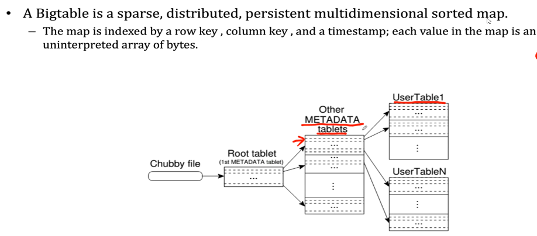

  - 如果这张表实在太大也可以做切分，表达成上述形式之后表就不会太大了，也就不用再进一步切分了

- 云操作系统的对应汇总：（google）

  - FS：GFS
  - job：mapreduce
  - DB：bigtable
  - 内存管理：没有统一架构
    - gaussdb的内存管理就是把它变成了一个分布式缓存
  - **hadoop提供了上面这些内容的一个开源实现**
    - hdfs
    - mr——yarn
    - hbase——bigtable
    - hive


#### 云原生

开发、部署、编译、一直到最后的运行全部都在云上

主要特征

- 云上的所有东西都是微服务，而且都以serverless的模式在运行
- 所有东西都是以容器化的模式运行
- 和本地的开发是有一些差异的


### 边缘计算

相比云计算，虽然最后一层也是发到云中，但有些计算会在边缘服务器中直接完成并返回，不需要每次都进入云中，让计算在靠近数据来源的地方进行

- 可以节省带宽
- 且设备一般不会一直与云相连但是会一直与边缘设备相连，速度也更快

#### **概念以及产生背景**

##### 概念

- 边缘计算是在**靠近数据来源**（如 IoT 设备、手机）的地方进行数据处理和存储，而不是完全依赖云端。

- 边缘服务器：
  - 负责接收设备上传的数据。
  - 对本地数据进行预处理，并定期上传核心云端。

##### 产生背景

- 原来所有操作都是在云里面做处理

  - 如果要访问总要将请求发到云端，会有很大的时延，也会对云端压力太大，**想要节省带宽**

- 但是有大量边缘设备：

  - 比如**基站**（含有边缘服务器）
  - 在网络的边缘，服务器具有一定的存储、计算的能力
  - 有些请求边缘服务器能计算就不发到云中，而是直接在边缘服务器中处理完返回
  - 将一些计算节点下放到边缘设备，加快速度


#### cloud offloading

**cloud offloading：操作在设备之间的迁移**

原则：边缘能处理就处理，太多就往上一级发

- 有些计算到底是在边缘里做还是在云里做呢？
  - **边缘还分为微基站、宏基站**
- 如果**本来决定微基站处理，但是大量请求涌入使得微基站处理不了了，就会给到宏基站，宏基站也处理不了则会进一步给到云端**
  - 例子：摄像头处理视频，摄像头内置cpu，自己先处理，白天人太多就截图发到上一级
- 能够处理该计算的服务器构成一个树形结构
  - 到底会在哪个层次做处理会由节点的状态动态决定
  - 这个计算会在不同的节点之间做迁移


#### The Rise of Cloud-Terminal Fusion Computing 云边段融合的崛起

- Cloud Servers 云服务器
- Mobile Edge Computing Servers 边缘服务器
- Mobile Devices (Edge Devices) 移动设备，即端侧

- 云边端融合（云 边缘 端侧）是现在的整体趋势
  - 边缘设备搞不定再往上发
  - 对端侧设备透明，它不会知道计算最后在哪里进行，只会知道计算被完成了


#### **挑战**

- 数据存储和处理的分布式特性：
  - 如何快速定位存储在边缘还是云端的数据。
    - 如果query发到核心，既要在核心云里找也要在边缘找，**要怎么知道去哪里找呢？**
  - 查询需要在多个地方（边缘和云）协调。

------

#### **边缘存储**

##### 边缘存储的特性

1. **流式数据**：数据连续生成和传输。
2. **数据量大**：需要高效的存储和压缩。
3. **范围查询**：支持对特定范围的数据进行快速查询。

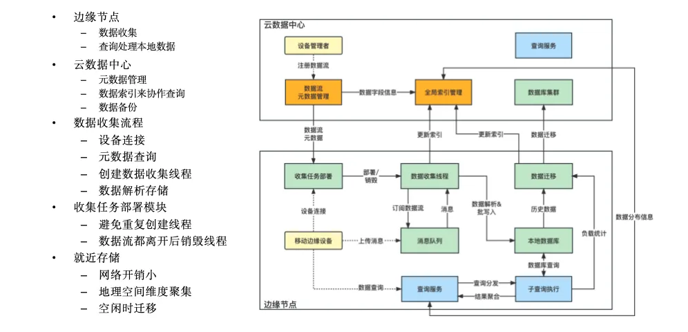

- #### **解决方案**

  - 元数据快速同步至云端：提供对数据位置的快速索引。
  - 详细数据保留在边缘存储：减少核心云端的存储压力。

------

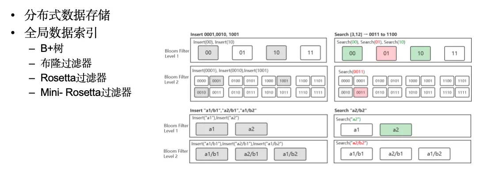

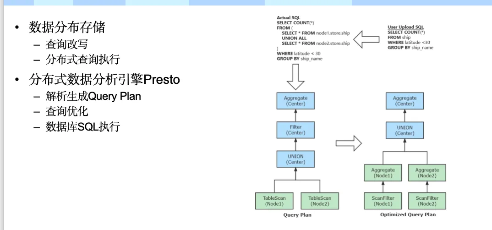

- 计算下推：节省网络传输开销；云中心计算减少；充分利用节点计算能力


## 神经网络

keras搭建的时候，搭建出来的是一个前端，后端一定要是tensorflow、pytorch和另一个三者之一。

#### 训练原理：

将神经元的结果汇总后发给几个激活函数进行处理

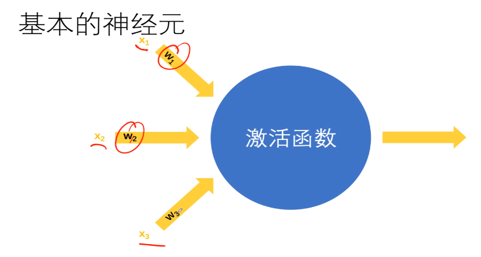

- 输入一般是带有权重的
- 将所有输入加在一起后就得到了净输入

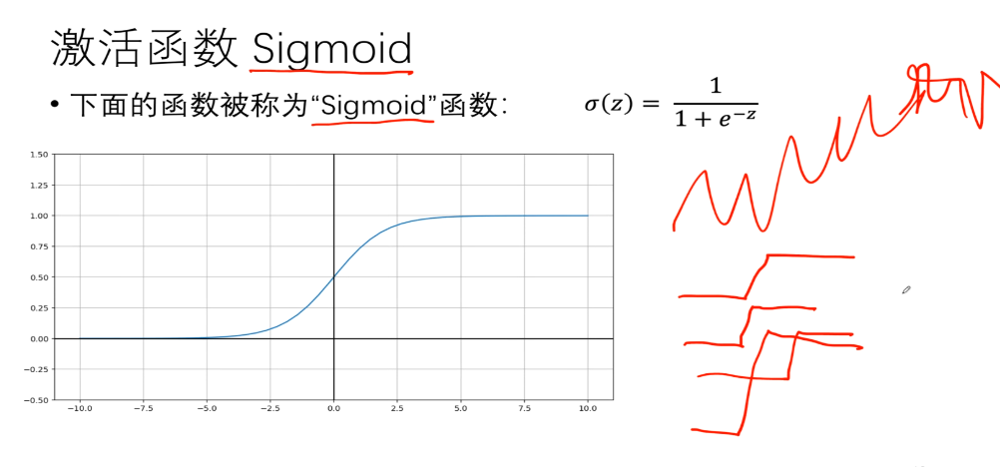

- sigmoid函数：
  - 任意函数可以变成若干个阶跃函数的线性组合，但是很难去描述这种组合
  - 他就是想要模拟这个阶跃函数，并且以单一的函数标识
- 主要记住：希望有一堆这样的函数，能够通过它们的组合模拟出一个接近真实的情况——激活函数


##### 为什么需要很多神经元：

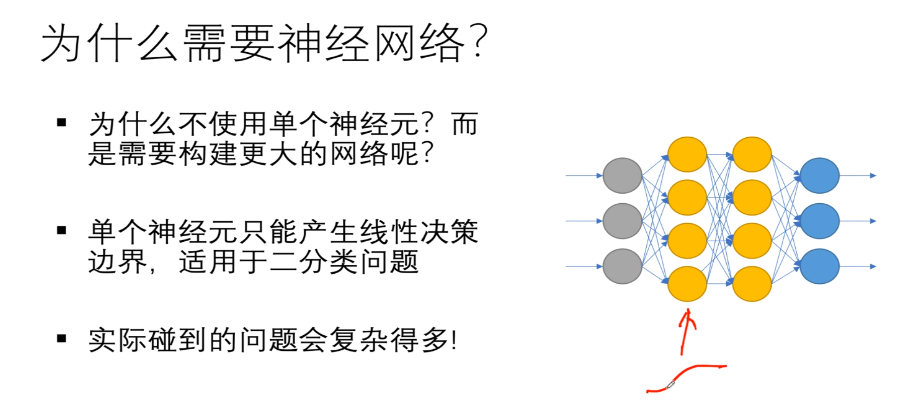

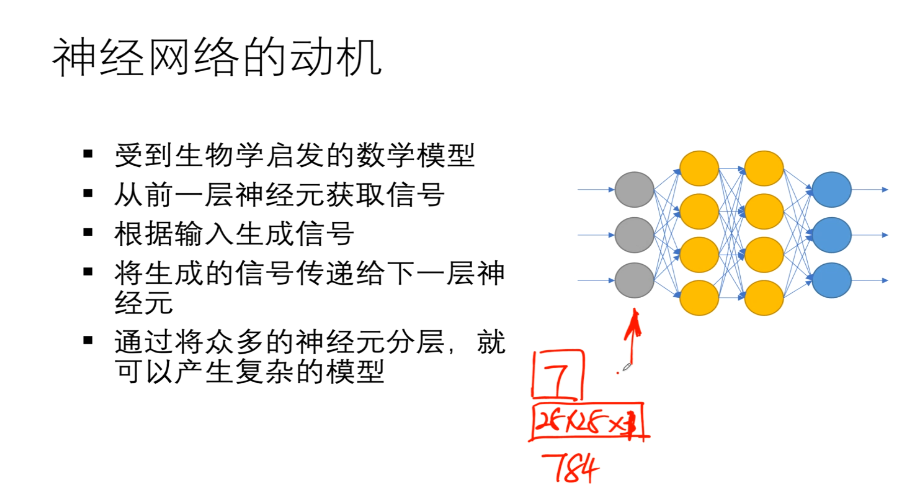

- 单个神经元无法描述复杂函数
- 需要多个神经元串在一起，用线性组合的方式得到对复杂函数逼近的一个结果
- 上图中：
  - 第一个灰色的是输入层，输入可能是多维的，输入之前需要先摊平。

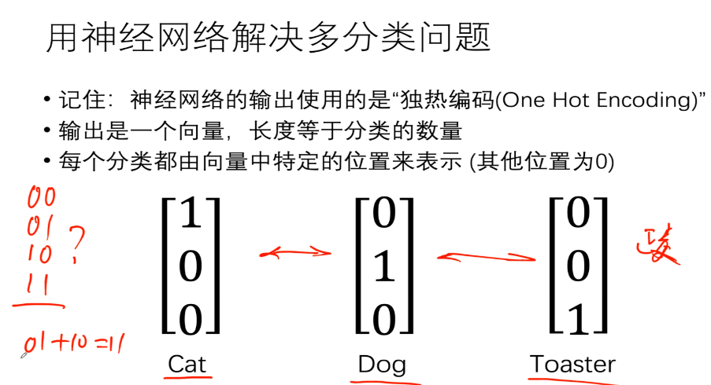

神经网络的输出使用的是**“独热编码”**

- 输出层里面只有一个1，其他全是0——理想情况

- 所以要分多少个类，输入层就要有几层


#### 神经网络的结构

如果从输入的角度和从输出的角度都看不见——**隐藏层**

- 线越多，能够识别的特征越多。线越少，能够识别的特征越少
- 如果神经元太多可能过拟合。如果神经元太少可能欠拟合

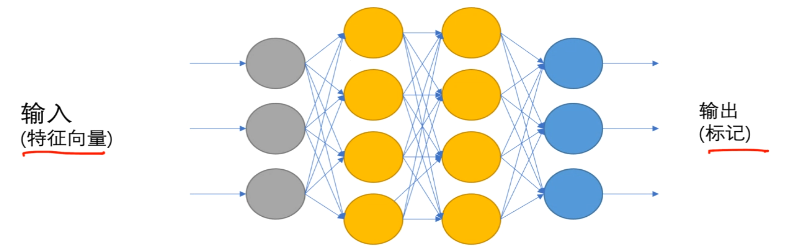

- 可以将其看作一种复杂的计算引擎
- 使用训练数据来训练它
- 期待它能够对新的数据起到不错的效果

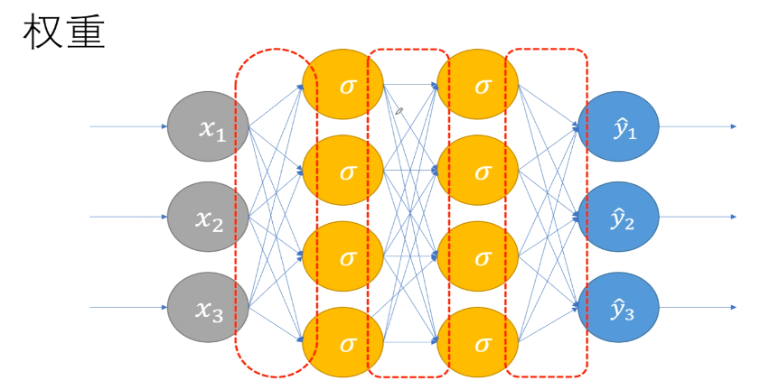

- 每一层的输出都会作为下一层的输入的一部分
- 权重就代表了机器学习到的结果

- 权重的意义：

  - 红色表达这个值对最后的判断有利
  - 蓝色表示这个值对最后判断没用
  - 权重算出来的东西具有一定的普适性

  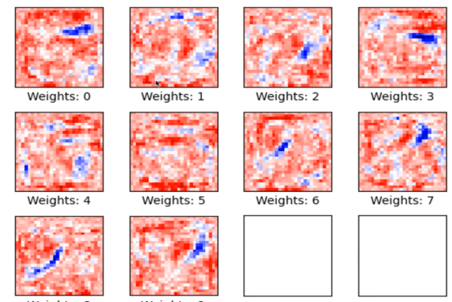

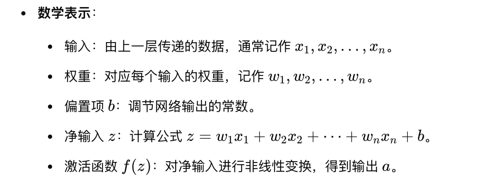

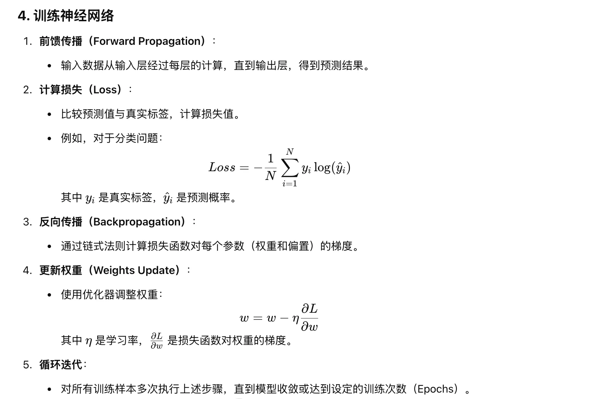

##### softmax函数就是sigmoid对多类别的扩展：

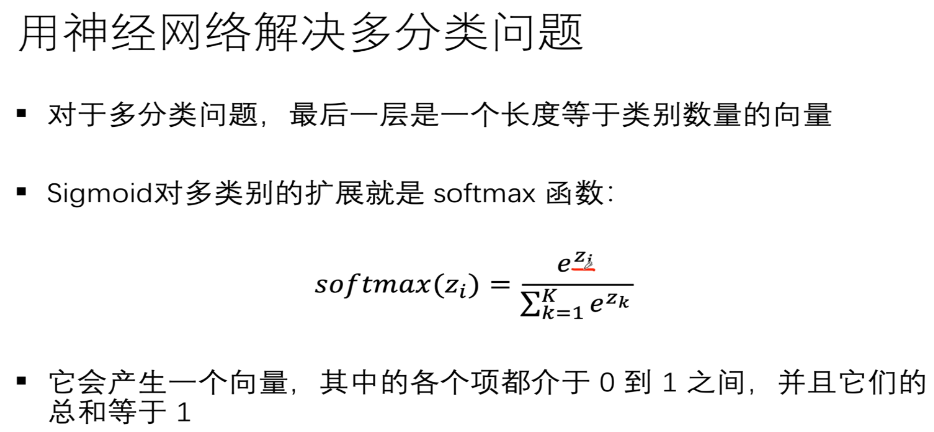

- 经过这个计算，1、2、3中最大的占比会被放大，只要占的不是最大的就会被压小
  - 所以希望将预测对的结果放大——softmax函数
- softmax另一个作用：和损失函数结合去计算梯度的降低

激活函数一定是非线性的

- 因为n个线性函数也等价于一个1个，设置n个神经元层就没有了意义

训练的时候会随机遮住一部分特征让模型进行识别——dropout函数做的就是这个

- 防止模型是根据某个局部的特征去进行识别的

#### 全连接神经网络

（Fully Connected Neural Network, FCNN）

**全连接层**的定义：就是这一层的所有神经元与上一层的所有神经元都相连——Dense就代表是全连接层

- 下一层能收到上一层所有的输出，某些边不会没有，称为是dense的

**多层感知机**（Multilayer Perceptron, MLP）

- **每个神经元与上一层的所有神经元相连**，并通过**权重和偏置**调整连接强度

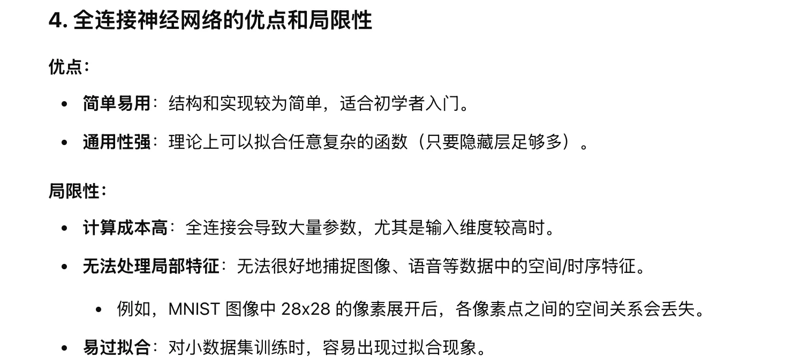

#### **全连接网络的局限性**：

- 全连接网络对输入数据的每个分量是“平等对待”的，没有考虑数据的内在结构关系。
- 对于图像数据，这种方法会导致需要学习的权重参数过多（例如，一个200×200的RGB彩色图像需要至少14亿个权重参数）。
- 全连接网络无法充分利用图像的**空间信息**（如像素之间的局部关系）。

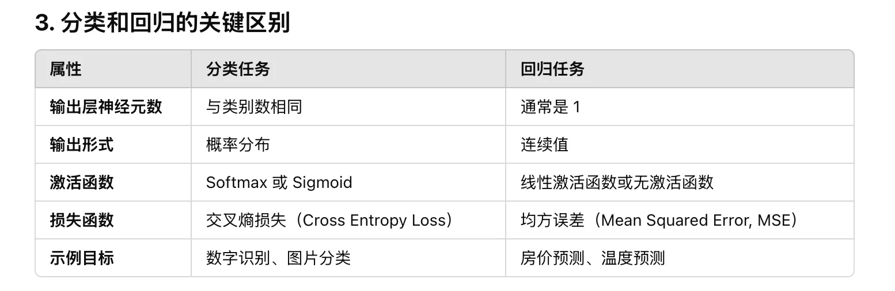

------


### 卷积神经网络

（Convolutional Neural Network, CNN）

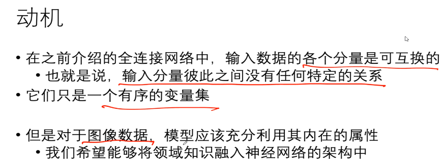

- 输入变量彼此之间没有关系，但是对于图来说不是这样的

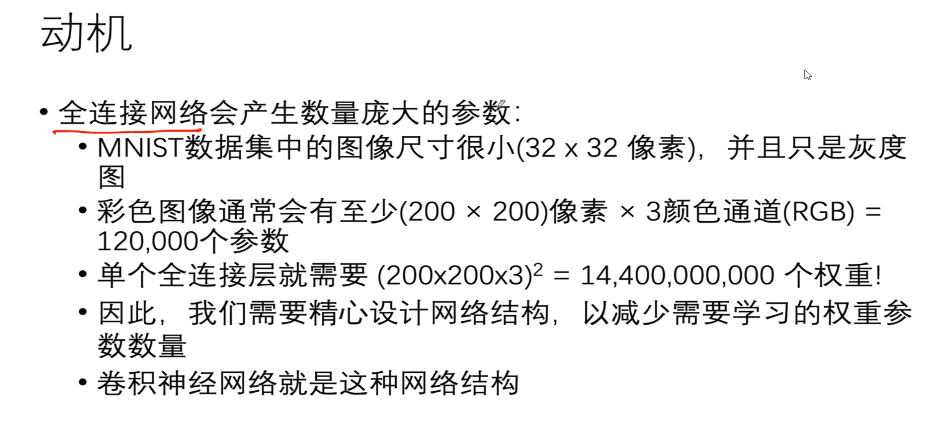

- 图片会有非常多的参数，如果全部是全连接，会发现权重数量太多，所以会使用卷积神经网络

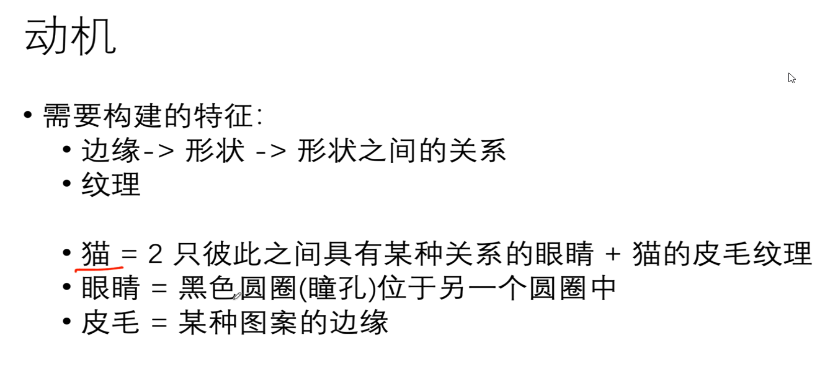

- 上面是一个卷积网络的运行例子：
  - 先看猫有没有一双眼睛
  - 一双眼睛是不是有两个圆圈，里面各套着一个圆圈，两者之间的距离是否正常
  - 再进一步看这个眼睛能不能和周围的东西构成一张猫的脸
- 即看一个局部一个局部，再将一些局部放到一起看他们是不是构成一个更大的局部
- 先提取局部特征，再将局部特征拼到一起看它是不是一个完整的分类（是不是一只猫）
- 且特征提取工具可以复用

#### **卷积核（Kernel）**

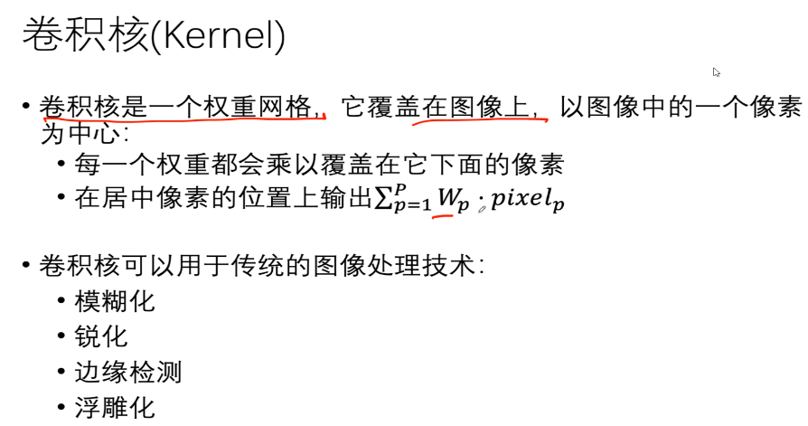

- 覆盖的位置乘以权重的值，得到居中像素的值

- 计算的具体例子：

  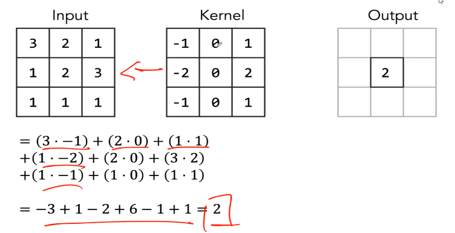

  - 将卷积核矩阵套在input矩阵上，对应位置做计算，算出来之后将特征值填在居中像素

- **卷积核**是一个小的滤波器（数字信号处理中），用于扫描图像并提取特征，**也就是一个局部特征提取器**

- 叫卷积的原因：

  - 这个概念来自财经界，算净收益由来


#### 卷积的结构

- 用一个能套取方块特征的卷积核套上去卷
- 再用一个能套取圆特征的卷积核套上去卷
  - 此时认为得到了一个channel，通道
- 基础类型有圆、方形等等
- 这里面的所有特征合起来能否合成一个更复杂的图形：
  - 比如一个发动机的途径
  - 此时就是将前一步的所有channel放在一起去卷，用一个更大的卷积核

#### **卷积操作**

- 卷积核在图像上滑动（通过设定步幅 Stride），对每一块区域执行加权求和操作，生成特征图（Feature Map）。
- 通过调整卷积核的大小、深度和步幅，可以控制输出特征图的尺寸和深度。
  - 缩小图的大小——称为池化，避免使用的卷积核太大

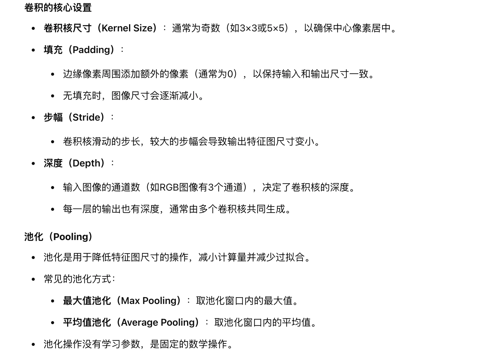

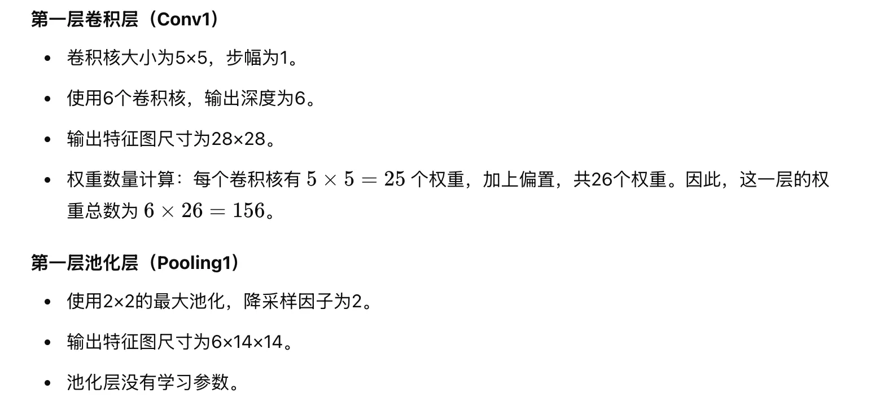

#### 其他特点：

- 卷积核的行数和列数一般都是奇数

- 为了使卷积的结果和输入的一样大，会有填充

- 步幅可以不断变化

- 卷积核的深度与输入通道的数量相同

- 卷积深度的相关知识：

  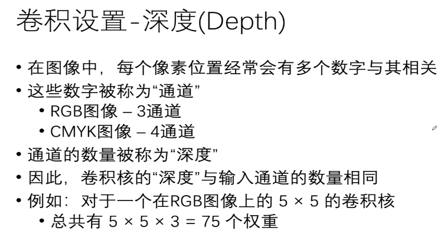

- 卷积神经网络可以做叠加

  - 卷积层可以不断添加，能够提升准确率，但是运行也会更慢

#### **卷积神经网络的优点**

- **减少参数数量**：通过共享卷积核，大大减少了需要学习的参数，降低了计算成本。
- **空间不变性**：通过卷积操作，模型能很好地处理目标的平移和尺度变化。
- **局部感知能力**：卷积核可以捕获图像的局部特征（如边缘、纹理等）。

# 云边融合数据存储
软院4号楼里面有一个小的服务器基站，那么这就属于边缘节点，来供给我们边缘设备的计算与存储例如摄像机、手机等等，由边缘服务器定期把数据传到核心机房里面，在上传的时候数据会经过一些压缩处理，可以减少带宽占用。那么现在的问题是，我现在在中心节点需要查找一些数据，他们存在边缘节点里面，如何确定这些数据存在哪个边缘节点里面？会生成查询计划，推到各个边缘节点里面查询，边缘架构需要采用KV方式存储
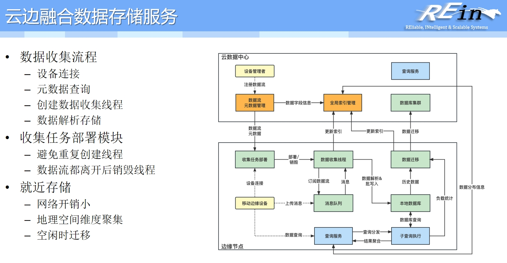

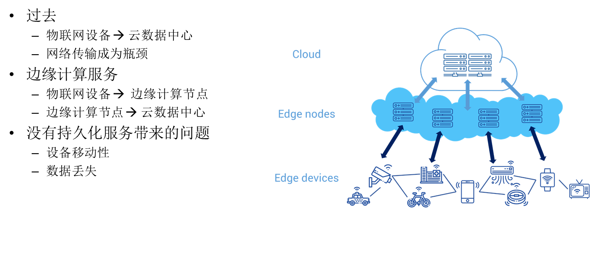
边缘节点每隔一段时间发给主节点。一辆车开的途中不断给边缘节点发送信息，我如何找到8:00到9:00的路线。
边缘节点需要实时地更新主节点索引

所以在查的时候添加了全局数据索引：B+树、布隆过滤器、Rosetta过滤器、Mini-Rosetta过滤器

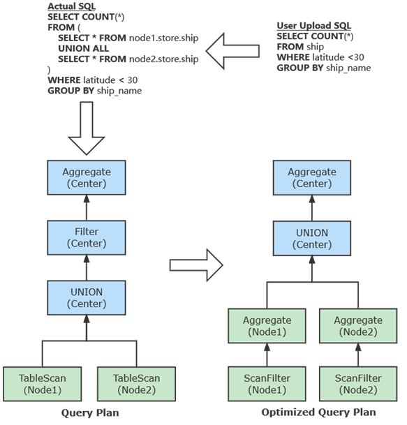
下推：充分利用节点的计算能力，传输的数据量也变少

---
# 23. Vitualization & Container & CNN神经网络
## 23.1 容器
### 23.1.1 容器的设计原则（不重要）
容器本身是有一个设计的原则的--容器调研的PPT，总的来说容器是用Linux里面Cgroup2做的性能隔离。容器本身超过课程的范围，
来讲一下容器是怎么开发的。

### 23.1.2 容器是什么
        容器是什么，刚刚提到的就是用Linux中的Cgroups和文件系统中的namespaces命名规则，做的一个运行环境的隔离。
在运行的时候我们需要一个Runnable的image的实例，这个image就是对整个运行环境做了一个打包。

Image里面就包含了我们所有运行的一个环境。（A Running container uses an isolated filesystem）Cgroup之间就隔离开了，就要保证
A的容器和B的容器他俩的空间要完全隔离开的，我对A的任何操作，就不应该影响对B的任何操作。本质上这个隔离就是靠Cgroups实现的。

容器里有什么？ 其实就是所有运行我们环境所需要的依赖（dependencies),Configurations，binaries。所以容器之间有大小差异。

        Docker使用GO语言写的。总的概念就是我们用namespace去给所有的容器加一个前缀，然后Cgroup语句把容器彼此之间隔离开。

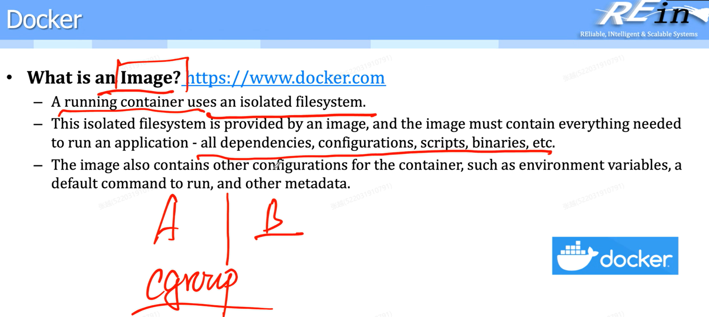

### 23.1.3 容器和虚拟机的区别

虚拟机内部是一个完整的OS，但是在容器里面，它实际上实在一个Linux的一个宿主机上面跑一个个的容器。这些容器在运行的时候，我们要考虑容器它是
分层的。 

        容器分层的目的是什么呢？比如我们开一个Springboot的项目，然后别人开发一个C#的项目，这些项目可能要依赖于底下一些共同的部分。
    于是这些共同的部分可以专门打包成一个Layer层。所以这些容器就可以变成若干层累积起来了。所以Docker内部是一个分层的结构。

所以我们科学上网，pull一个镜像的时候，我们可以看到镜像是一层层下载的，考虑分层的目的就是要做复用。就是有很多相同的东西
，不同的容器可以共享一层，这一层的代码就不用反复去拉取了，提高效率。

      虚拟机和容器最大的区别就是虚拟机有一个独立的操作系统。
这个完整独立的操作系统就可以告诉你，假如使用Windows的环境里面运行一个
Linux环境的虚拟机。但是Docker就会想，既然都是Linux操作系统，那我们为什么不直接基于这个操作系统，然后彼此之间的环境隔离开就可以了。
    
        所以Docker其实是要跑在一个类Linux的操作环境里头。

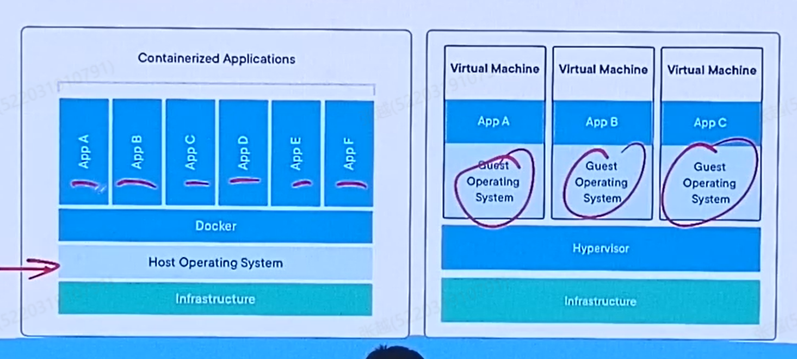

### 23.1.4 Docker的架构

我们在client端主要命令就是比如docker build可以本地构建一个镜像，就可以把他推到一个注册表（DockerHub）里去。

我们也可以使用docker pull拉下来一个镜像，我们可以在镜像里面去实例化一个容器。

docker run就是去实际跑起来一个容器。

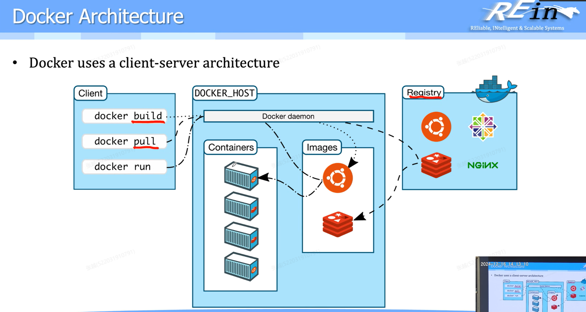

### 23.1.5 DockerFile

DockerFile在告诉你，这个Docker镜像里面有些什么东西，就比如我们在docker build的时候，就会读这个DockerFile的内容，这个内容就告诉我们
怎么去打包这个image。

### 23.1.6 Container Volumn（数据持久化）

我们是否可以在容器启动的过程中不断动态添加卷（Volumn）上去，这些卷可以存我们想要的东西。但就像我们做作业中遇到的问题，我们直接给容器外挂
一个卷，重启容器后，这个卷内的数据就会丢失，怎么持久化这个卷里面的数据？

    我们需要先建立一个卷，我们再次运行容器的时候，除了对端口进行映射之外我们还需要对卷进行映射，对这个容器外挂这个卷。因为将容器关了以后，我们的卷
    还在，重启容器的时候还会把这个卷挂载进去，数据就不会丢失。


再进一步，如果我们不想要把数据搞成一个卷，挂载到容器上，我想自己管理文件，放到自己电脑的文件夹里面，该怎么办？

    那我们就要使用Bind Mounts，Bind Mounts和Named Volumn的区别就是，Named Volumn的位置是由Docker来决定的，而Bind Mounts的
    位置我们可以自行决定。

### 23.1.7 多个容器间通信

多个容器间通信，首先我们需要让多个容器跑在同一个网络内部。

    容器只有在同一个网络中，彼此间才能通信。

所以我们得首先使用docker network create指令创建一个网络。然后在这个网络中运行后续这多个容器。

### 23.1.8 Docker Compose

对于多个容器，我们能不能把这些容器一次性全部提来，这就需要Docker compose，我们要使用.yaml文件，里面包含所有Services的名称，image名字，端口映射
，过载卷，镜像环境...

    写好docker——compose.yml后我们就可以通过docker compose up来一键提起所有的容器。

## 23.2 CNN 自然语言处理基础知识

### 23.2.1 自然语言处理简介

自然语言处理涉及到以下几个方面：

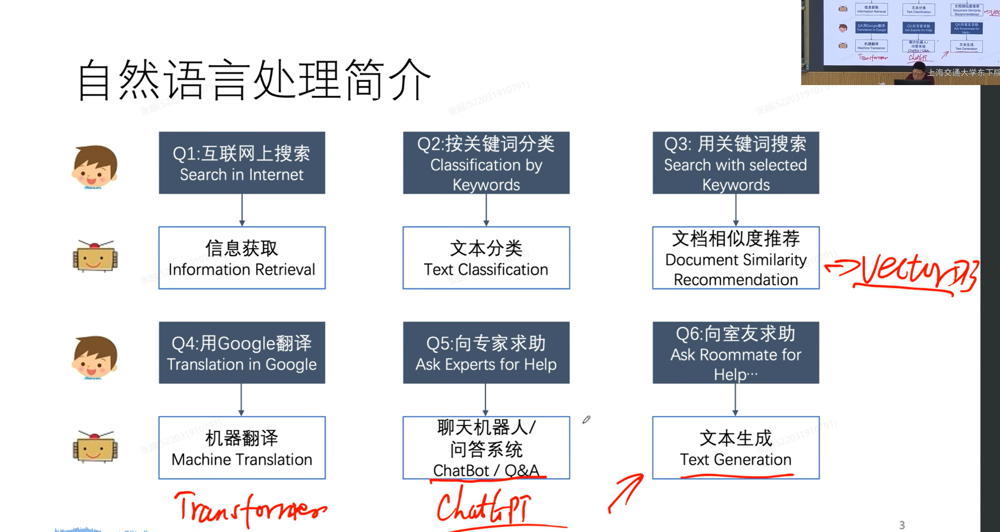

怎么把自然语言数值化：
1. word->vector：（NLP研究1领域2 ~ 应用3领域2），缺点：字符种类过多，我们要用到的数值就过多了。而且各单词间有关联，我们得把单词变成Vector，如果
简单的把每个单词和其他的单词的关联写成[0,0,..,1,...1,..0,0]类似的Vector，若有100000个单词、则维度也为100000，显然过高了。
2. BOW（词袋模型）：对于有哪些词语，我直接把它放到一个袋子中（Bag of Word),然后按照它们的顺序进行排序。

卷积: 多个相连单词间的关系

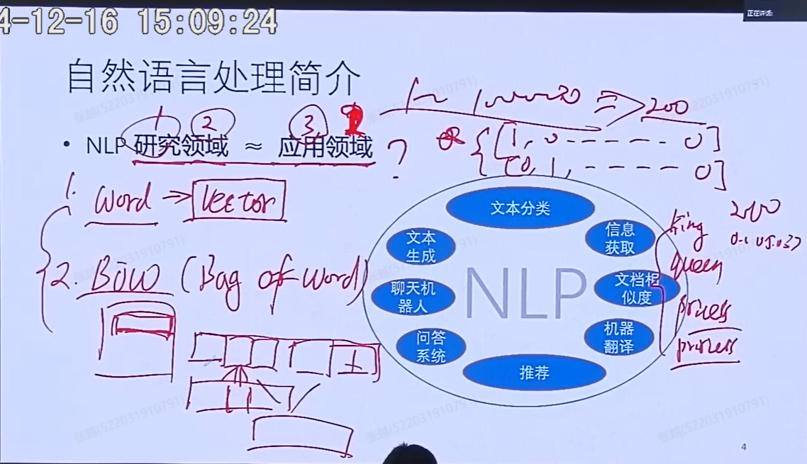


    CNN可以用来做自然语言处理，我多设几个卷积层、池化层，第一层卷积层检测多个相邻单词间的关系，第二层检测多个相邻词组间的关系，
    以此类推，慢慢的就可以变成一个完整的句子。

### 23.2.2 自然语言处理示例

首先我们要知道怎么分词，把文本数据所有单词分开——可以使用字典（都是一个一个的单词，包含权重和词性）。然后我们需要获得语料库（corpus），即我们用于训练的
文本数据，（课中的例子是许多的新闻合集），对这个语料进行分词预处理。对于分词后的结果我们对之进行数据清洗，（课中的例子过滤了极值，这里过滤了只出现一次的词，以及
所有语料中50%以上都出现的值）。构建BOW模型，把之前分词后的结果构建为词袋模型（词袋模型具体做什么——拿着字典到你的语句里面找，每个字符都做了多少次，他做了一个统计，
统计完之后他按照这些单词的ID的顺序排列）。然后用N—Gram构建Phrases模型，对词组进行处理。再后面做了一个主题分类，使用GenSim在BOW模型基础上构建LDA模型，
查看每个文本被分到不同主题的概率。

CNN怎么运用的。
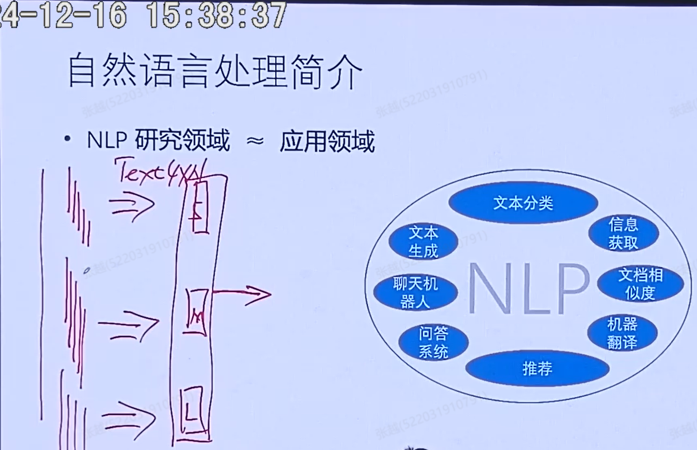
    
    顺序模型（普通CNN）：我们在对文本进行训练时，我们kernel_size为n，则找n个单词间的关系。然后用MaxPool进行池化，再卷积，就可以进而得到n个词组间的关系，
    所以效果很好。

    优化模型（TextCNN）：在卷积和池化层后，我们对池化层1、池化层2、池化层n的结果进行了一个拼接，相当于我们把短，中，长句子的特征都拼接到了一起，
    然后拉平，dropout一下，准确率会大大提升。而且如果各句子彼此长度差别大，该模型效果一定更好。

    ChatGPT用的是RNN循环神经网络，RNN的结果会更好！RNN不仅可以做语言处理、还可以做文本生成。


---
# 24 Hadoop & RNN

## 24.1 Hadoop
### 24.1.1 Hadoop简介

Hadoop是Apache的项目，主要就是提供一个分布式的计算环境，就包含了云操作系统里面的一些实现，具体就是要解答分布式计算环境里面怎么让大量机器
看起来就像单个服务器一样做计算，实际上是在做大集群计算。

Hadoop项目包含了以下模块：
1. Hadoop Common——支持其他Hadoop模块的common utilities，
2. Hadoop Distributed File System（HDFS）——一个高并发处理数据的分布式文件系统，
3. Hadoop YARN，Hadoop MapReduce——分布式作业调度；
4. Hadoop Ozone——数据存储（对象存储）等等

HDFS实际上不是一个从底端开始，需要格式化才能装的文件系统，实际上是在类Linux操作系统上加了一层。所以在Linux或者类Linux（比如Mac上可以直接跑这个程序），
HDFS内部一个file可以分成若干tablet以及block，这些block被真正存到文件系统中。为了提高可靠性，在分布式环境中，我们一般要加一个副本。

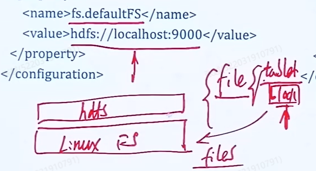

整个文件分区表存在namenode中，客户端每个请求先要进入namenode中，client->namenode->HDFS（block)->Linux FileSystem。所以打开hadoop首先要启动
namenode。

### 24.1.2 Map Reduce

Map: 如果一个A映射到B，如果A的长度是10，那么B的长度也是10，Map就是做一个集合映射。

Reduce： 把集合变成一个值，相当于一个规约。
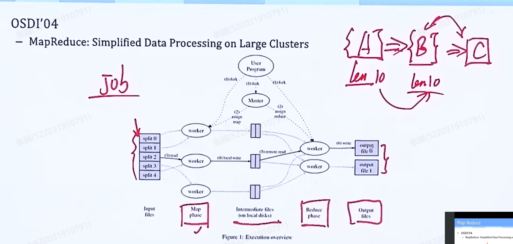


具体：Word Count例子：我每次Map完，对于Map的结果可以先在本地做一个Combine，然后把Combine的结果写到一个Reduce的worker可以读到的地方。然后我再调用一个Reduce，对combine结果进行规约
这才是真正的规约得到的结果。

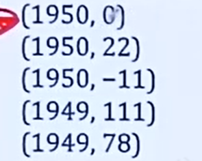

经过Combine操作后：

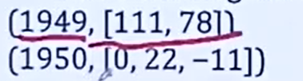

Shuffle是什么：我们规定每个Reducer处理对应段的字符串，因此在Map后我们要Shuffle，方便每个Reducer读取自己需要处理的集合（比如把A-N放一起，O-Z放一起），
Shuffle同时我们还要对结果进行sort，两个是一体的。
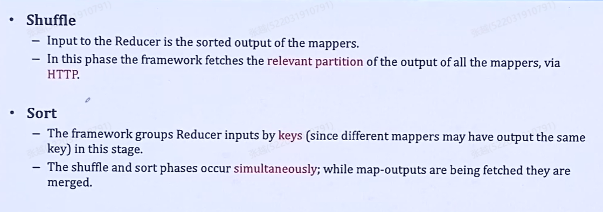
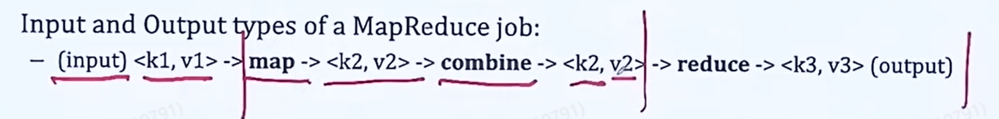
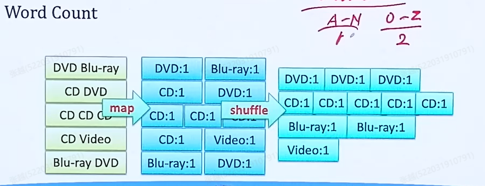
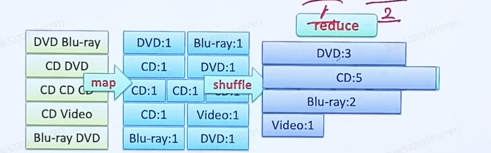
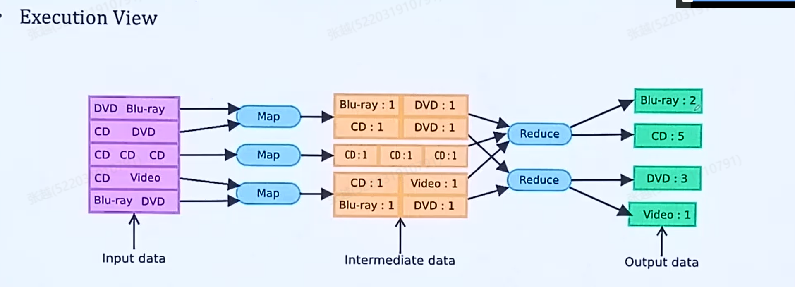

### 24.1.3 input数据格式

Map阶段的输入是raw NCDC data（原始NCDC数据），我们首先需要按行取出，在处理是时候我们在前面加入一个偏置量，知道每条数据的长度。数据map-reduce具体流程：

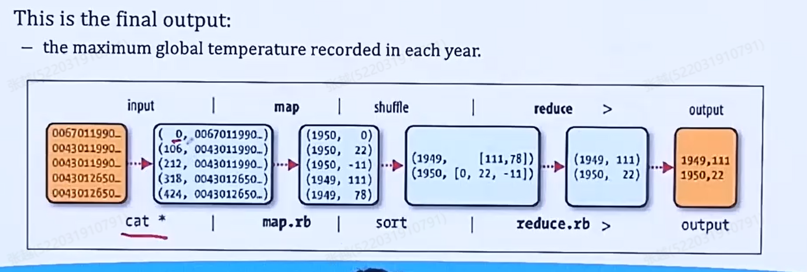

### 24.1.4 Combiner

    Combine 可以用也可以没有：

比如我们在求最大值时，我们可以在每个Mapper后做Combine操作，（其实就是对数据进行预处理）有些情况可以节省效率，有些情况不能优化。

    比如求平均值，我们对每个节点的map结果进行平均值计算的预处理就是没有任何意义的，所以具体情况具体分析。

### 24.1.5 input splits

Hadoop会把传给Map Reduce的出入数据切分成固定大小的pieces，称之为input splits，对于每个split调用一个map task。
split就是HDFS的block，默认值是64MB。


### 24.1.6 JobTracker V1.0

Map reduce中任务调度是怎么控制的呢。我们有一个jobTracker。我们先讨论JobTracker1.0的情况。

图中黄颜色的是我们的代码，我们提交一个作业给jobclient，发一个client包给hadoop，hadoop就把包给JobTracker，JobTracker就会新建一个job，然后就有可能
会读取一些HDFS上面的文件，创建好job后面就会找一些执行程序的机器，JobTracker会把代码扔给这些机器，执行的过程中会起一个单独的进程（TaskTracker），在这个过程
中TaskTracker一直给JobTracker发心跳包，如果心跳停止就寻找新的节点。

心跳：如10分钟内必须来三次，（一个时间段内来n次）。没有限制得很死。

    缺点：JobTracker需要管理所有可用资源、还要跟踪监控job运行状态，监控task tracker，任务过重。
    JobTracker成为系统的瓶颈。
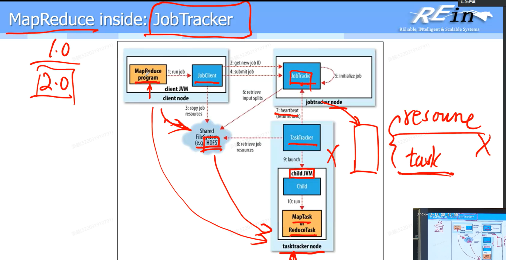

### 24.1.7 多少个Reducer

    0.95到1.75倍的节点数乘以每个节点能开的容器数。如果认为节点处理速度不强就用0.95，
    如果处理速度很强，就用1.75。

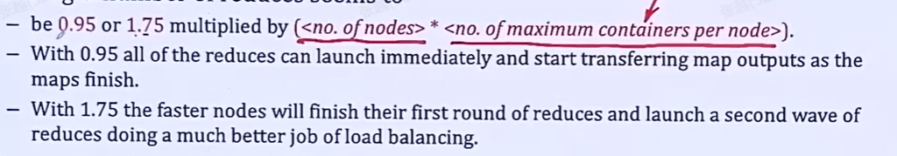

### 24.1.8 Partitioner
如果存在若干个reducer，我们可以使用Partitioner对数据进行分区，（可以设置）。

### 24.1.9 Hadoop的缺陷

我们的数据都在磁盘中，会有大量的I/O操作，是一个重度I/O的操作，极大影响效率，我们是否可以把数据放入内存中——这就引出了下一节课的Spark。


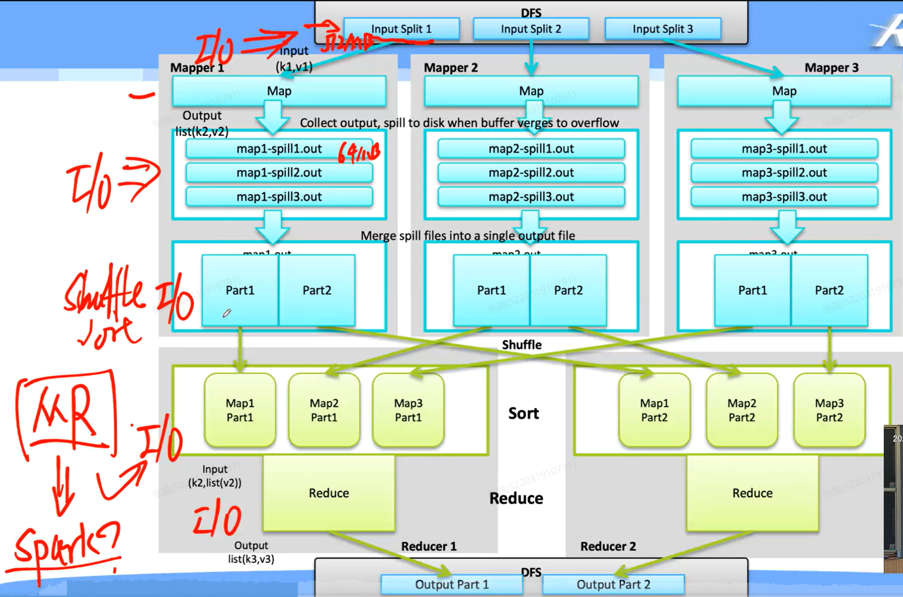

- 如果我一个节点的map操作中途出现问题，前面的处理都作废了，那么我们可以如何优化他？我们可以在每次map得到中间文件后直接Shuffle&Sort，传给Reducer节点，

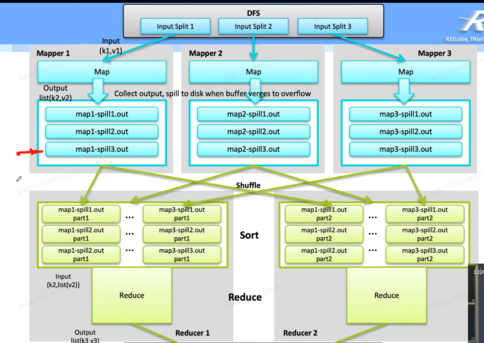

### 24.1.10 Map Reduce 2.0（YARN)

 -    原来version1的jobTracker里面实际上是把资源管理和作业的跟踪，是合在一起的，于是呢就会觉得瓶颈就会出现，Hadoop里面就会有一个所谓的下一代的
Map Reduce，也就是Yarn。这里面就把两个职责给分开了，资源管理由Resource Manager（Global全局的）管理，作业跟踪就用Application Master管理，而且不是有单独一个
Application Master来跟踪所有的节点，而是由每一个节点都有自己的Application Master。应用就是一堆的作业，彼此之间是一个DAG。

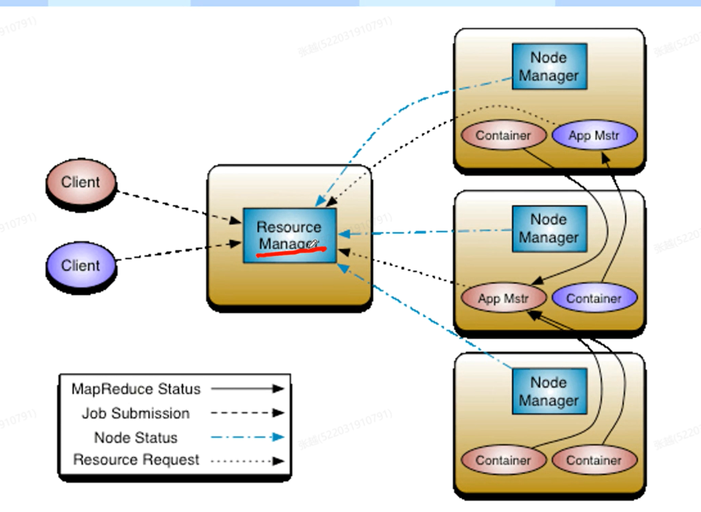

每一个Node内部都有一个Node Manager，Node Manager就会把node的所有信息发给Resource Manager，所以当客户端在发给Resource Manager
一个请求的时候，他就可以Node Manager提供的信息找最适合的节点去处理作业。

跟踪这个任务作业实时状态的逻辑和容器生成与销毁的逻辑都放在App Mstr里面去完成，
如果他发现一个容器心跳没了，就会像Resource Manager申请一个新的节点去retry。

通过这个分离职责，任务追踪和资源管理就解耦了。实现了更加均衡的实现方式。

## 24.2 RNN循环网络神经

- ### 24.2.1 循环神经网络含义

我们有一个网络层，我们的输入进去之后，产生了这一层的输出ht，当我输入下一个输入的时候，对于这个神经元来说，（比如这个输入是x0，输出也是h0），当输入x1的时候，
h0也会当成一个输入输回网络层。也就是说，每一次输出都包含了前面的输出提取出来的特征，就非常适合自然语言处理以及连续性数据的预测。（比如股票市场，我要预测一天的
股价，我们可以把前面20天股价数据输入进来，这样20天里面所有的特征全部用来预测最终的结果）我们要限定一个我们要回看多少行。

- 缺点：程序不能并行，必须要串行，速度比较慢。

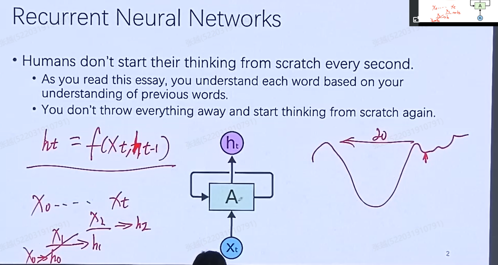


- ### 24.2.2 LSTM

 我们碰到不同长度的句子全部都用一个RNN模型吗，如果有的序列特别长的时候，效率显然不太好。所以我们可不可以分情况，可以把某些输出扔掉不进行保留，不继续传下去呢？

为了提高灵活性，我们需要引入LSTM模型。

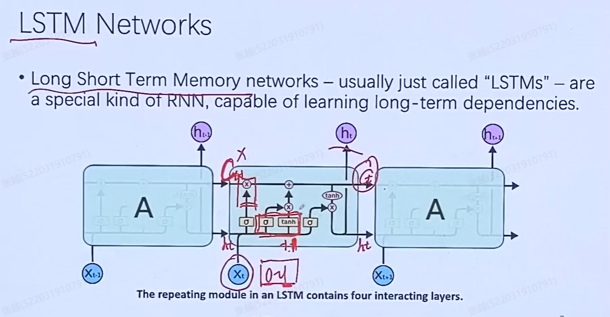

LSTM内部有许多的门，我们输入值进入以后，需要经过一个sigmod函数（激活函数），这样就会有一个0到1的范围。
如果我们的输入值经过激活后接近于0，跟前面输出的h(t-1)相乘，就相当于我把h(t-1)忘掉了，如果接近1，h(t-1)就会传下去。然后我们将h(t-1)和x(t)相加，
作为这一层的结果传下去。这样不会将所有前面的输出特征传下去。

具体如何结合h(t-1)和xt逻辑的算式如下，比较逆天，看不懂。

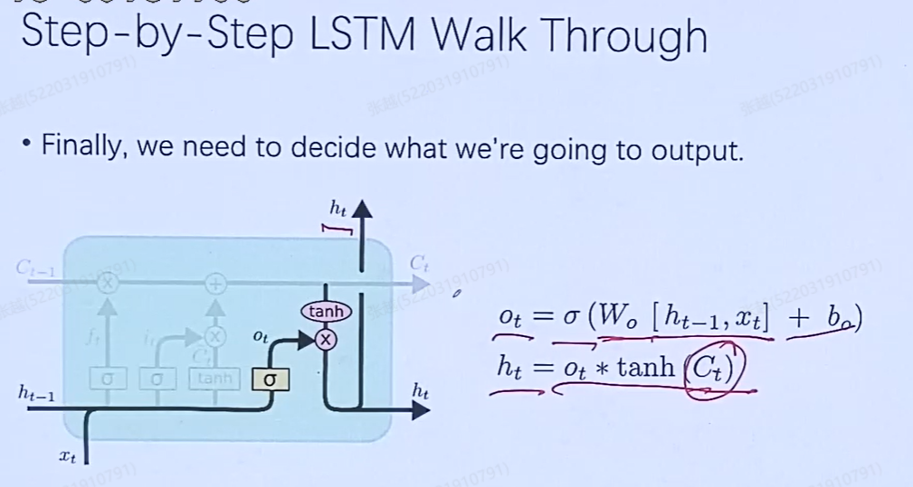


---
# 25 - Spark

### 对大规模数据做分析，在内存中进行，比较快速

### 支持的语言很多：JAVA | PYTHON | SCALA

### Spark本身用Scala写的， 用Java代码量是其6倍

***

## Spark 的主要构件

 1.  **批处理 / 流式数据：Batch / Streaming data**

    - Batch data 和之前看到的 `Hadoop` 里面做 `MapReduce`是一样的

    - Streaming data 始终是源源不断的来，没有开始没有结束，因此与 Batch 的处理不一样

      

 2. **支持 SQL 的操作**

    - 底层的数据实际上不是结构化数据的表，不是关系型数据库的表

    - 实际数据是以 `RDD` 或者 `DataFrame` 的形式

      > 把文件读进来实际上就是读成 **DataFrame**

    - 在 `DataFrame` 之上可以用 **SQL** 的方式去操作它

      > Spark 能够把 **SQL** 语句转化成对 **DataFrame** 的操作
      >
      > 因此不需要在 **DataFrame** 上记录很多专有的接口，只需要用 **SQL** 就能直接操作它

 3.  **支持机器学习和数据分析**

    - 目前用 `Pytorch` 或者 `Tensorflow` ，因此只是简单介绍一下

---

## Spark 优点

1. 性能表现很好

   - 使用内存计算，workloads 比 `Hadoop` 快了 100 多倍

     > Hadoop 在 MapReduce 等操作时重度使用磁盘 IO

   - 数据结构更简单

     > 使用内存，内存是一维的、线性的，因此数据结构可以比Hadoop更简单，比如一维一直去增长

   - **因为Spark是完全内存计算，因此对内存的需求比较大，如果内存开的太小，就会进行虚拟内存和磁盘间大量的换页操作，从而导致速度的降低**

2. Spark 拥有多用途的核心组件

   1. **Spark Core**
      - 支持让Spark跑起来，包括 `RDD` 这样的数据集，以及支持并行
   2. **Spark SQL**
   3. **Spark Streaming**
   4. **MLlib**（机器学习的库）
   5. **GraphX**
      - 专门对图数据进行加速处理，包括图计算、图上的机器学习

---

## Spark 实例：Log Mining

### 场景：有一个Driver（Master）和三个Worker，以及要读入一个规模很大的Log，需要过滤出其中报错的消息 (以下为SCALA代码)

1. `lines = spark.textFile("hdfs://...")`

**使用Spark的上下文环境，将 HDFS 中的某个文本文件读取进来**

- 这里要注意的是 lines 读进来的是 `RDD` （分布式数据集）在内存里， 是不可以改的

- 也就是说数据集被 Spark 加载进来后，本身的值就不能被修改了，意味着可以复用（例如不用担心多线程问题，在集群环境下就可以免除竞争、加锁的情况）

  

2. `errors = lines.filter(_.startsWith("ERROR"))`

   **类似Map的转换（transformation）操作，从一个 `RDD` 变成另一个 `RDD`，即过滤 lines 里面以 ERROR 开头的信息**

- 这里的 errors 转换并不会改变 lines 里的内容


3. `messages = errors.map(_.split('\t')(2))`

   **将 ERROR 信息中的部件分隔开，并取出其中的第二个部件，也即错误日志的messages，这是第三个 `RDD`**

   

4. `cachedMsgs = messages.cache()`

   **将messages给cache住**

- **为什么要将其cache住？**
  - 内存是有限的，把所有`RDD`放在内存里，那内存满了怎么办？此时有两种方法：
    - 一种是使用 `LRU` 把一些不使用的RDD直接抹除（Remove）
    - 另一种是使用 `SWAP` 把最远被访问的写到disk，把新进来的写到内存
  - 此时的 `cache` 就相当于在内存中做了一次  `PERSIST` ，此时上述两种操作就不会作用到这个 `RDD` 
  - 但是这也只是一个愿望，如果内存最后实在不够，还是会进行 `SWAP` 等操作
- **Spark是分 stage 执行的**
  - 在前三行代码执行过程中，Spark只是维护一张计算图，并没有进行任何的计算操作
  - 即使加载进来的文件不存在，如果没有运行第四行的cache，也不会报错
  - 只有进行到cache操作（跨stage），才会反推回去把前三行执行，此时才会报错加载文件不存在等错误
  - cache住的RDD是要持久化在内存中，而前三个RDD是为了产生cache的RDD产生的中间结果，此时就可以进行LRU或者SWAP，这是可以接受的


5. `cachedMsgs.filter(_.contains("foo")).count` 

   **把包含`foo`的拿出来，`count` 相当于 Reduce 操作，同样前半部分是一个 transformation，仍然不会立刻执行，而到后半部分的count （Action） 才会执行**

- 具体的计算（例如这里的 count）是要并行执行的，日志分部分加载在三个worker上，三个worker同时进行count，最后汇总
- 当然由于这里的RDD是被Cache住的，因此可以复用来计数其他内容，比如 bar ...


> **总流程 ：**
>
> **-> Log 被分成三个 Block 加载到三个 Worker上  （注意：从lines加载到后面的所有RDD是在三个Worker上都有的，逻辑上是一个，但实际是三个）**
>
> **-> Driver 派发任务** 
>
> **-> Worker 并行处理，将结果返回给 Driver**
>
> **-> Driver 进行汇总**
>
> 
>
> 具体怎么分成三块，以及并行计算后如何汇总，这就是Spark框架帮我们做好的了
>
> 总结来说：Transformation、Action、分stage执行、遇到stage边界后反向回推执行、RDD不可修改、RDD是分布式对象
>
> 除了第一步涉及磁盘读，其他所有都是内存操作（理论上）

---

## Spark 运行

### 至少要有两个节点：一个 Cluster Manager，以及至少一个的 Worker Node

应用程序通过一个spark context 提交任务给 Manager

Manager 会把任务派发给 Worker node 执行，执行过程中 Manager 要监控 Worker Node， 任务执行过程中频繁使用Worker Node所在机器上的 cache

最终结果会返回给 应用程序


由于集群的运行被 Cluster Manager 屏蔽掉了，因此在外部看来就是在多线程上运行的应用程序

- Worker Node 需要可以被 Manager 网络寻址 （network addressable）
- Manager 上要跑某一种集成管理工具，例如 YARN / Mesos / Kubernetes / Zookeeper （Manager 内置）
- Manager 运行方式分为 Standalone / Apache Mesos / Hadoop YARN /  Kubernetes
- Manager 同时也负责 监控 和 任务调度

**Spark 提交执行脚本：spark-submit script**

- (spark-submit 所在路径)/spark-submit --class "运行的程序主类名" --master (master启动的URL) target/(打好的jar包)

> **流程总结：**
>
> 1. **写好一个应用，打包成 jar 包，丢给 script 脚本 （驱动程序）**
>
>    > 注意直接运行应用会报错 `找不到主类`，必须打 jar 包丢给 script 脚本
>    >
>    > SCALA 也是jar包， PYTHON 是 py 脚本
>
> 2. **通过 submit script 交给 Cluster Manager**
>
> 3. **Cluster Manager 找到 可用的 Worker Node 进行 任务分发 、 调度、 监控**
>
> 4. **Worker Node 中的 Executor 执行 任务 （ Job），通过一堆的 Task 执行得到，并且执行过程中要写一个DAG，分stage执行**

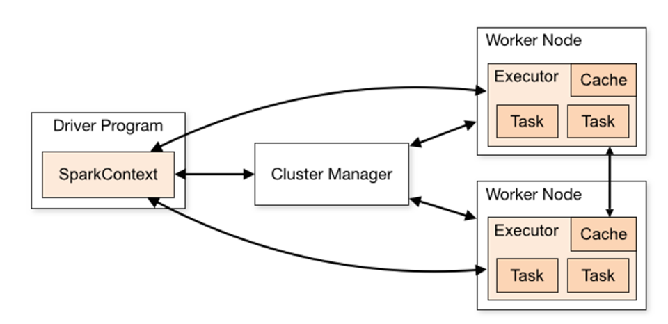

**Spark 还支持 SCALA 版本 和 PYTHON 版本的 命令行 shell， 分别为 spark-shell 和 pyspark，这里的具体操作可能不重要，因此我在笔记最后和三种版本的Spark 代码一起贴个图**

---

## Spark RDDs 弹性分布式数据集

### Resilient Distrubuted Dataset

- 弹性：可以很大也可以很小
- 分布式：逻辑上是一个对象，但可能分布在多个节点上，最大的特点是在多个节点存一个数据集可以并行处理
- 如何获得一个RDD：
  - 调用 （SparkContext的`parallelize`方法）`sc.parallelize`就可以把一个数组等变成一个RDD
  - 调用 （SparkContext的`textFile`方法）`sc.textFile`就可以加载一个文件成为一个RDD

1. **RDD 一般都是分区的 （Partition），可以 load 到一个 集群里面，一旦 load 到一个 集群，将来运行一个任务时会对每个partition都有一个task**

   

2. **RDD有 Transformation 和 Action 两种操作**

   - Transformation : 将一个 dataset 变成 另一个 dataset （典型：Map）

     - **所有 Transformation 都是 Lazy 的，不会立刻执行操作，而是等一个 stage 结束 或者 遇到一个 cache，才会反推执行所有内容**

     - 包括 **map 操作**：对 RDD 中 所有的内容 做一个 映射，比如平方...

     **flatmap 操作**：类似 机器学习中的 flatten 层，在做摊平操作（比如对["hello world", "hi"] 做 flatmap 会得到一个一维数组，包括 hello、world、hi 三个词

      **filter 操作**：做筛选，比如选出所有的”error“

      **union 操作**：做合并，比如将 errorsRDD.union(warningsRDD) 得到一个 badlinesRDD

     - 以上操作**均不会改变RDD，只会创建新的**

   - Action：对 dataset 进行计算 并 返回一个值 给 driver program（典型：Reduce）

     - 包括 **reduce 操作**：对 RDD 中的内容 做给定操作，比如求和
       	 **count 操作**：做行数的计算

       **collect 操作**：统计 dataset 中所以元素并返回一个数组

   - **为什么要把操作做上述两类区分？**

     - 计算是分 stage 的，在 stage 内部是一个 lazy 的计算方式，stage 告诉我们什么时候开始计算

3. **Spark 中触发事件的操作 ：Shuffle （类似 Hadoop）**

宽依赖会触发shuffle操作，Shuffle 会将数据从上游任务（Map 任务）的输出重新分区并传输到下游任务（Reduce 任务）。

reduceByKey 会在 Map 端（本地）先对 Value 进行局部聚合（Combiner），然后再将部分聚合的结果传输到 Reduce 端，从而相较于groupByKey减少数据传输量。

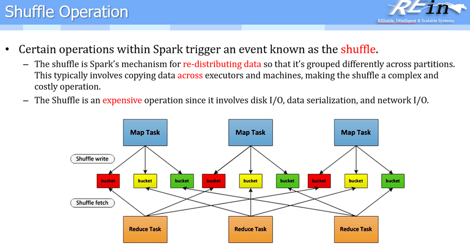

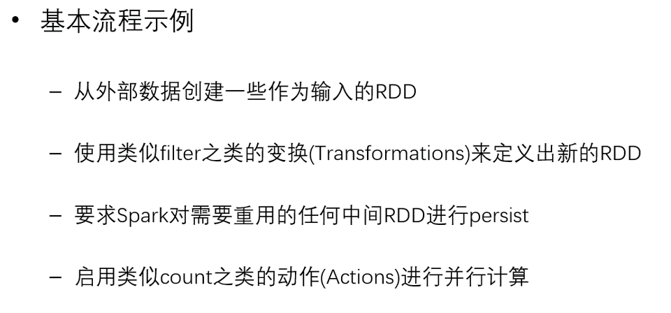

---

## Spark 分 Stage 计算

### 用一个例子来看：

> **假设程序在内存中持有一个非常大的用户信息表（UserID，UserInfo），其中UserInfo包含用户订阅的主题列表**
>
> **有一个很小的表，是过去五分钟内用户在网页上点击链接的事件（UserID，LinkInfo）**
>
> 这两张表看起来是通过UserID关联的表，但实际上是两个RDD，不是关系型的表
>
> **程序周期性地对两张表做`合并`和`查询`**


1. **No Partition**

   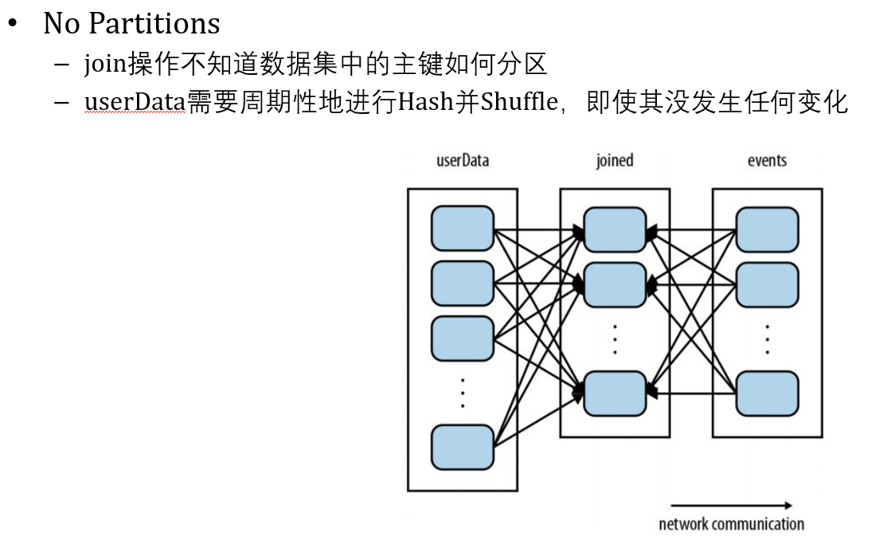

   - 如果不做分区，用户数据只是按照加入进来的顺序进行切分，那么数据是没有什么规律的，因此若要查询用户A的点击事件，需要在events集合中全都查找一遍才能生成join操作中的一块数据
   - 如果要生成两张表的join结果，就需要用userData中每个数据找一遍events中的所有数据，**效率很低**

2. **Partition**

   **在加载（UserID，UserInfo）时，使用哈希进行分区**

   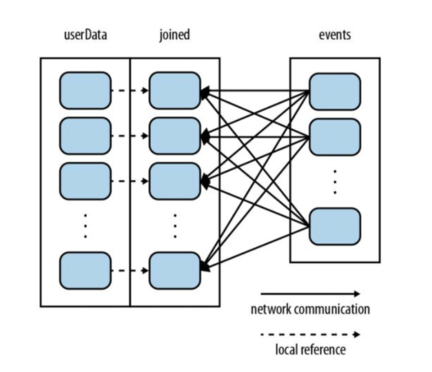

   - 和之前的差别在于，不做分区时，同一个用户信息可能分布在不同批次加载进来的数据中，因此join需要遍历userData
   - 而采用了 Partition 后同一个用户就只用到一个块中找，**join子分区只依赖于一个userData父分区**，得到了一个**性能优化**

## Dependency 依赖的类型

- **窄依赖（Narrow Dependency）**
  - **父分区的每个RDD只被子分区的一个RDD使用**（注意不要反）
  - 上面的 join 和 userData
  - **而且如果在分布式环境下，同一个窄依赖可以放在同一台机器，从而提升性能**
- **宽依赖（Wide Dependency）**
  - **父RDD的每个分区都可能被多个子RDD分区所使用**（一个父指向多个子）
  - 上面的 join 和 events
  - 性能差

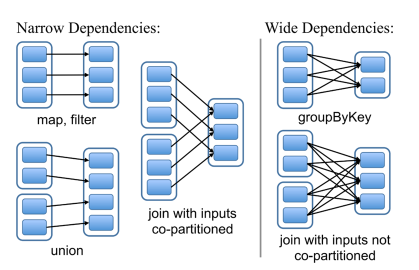

**上图中左侧是 窄依赖 ， 右侧是 宽依赖**


## 窄依赖 和 宽依赖 对比

要注意的是**宽依赖是不可避免的，但是我们应该尽可能使用窄依赖**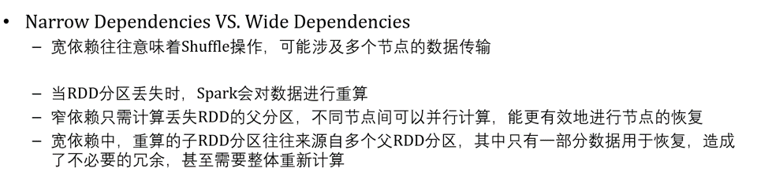


## Stage

**将整个计算画出一个DAG图，将其中窄依赖尽可能放在一个stage**

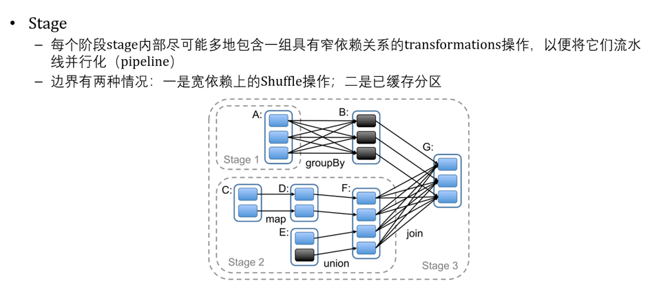

**以C开始为例：C->D/E->F均没有跨stage，因此当执行到G时，stage2结束，才会回推执行CDEF**

- **好处**
  - 只要执行一个操作，如果是 Tran：
    1. 一定要创建一个新RDD，如果stage很长，那**在很早的时候就计算出RDD**就会**占用、浪费内存**，而当跨stage后，不得不用前面的RDD去计算了，再让前面的RDD去计算
    2. 并且 stage 内部是窄依赖，一个分区只依赖一个分区，并且几个分区可能在同一台机器的内存中，速度很快，因此**在结束时才计算**就可以**节省内存占用**

- 上图中**黑色部分是进行cache**，**为什么E中有个分区进行了 cache 但是没有单独分一个 stage**？
  - 因为之前没有用到RDD，也就是说这个cache实际上是被直接拿来复用的，不是依赖于RDD生成的cache操作

## RDD Cache（Persist）

**RDD Cache 分为以下几种内存存储逻辑**

- **MEMORY_ONLY**：始终放在 内存，如果放不下会把其他RDD移除或者放进DISK，等到用到再重新计算或者拿回来
- **MEMORY_AND_DISK**：可以放在内存里，不适合放内存的时候可以把一部分分区拿到DISK
- **MEMORY_ONLY_SER** (Java and Scala)：只放在内存，并且RDD对象是一个序列化之后的对象，将来可以用于在不同服务器之间传输
- **MEMORY_AND_DISK_SER** (Java and Scala)：跟上面的对应
- **DISK_ONLY**：只放在DISK
- **MEMORY_ONLY_2, MEMORY_AND_DISK_2**, etc. 和上面一样，只是要把每个分区放在两个node做备份
- **OFF_HEAP** (experimental)

**当数据要被移除时通常用 LRU， 也可以用 unpersist 做一个反向操作来处理掉**

---

## Spark SQL

**底层放在一个RDD 或者 DataFrame 中， 可以用 SQL 语句来操作**

- RDD 是一个完整的对象，比如一个person就有name、info等等
- DataFrame 是一个结构化更好的数据对象，有列式结构，结构化更好（也是创建好就不能修改了）

**如果对 SQL 更熟悉的用户，使用Spark也很方便**

---

## Structured Streaming 流式数据处理

**数据源源不断的来，如果存入一个表中，这个表就是在无限增长，如何进行word count类似的操作呢**

- 微观上仍然是 Batch 批处理
  - 增量式处理，某个时间点对距离上一次处理之间新增的输入 / 对原来输入的更改 进行处理和返回，处理结果会一直保留
  - 总体来看是流式处理，微观上看是批处理（增量式）

**数据可以通过 kafka 等工具传入**

- 数据传进来后会被切成一个个小批量的批数据来传入Spark Engine，时间间隔很短，每个批数据的处理是增量式的而不是孤立的，看起来就是一直在流式处理

**在数据湖中提到过的流批一体在Spark也可以做**

---

## Spark 中的 MLlib 和 GraphX

重点在于做并行，虽然现在大多使用pytorch等张量计算，但是对于非张量处理（随机森林、决策树、逻辑回归）可以用MLlib

GraphX就是将节点和边分别存在两个不同的RDD中，这样就可以将图做的很大

---
# 26 - Storm

## 专门基于流数据处理做的框架

---

## Storm 框架

- 数据源（Spout）就像水龙头，不断输入数据，可以来自队列或者数据库
- 中间有一些处理节点（Bolt），对流入数据进行处理，解析图片、文本、统计字数等
- 处理完后交给下一个处理节点进行处理，处理在微观上仍然是批处理（类似spark）

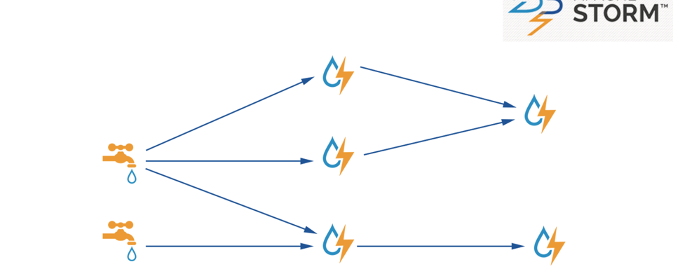

输入源+处理结构，是一个**计算的DAG图**，也叫一个**计算拓扑**

---

## Storm 运行逻辑

**和Spark、Hadoop非常类似**

- 默认使用**Zookeeper**进行集群管理
- 由 **Nimbus** 作为管理节点来管理一堆 **worker**
- 每个**Worker**上有一个 **SuperVisor**，作为监听器监听 Worker 上的内容和状态并汇总到 **Nimbus**
- 一个 **Worker** 中分了许多 **Slots**，一个 Slot 可以理解为单独执行一个任务的一个进程，受 **SuperVisor** 监控
- **Nimbus** 根据 **SuperVisor** 的汇总进行 **Worker** 的统一调度

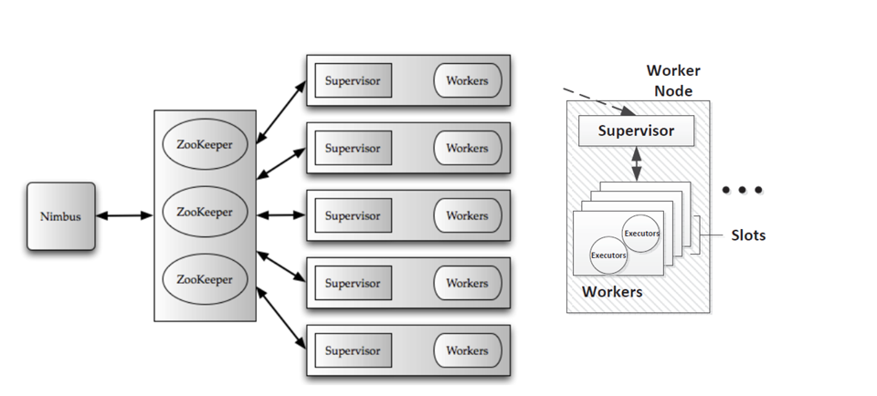

---

## Storm 集群中的组件

**与Hadoop 集群很像**

- 与 Hadoop 不同的是，Storm不是运行 `MapReduce` 这样输入给好的作业job，而是运行 `topologies`
- `topologies` 和 `job` 在逻辑上很相似，但是区别在于 job 最终会 finish，而 topologies 是永远没有停止的

**同样需要一个 master 与至少一个 Worker Node**

- master 节点上运行 **Nimbus** 进程，与 Hadoop 的 **JobTracker** 类似，负责在集群中分发代码、将任务分配给机器以及监控故障
- 每个 worker node 上运行一个 **SuperVisor** 进程，负责监听机器的工作状态，以及接受 Nimbus 命令来启动或者停止机器运行
- 每个 worker node 上运行 **topologies** 的一个**子集**，topologies 通过这些 worker 来执行和传播
- 所有 Nimbus 和 Supervisor 之间的联系通过 **Zookeeper 集群**实现（机器挂了等等...)


---

## Storm 中的 Topologies

**一张 DAG 计算图**

其中包含处理节点 bolt 与 源节点 spout，这些节点共同构成了 stream 流

执行方式类似 spark，也是使用脚本来跑

`storm jar all-my-code.jar org.apache.storm.MyTopology arg1 arg2 `

- 这将运行带有参数 arg1 和 arg2 的类 org.apache.storm.MyTopology
- 该类的 main 函数定义拓扑并将其提交给 Nimbus。
- storm jar 部分负责连接到 Nimbus 并上传 jar

### Data Model

Storm 使用 `tuples` 作为数据模型，即 a named list of values

**下面是一个Bolt 的实例**

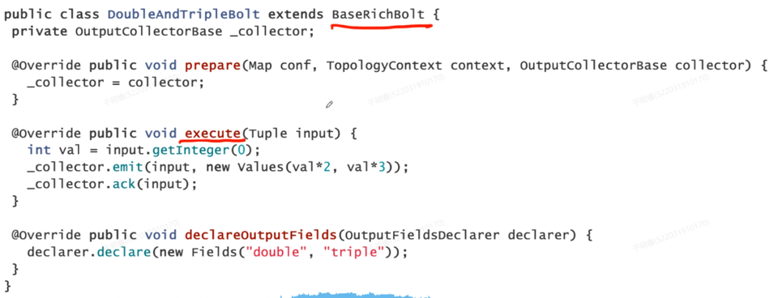

**以及多个 Bolt 如何 结成一个 Topologies**

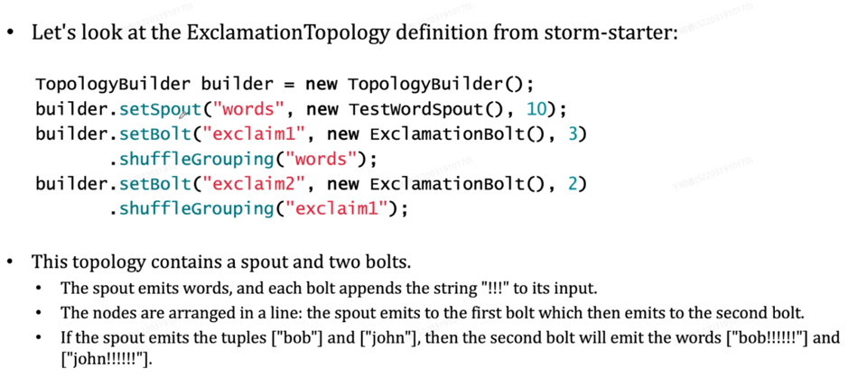

其中构建了一个 包含 1个 spout 和 2个 bolt 的 topologies，其中的 10、3、2是传给处理函数的参数

**最终运行效果类似 Spark 的宽依赖执行：**

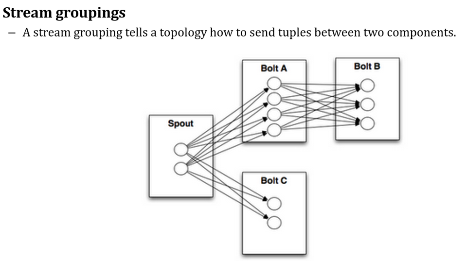

---

## Zookeeper

**前面一直讲的 Zookeeper 到底是啥**

- 监控集群中的所有机器
- 会在所有机器中选一个 leader，通过心跳来管理其他节点

---
# hdfs & hbase

## hdfs
来源：谷歌写的一个分布式文件系统的实现。

### 特征：
- **专门用来存大文件的,至少大到需要分成不少block，小文件别用hdfs**
- 流式数据访问,在写入时**最好只写入一次(定位block困难，修改后可能block大小变化。并行写存在问题,最好有个写入器写)**(读可以多次),**数据不适合做修改**!
- 廉价硬件:经常是使用一堆廉价硬件来实现的.

### 不合适:
- 数据不大的时候不适合.
- 对数据读写有低延迟要求时也不适合.(hdfs的写入效率和读入效率都不算高)
- 如果想多人写入/修改数据的时候不适合.

### 适合:
- 如视频这类是可以的,存电影这类是可以的,不修改,也很大.
  
---

## hdfs的架构:
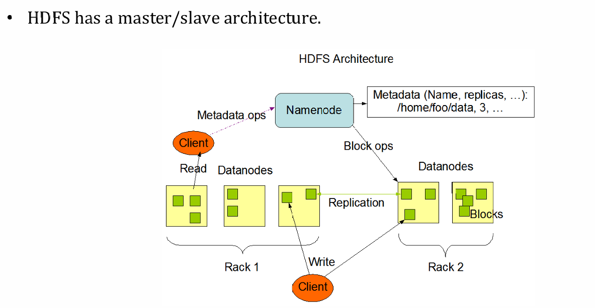
上层节点进行元数据处理(比如怎么切block,切出来的block放在哪里之类的),底下的节点是实际存储数据的节点.
用户过来会先到上面去操作元数据,namenode在metadata里找到相关信息后返回给client的jar包,拿到信息后拿着客户端去底下读数据,namenode只操作元数据,实际数据和namenode无关.

### 副本情况:
副本主要两种,同一个基架下的副本和不同基架下的副本.----这导致读操作的时候可以负载均衡,而写操作需要对全部副本写入.(流水作业,因此浪费时间).

### 启动与心跳
启动集群先起namenode再启datanode.通过datanode发心跳给namenode来确认datanode.(确认活着进架构,确认副本规则不被破坏),没收到心跳就认为死了,把数据发给其他节点.这里的心跳中还含有bolck-report:报告自身的data情况,帮助namenode把控block数据的情况.
整体还是**master-slave架构**,namenode是master,datanode是slave.
一般来说namenode会专门拿台机器跑,和datanode分开.datanode一个机器上可以跑一个或者多个.(但实际上跑多个没啥意义,跑一个一般,但也不排斥就是了)

### 一些小点
namenode里设置的副本数量不是一个全局的超参数,实际上你可以给每个文件单独设置.设置越多,可靠性越高,浪费空间多,写入效率降低.存储block的时候是可以分开存的,同时block的参数都可以设置(namenode上),但无论如何,写入都是一次性且单个写入头写入,eg:
- 我要写数据了:client->1->2->3,然后每个都写完了再报告上一级自己写完了:3->2->1->client.

### 基架感知
它一定会把副本帮你相对分配到各个基架上,而不是塞到一个基架里.(鸡蛋不放进同一个篮子)当然这样做会提高写的代价.(网络距离变大了),哪怕replica超过4进入随机选基架模式,也不会roll到同一个基架上,它一定是分散开的(类似mongodb的mongos).

### safemode
namenode刚启动的时候(注意到之前提过它是第一个启动的),处于一种安全运行模态,等着底下的黑奴datanode发心跳和block-report,安全模式不对外提供访问,等到block的replica达到要求才退出安全模式.**简而言之就是刚开始的时候先封闭整个系统的对外访问,等到实际运行起来才开放**.

### editlog
可以简单类比为mysql里的log一样,记录你对文件系统的操作,先写日志,再实际操作.由于hdfs是在本地文件系统的上层,所以启动hdfs本身也需要被记录,这份记录就记录在本地文件系统里.至于其他的存fs image文件里,这个也是在本地文件系统,这俩核心部件都不在hdfs里的.
启动后会**先把上次可能的还没做完就退出的操作(但是记录在日志上的)先做了,然后确认hdfs状态和log状态一致后就可以删日志了(避免日志越来越长)** 上述的清理日志功能也可能由checkpoint来做.

### robustness
- datanode心跳缺失时标记死亡，将对应文件在其他节点上再建立副本
- 机器上数量不平衡的时候会做一次再平衡操作.
- 为了保证数据的完整性,一般会生成checksum来校验.(单独文件存)
- 而上述的两个核心log也有副本,防止这两个核心部件出问题,且副本是**时时同步的**.
- namenode和datanode中间的协议走的tcp/ip协议.任何⽂件都会有⼀个crc校验码, 避免传输损坏/恶意篡改.写pipeline, ⼀定要全部写完,读负载均衡.


读写示意图:(实际的过程上述已经描述过了)
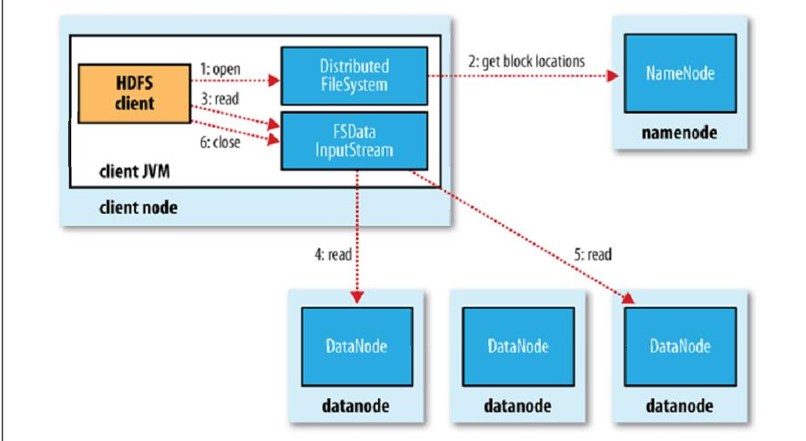
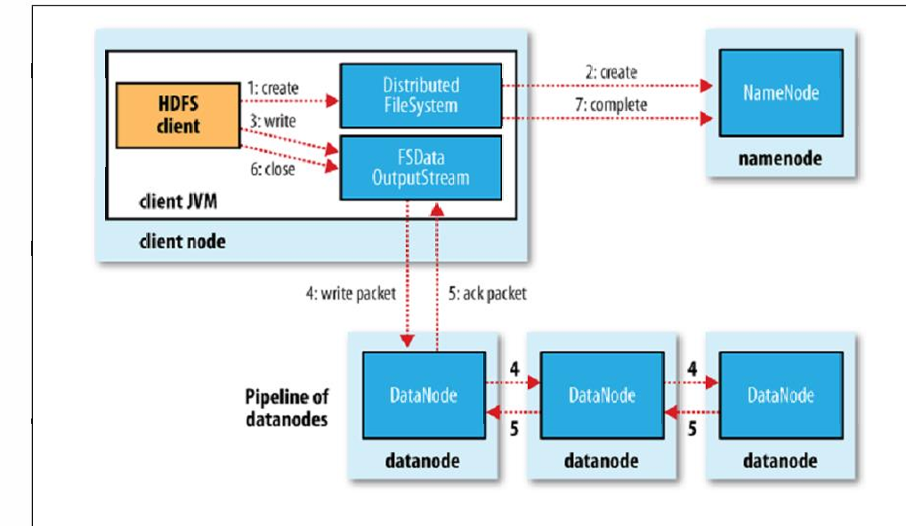

## hbase
- 来源:hadoop中的bigtable的开源实现.
- 存结构化数据和半结构化数据,没关系型数据库的结构要求这么高.本身的数据存储也可以分布式存储.
- 含有布隆过滤器帮助加速.
- 对第三方网关有支持.
- 支持auto sharding
- 支持谓词下推，数据存在三个不同服务器上我要求平均值，运算下推在服务器端
- 支持map reduce

### 面向列存
- mysql不垂直分区是因为行存。hbase列存导致hbase支持垂直分区,还有列族的概念.存的数据是有版本的.(建立在hdfs上)
- 行列交叉点称之为cell,cell是带版本的.可以通过时间戳或者版本向前追溯数据.在hbase里,key是严格有序的.
- 行key是字节数组，不能由几列合起来
- 主键完全有序，分区时不同tablet放不同服务器上，tablet在某个区间内分配在同一个服务器内
- version(timestamp)还有⼀些时序保证,例如字段的时间戳倒序, 还有例如在t4时刻发出的数据请求, 在t6时刻被处理, 保证不会读到t5的数据(类似MVCC, 找第⼀个满⾜时序的version)的因果保证
- 列族支持动态加入到表里(同理,列也行),每个列都属于某个列族,所以这会导致可能不同行的列数不同,有些行不具备某些列.(**列族数目不建议超过三个!!!!**)因此是支持按列分区的(竖切)
- 当然也支持横切,得到的产物被称为region,而region-server就和hdfs里的datanode基本一样了,而root就类似namenode,会记录元数据.
- 改写表原数据需要获得root的锁
- **稀疏处理**：有时为了节省空间,当一段时间没变时,这个时间戳就不记了,比如t1,2,3,到t7才变,那可能中间的t5t6就没记下来.
### 经典例子之webtable
每⼀⾏是⼀个⽹⻚, 然后例如url这种数据和版本号匹配很好.

大致结构如下:
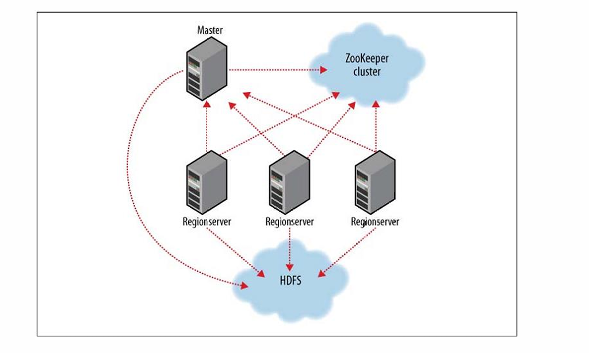

- ## transformer
论文结构如下,主要结构是编码器和解码器.
编码器接受输入并提取特征,解码器根据特征分析输出.
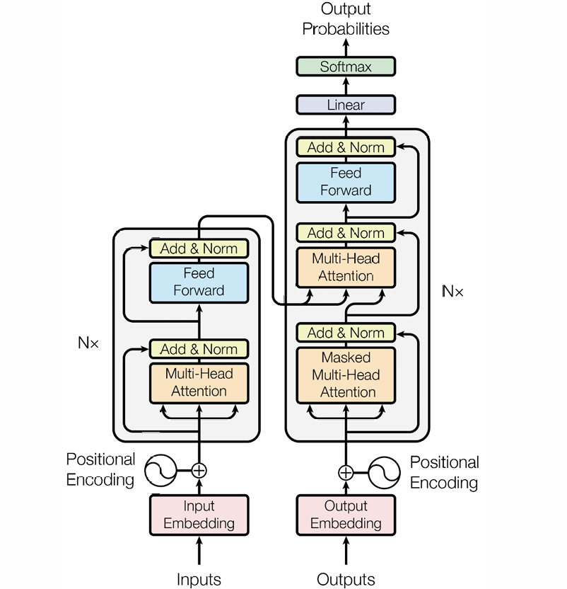
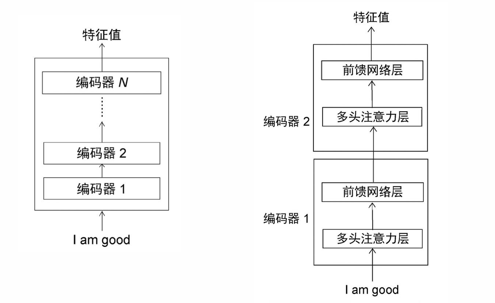
三个关键矩阵:查询矩阵,键矩阵,值矩阵:用于计算输入的特征之间的相关性.经过矩阵乘法,缩放,softmax函数（上述的具体过程并没有细讲）,最后得到了注意力矩阵(组成编码器).一般编码器有多个注意力矩阵.
最终效果示意图：
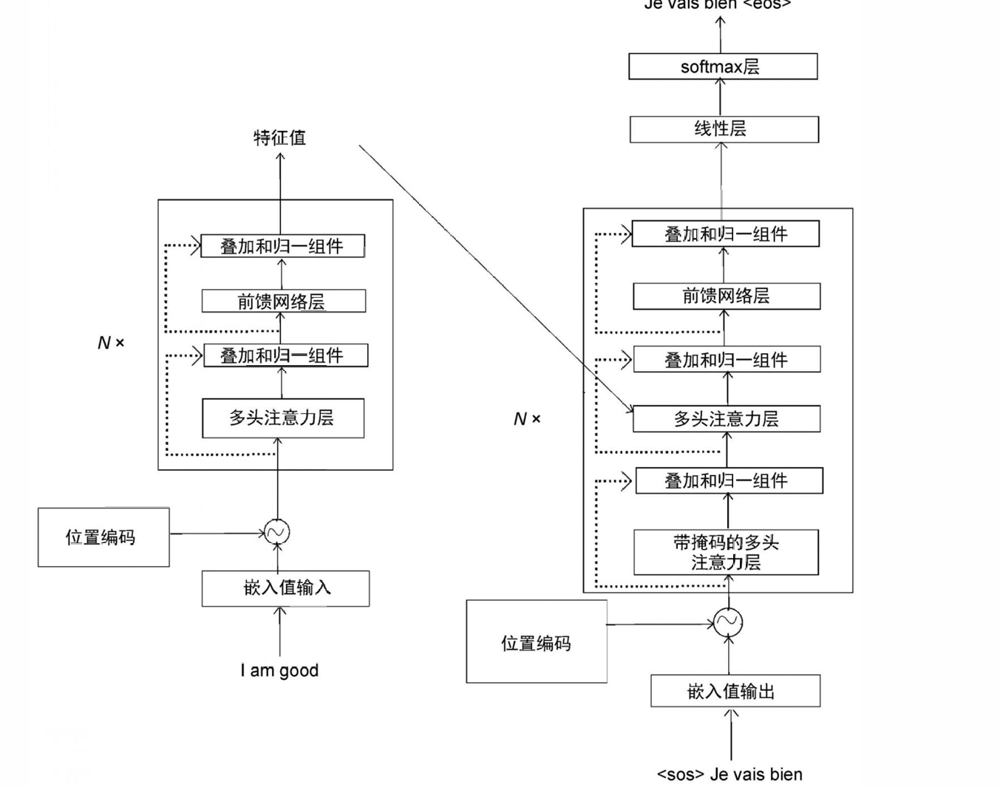

---

# Hive
Hadoop框架下的数据仓库，很多大厂还是使用hive进行存储

## 数据仓库与数据库的区别
### 1. 最大的区别是他是schema on read：Load一个data的时候不做任何校验，当发生查询的时候才会发生ETL操作
hive底层是HDFS，大量数据使用原始文件存储在HDFS，hive在上层读取它的内容，转化成同一个中间格式（parquet等），在上层使用类似sql的语句访问。

ETL操作：Extract, Transform, Load

**问题**：数据格式不是很好可能会有缺失，比如csv会有格子NULL，他转化为parquet会不会质量不行，什么时候做检查？

**回答**：LOAD DATA语句只会将文件加载进HDFS，只有当执行sql语句访问这个文件时才转化为parquet。转化需要的信息（如这个表格有哪些列）存储在metadata store里。

**schema on read优点**：数据会源源不断地进来但未必会使用，不要在加载的时候浪费大量的时间。数据湖也是类似。

mysql是schema on write，数据写入时进行校验，比如Not NULL列检查是否为NULL

---
## Running Hive
derby是内存数据库，存metadata
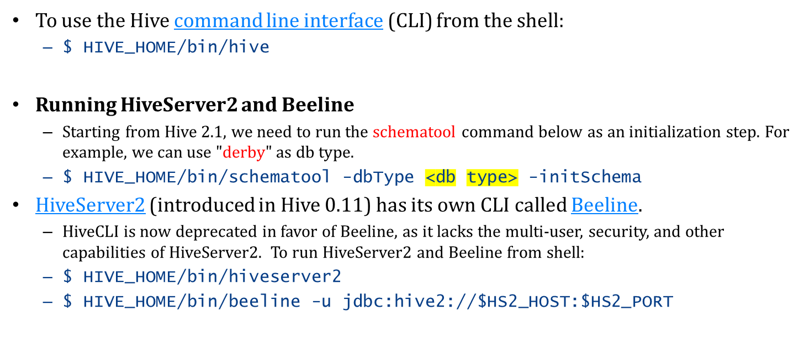
<span style="color:red">省略了配置运行的教学内容</span>

## Hive partition and bucket
**partition**分区，Hive存储在分布式文件系统里，所以需要分区。和sql一样按照range或key分区

**bucket**是在分区的基础上再分区，1. 提高查询速度，2. 方便进行采样：
比如机器学习分割测试集，4个bucket抽80%训练集，希望抽出的数据符合整体数据的男女比例。
假如这时候bucket已经按性别划分了前两个为男性，后两个为女性，则每个bucket采样80%则满足抽样的比例

---
## parquet是一种列存
数据仓库经常做的是OLAP（在线分析处理），大多数时候针对一列处理，比如统计订单数量、销售总额

## parquet是一次性写入
不会在原文件上做修改。但是可以插入

---
## 存入sql不好吗，hive的优势在哪里
### 1. mysql必须是结构化表，hive可以是表也可以是csv,excel,txt
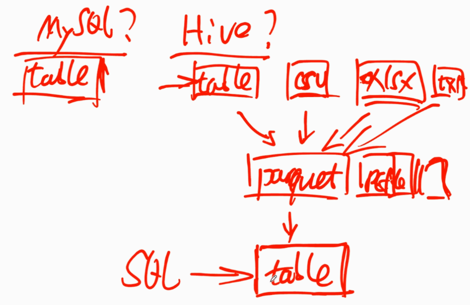
图中：parquet、RCfile是两种不同的中间格式。意思就是hive会源文件->中间格式->表，在表上面进行sql操作。

---
## metastore
和hive server一起跑或者分开跑，两个hive server可以共用同一个metastore。

---
## 支持的file format以及很多都是列存
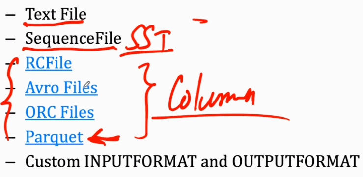
标Column都是列存

### 1. 行存：每一行的数据在存储中是连续的
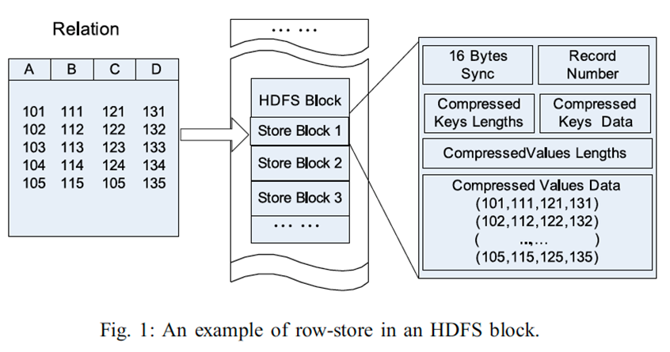

### 2. HBase列族
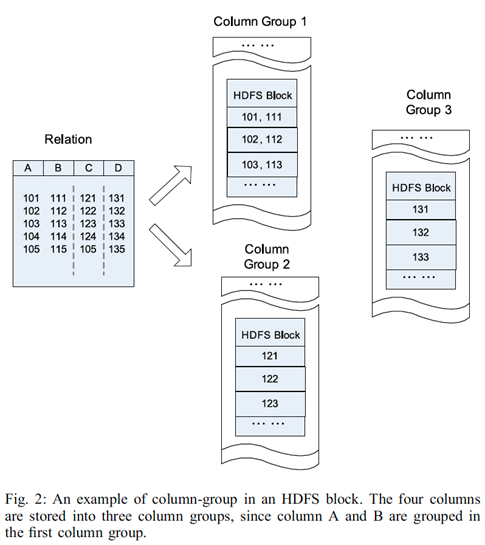
这还不是RCFile

### 3. RCFile列存
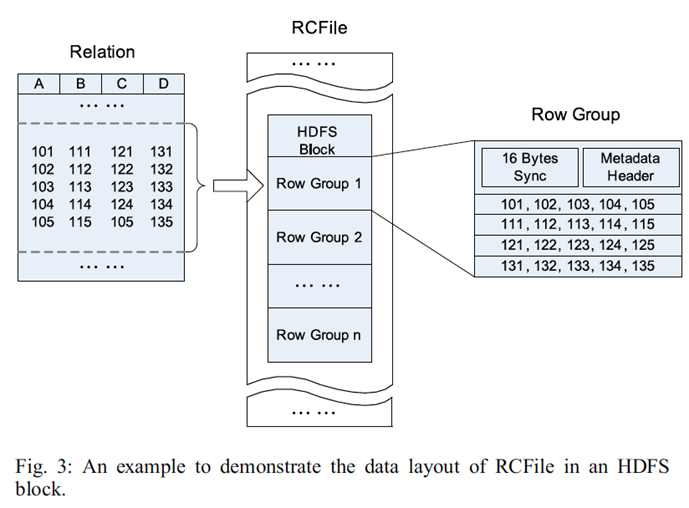
row group之间是行存，row group里面是列存

### 4. ORCFile
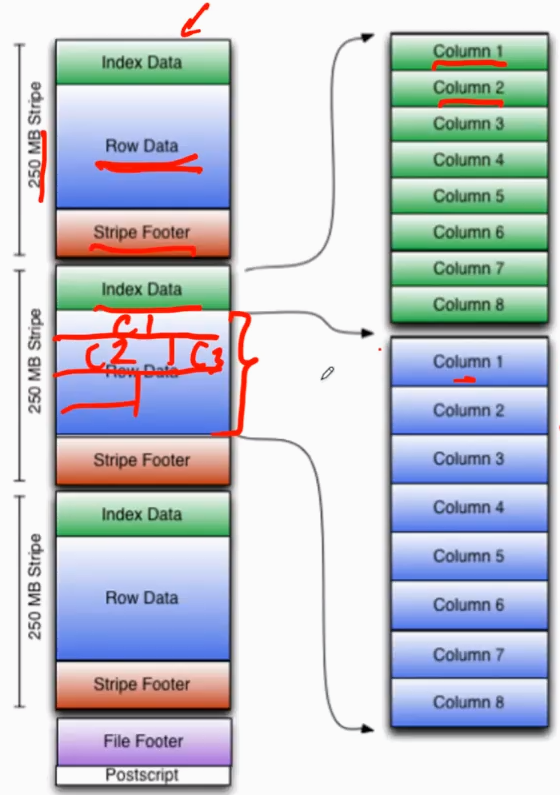
每个列如红笔标注依次存储，绿色记录每个column的起始offset

### parquet
类似的方式存储，但会做一些压缩。列之间的数据比较相似，可以采用类似事件序列数据的优化。

比如在重复数据较多时，可以采用bit vector来表示哪些行是某个数。需要权衡解压缩的时间。

# Flink
大互联网公司都在用的流式数据处理工具，处理有状态的事件流

## 流式数据处理的基本方法
在一个小的时间窗里执行批处理，当时间窗足够小的时候看起来像流式处理。
可以有边界，可以源源不断。可以实时，可以记录下来之后处理。需要支持有状态的处理，比如处理第3个数据需要用到处理前两个的结果。

## 状态怎么维护
内存或硬盘上，每个机器只能访问本地的。为了防止在内存或硬盘里丢失（为什么硬盘里会丢失），需要周期性增量性的快照。

### 如何做checkpoint
流里有一个栅栏事件，当栅栏事件进入operator，则会暂停当前流。当operator所有流栅栏都到达后，则记录状态。

**问题**：暂停会不会很浪费？
**回答**：在遇到一个栅栏时找另一个栅栏，并将未处理的部分，包括未输出的output buffer都记录在状态里。这样减少等待但是需要记录的状态更多
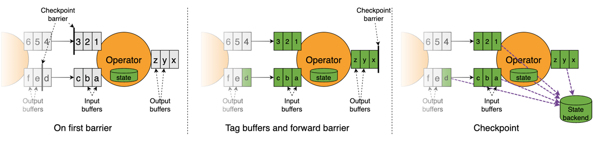

checkpoint存储使用RocksDB

### 记录的状态有哪些
1. 当前事件流处理到了哪个事件。
2. 如果一个operator处理多个流，则要记录每个流到了哪个数据，即记录栅栏的位置。
3. 最终的结果(sink)
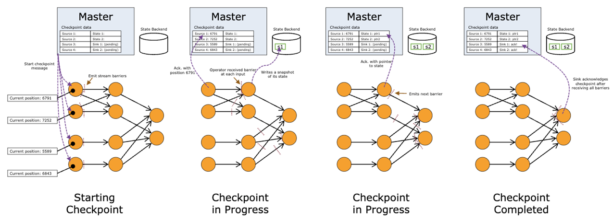

## 时间是怎么描述的
所有事件必须打上时间戳。有一些不同的时间概念，事件产生的时间，处理时间

### flink time-related feature

- 事件是什么时候产生的
- 水印事件，不代表任何语义动作，代表一个时间
- 处理的时候时间显得不一样，比如function同时处理两个event1，event2，分别有不同的t1，t2
- （无讲解）

### flink api
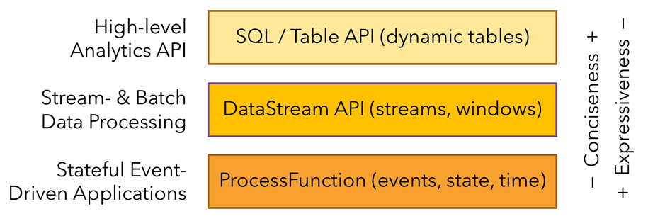
- 关心业务可以用最高层的，类似hive采用sql，数据以表呈现但是是动态表，数据更改非常快
- 不是最高层，想控制流的处理过程
- 想把流放大，流是一系列事件构成的，我直接操作处理函数

<span style="color:red">代码演示内容只贴了代码</span>
#### 1. ProcessFunction api example
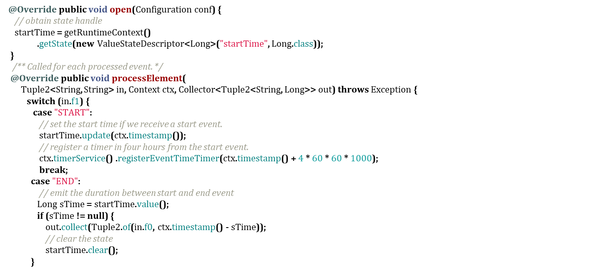


#### 2. DataStream api example
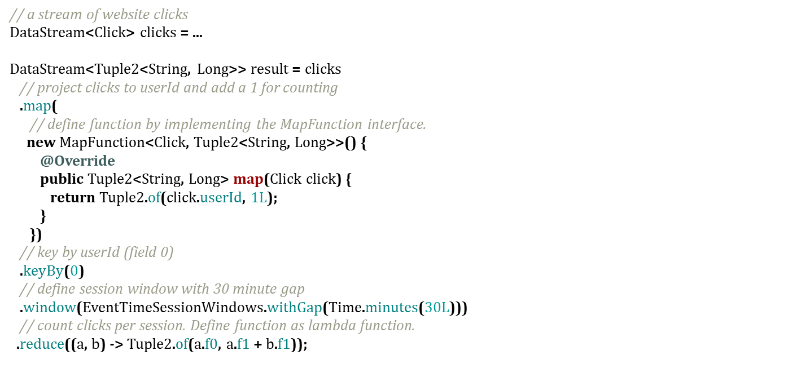

#### 3. SQL

点击事件30分钟分一组，最后得到每30分钟每个userId点击了几次

### watermark
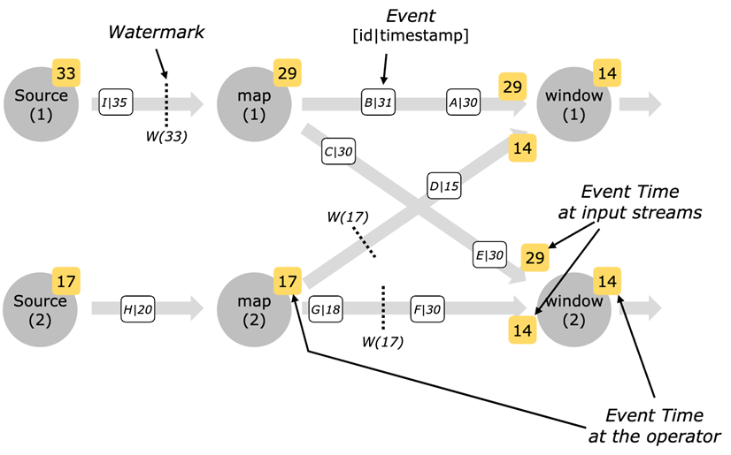
Source(1)处理过的时间是33，他只记录watermark时间，意味着这之前可能是乱序的，但33之前的我肯定是处理过的：即我之前可能处理过34，但是我不会没处理32。

同理Source(2)处理完的是17，map(1)处理完的是29，map(2)处理完的是17。

14和29同时到window(1)，则window处理完的只能是14。

### window
每固定时间作为一个时间窗：有可能有些时间窗很多，有些甚至没有

每固定个数的时间作为一个时间窗：遇到稀疏事件时，他的第一个事件就会显得不够实时

### architecture
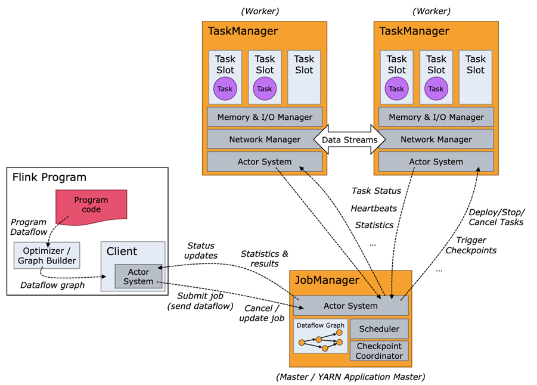
一个master多个worker，每个worker一个taskManager，一个taskManager多个task slot进程，一个task slot多个线程（spark、storm都是单一任务）
