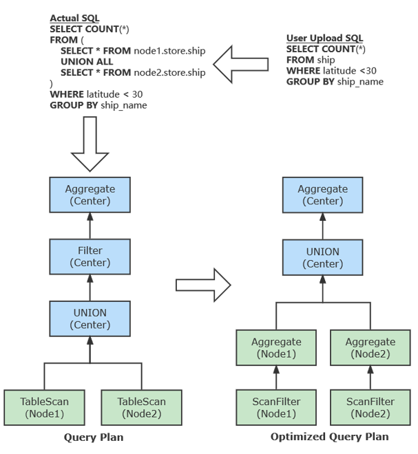

# Data Lake
之前的数据库例如MongoDB、InfluxDB都有云数据库，注册一个账号就可以用，但是现在有一些不同数据库里面的数据，需要放到一个系统里面，未来要做OLAP。那么就有一种软件叫做Dataware House（数据仓库），作用是接一些适配器，每个适配器负责一个数据库的数据读取，读进来以后放到一张表或者一个立体一样，将来分析的时候直接在这个多维的数据表上面分析。但是在这个分类读取和整理的过程中耗费了大量的代价，一般都要经过三个过程。E（extract），把数据从原始的表里面提取出来，T（Transform）把原始的数据转换成统一的单位，L（Load）加载到统一的表里面，如果原始的表很大就会非常耗时间。但是假如不知道什么时候对于这些数据进行分析，那么只需要把这些数据存放下来即可，等到需要分析的时候再去做ETL，那么数据湖就是解决这样一个存放数据的问题。  
数据湖是一个存储池，存的时候没有ETL的操作，就是按照数据原来的格式，一般来说是图文件或者较大的文件，还需要有一个元数据去描述它的格式。里面包含结构化的数据，也可以是非结构化的数据。  
湖的前方会有一个类似于Flink这样的工具，把数据接入进去存放进去，然后配一个metadata描述他在干嘛，要访问的时候先去读取metadata，看是什么格式，是不是自己要的，找到之后再去做ETL。  
但是假如用户的Query语句设计了MySQL和MongoDB两个数据库的内容，需要在元数据里面发现操作的数据集是这两个，要把SQL语句转化为这两个数据集的调用，但是有专门的工具，例如calcite。  

# Delta Lake
数据湖里面有几个不同产品。最常用的叫Delta Lake，它支持各种结构化、半结构化、非结构化的数据类型，可以高速接入各种类型数据并且保真存储，原来的格式是什么就存什么。它的处理可以是实时处理也可以是批处理，可以用SQL或者第三方的语言去进行分析。分析的方法是把所有数据转成统一的格式，例如Parquet这种二进制格式，几乎所有数据库都支持把他们的数据转换成这个格式，那么也就是说，它可以成为一个数据交换的一个标准。

# 数据湖和数据仓库的区别
|   | 数据湖  | 数据仓库  |
|---|------|------|
| 数据格式 | 原生的 | 经过处理的 |
| 数据使用时间 | 不是现在 | 现在正在使用 |
| 用户 | 数据科学家 | 商业处理 |
| 能力 | 高可用性和可更新性 | 更复杂、修改更花时间 |

# 演化历程
HDFS（集群）->YARN（分布式计算框架）->数据湖  
HDFS批处理无法满足实时性要求高的场景，因此产生了lambda架构“流批一体”。流是源源不断的，因此需要加一个实时处理的层，filter必须马上过滤完，在原先的批处理引擎上增加了流处理引擎，形成了lambda架构。进来的数据既可以以流的方式处理，也可以以批的方式处理，最终都放在一个统一的数据存储的地方。对外服务的时候也有流处理和批处理两种方式。  
现在对流处理划定一个时间窗，对这个时间窗内的内容进行统一处理，那么在每个时间窗内就是一个批处理，那么流处理就可以按照批处理的方式去分析，无非就是调整时间窗的大小，那么只需要一个批处理引擎就可以实现流批一体。

# 架构

最后一种湖仓一体的存储方式，数据是否需要ETL由具体用途决定，但是不需要额外进行ETL，在这个湖仓一体的里面即可完成。  
现在的数据湖底部基本上是HDFS或者亚马逊S3或者微软的Azure。

# 云边融合数据存储服务
软院4号楼里面有一个小的服务器基站，那么这就属于边缘节点，来供给我们边缘设备的计算与存储例如摄像机、手机等等，由边缘服务器定期把数据传到核心机房里面，在上传的时候数据会经过一些压缩处理，可以减少带宽占用。那么现在的问题是，我现在在中心节点需要查找一些数据，他们存在边缘节点里面，如何确定这些数据存在哪个边缘节点里面？会生成查询计划，推到各个边缘节点里面查询，边缘架构需要采用KV方式存储

所以在查的时候添加了全局数据索引：B+树、布隆过滤器、Rosetta过滤器、Mini-Rosetta过滤器

下推可以充分利用边缘节点的算力并且减少数据传输量